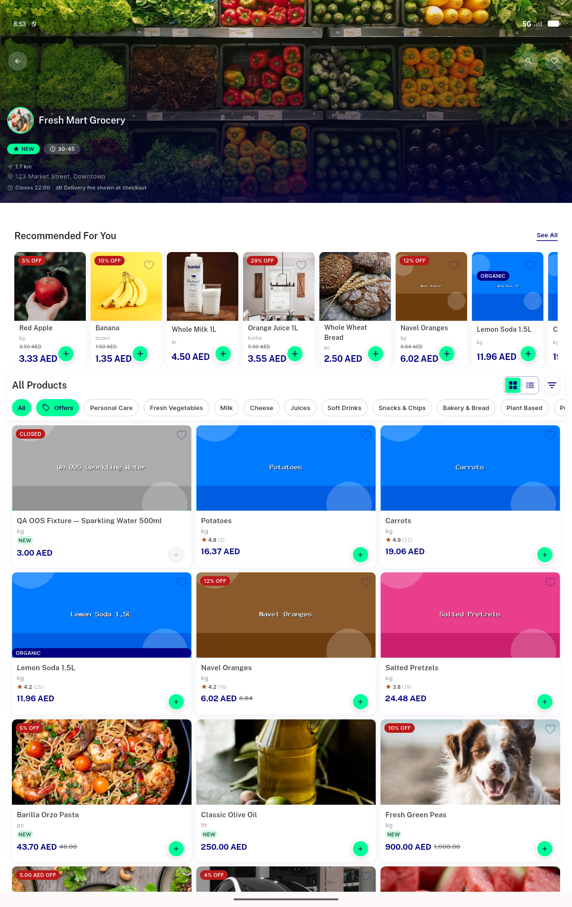
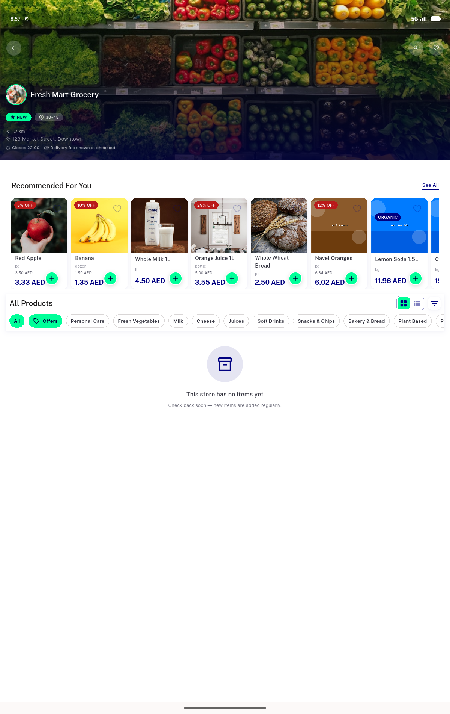
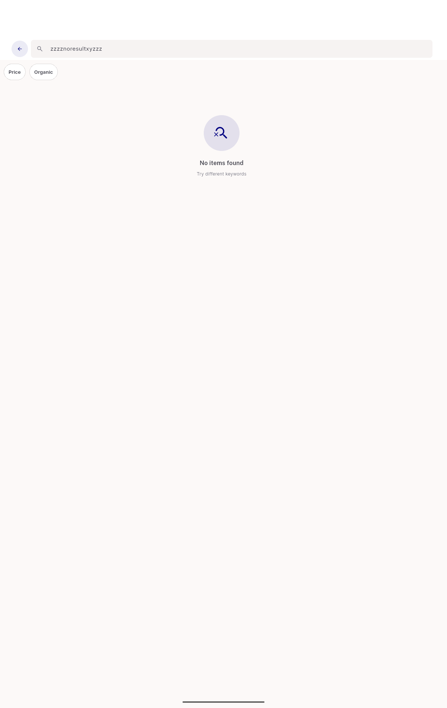
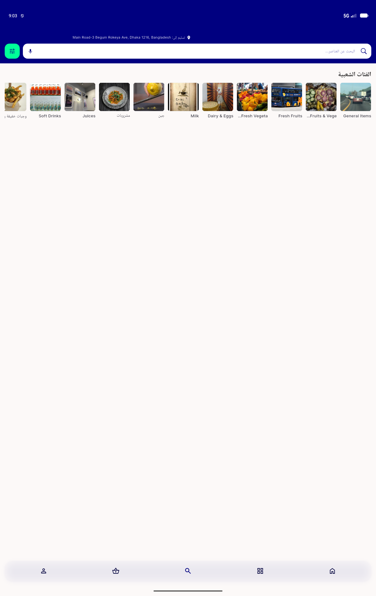

# QA Evidence — NEARS-3557

**PASS — AC3 cap+center demonstrated live at 1200dp tab-width (states 3+4 live, states 1/2 verify-only via widget-test pins); AC1/AC2 confirmed via grep (verify-only, no diff)**

**4 screenshot(s).** Click any thumbnail for full resolution.

<table>
<tr>
<td align="center" width="33%"> ac3 state4 loaded grid 1200dp</td>
<td align="center" width="33%"> probe 5star filter</td>
<td align="center" width="33%"> probe instore search noresults wrong screen</td>
</tr>
<tr>
<td align="center" width="33%"> probe rtl current</td>
</tr>
</table>

### Other artifacts
- [`ac3-rtl-header-categories-a11y-dump.xml`](ac3-rtl-header-categories-a11y-dump.xml)
- [`ac3-state3-empty-storecatalog-a11y-dump.xml`](ac3-state3-empty-storecatalog-a11y-dump.xml)
- [`ac3-state4-a11y-dump.xml`](ac3-state4-a11y-dump.xml)
- [`probe-instore-search-noresults-wrong-screen-a11y-dump.xml`](probe-instore-search-noresults-wrong-screen-a11y-dump.xml)
- [`regression-mobile-400dp-a11y-dump.xml`](regression-mobile-400dp-a11y-dump.xml)
- [`regression-mobile-400dp-empty-a11y-dump.xml`](regression-mobile-400dp-empty-a11y-dump.xml)
- [`regression-mobile-400dp-grid-a11y-dump.xml`](regression-mobile-400dp-grid-a11y-dump.xml)

---
*From `nears/docs/qa-evidence/NEARS-3557/` · public-repo scrub policy (no live secrets; verified clean).*
