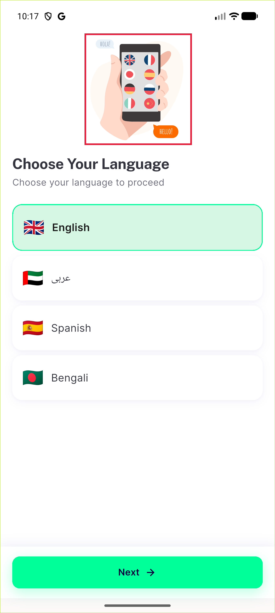
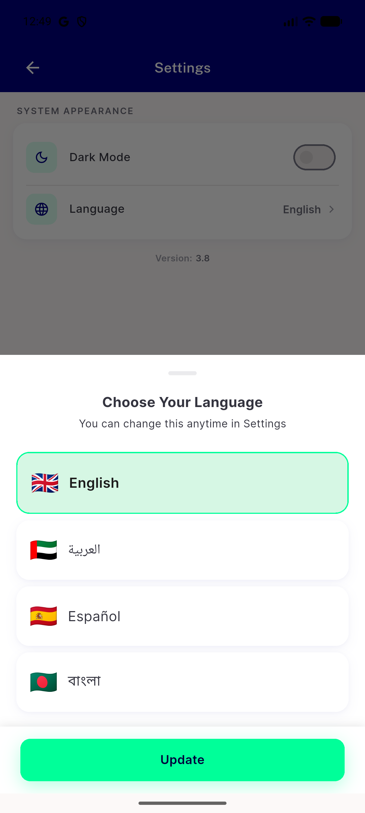
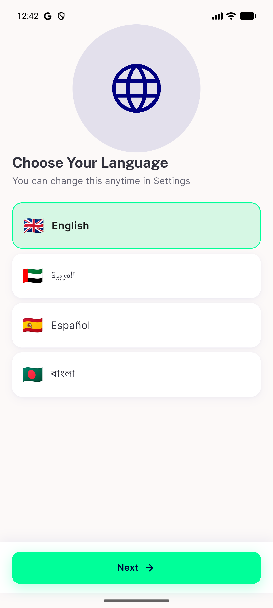

# QA Evidence — NEARS-3578

**delta re-QA cycle2: AC2 endonyms + AC5 subtitle PASS**

**5 screenshot(s).** Click any thumbnail for full resolution.

<table>
<tr>
<td align="center" width="33%"> choose language</td>
<td align="center" width="33%"> choose language illustration crop</td>
<td align="center" width="33%"> choose language illustration full</td>
</tr>
<tr>
<td align="center" width="33%"> ac2 ac5 profile language bottomsheet</td>
<td align="center" width="33%"> ac2 choose language firstrun</td>
</tr>
</table>

### Other artifacts
- [`bug-firebase-sync-throw-blocks-autonavigate.log`](bug-firebase-sync-throw-blocks-autonavigate.log)

---
*From `nears/docs/qa-evidence/NEARS-3578/` · public-repo scrub policy (no live secrets; verified clean).*
