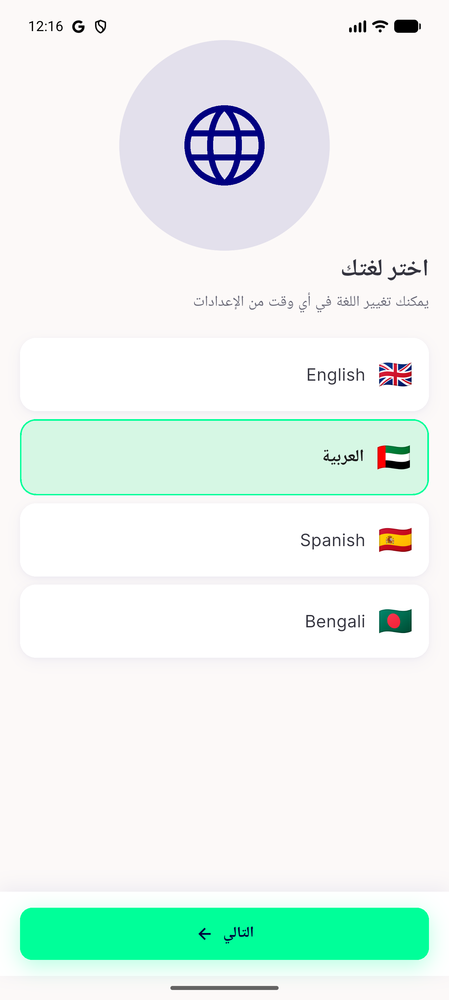
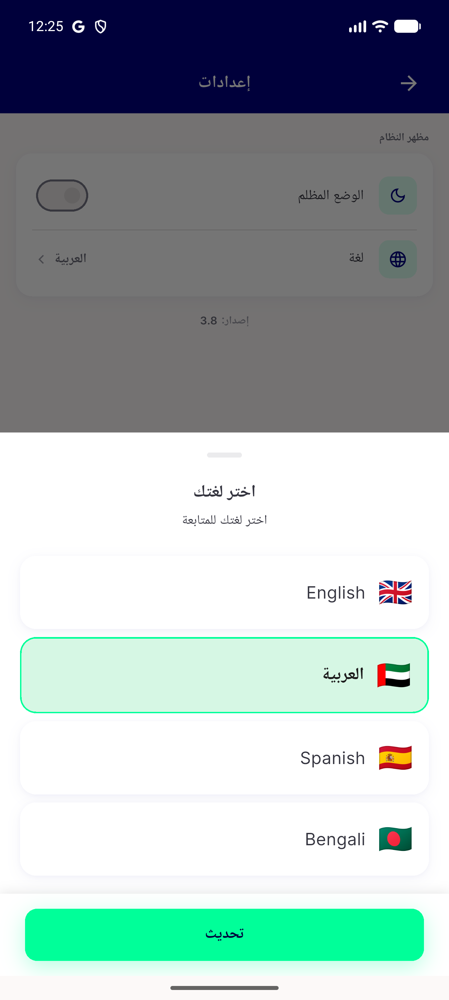

# QA Evidence — NEARS-3578

**FAIL — AC2 (Spanish/Bengali endonyms) + AC5 (bottom-sheet subtitle) unfixed; hero/a11y/background/DLS/analytics all PASS**

**3 screenshot(s).** Click any thumbnail for full resolution.

<table>
<tr>
<td align="center" width="33%"> ac1 ac2 ac4 choose language en</td>
<td align="center" width="33%"> ac10 rtl after next</td>
<td align="center" width="33%"> bug ac2 ac5 bottomsheet ar</td>
</tr>
</table>

### Other artifacts
- [`ac3-a11y-dump-bottomsheet.xml`](ac3-a11y-dump-bottomsheet.xml)
- [`ac3-a11y-dump-choose-language.xml`](ac3-a11y-dump-choose-language.xml)
- [`bug-ac2-endonyms-not-translated.log`](bug-ac2-endonyms-not-translated.log)
- [`bug-ac5-bottomsheet-subtitle-not-updated.log`](bug-ac5-bottomsheet-subtitle-not-updated.log)

---
*From `nears/docs/qa-evidence/NEARS-3578/` · public-repo scrub policy (no live secrets; verified clean).*
