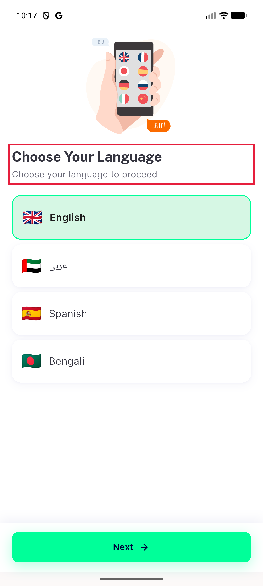

# QA Evidence — NEARS-3582

**Choose Language: redundant subtitle copy**

**3 screenshot(s).** Click any thumbnail for full resolution.

<table>
<tr>
<td align="center" width="33%"> choose language</td>
<td align="center" width="33%"> choose language title subtitle crop</td>
<td align="center" width="33%"> choose language title subtitle full</td>
</tr>
</table>

---
*From `nears/docs/qa-evidence/NEARS-3582/` · public-repo scrub policy (no live secrets; verified clean).*
