# QA Evidence — NEARS-3583

**FAIL (cycle 0): 1 breaks-AC finding (AC1 tile/auth-failure with map created still blank); all other ACs PASS; UserApp Android emulator-5554**

**24 screenshot(s).** Click any thumbnail for full resolution.

<table>
<tr>
<td align="center" width="33%"><a href="01-rationale-ltr.png">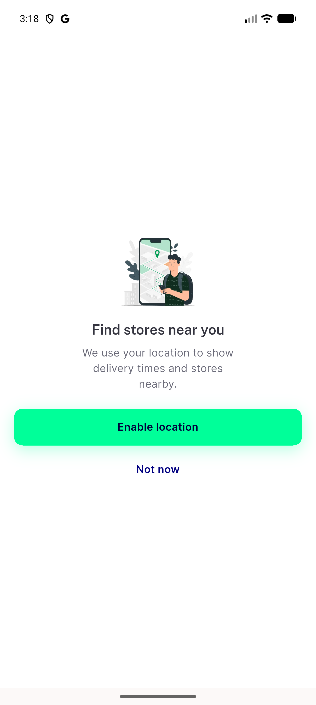</a> rationale ltr</td>
<td align="center" width="33%"><a href="02-os-prompt-over-pickmap.png">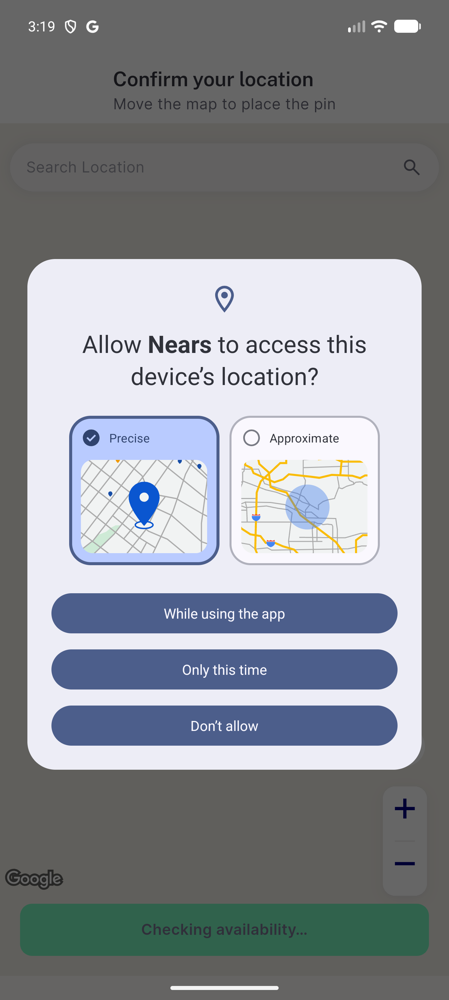</a> os prompt over pickmap</td>
<td align="center" width="33%"><a href="03-pickmap-after-allow-nogps.png">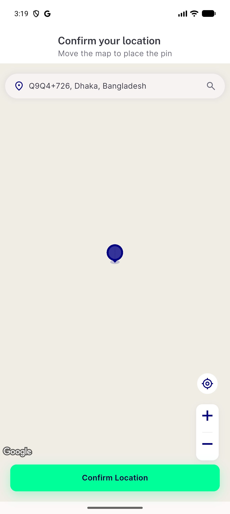</a> pickmap after allow nogps</td>
</tr>
<tr>
<td align="center" width="33%"><a href="04-pickmap-loaded-inzone.png">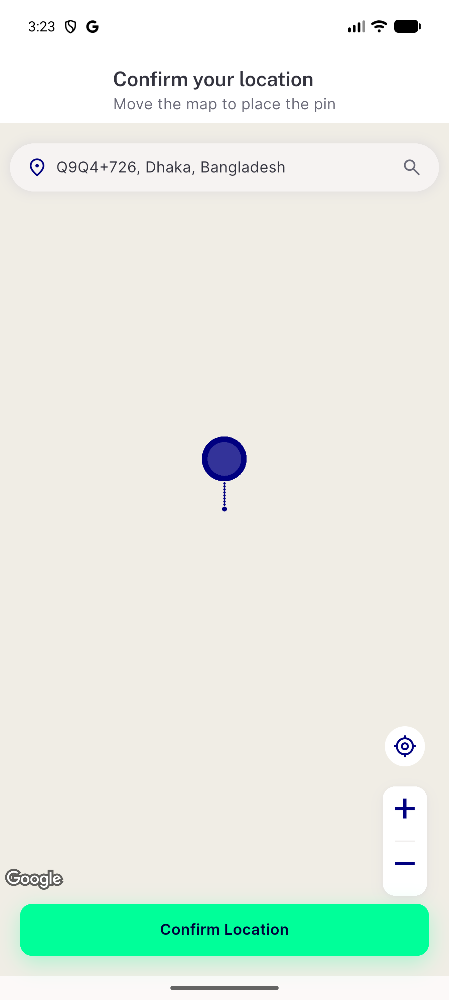</a> pickmap loaded inzone</td>
<td align="center" width="33%"> rationale relaunch denied</td>
<td align="center" width="33%"><a href="06-fab-denied-forever-dialog.png">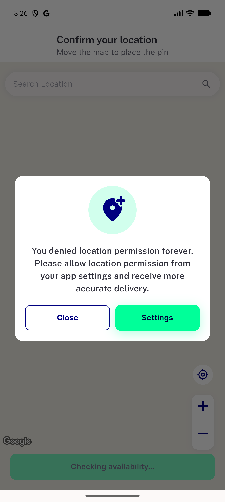</a> fab denied forever dialog</td>
</tr>
<tr>
<td align="center" width="33%"><a href="07-skeleton-loading.png">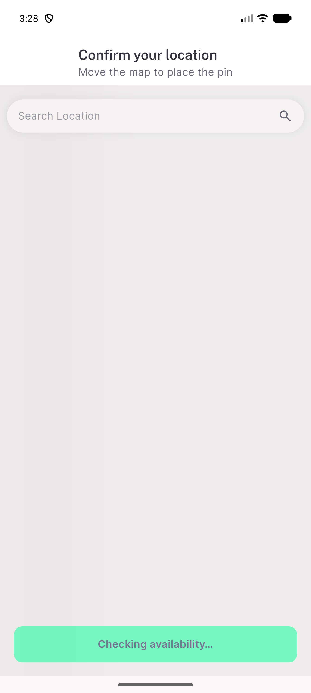</a> skeleton loading</td>
<td align="center" width="33%"><a href="08-failure-card.png">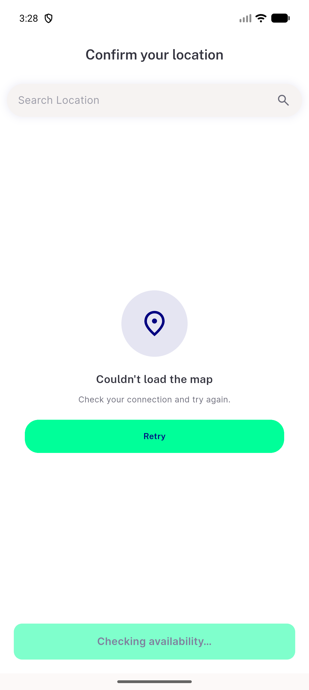</a> failure card</td>
<td align="center" width="33%"><a href="09-skeleton-after-retry.png">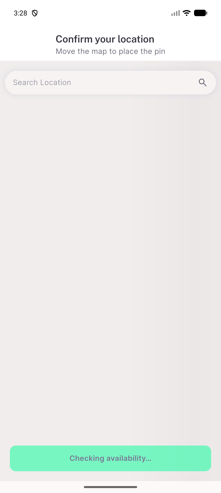</a> skeleton after retry</td>
</tr>
<tr>
<td align="center" width="33%"><a href="10-failure-card-320x480.png">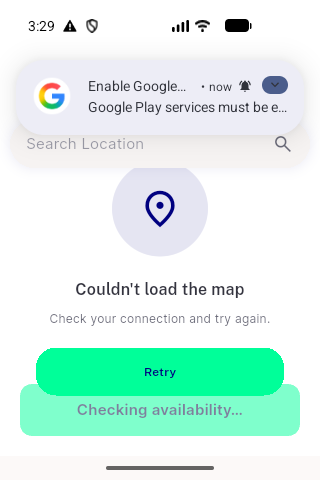</a> failure card 320x480</td>
<td align="center" width="33%"><a href="11-rationale-320x480.png">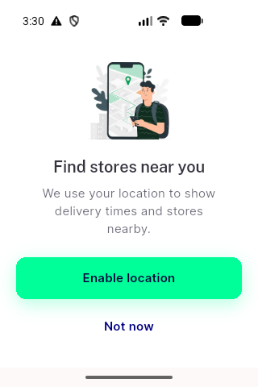</a> rationale 320x480</td>
<td align="center" width="33%"><a href="12-pickmap-skeleton-320x480.png">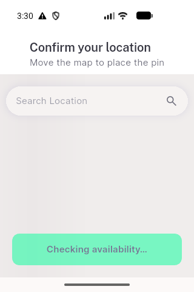</a> pickmap skeleton 320x480</td>
</tr>
<tr>
<td align="center" width="33%"><a href="12b-failure-320x480.png">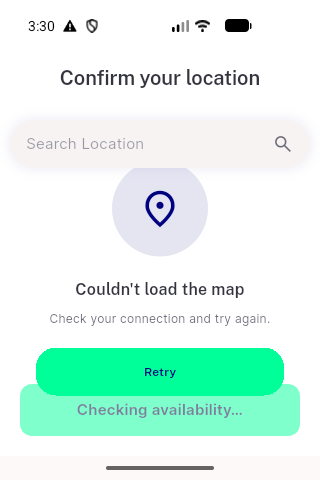</a> 12b failure 320x480</td>
<td align="center" width="33%"><a href="13-rationale-ltr-fresh-install.png">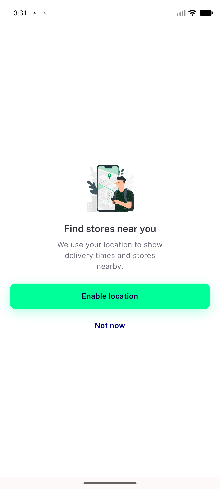</a> rationale ltr fresh install</td>
<td align="center" width="33%"> pickmap loaded clean</td>
</tr>
<tr>
<td align="center" width="33%"><a href="15-gps-off-gms-dialog.png">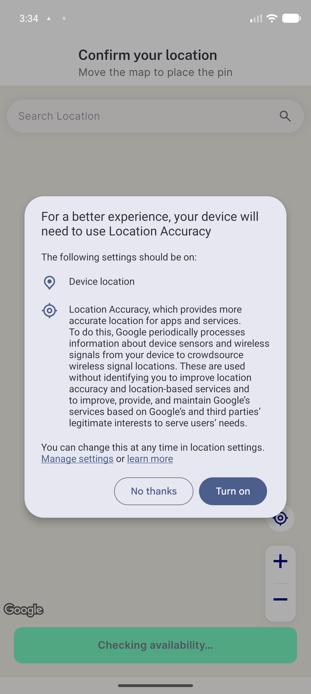</a> gps off gms dialog</td>
<td align="center" width="33%"><a href="16-rationale-rtl-arabic.png">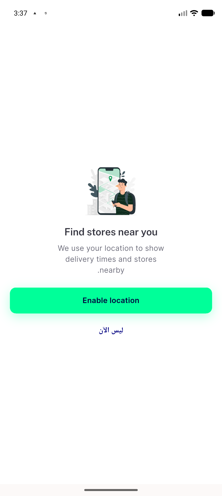</a> rationale rtl arabic</td>
<td align="center" width="33%"><a href="17-pickmap-rtl-arabic.png">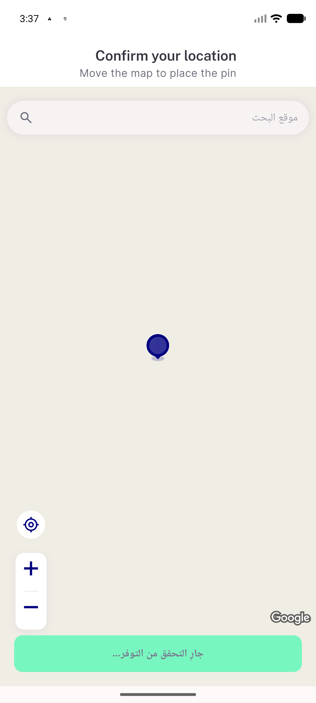</a> pickmap rtl arabic</td>
</tr>
<tr>
<td align="center" width="33%"><a href="18-regression-home-location-no-rationale.png">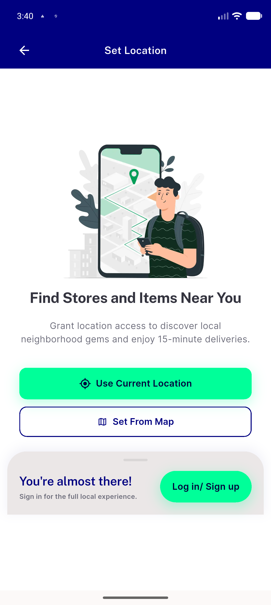</a> regression home location no rationale</td>
<td align="center" width="33%"><a href="19-pickmap-out-of-zone-banner.png">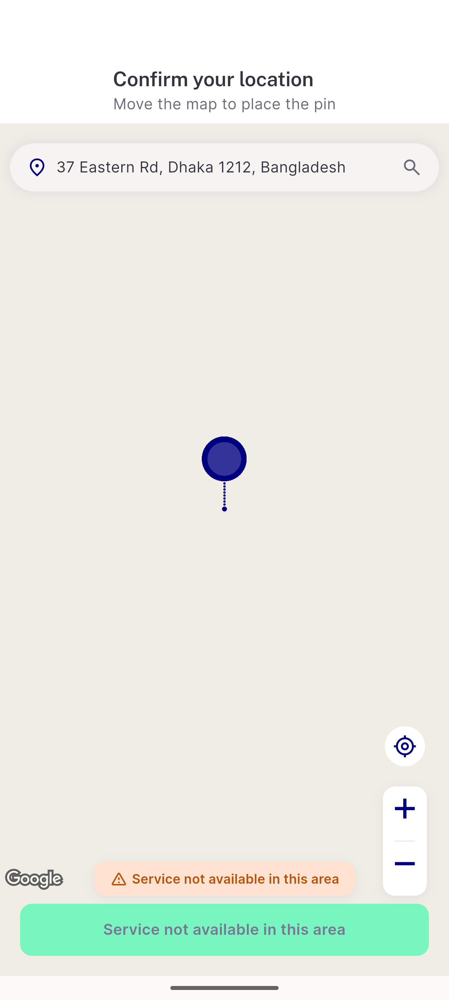</a> pickmap out of zone banner</td>
<td align="center" width="33%"><a href="20-fab-crosshair-and-zoom-crop.png">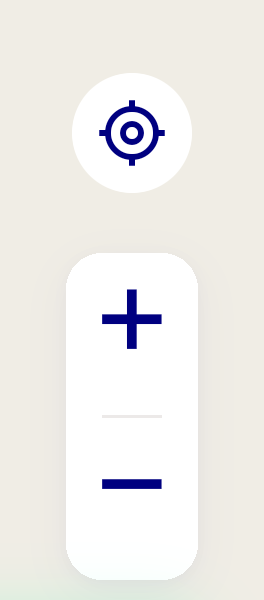</a> fab crosshair and zoom crop</td>
</tr>
<tr>
<td align="center" width="33%"><a href="21-google-logo-above-cta-crop.png">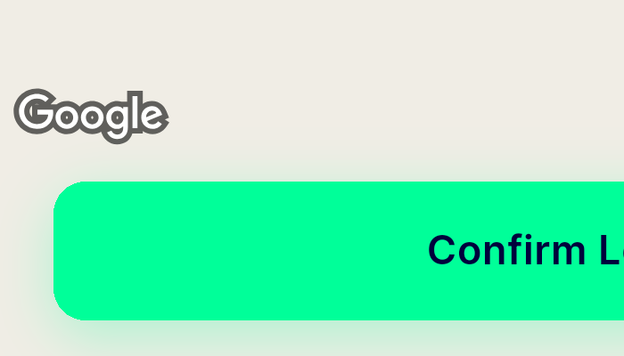</a> google logo above cta crop</td>
<td align="center" width="33%"><a href="bug-back-from-cold-rationale-dead-end-loading.png">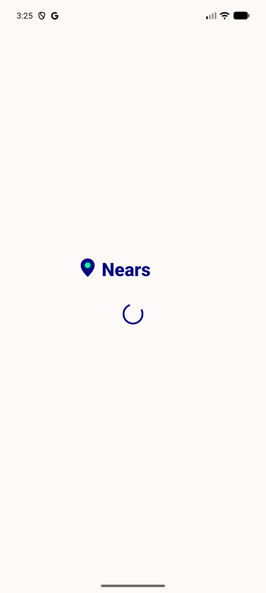</a> bug back from cold rationale dead end loading</td>
<td align="center" width="33%"><a href="bug-back-from-cold-start-dead-end-loading.png">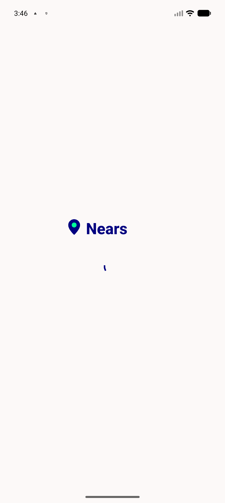</a> bug back from cold start dead end loading</td>
</tr>
</table>

### Other artifacts
- [`app-events-and-nonsuccess-logs.log`](app-events-and-nonsuccess-logs.log)

---
*From `nears/docs/qa-evidence/NEARS-3583/` · public-repo scrub policy (no live secrets; verified clean).*
