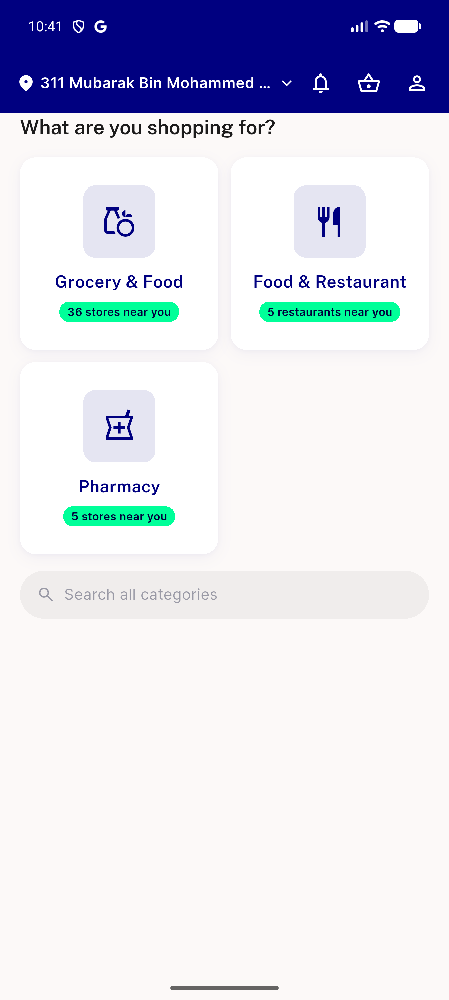
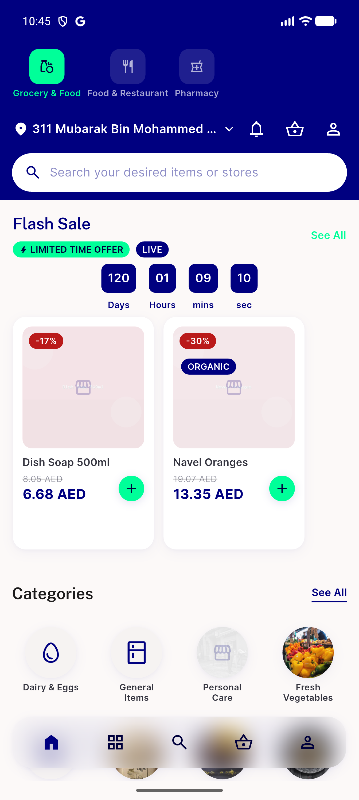
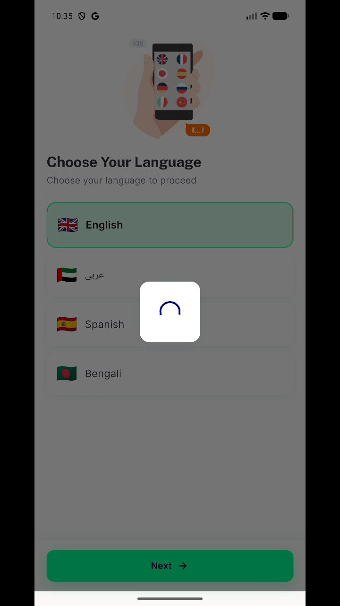
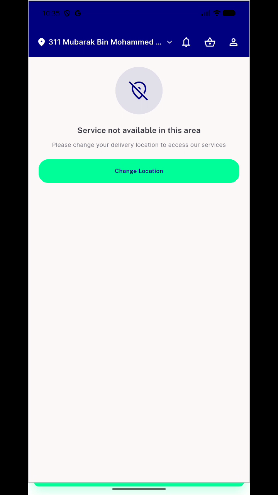
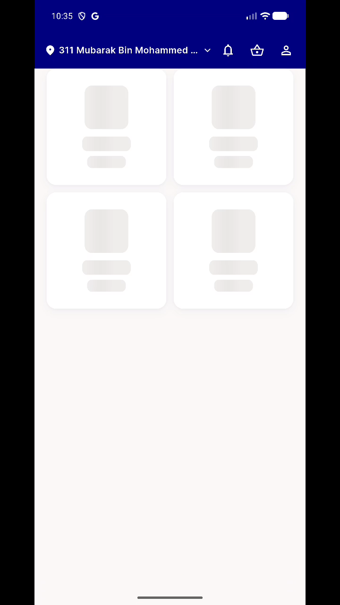
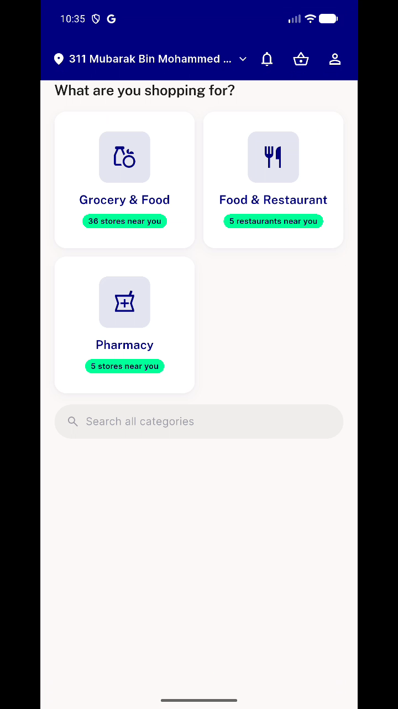
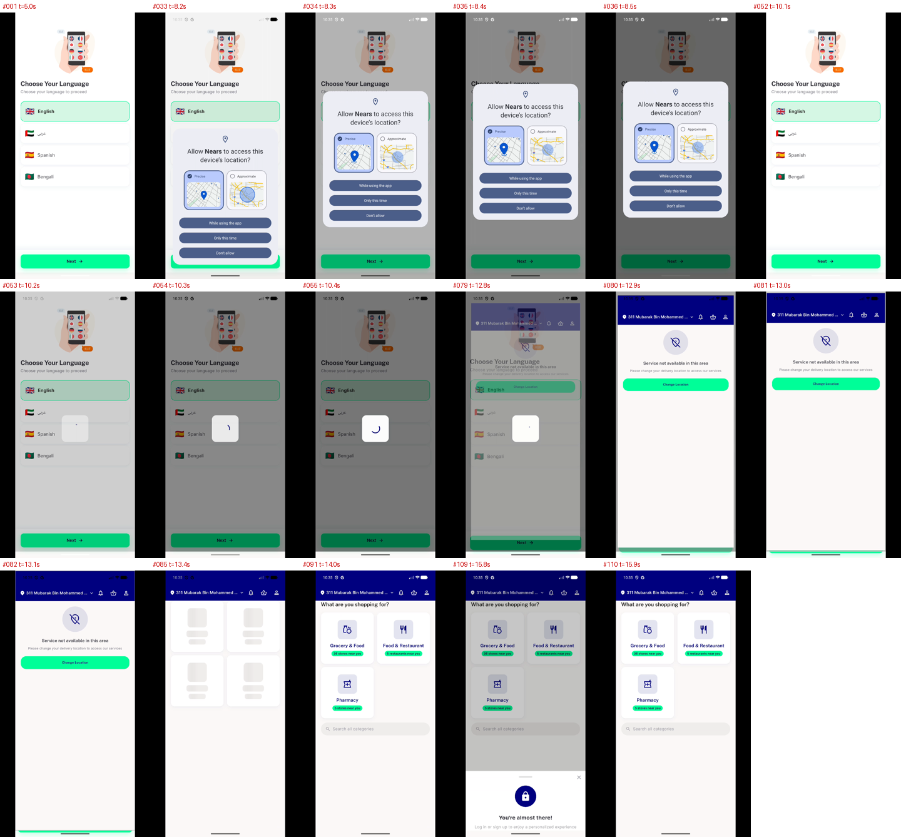

# QA Evidence — NEARS-3584

**Module picker landing removal + first-run loading/false-error + login popup (8 items)**

**8 screenshot(s).** Click any thumbnail for full resolution.

<table>
<tr>
<td align="center" width="33%"> module picker home</td>
<td align="center" width="33%"> grocery home switcher and module search</td>
<td align="center" width="33%"> login sheet</td>
</tr>
<tr>
<td align="center" width="33%"> T2 spinner over language screen</td>
<td align="center" width="33%"> T1 false service not available</td>
<td align="center" width="33%"> T3 shimmer skeleton</td>
</tr>
<tr>
<td align="center" width="33%"> T3 final grid</td>
<td align="center" width="33%"> T1 T3 transition states sheet</td>
</tr>
</table>

---
*From `nears/docs/qa-evidence/NEARS-3584/` · public-repo scrub policy (no live secrets; verified clean).*
