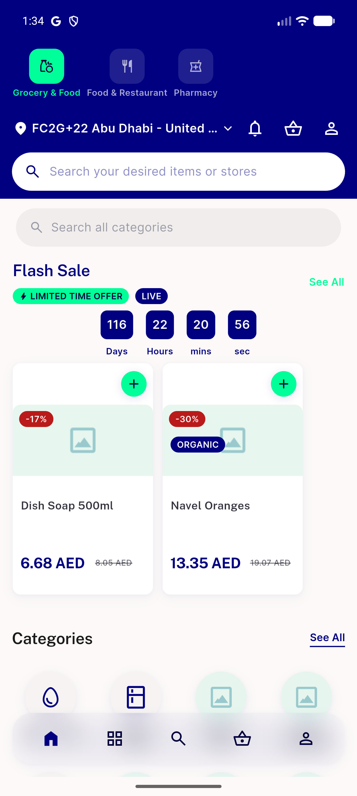
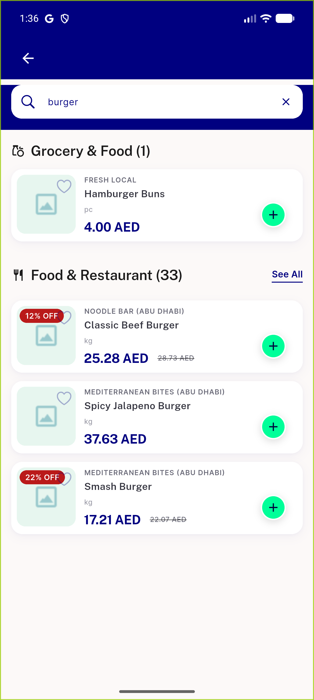
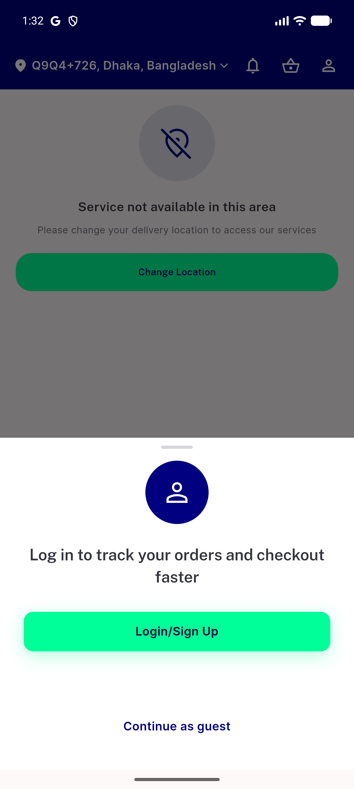

# QA Evidence — NEARS-3584

**Fix-cycle 2 delta re-QA: PASS - all 4 fixes confirmed live, AC4 still unverifiable (tooling)**

**3 screenshot(s).** Click any thumbnail for full resolution.

<table>
<tr>
<td align="center" width="33%"> module home no picker default select</td>
<td align="center" width="33%"> cross module search results</td>
<td align="center" width="33%"> login suggestion sheet</td>
</tr>
</table>

### Other artifacts
- [`ac3-empty-state-dump.xml`](ac3-empty-state-dump.xml)
- [`ac4-still-unverifiable-cycle2.log`](ac4-still-unverifiable-cycle2.log)
- [`bug-global-search-opened-missing-context.log`](bug-global-search-opened-missing-context.log)
- [`bug-module-restored-missing-at-restored-tier.log`](bug-module-restored-missing-at-restored-tier.log)
- [`bug-raw-circularprogressindicator-not-dls.log`](bug-raw-circularprogressindicator-not-dls.log)
- [`bug-setstate-during-build.log`](bug-setstate-during-build.log)
- [`fix-cycle2-qa1-clean.log`](fix-cycle2-qa1-clean.log)
- [`fix-cycle2-qa2-clean.log`](fix-cycle2-qa2-clean.log)
- [`fix-cycle2-qa3-clean.log`](fix-cycle2-qa3-clean.log)
- [`fix-cycle2-qa4-code-and-test.log`](fix-cycle2-qa4-code-and-test.log)
- [`progress.md`](progress.md)

---
*From `nears/docs/qa-evidence/NEARS-3584/` · public-repo scrub policy (no live secrets; verified clean).*
