# QA Evidence — NEARS-3585

**Grocery module home — H1-H8 UI/UX findings (owner: file them all)**

**19 screenshot(s).** Click any thumbnail for full resolution.

<table>
<tr>
<td align="center" width="33%"> p4 01</td>
<td align="center" width="33%"><a href="p4-02.png">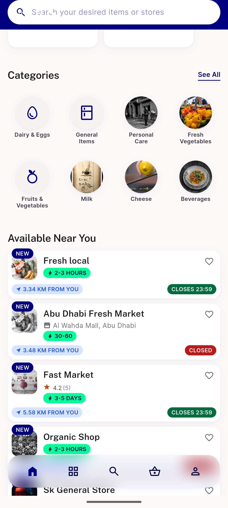</a> p4 02</td>
<td align="center" width="33%"><a href="p4-03.png">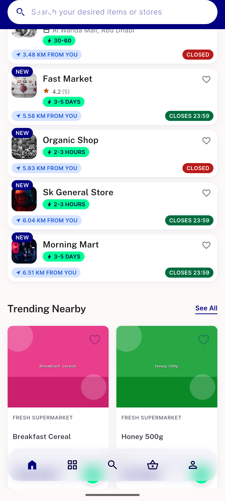</a> p4 03</td>
</tr>
<tr>
<td align="center" width="33%"><a href="p4-04.png">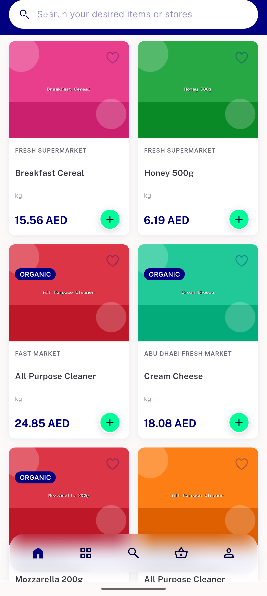</a> p4 04</td>
<td align="center" width="33%"><a href="p4-05.png">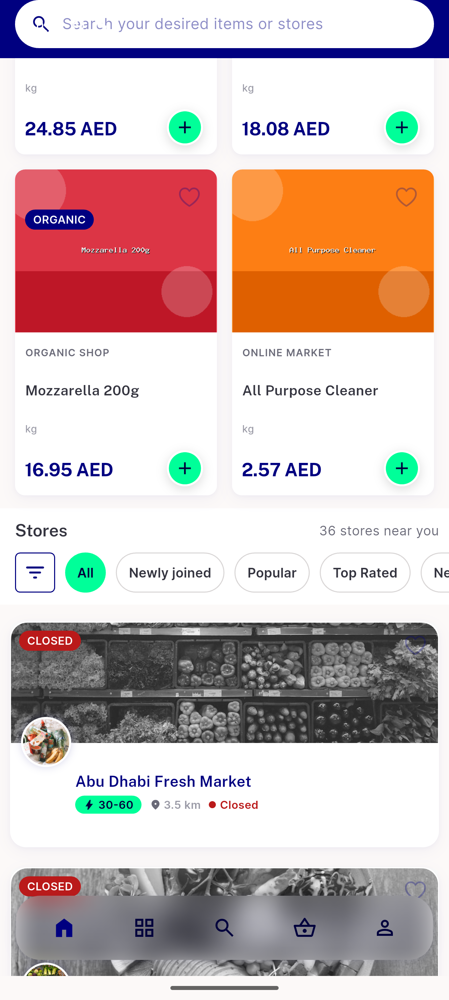</a> p4 05</td>
<td align="center" width="33%"><a href="p4-06.png">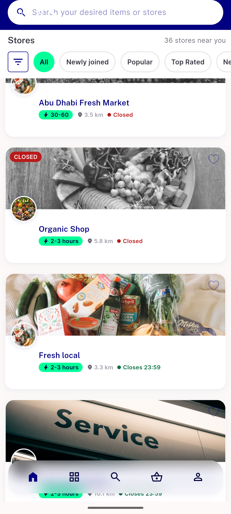</a> p4 06</td>
</tr>
<tr>
<td align="center" width="33%"> p4 10 after add</td>
<td align="center" width="33%"> p4 H1 module tabs left aligned crop</td>
<td align="center" width="33%"> p4 H1 module tabs left aligned full</td>
</tr>
<tr>
<td align="center" width="33%"><a href="p4-H3-countdown-120-days__crop.png">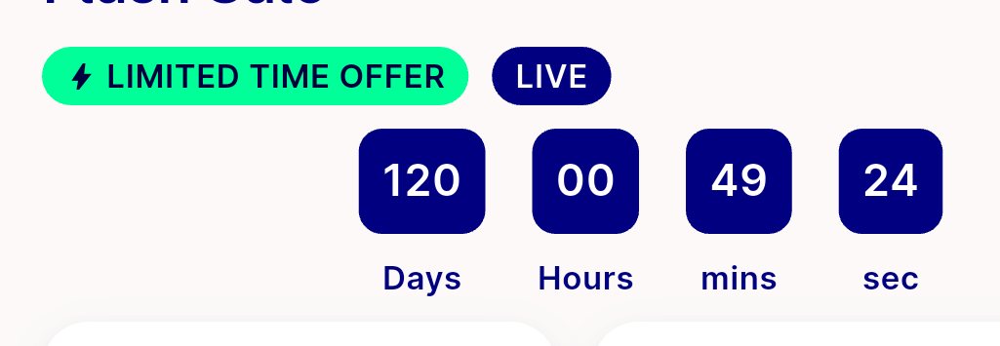</a> p4 H3 countdown 120 days crop</td>
<td align="center" width="33%"><a href="p4-H3-countdown-120-days__full.png">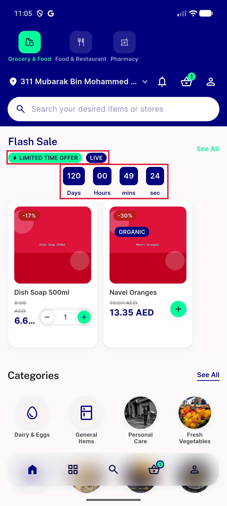</a> p4 H3 countdown 120 days full</td>
<td align="center" width="33%"> p4 H4 see all mint contrast crop</td>
</tr>
<tr>
<td align="center" width="33%"><a href="p4-H4-see-all-mint-contrast__full.png">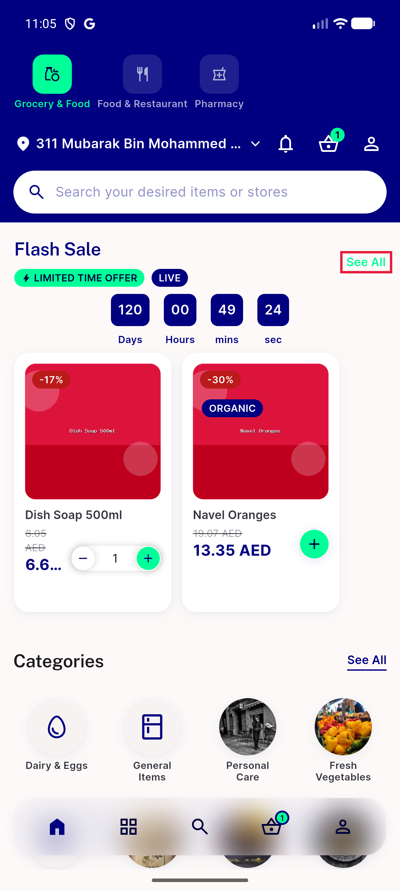</a> p4 H4 see all mint contrast full</td>
<td align="center" width="33%"><a href="p4-H5-card-stepper-overlaps-price__crop.png">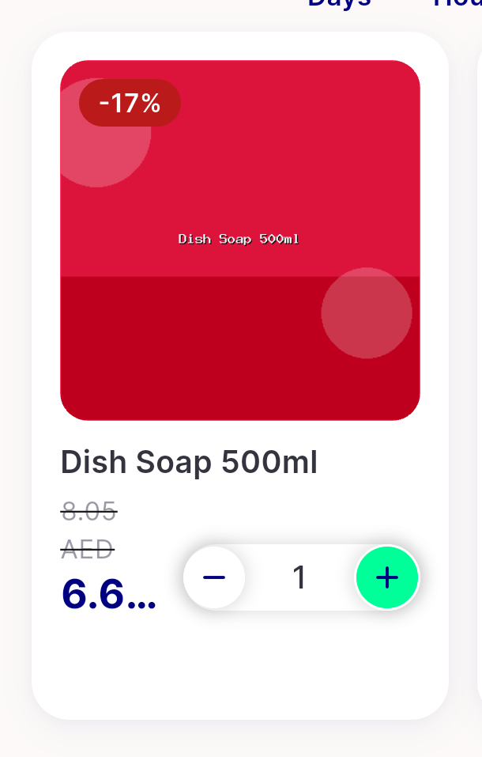</a> p4 H5 card stepper overlaps price crop</td>
<td align="center" width="33%"><a href="p4-H5-card-stepper-overlaps-price__full.png">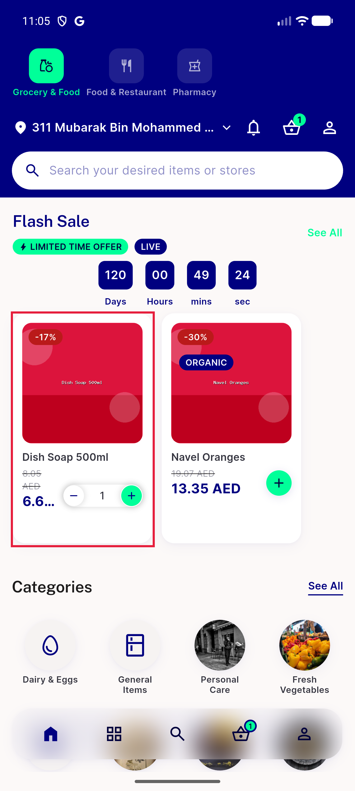</a> p4 H5 card stepper overlaps price full</td>
</tr>
<tr>
<td align="center" width="33%"><a href="p4-H6-H7-categories-mixed-icons__crop.png">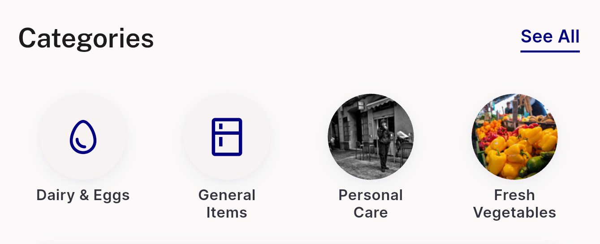</a> p4 H6 H7 categories mixed icons crop</td>
<td align="center" width="33%"><a href="p4-H6-H7-categories-mixed-icons__full.png">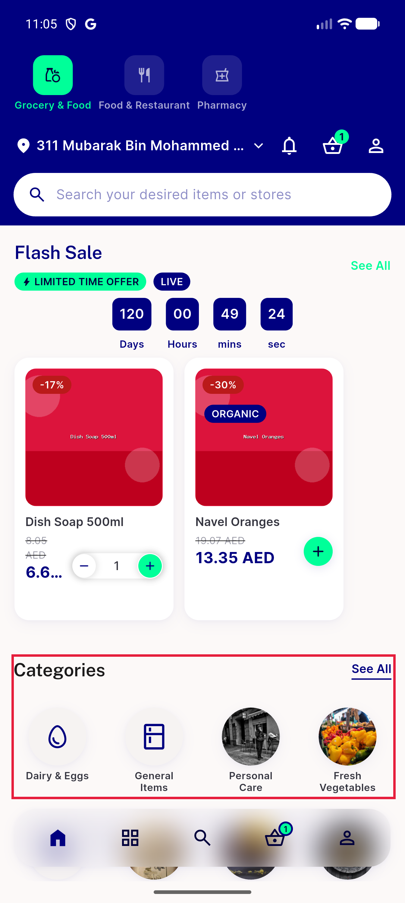</a> p4 H6 H7 categories mixed icons full</td>
<td align="center" width="33%"><a href="p4-H8-two-basket-icons__crop.png">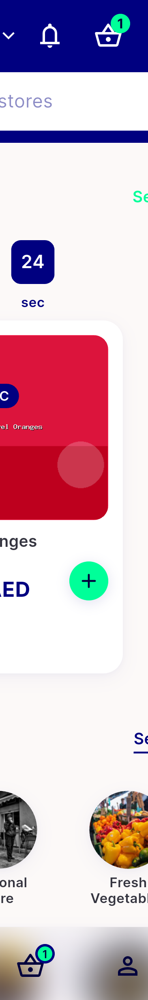</a> p4 H8 two basket icons crop</td>
</tr>
<tr>
<td align="center" width="33%"> p4 H8 two basket icons full</td>
</tr>
</table>

---
*From `nears/docs/qa-evidence/NEARS-3585/` · public-repo scrub policy (no live secrets; verified clean).*
