# QA Evidence — NEARS-3585

**fix-cycle 4 [9a] semantic re-verify: PASS — on-the-way redesigned card <=120dp EN/AR 1.3x confirmed, no onCancel/ETA crowding possible on rail (running_order_rail.dart passes no onCancel), NEARS-3696 cancel affordance non-regressed on tracking hub**

**35 screenshot(s).** Click any thumbnail for full resolution.

<table>
<tr>
<td align="center" width="33%"><a href="dm-ar-1.0x.png">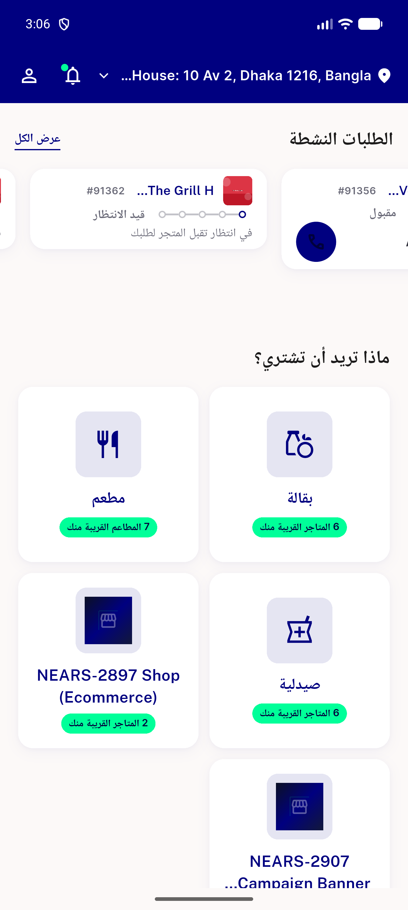</a> dm ar 1.0x</td>
<td align="center" width="33%"><a href="dm-ar-1.3x-final.png">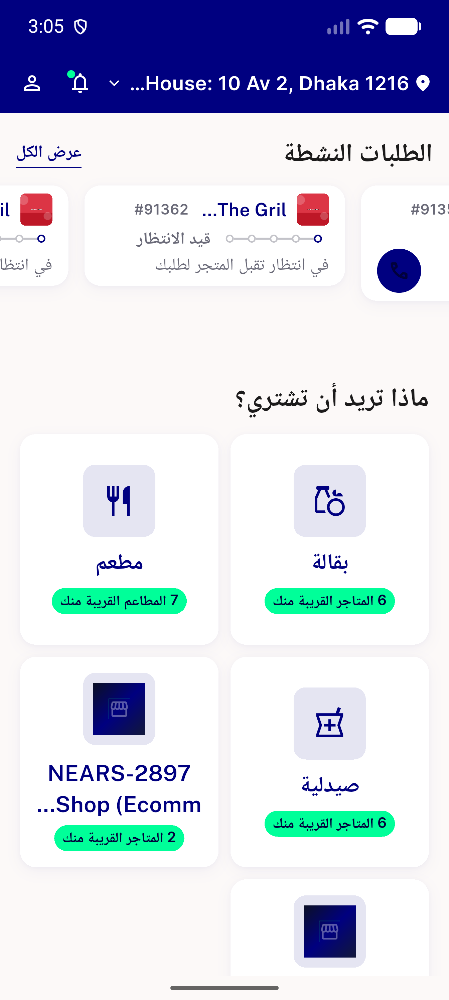</a> dm ar 1.3x final</td>
<td align="center" width="33%"><a href="dm-ar-1.3x-final2.png">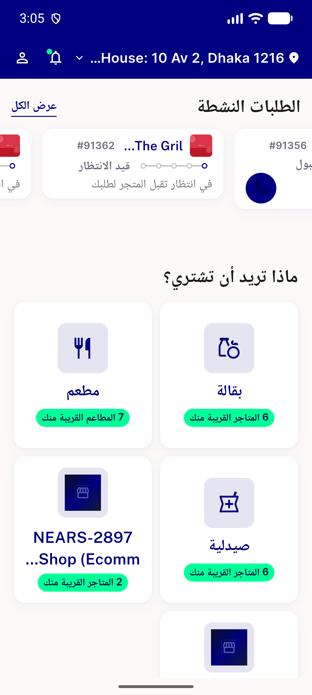</a> dm ar 1.3x final2</td>
</tr>
<tr>
<td align="center" width="33%"><a href="dm-ar-1.3x-final3.png">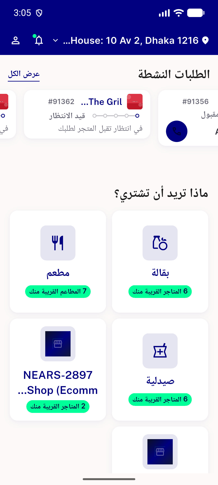</a> dm ar 1.3x final3</td>
<td align="center" width="33%"><a href="dm-ar-1.3x-final4.png">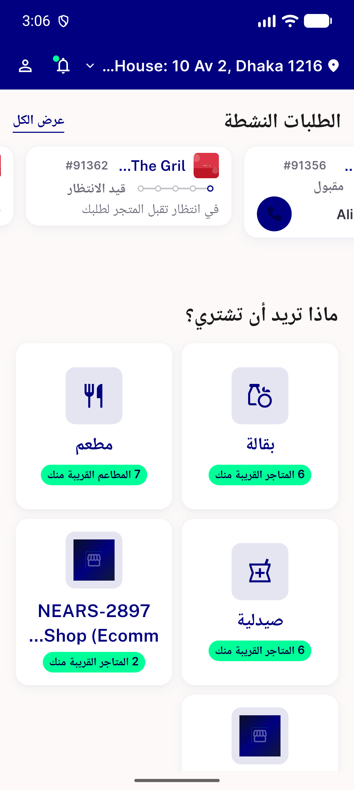</a> dm ar 1.3x final4</td>
<td align="center" width="33%"><a href="dm-ar-1.3x-probe.png">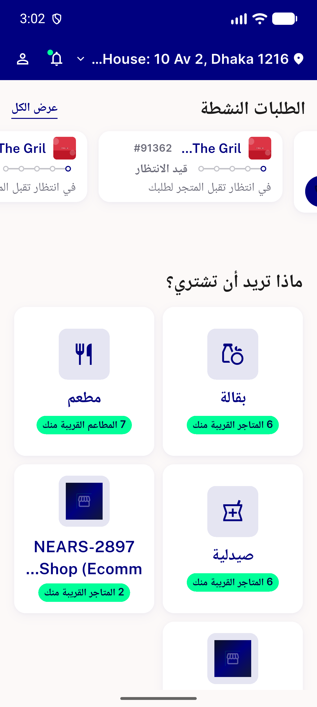</a> dm ar 1.3x probe</td>
</tr>
<tr>
<td align="center" width="33%"><a href="dm-ar-1.3x-v2.png">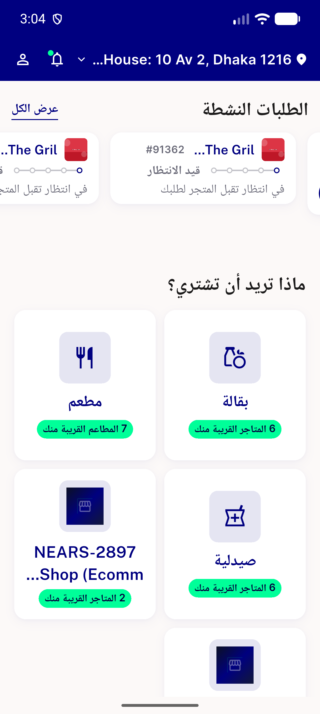</a> dm ar 1.3x v2</td>
<td align="center" width="33%"><a href="dm-ar-1.3x-v3.png">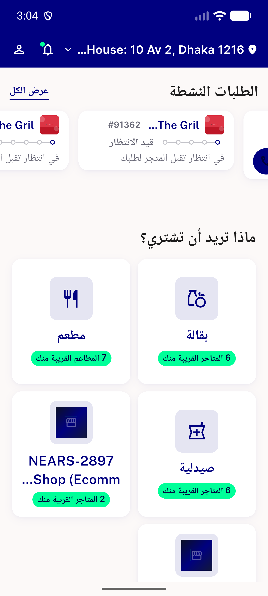</a> dm ar 1.3x v3</td>
<td align="center" width="33%"><a href="dm-ar-1.3x-v4.png">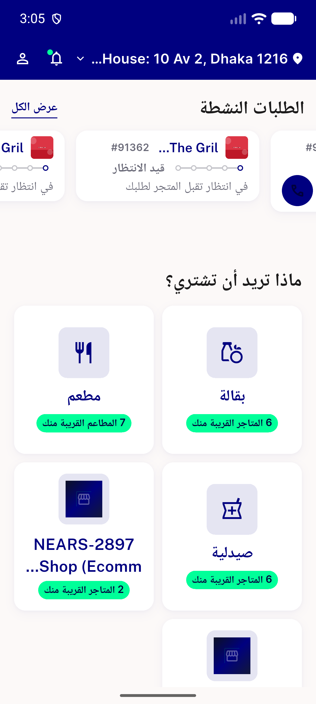</a> dm ar 1.3x v4</td>
</tr>
<tr>
<td align="center" width="33%"><a href="dm-ar-1.3x.png">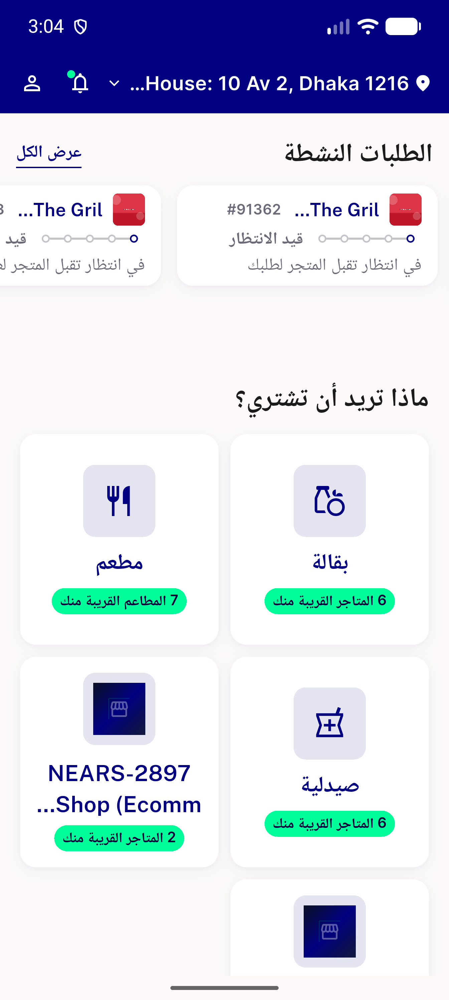</a> dm ar 1.3x</td>
<td align="center" width="33%"> dm en 1.0x</td>
<td align="center" width="33%"> dm en 1.3x</td>
</tr>
<tr>
<td align="center" width="33%"> fix3 rail dm ar 1.3x</td>
<td align="center" width="33%"> fix3 rail dm en 1.3x</td>
<td align="center" width="33%"><a href="fix3-tracking-hub-ali-hassan.png">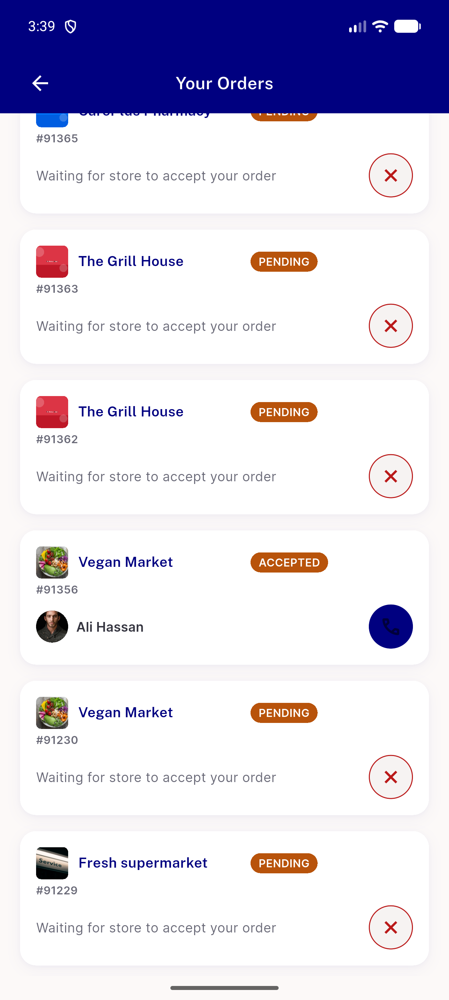</a> fix3 tracking hub ali hassan</td>
</tr>
<tr>
<td align="center" width="33%"> home en 1.0x</td>
<td align="center" width="33%"><a href="pending-ar-1.3x.png">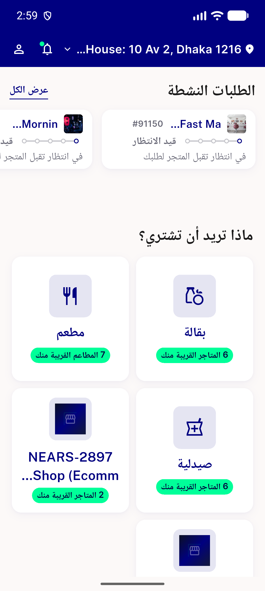</a> pending ar 1.3x</td>
<td align="center" width="33%"> pending en 1.3x b</td>
</tr>
<tr>
<td align="center" width="33%"> pending en 1.3x</td>
<td align="center" width="33%"><a href="precall.png">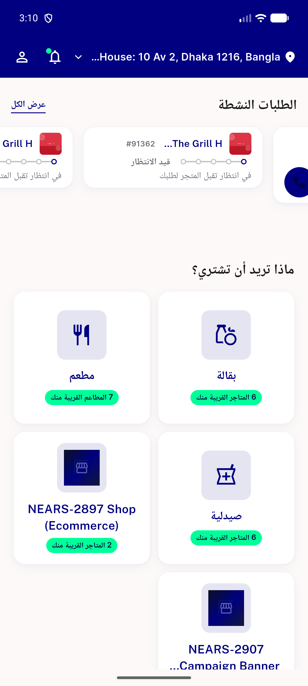</a> precall</td>
<td align="center" width="33%"> probe 91356</td>
</tr>
<tr>
<td align="center" width="33%"> probe 91356b</td>
<td align="center" width="33%"> probe 91370</td>
<td align="center" width="33%"> probe 91371</td>
</tr>
<tr>
<td align="center" width="33%"> probe 91371b</td>
<td align="center" width="33%"> probe2</td>
<td align="center" width="33%"> scale check</td>
</tr>
<tr>
<td align="center" width="33%"> thumb ar 1.0x</td>
<td align="center" width="33%"> thumb ar 1.3x</td>
<td align="center" width="33%"> thumb en 1.3x 2</td>
</tr>
<tr>
<td align="center" width="33%"> thumb en 1.3x 3</td>
<td align="center" width="33%"> thumb en 1.3x probe</td>
<td align="center" width="33%"> thumb en 1.3x</td>
</tr>
<tr>
<td align="center" width="33%"><a href="tracking-hub-ar.png">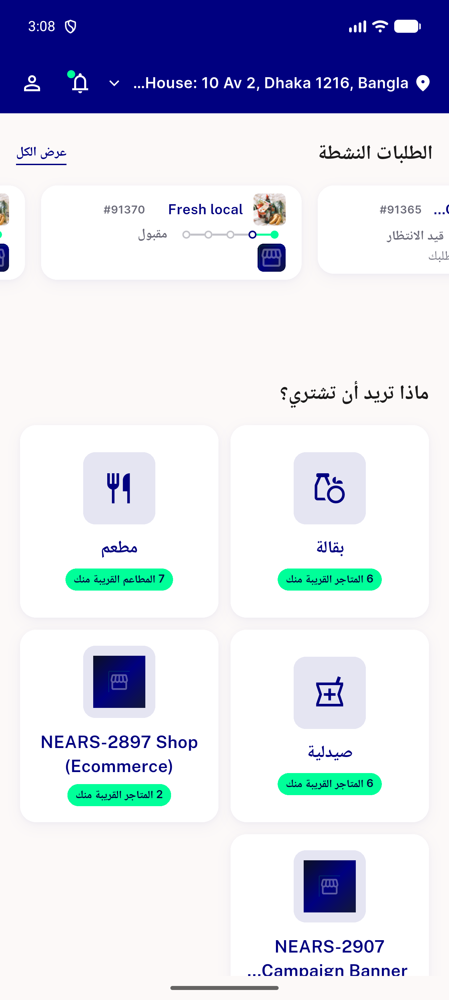</a> tracking hub ar</td>
<td align="center" width="33%"> tracking hub legacy</td>
</tr>
</table>

---
*From `nears/docs/qa-evidence/NEARS-3585/` · public-repo scrub policy (no live secrets; verified clean).*
