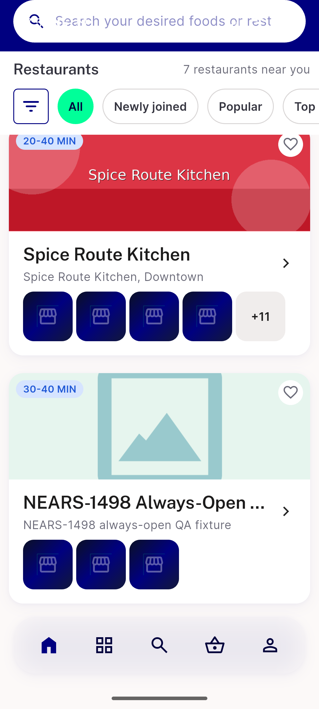
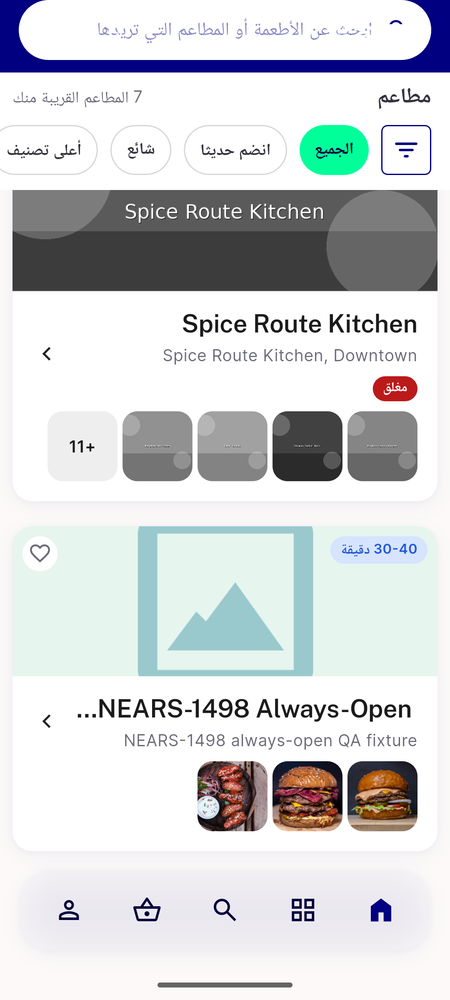
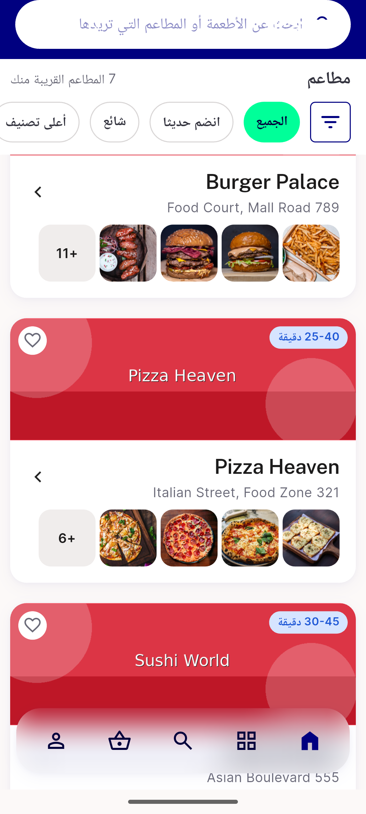
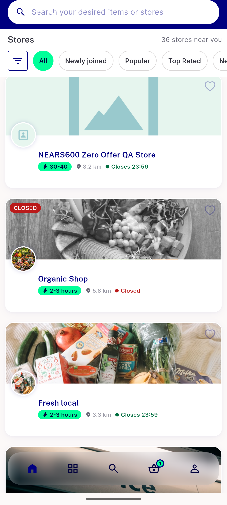

# QA Evidence — NEARS-3586

**PASS - store card popular-items preview row: AC1-7 + AC-ANALYTICS + AC-LOG demonstrated live, emulator-5554, EN+AR, 360dp**

**4 screenshot(s).** Click any thumbnail for full resolution.

<table>
<tr>
<td align="center" width="33%"> AC1 360dp count3 open en store91112</td>
<td align="center" width="33%"> AC3 closed desaturation ar</td>
<td align="center" width="33%"> AC5 rtl ar 360dp</td>
</tr>
<tr>
<td align="center" width="33%"> p4 40 stores</td>
</tr>
</table>

### Other artifacts
- [`a11y-dump-store91112-en.xml`](a11y-dump-store91112-en.xml)
- [`bug-login-firebase-noapp-unhandled.log`](bug-login-firebase-noapp-unhandled.log)

---
*From `nears/docs/qa-evidence/NEARS-3586/` · public-repo scrub policy (no live secrets; verified clean).*
