# QA Evidence — NEARS-3587

**Human QA — Store page (Fresh local): 13 UI/UX findings, SP7 misleading-state**

**23 screenshot(s).** Click any thumbnail for full resolution.

<table>
<tr>
<td align="center" width="33%"><a href="p5-01.png">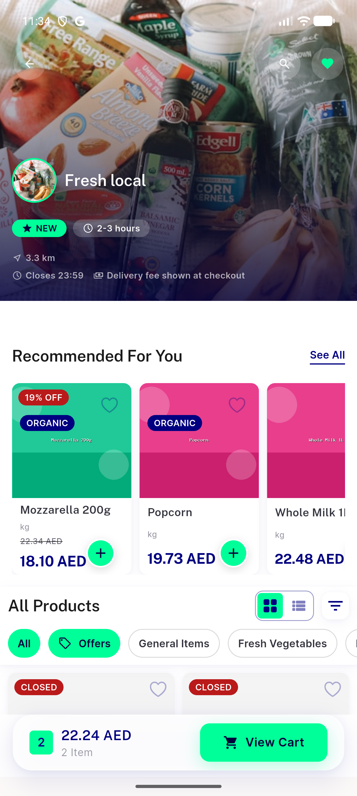</a> p5 01</td>
<td align="center" width="33%"> p5 02</td>
<td align="center" width="33%"><a href="p5-03.png">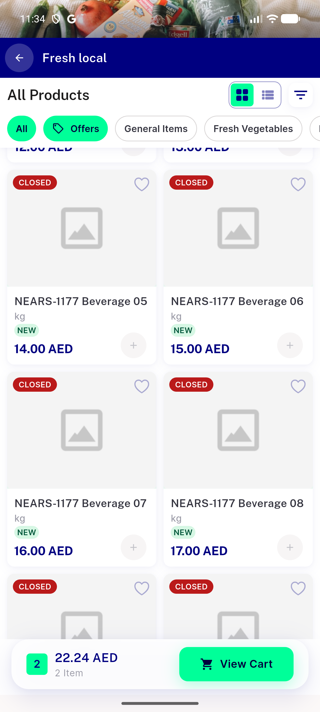</a> p5 03</td>
</tr>
<tr>
<td align="center" width="33%"><a href="p5-04.png">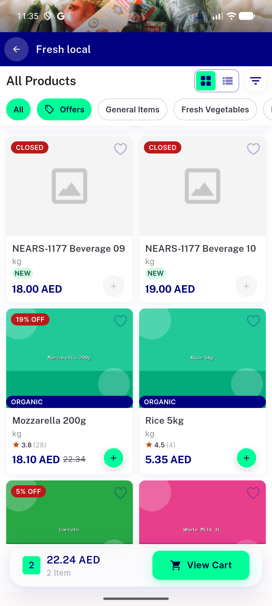</a> p5 04</td>
<td align="center" width="33%"><a href="p5-05.png">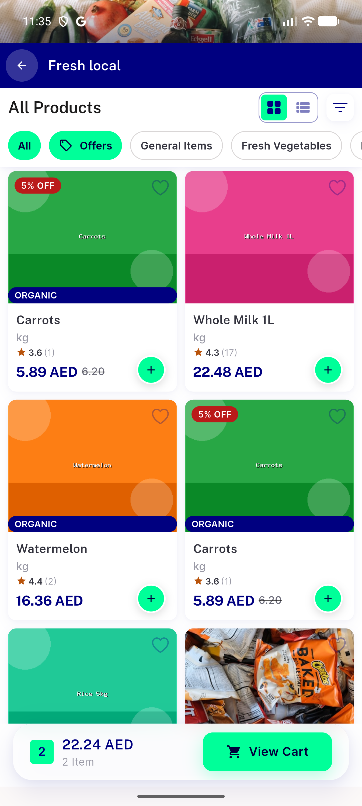</a> p5 05</td>
<td align="center" width="33%"><a href="p5-SP1-hero-icons-low-contrast__crop.png">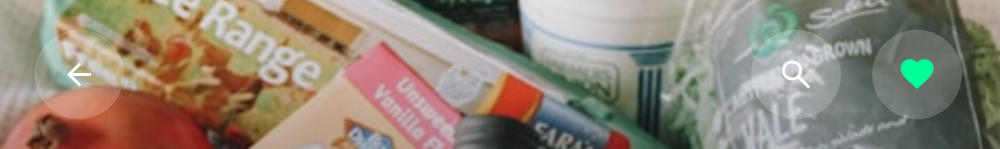</a> p5 SP1 hero icons low contrast crop</td>
</tr>
<tr>
<td align="center" width="33%"> p5 SP1 hero icons low contrast full</td>
<td align="center" width="33%"><a href="p5-SP10-basket-bar-other-store__crop.png">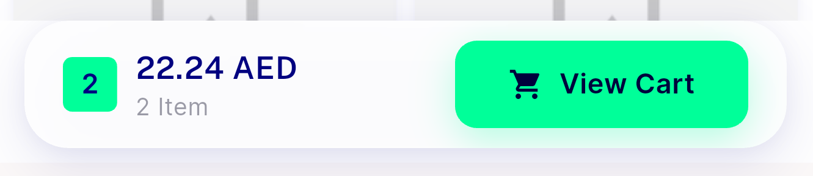</a> p5 SP10 basket bar other store crop</td>
<td align="center" width="33%"><a href="p5-SP10-basket-bar-other-store__full.png">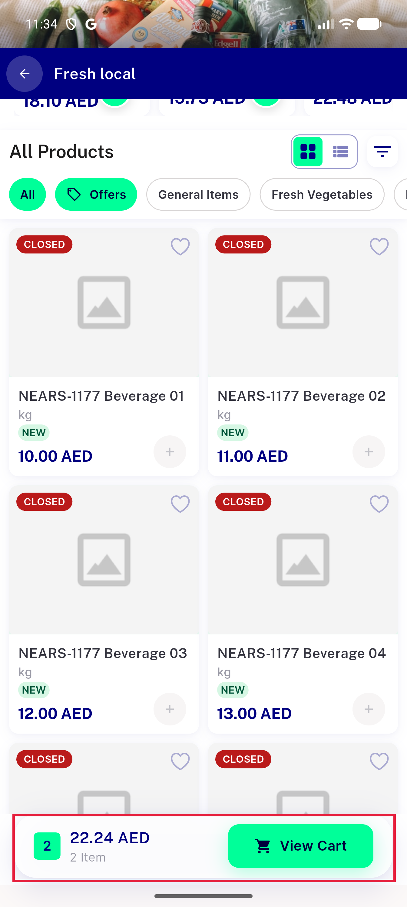</a> p5 SP10 basket bar other store full</td>
</tr>
<tr>
<td align="center" width="33%"><a href="p5-SP11-duplicate-carrots__crop.png">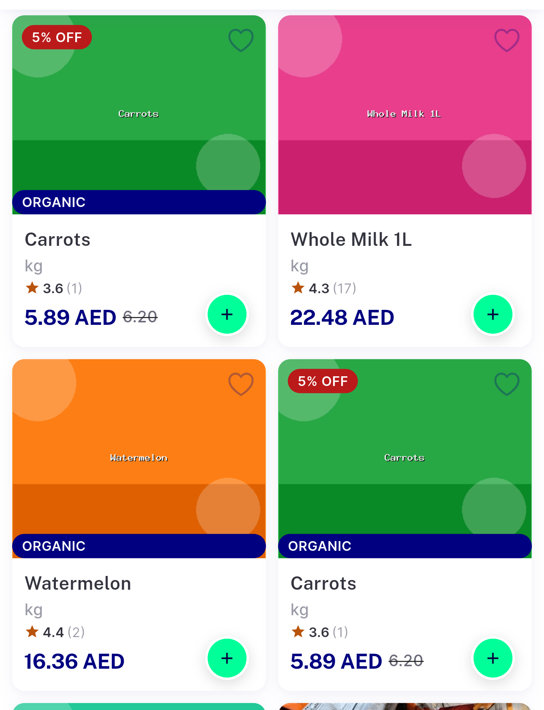</a> p5 SP11 duplicate carrots crop</td>
<td align="center" width="33%"><a href="p5-SP11-duplicate-carrots__full.png">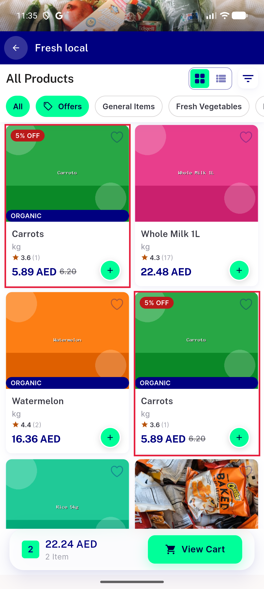</a> p5 SP11 duplicate carrots full</td>
<td align="center" width="33%"><a href="p5-SP12-photo-strip-behind-status-bar__crop.png">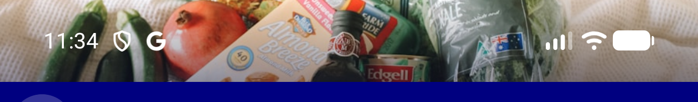</a> p5 SP12 photo strip behind status bar crop</td>
</tr>
<tr>
<td align="center" width="33%"><a href="p5-SP12-photo-strip-behind-status-bar__full.png">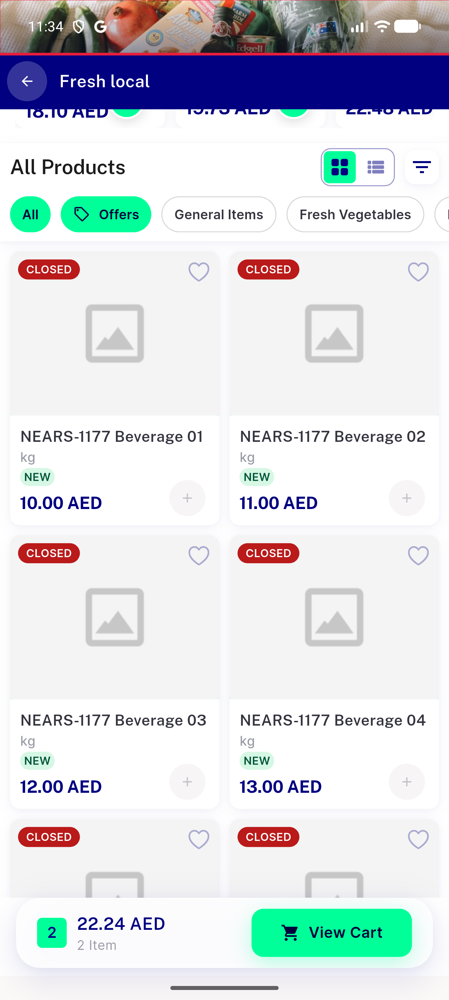</a> p5 SP12 photo strip behind status bar full</td>
<td align="center" width="33%"><a href="p5-SP2-SP13-hero-meta-small-new-chip__crop.png">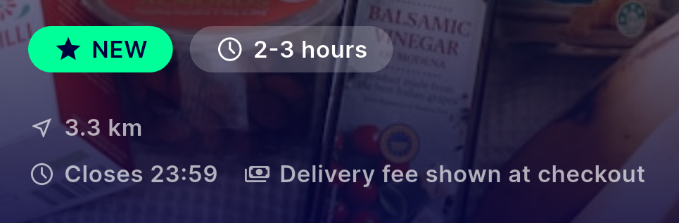</a> p5 SP2 SP13 hero meta small new chip crop</td>
<td align="center" width="33%"><a href="p5-SP2-SP13-hero-meta-small-new-chip__full.png">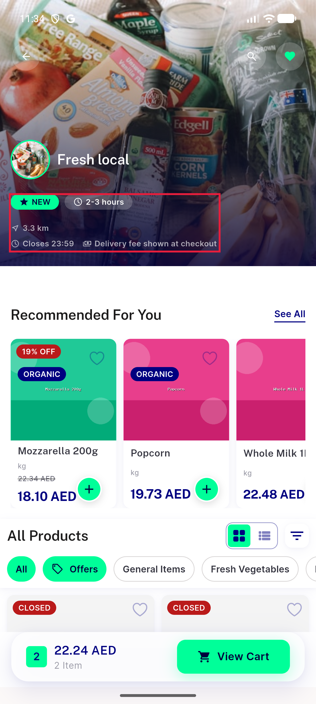</a> p5 SP2 SP13 hero meta small new chip full</td>
</tr>
<tr>
<td align="center" width="33%"> p5 SP3 gap hero to recommended crop</td>
<td align="center" width="33%"><a href="p5-SP3-gap-hero-to-recommended__full.png">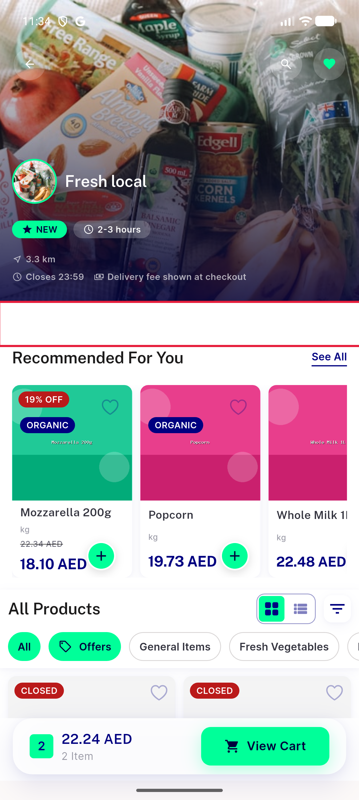</a> p5 SP3 gap hero to recommended full</td>
<td align="center" width="33%"><a href="p5-SP4-card-tags__crop.png">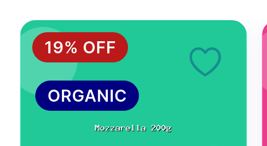</a> p5 SP4 card tags crop</td>
</tr>
<tr>
<td align="center" width="33%"> p5 SP4 card tags full</td>
<td align="center" width="33%"><a href="p5-SP5-SP6-toolbar-and-offers-chip__crop.png">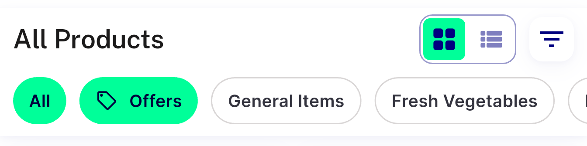</a> p5 SP5 SP6 toolbar and offers chip crop</td>
<td align="center" width="33%"><a href="p5-SP5-SP6-toolbar-and-offers-chip__full.png">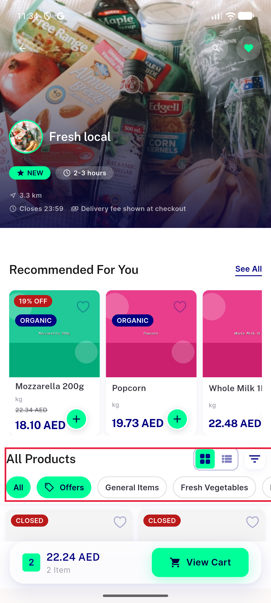</a> p5 SP5 SP6 toolbar and offers chip full</td>
</tr>
<tr>
<td align="center" width="33%"><a href="p5-SP7-SP8-SP9-oos-labelled-closed-first-new-kg-no-image__crop.png">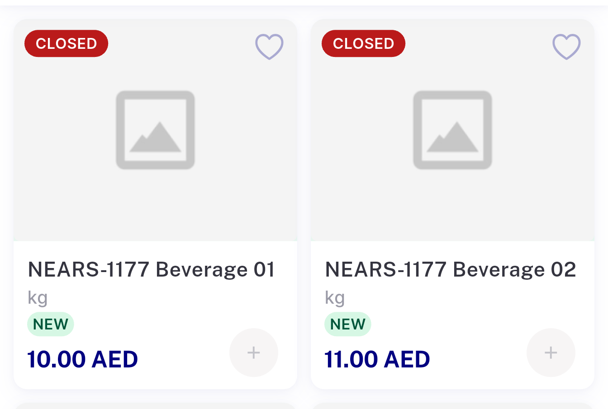</a> p5 SP7 SP8 SP9 oos labelled closed first new kg no image crop</td>
<td align="center" width="33%"><a href="p5-SP7-SP8-SP9-oos-labelled-closed-first-new-kg-no-image__full.png">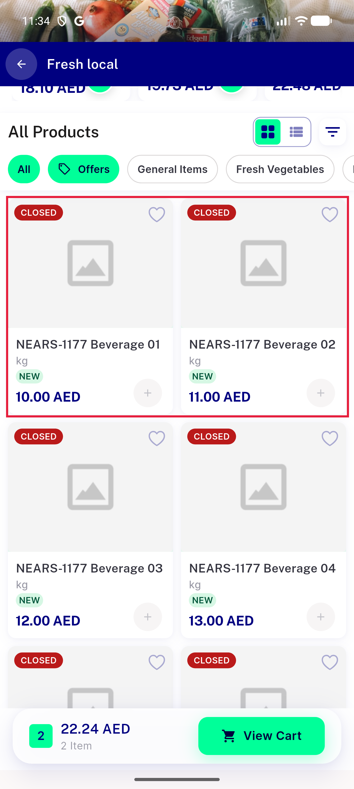</a> p5 SP7 SP8 SP9 oos labelled closed first new kg no image full</td>
</tr>
</table>

---
*From `nears/docs/qa-evidence/NEARS-3587/` · public-repo scrub policy (no live secrets; verified clean).*
