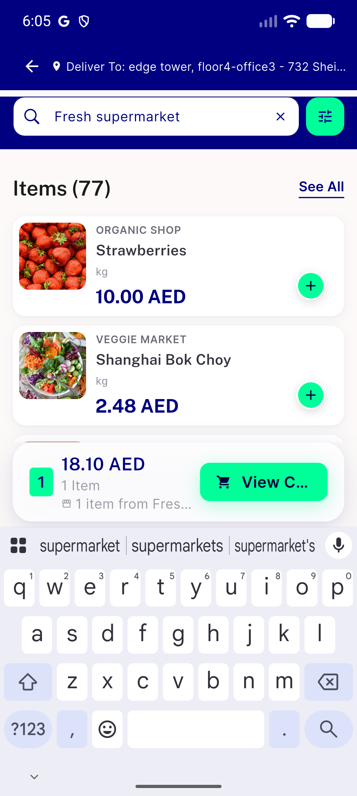
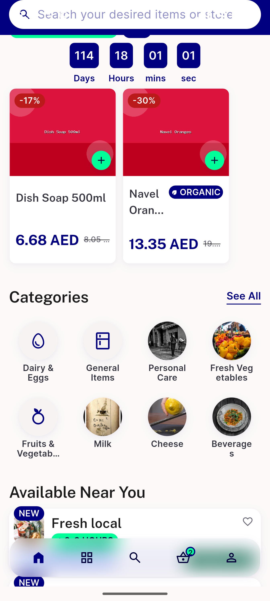
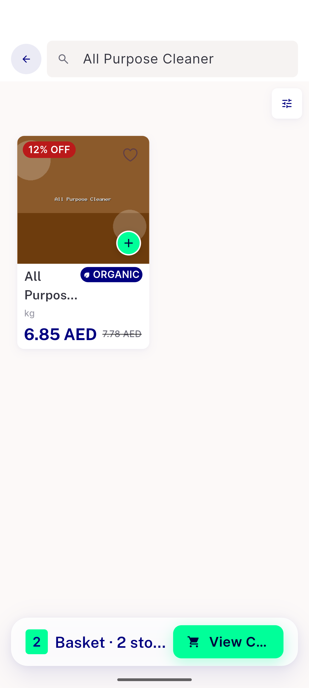
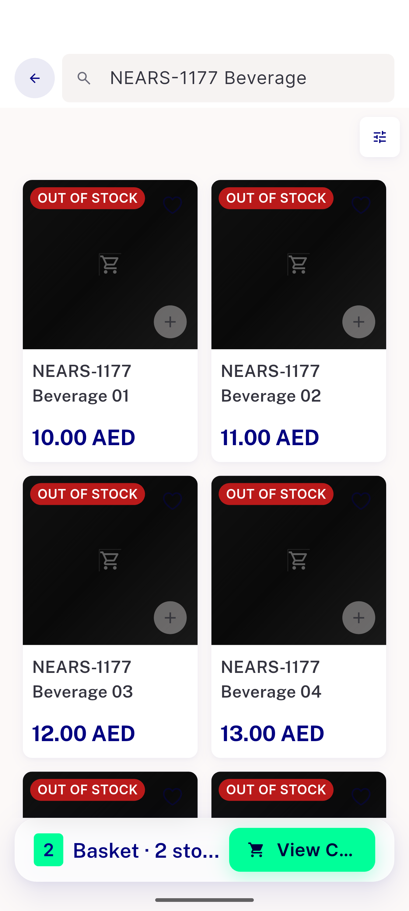
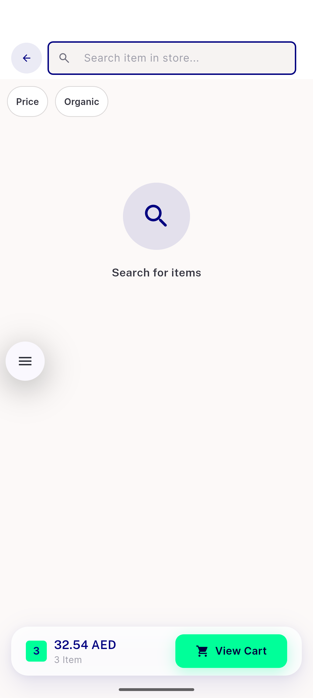
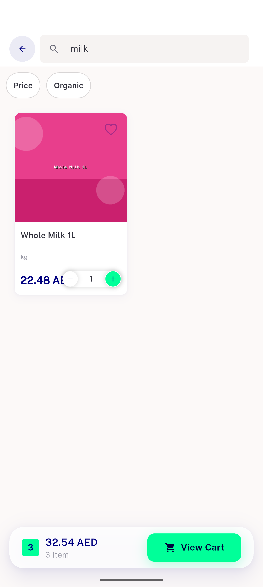
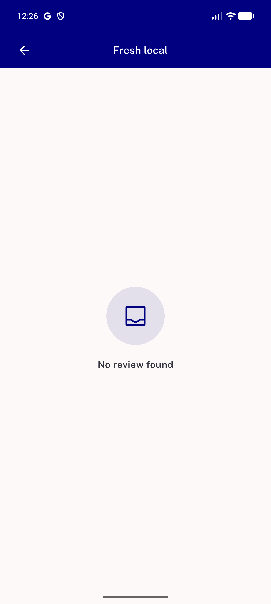

# QA Evidence — NEARS-3587

**PASS — 8b-fix1 delta re-QA: SP4/SP8/SP9/analytics/SP10 all verified fixed**

**30 screenshot(s).** Click any thumbnail for full resolution.

<table>
<tr>
<td align="center" width="33%"> 8b fix1 SP10 singular basket bar en</td>
<td align="center" width="33%"> 8b fix1 SP4 home flashsale</td>
<td align="center" width="33%"> 8b fix1 SP4 store grid</td>
</tr>
<tr>
<td align="center" width="33%"> 8b fix1 SP8 oos no unit</td>
<td align="center" width="33%"> p37 store 20 instore idle</td>
<td align="center" width="33%"> p37 store 21 instore milk</td>
</tr>
<tr>
<td align="center" width="33%"> p37 store 30 store reviews</td>
<td align="center" width="33%"> p5 01</td>
<td align="center" width="33%"> p5 02</td>
</tr>
<tr>
<td align="center" width="33%"> p5 03</td>
<td align="center" width="33%"> p5 04</td>
<td align="center" width="33%"> p5 05</td>
</tr>
<tr>
<td align="center" width="33%"> p5 SP1 hero icons low contrast crop</td>
<td align="center" width="33%"> p5 SP1 hero icons low contrast full</td>
<td align="center" width="33%"> p5 SP10 basket bar other store crop</td>
</tr>
<tr>
<td align="center" width="33%"> p5 SP10 basket bar other store full</td>
<td align="center" width="33%"> p5 SP11 duplicate carrots crop</td>
<td align="center" width="33%"> p5 SP11 duplicate carrots full</td>
</tr>
<tr>
<td align="center" width="33%"> p5 SP12 photo strip behind status bar crop</td>
<td align="center" width="33%"> p5 SP12 photo strip behind status bar full</td>
<td align="center" width="33%"> p5 SP2 SP13 hero meta small new chip crop</td>
</tr>
<tr>
<td align="center" width="33%"> p5 SP2 SP13 hero meta small new chip full</td>
<td align="center" width="33%"> p5 SP3 gap hero to recommended crop</td>
<td align="center" width="33%"> p5 SP3 gap hero to recommended full</td>
</tr>
<tr>
<td align="center" width="33%"> p5 SP4 card tags crop</td>
<td align="center" width="33%"> p5 SP4 card tags full</td>
<td align="center" width="33%"> p5 SP5 SP6 toolbar and offers chip crop</td>
</tr>
<tr>
<td align="center" width="33%"> p5 SP5 SP6 toolbar and offers chip full</td>
<td align="center" width="33%"> p5 SP7 SP8 SP9 oos labelled closed first new kg no image crop</td>
<td align="center" width="33%"> p5 SP7 SP8 SP9 oos labelled closed first new kg no image full</td>
</tr>
</table>

---
*From `nears/docs/qa-evidence/NEARS-3587/` · public-repo scrub policy (no live secrets; verified clean).*
