# QA Evidence — NEARS-3587

**FAIL — 4 task_bugs (SP4 overflow, SP8 unit leak, SP9 fallback unreachable, Analytics store_id missing); rest PASS**

**26 screenshot(s).** Click any thumbnail for full resolution.

<table>
<tr>
<td align="center" width="33%"><a href="bug-switch-off.png">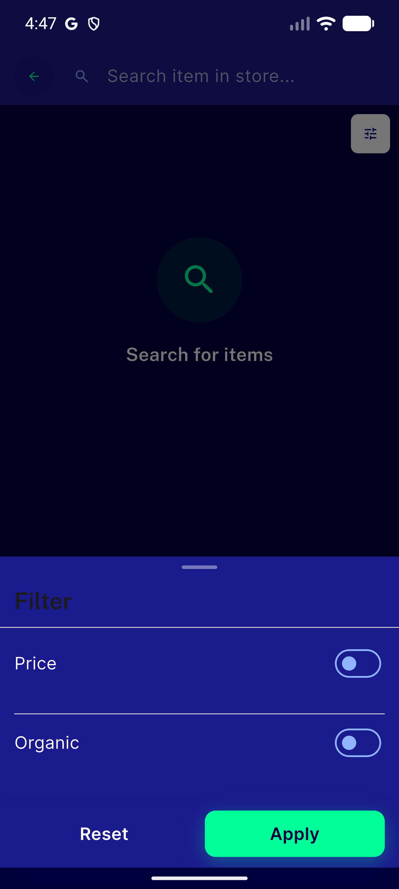</a> bug switch off</td>
<td align="center" width="33%"> bug switch on</td>
<td align="center" width="33%"><a href="bug-switch-on2.png">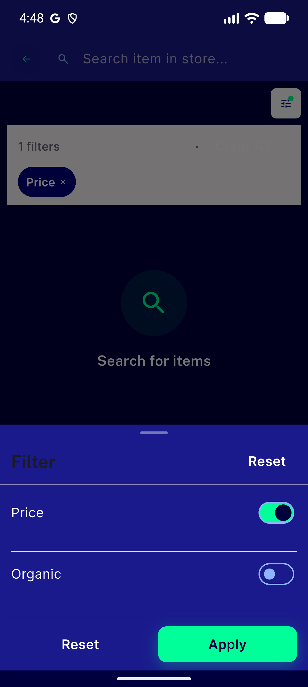</a> bug switch on2</td>
</tr>
<tr>
<td align="center" width="33%"><a href="is1-applied-bar.png">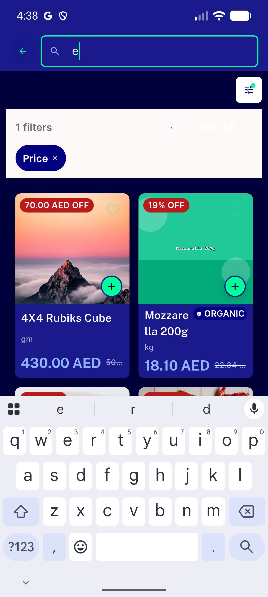</a> is1 applied bar</td>
<td align="center" width="33%"><a href="is1-applied-filter.png">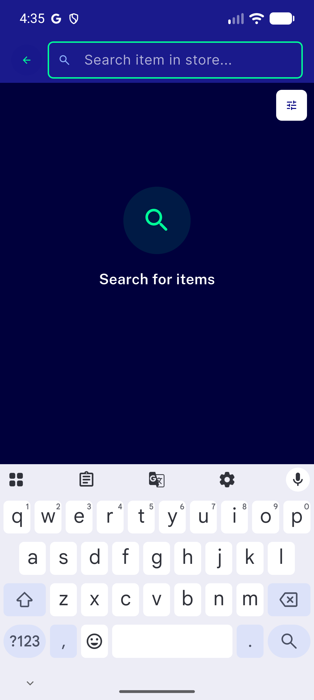</a> is1 applied filter</td>
<td align="center" width="33%"> is1 filter sheet</td>
</tr>
<tr>
<td align="center" width="33%"><a href="is1-noleak-check.png">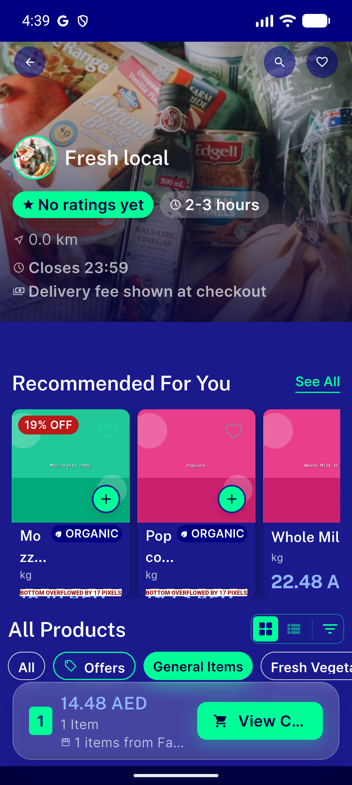</a> is1 noleak check</td>
<td align="center" width="33%"><a href="is1-search-results.png">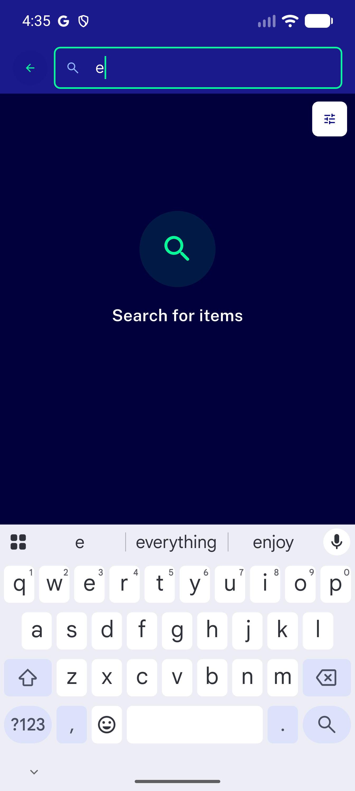</a> is1 search results</td>
<td align="center" width="33%"><a href="is1-search-results2.png">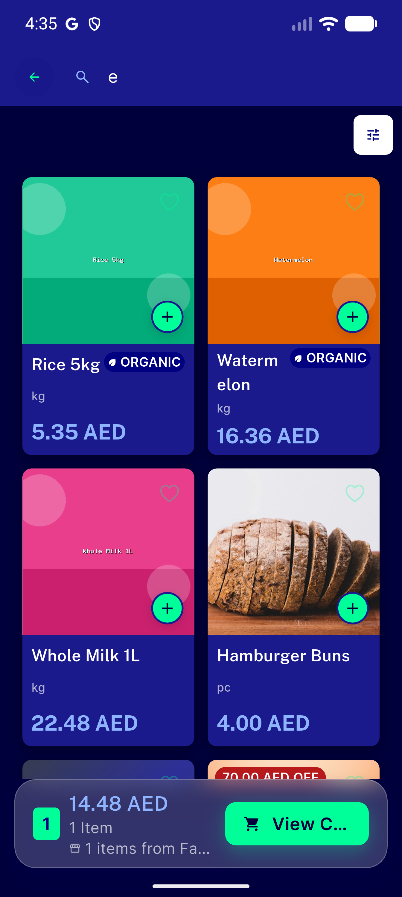</a> is1 search results2</td>
</tr>
<tr>
<td align="center" width="33%"><a href="is1-toggle-check.png">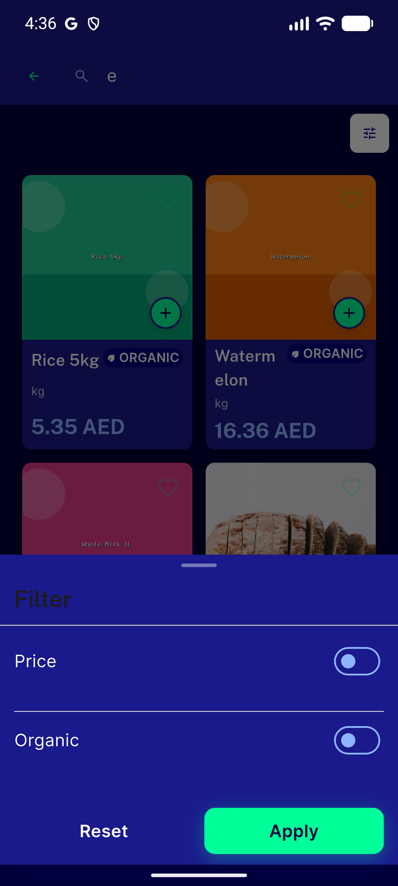</a> is1 toggle check</td>
<td align="center" width="33%"> regression a flashsale home</td>
<td align="center" width="33%"><a href="regression-b-categories.png">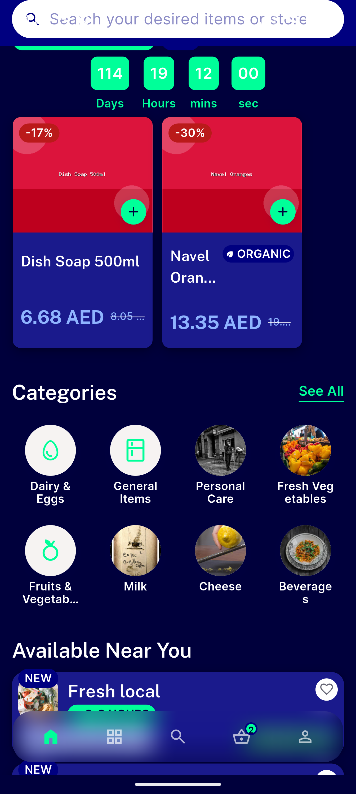</a> regression b categories</td>
</tr>
<tr>
<td align="center" width="33%"><a href="regression-b-categories2.png">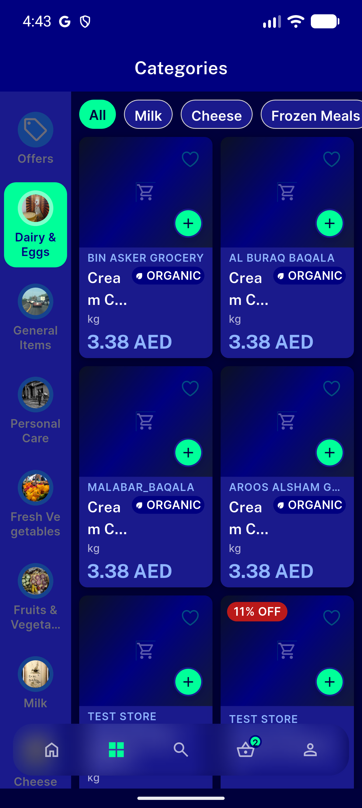</a> regression b categories2</td>
<td align="center" width="33%"><a href="regression-c-mappreview.png">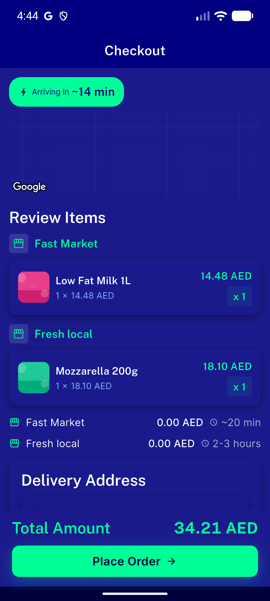</a> regression c mappreview</td>
<td align="center" width="33%"> sp1 sp2 hero</td>
</tr>
<tr>
<td align="center" width="33%"><a href="sp10-cart-top.png">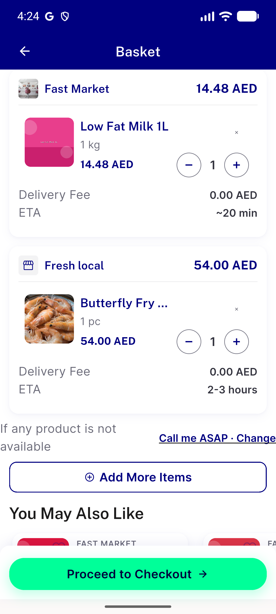</a> sp10 cart top</td>
<td align="center" width="33%"><a href="sp10-wrong-store-basket.png">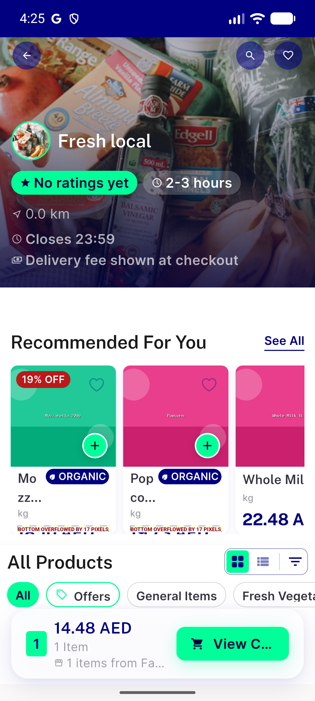</a> sp10 wrong store basket</td>
<td align="center" width="33%"><a href="sp12-0pct.png">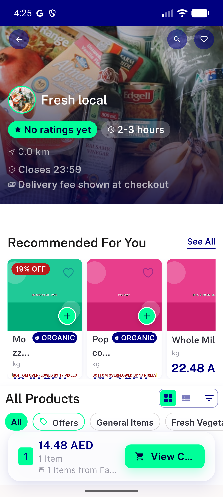</a> sp12 0pct</td>
</tr>
<tr>
<td align="center" width="33%"><a href="sp12-25pct.png">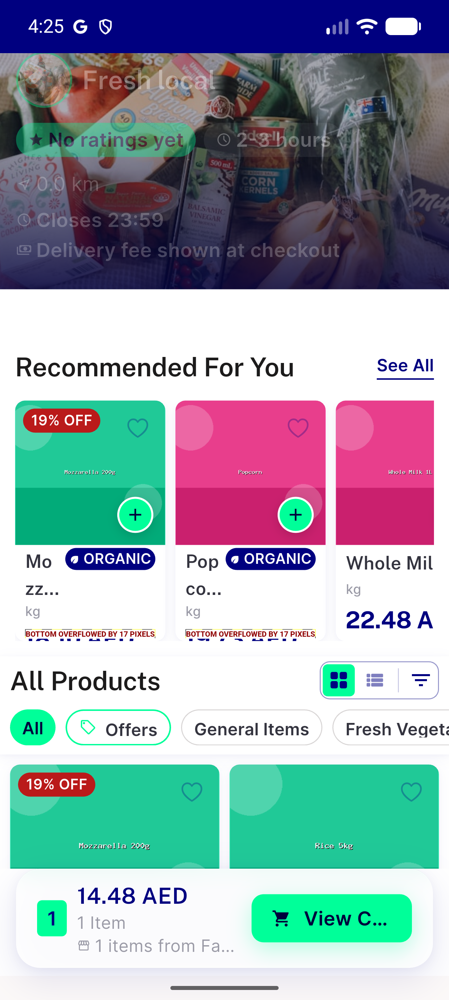</a> sp12 25pct</td>
<td align="center" width="33%"><a href="sp12-50pct.png">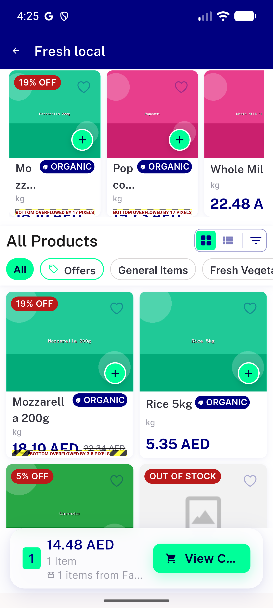</a> sp12 50pct</td>
<td align="center" width="33%"> sp2 ar hero</td>
</tr>
<tr>
<td align="center" width="33%"> sp2 ar hero2</td>
<td align="center" width="33%"><a href="sp2-ar-hero3.png">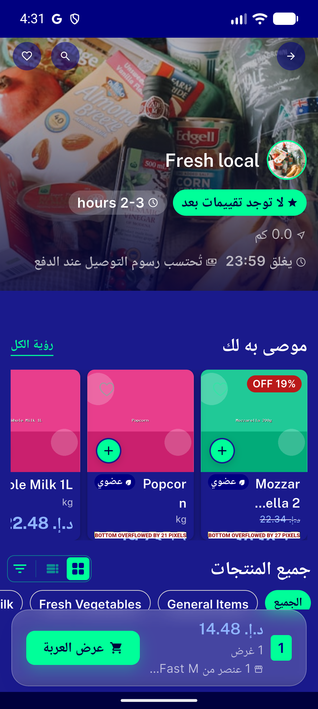</a> sp2 ar hero3</td>
<td align="center" width="33%"><a href="sp4-recommended-rail.png">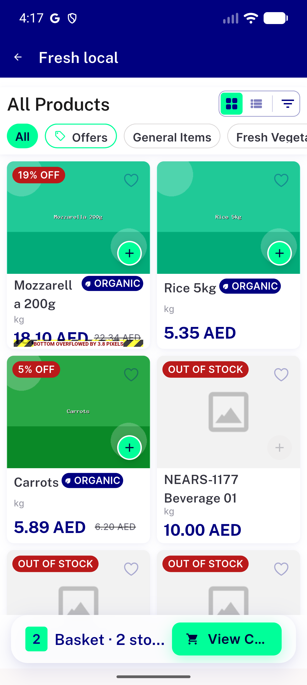</a> sp4 recommended rail</td>
</tr>
<tr>
<td align="center" width="33%"><a href="srv1-empty-state.png">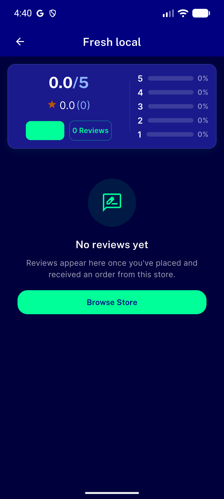</a> srv1 empty state</td>
<td align="center" width="33%"><a href="store-hero-top.png">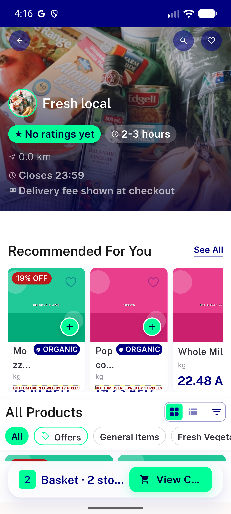</a> store hero top</td>
</tr>
</table>

---
*From `nears/docs/qa-evidence/NEARS-3587/` · public-repo scrub policy (no live secrets; verified clean).*
