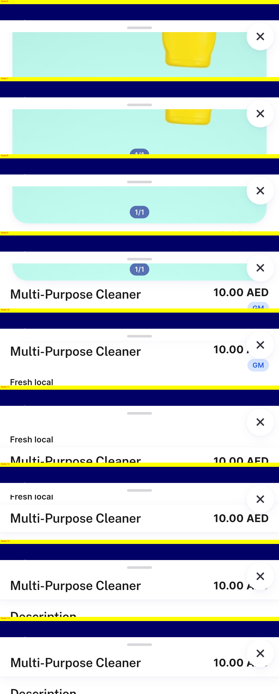
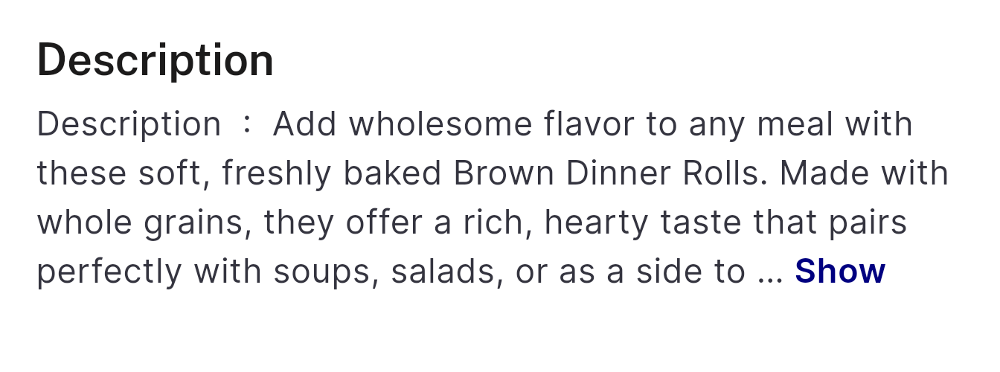
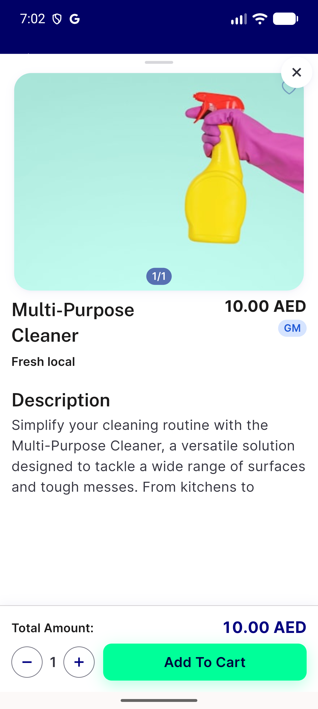

# QA Evidence — NEARS-3588

**FAIL - PD4 still broken (Show More toggle clips/missing on-screen), PD5 PASS for single-line-name, add_to_cart+view_item source enum analytics PASS (delta re-QA cycle 2)**

**4 screenshot(s).** Click any thumbnail for full resolution.

<table>
<tr>
<td align="center" width="33%"> ac pd5 singleline scroll montage</td>
<td align="center" width="33%"> bug pd4 item51 fontscale1.0 more clipped</td>
<td align="center" width="33%"> bug pd4 item94 fontscale1.0 more clipped</td>
</tr>
<tr>
<td align="center" width="33%"> bug pd4 item94 fontscale1.3 no toggle</td>
</tr>
</table>

### Other artifacts
- [`ac-analytics-addtocart.log`](ac-analytics-addtocart.log)
- [`ac-analytics-viewitem-source-enum.log`](ac-analytics-viewitem-source-enum.log)

---
*From `nears/docs/qa-evidence/NEARS-3588/` · public-repo scrub policy (no live secrets; verified clean).*
