# QA Evidence — NEARS-3589

**Final confirmation pass PASS - BK1 15dp reconfirmed fresh build, AC-DLS Outlined Ring reachable**

**64 screenshot(s).** Click any thumbnail for full resolution.

<table>
<tr>
<td align="center" width="33%"> bk scroll check</td>
<td align="center" width="33%"><a href="bk1-pushed-mode-en.png">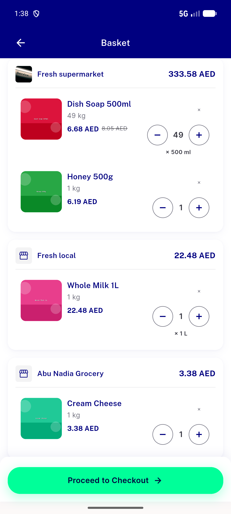</a> bk1 pushed mode en</td>
<td align="center" width="33%"> bk1 tab mode en</td>
</tr>
<tr>
<td align="center" width="33%"><a href="bk2-check.png">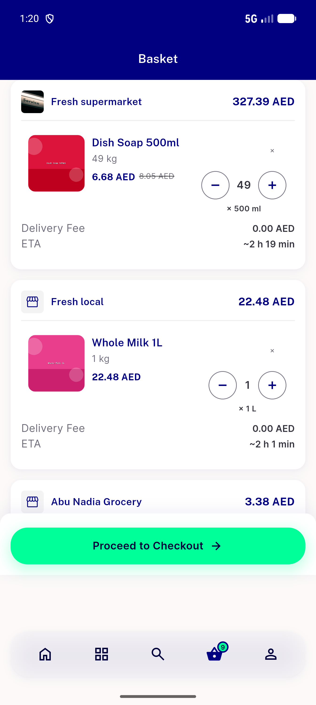</a> bk2 check</td>
<td align="center" width="33%"><a href="bk2-undo-snackbar-clean.png">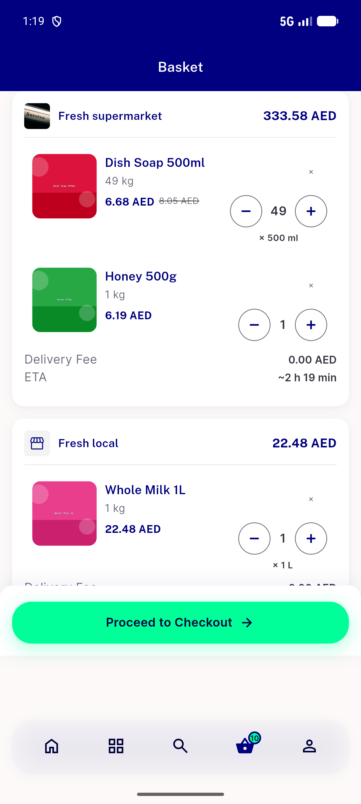</a> bk2 undo snackbar clean</td>
<td align="center" width="33%"> bk2 undo snackbar clean2</td>
</tr>
<tr>
<td align="center" width="33%"> bk2 undo snackbar fast</td>
<td align="center" width="33%"><a href="bk2-undo-snackbar.png">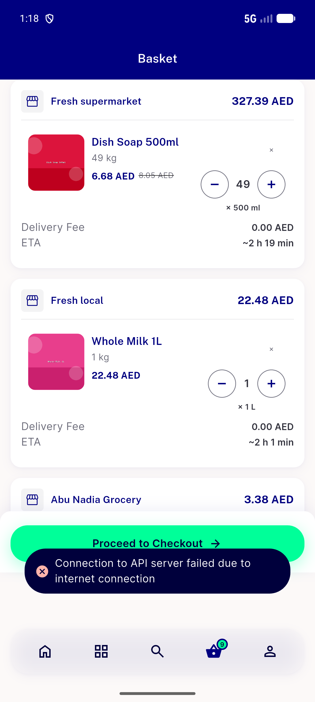</a> bk2 undo snackbar</td>
<td align="center" width="33%"> bk2 undo timed</td>
</tr>
<tr>
<td align="center" width="33%"> bug bk1 cta nav gap</td>
<td align="center" width="33%"><a href="bug-bk2-tap-target-44dp.png">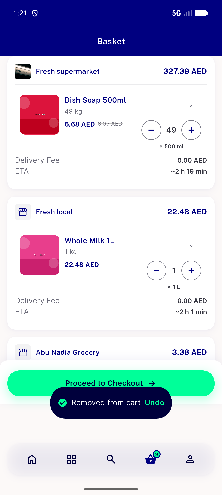</a> bug bk2 tap target 44dp</td>
<td align="center" width="33%"><a href="bug-bk3-widgetbook-outlined-ring-unreachable.png">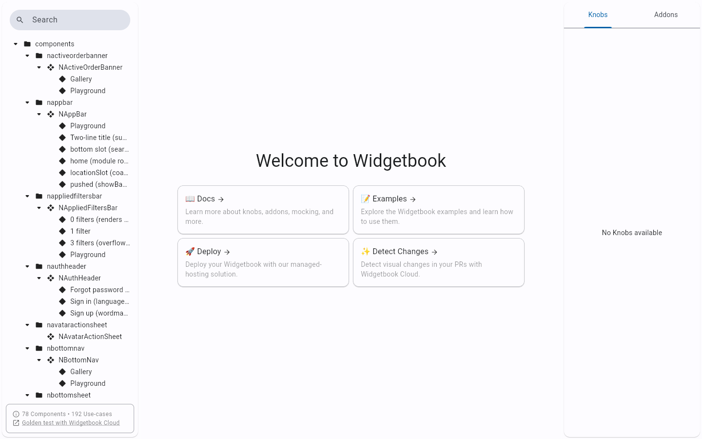</a> bug bk3 widgetbook outlined ring unreachable</td>
</tr>
<tr>
<td align="center" width="33%"> bug bk6 substitution below fold</td>
<td align="center" width="33%"><a href="bug-bk7-discount-row-unfixed-mobile.png">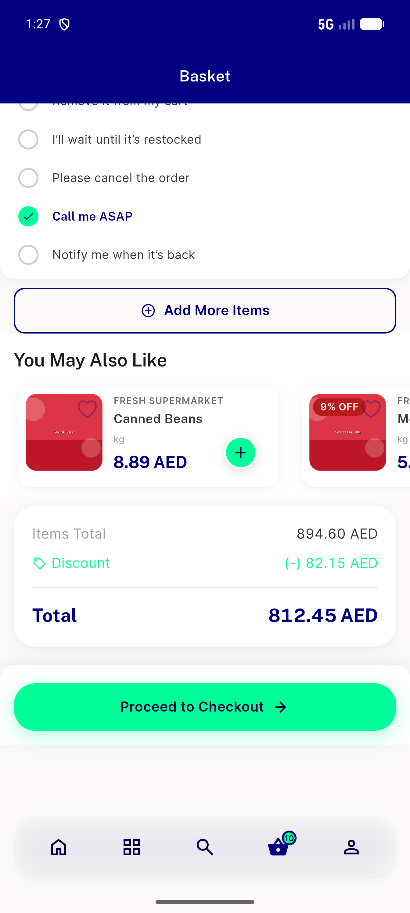</a> bug bk7 discount row unfixed mobile</td>
<td align="center" width="33%"> delta acdls widgetbook outlined ring</td>
</tr>
<tr>
<td align="center" width="33%"><a href="delta-bk1-probe-crosscheck.png">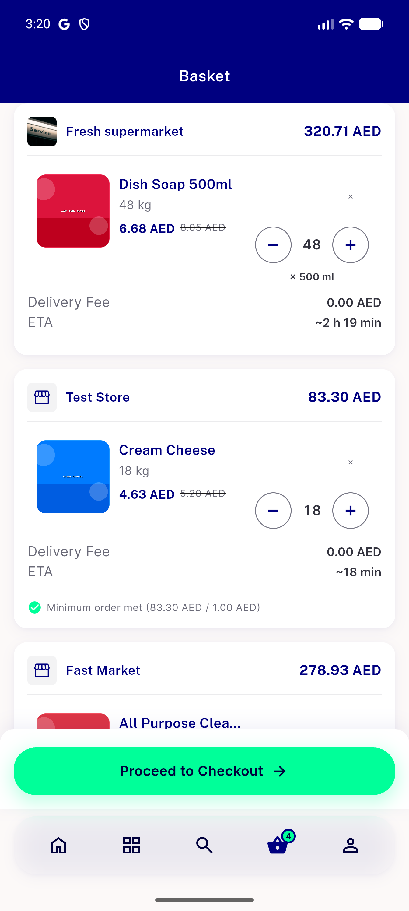</a> delta bk1 probe crosscheck</td>
<td align="center" width="33%"><a href="delta-bk1-tabmode-cta-gap.png">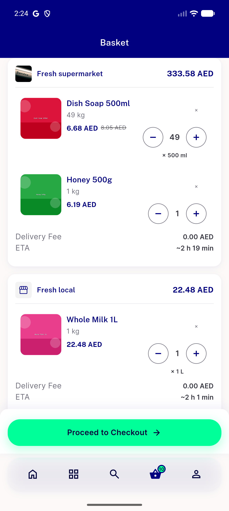</a> delta bk1 tabmode cta gap</td>
<td align="center" width="33%"><a href="delta-bk2-undo-independent-node.png">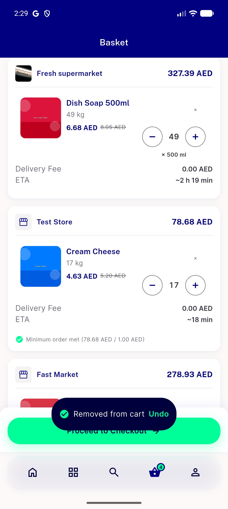</a> delta bk2 undo independent node</td>
</tr>
<tr>
<td align="center" width="33%"><a href="delta-bk2bk3-narrow-1.3x-textscale.png">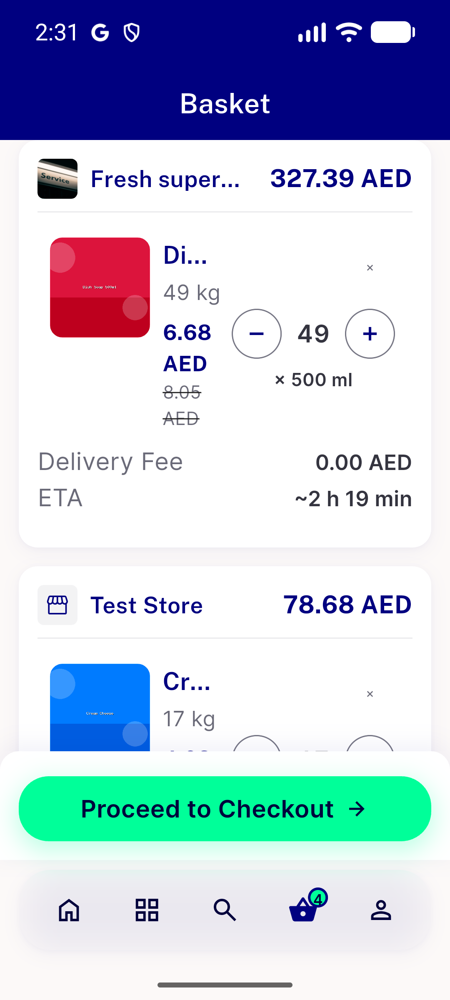</a> delta bk2bk3 narrow 1.3x textscale</td>
<td align="center" width="33%"><a href="delta-bk2bk3-narrow-360dp.png">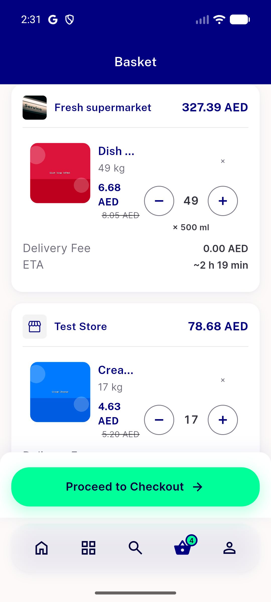</a> delta bk2bk3 narrow 360dp</td>
<td align="center" width="33%"><a href="delta-bk2bk3-rtl-narrow-1.3x.png">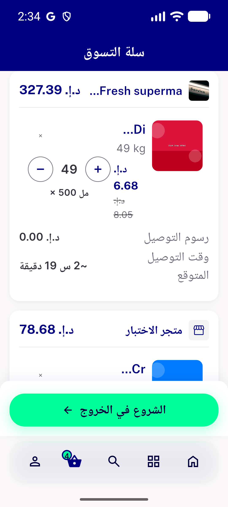</a> delta bk2bk3 rtl narrow 1.3x</td>
</tr>
<tr>
<td align="center" width="33%"> delta bk6 basket initial</td>
<td align="center" width="33%"><a href="delta-bk7-discount-row-mobile.png">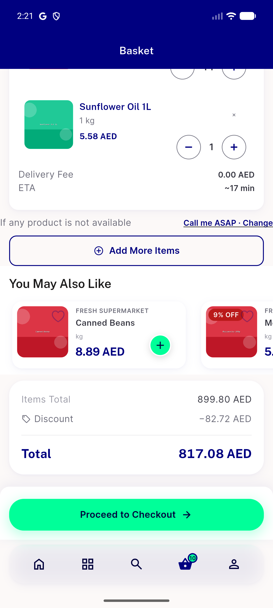</a> delta bk7 discount row mobile</td>
<td align="center" width="33%"><a href="final-acdls-outlined-ring-reachable.png">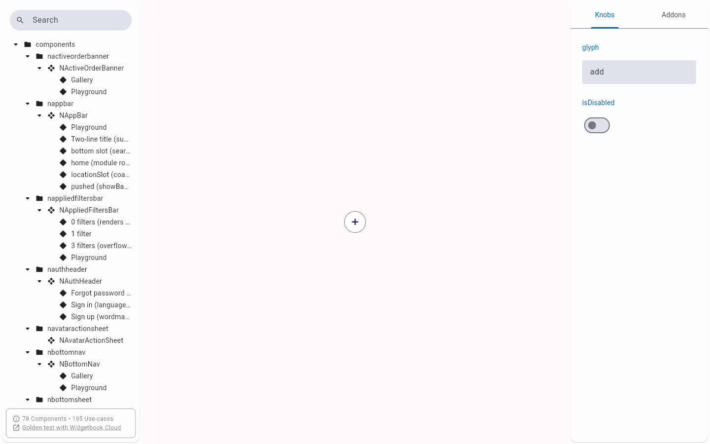</a> final acdls outlined ring reachable</td>
</tr>
<tr>
<td align="center" width="33%"><a href="final-bk1-3button-nav-mode-attempt.png">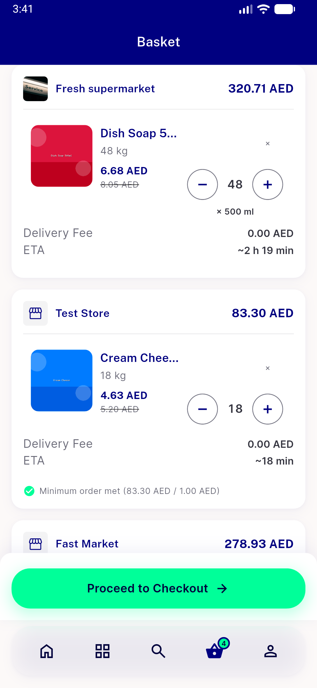</a> final bk1 3button nav mode attempt</td>
<td align="center" width="33%"> final bk1 tabmode gap 15dp</td>
<td align="center" width="33%"> p7 01</td>
</tr>
<tr>
<td align="center" width="33%"> p7 02</td>
<td align="center" width="33%"> p7 12 after x</td>
<td align="center" width="33%"> p7 14 settled bottom</td>
</tr>
<tr>
<td align="center" width="33%"> p7 20 owner repro</td>
<td align="center" width="33%"> p7 30 after add other store</td>
<td align="center" width="33%"> p7 31 multistore pushed top</td>
</tr>
<tr>
<td align="center" width="33%"> p7 32 multistore pushed mid</td>
<td align="center" width="33%"> p7 33 multistore pushed bottom</td>
<td align="center" width="33%"> p7 34 multistore tab top</td>
</tr>
<tr>
<td align="center" width="33%"> p7 B1 checkout bar floats mid screen tab mode crop</td>
<td align="center" width="33%"> p7 B1 checkout bar floats mid screen tab mode full</td>
<td align="center" width="33%"> p7 B1 floating panel multistore tab crop</td>
</tr>
<tr>
<td align="center" width="33%"> p7 B1 floating panel multistore tab full</td>
<td align="center" width="33%"> p7 B2 remove x unlabelled 40dp no undo crop</td>
<td align="center" width="33%"> p7 B2 remove x unlabelled 40dp no undo full</td>
</tr>
<tr>
<td align="center" width="33%"> p7 B3 huge mint steppers crop</td>
<td align="center" width="33%"> p7 B3 huge mint steppers full</td>
<td align="center" width="33%"> p7 B4 unit shown kg chip and 1kg crop</td>
</tr>
<tr>
<td align="center" width="33%"> p7 B4 unit shown kg chip and 1kg full</td>
<td align="center" width="33%"> p7 B5 suggestion card style crop</td>
<td align="center" width="33%"> p7 B5 suggestion card style full</td>
</tr>
<tr>
<td align="center" width="33%"> p7 B6 substitution default hidden crop</td>
<td align="center" width="33%"> p7 B6 substitution default hidden full</td>
<td align="center" width="33%"> p7 B7 discount zero row low contrast crop</td>
</tr>
<tr>
<td align="center" width="33%"> p7 B7 discount zero row low contrast full</td>
<td align="center" width="33%"> p7 M1 single combined total no fees crop</td>
<td align="center" width="33%"> p7 M1 single combined total no fees full</td>
</tr>
<tr>
<td align="center" width="33%"> p7 M1 two store sections no delivery info crop</td>
<td align="center" width="33%"> p7 M1 two store sections no delivery info full</td>
<td align="center" width="33%"> p7 M2 two suggestion rails crop</td>
</tr>
<tr>
<td align="center" width="33%"> p7 M2 two suggestion rails full</td>
<td align="center" width="33%"> p7 M3 diagonal ribbon 4th discount style crop</td>
<td align="center" width="33%"> p7 M3 diagonal ribbon 4th discount style full</td>
</tr>
<tr>
<td align="center" width="33%"> p7 M4 store bar combined other store total crop</td>
<td align="center" width="33%"> p7 M4 store bar combined other store total full</td>
<td align="center" width="33%"> p7 M5 stepper over price whole milk crop</td>
</tr>
<tr>
<td align="center" width="33%"> p7 M5 stepper over price whole milk full</td>
</tr>
</table>

### Other artifacts
- [`bug-bk2-undo-a11y-merge-dump.xml`](bug-bk2-undo-a11y-merge-dump.xml)
- [`bug-bk3-widgetbook-outlined-ring-unreachable.log`](bug-bk3-widgetbook-outlined-ring-unreachable.log)
- [`delta-bk2-undo-a11y-dump.xml`](delta-bk2-undo-a11y-dump.xml)
- [`p7-remove-label-evidence.txt`](p7-remove-label-evidence.txt)
- [`progress.md`](progress.md)

---
*From `nears/docs/qa-evidence/NEARS-3589/` · public-repo scrub policy (no live secrets; verified clean).*
