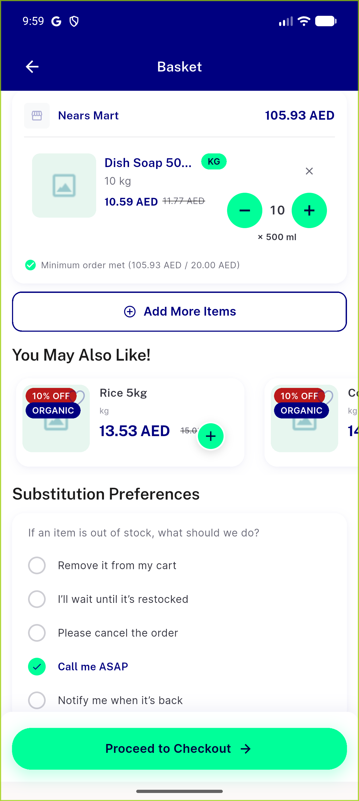
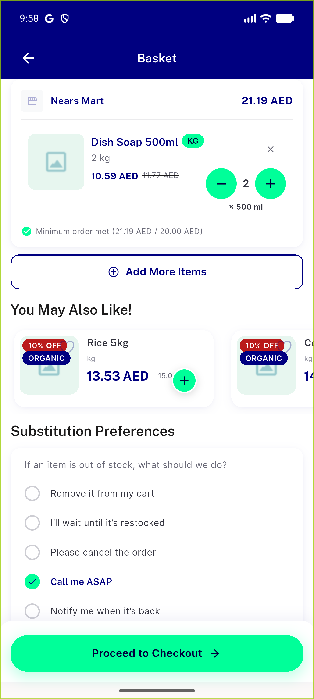
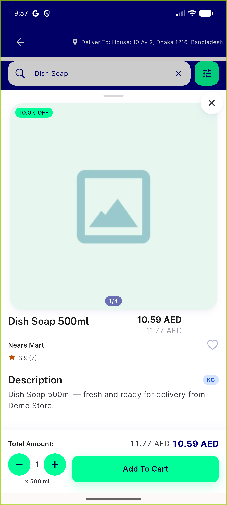
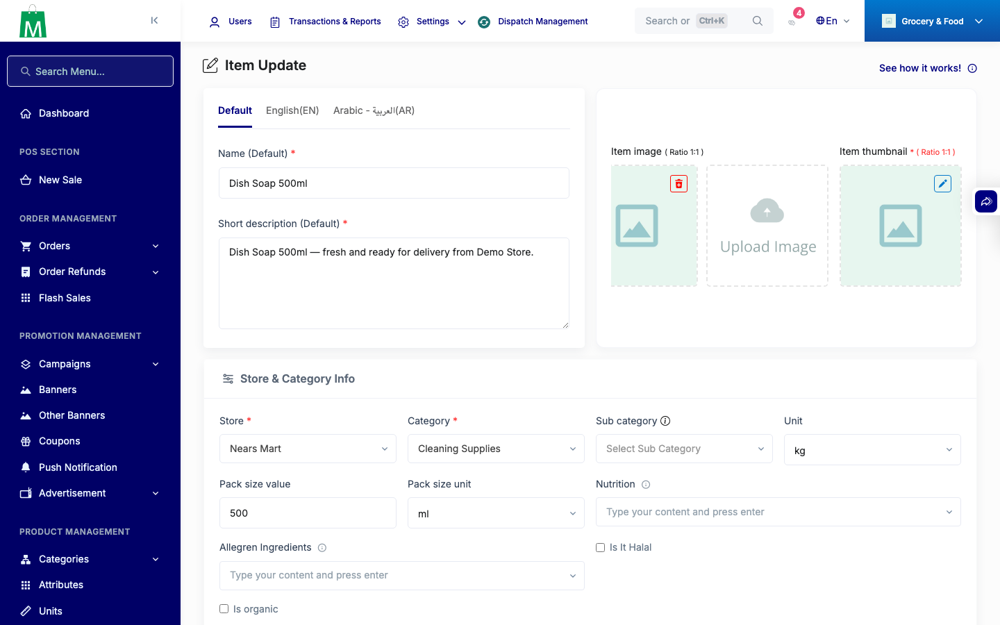

# QA Evidence — NEARS-3590

**PASS — pack-size caption on NQtyStepper wired at basket + item-sheet primary stepper, EN+AR, no NEARS-2723 width regression, analytics events confirmed live**

**5 screenshot(s).** Click any thumbnail for full resolution.

<table>
<tr>
<td align="center" width="33%"> ac1 basket row 2digit caption</td>
<td align="center" width="33%"> ac1 basket row caption</td>
<td align="center" width="33%"> ac2 item sheet primary caption</td>
</tr>
<tr>
<td align="center" width="33%"> ac6 basket arabic caption ltr</td>
<td align="center" width="33%"> ac7 admin edit form</td>
</tr>
</table>

---
*From `nears/docs/qa-evidence/NEARS-3590/` · public-repo scrub policy (no live secrets; verified clean).*
