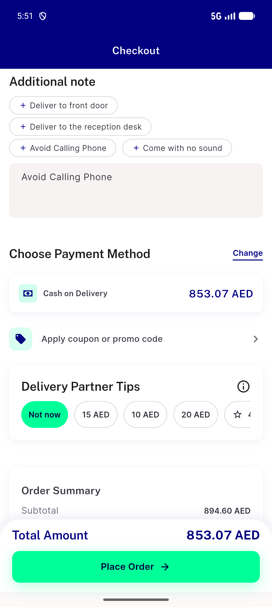

# QA Evidence — NEARS-3625

**Delta re-QA fix-cycle 2: PASS - CK8 critical fix confirmed re-enabling, CK2/CK7/CK10/CK13/analytics dead-code fix + CK1 dedup all re-verified live, CK9/CK11 regression clean**

**1 screenshot(s).** Click any thumbnail for full resolution.

<table>
<tr>
<td align="center" width="33%"> ck9 ck13 summary and consent</td>
</tr>
</table>

### Other artifacts
- [`ck10-network-trace.log`](ck10-network-trace.log)
- [`ck2-ck1-ck13-live-logs-and-strings.log`](ck2-ck1-ck13-live-logs-and-strings.log)
- [`ck7-section-order-and-ck9-ck11-ck12-regression.log`](ck7-section-order-and-ck9-ck11-ck12-regression.log)
- [`ck8-place-order-reenable-timing.log`](ck8-place-order-reenable-timing.log)

---
*From `nears/docs/qa-evidence/NEARS-3625/` · public-repo scrub policy (no live secrets; verified clean).*
