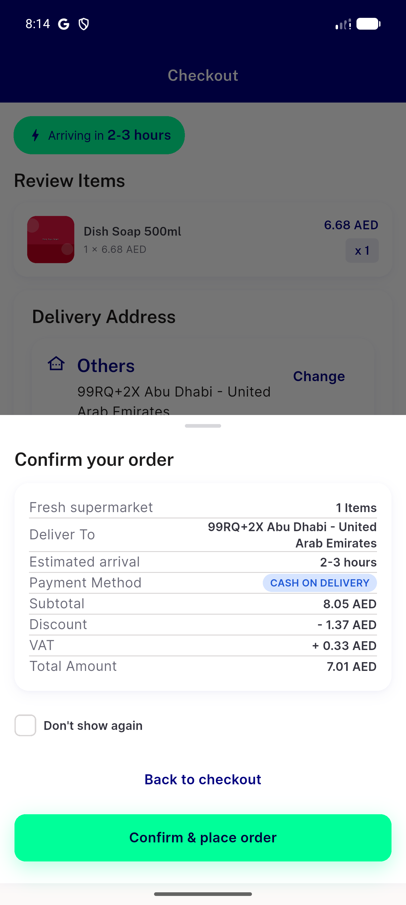
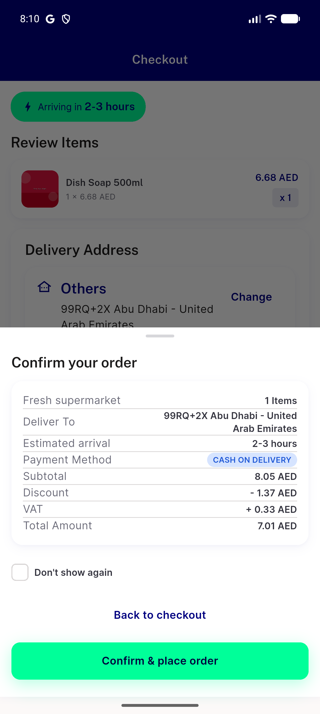
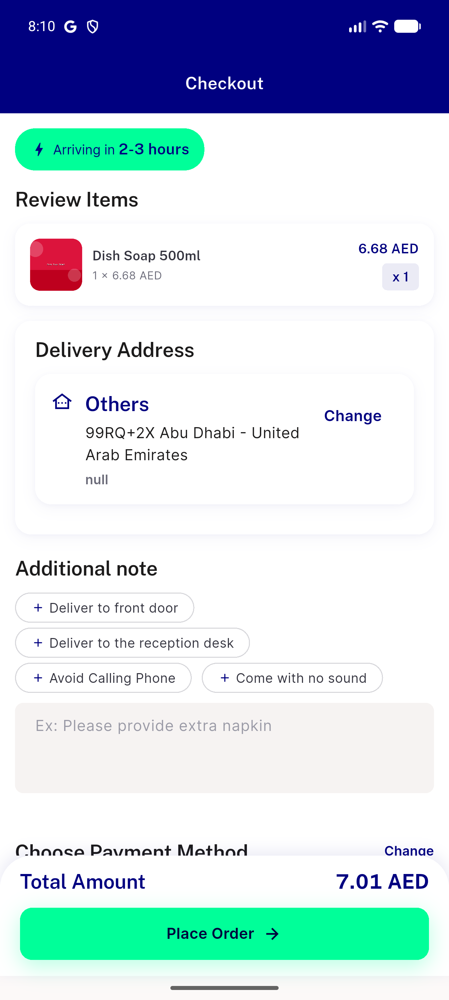
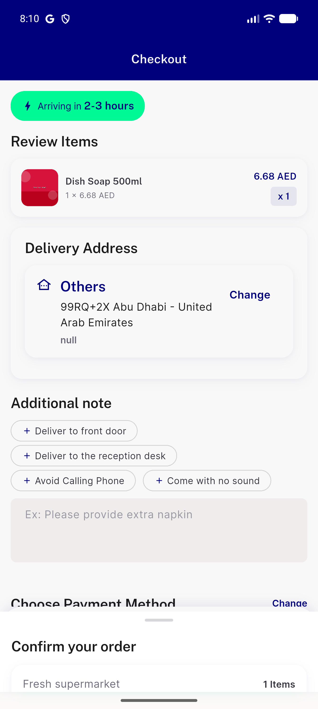

# QA Evidence — NEARS-3626

**PASS — order confirmation sheet, emulator-5554**

**4 screenshot(s).** Click any thumbnail for full resolution.

<table>
<tr>
<td align="center" width="33%"> ac log offline degraded fallback state</td>
<td align="center" width="33%"> ac1 ac2 ac4 ac6 confirm sheet default state</td>
<td align="center" width="33%"> ac1 checkout before place order</td>
</tr>
<tr>
<td align="center" width="33%"> ac3 sheet immediate open</td>
</tr>
</table>

### Other artifacts
- [`ac-analytics-live-log.log`](ac-analytics-live-log.log)
- [`ac-log-forced-get-tax-offline-failure.log`](ac-log-forced-get-tax-offline-failure.log)

---
*From `nears/docs/qa-evidence/NEARS-3626/` · public-repo scrub policy (no live secrets; verified clean).*
