# QA Evidence — NEARS-3627

**PASS/FAIL final — see QA comment (2 blocking task_bugs: OR14, OR15)**

**57 screenshot(s).** Click any thumbnail for full resolution.

<table>
<tr>
<td align="center" width="33%"><a href="bug-hub-mintwashes-inflight-status.png">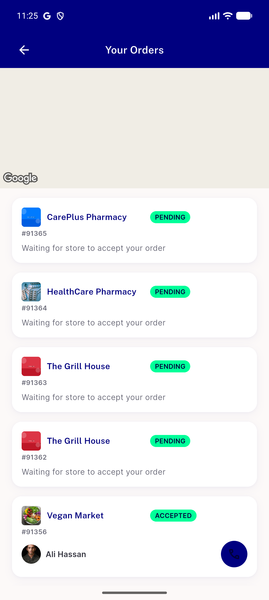</a> bug hub mintwashes inflight status</td>
<td align="center" width="33%"> bug or1 no stated eta fallback text</td>
<td align="center" width="33%"> bug or14 empty summary body at default extent</td>
</tr>
<tr>
<td align="center" width="33%"> bug or15 fab overlaps trip route dragged</td>
<td align="center" width="33%"><a href="p30-hub-00-orders-hub.png">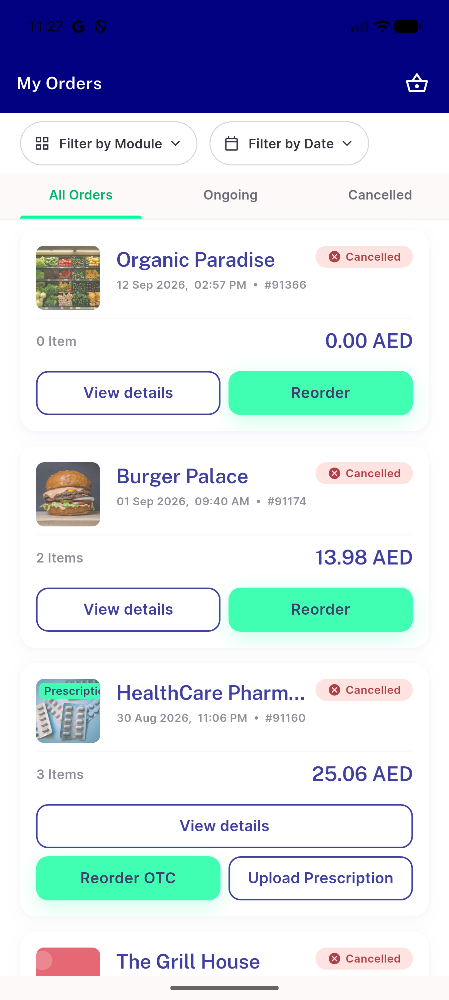</a> p30 hub 00 orders hub</td>
<td align="center" width="33%"><a href="p30-hub-40-hub-top.png">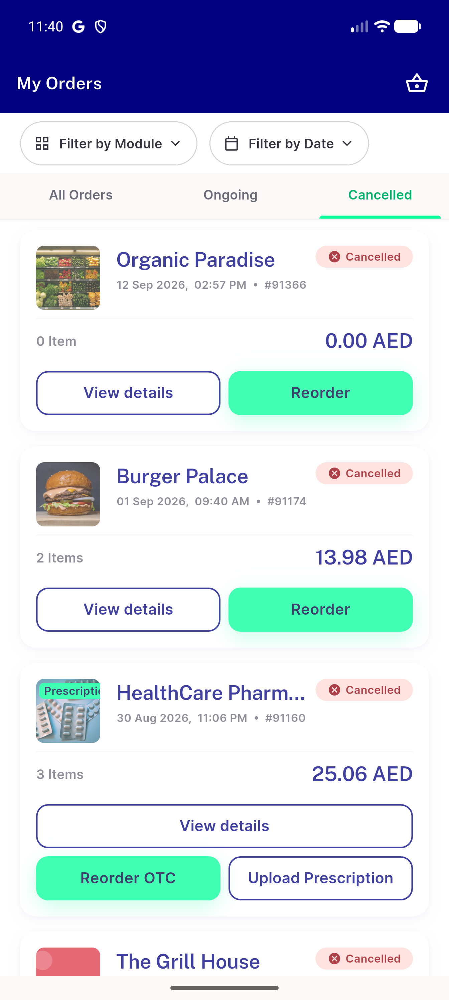</a> p30 hub 40 hub top</td>
</tr>
<tr>
<td align="center" width="33%"><a href="p30-hub-41-filter-module.png">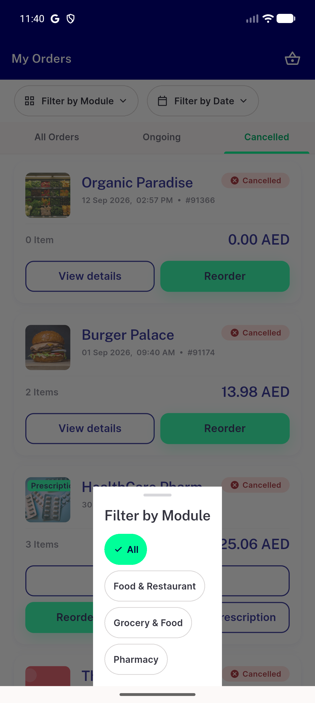</a> p30 hub 41 filter module</td>
<td align="center" width="33%"> p30 hub 42 filter date</td>
<td align="center" width="33%"><a href="p9-01-orders-list.png">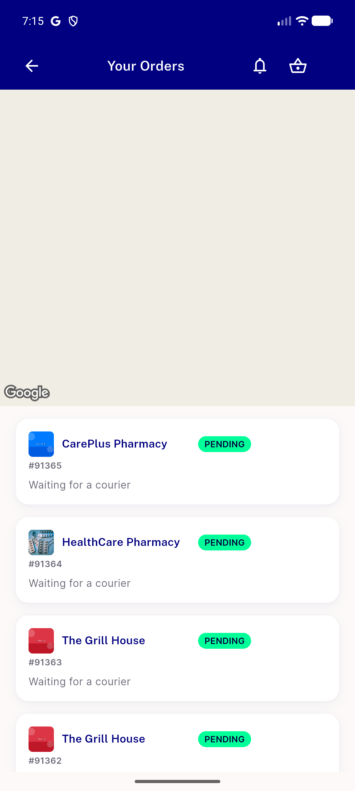</a> p9 01 orders list</td>
</tr>
<tr>
<td align="center" width="33%"><a href="p9-02-orders-list-scrolled.png">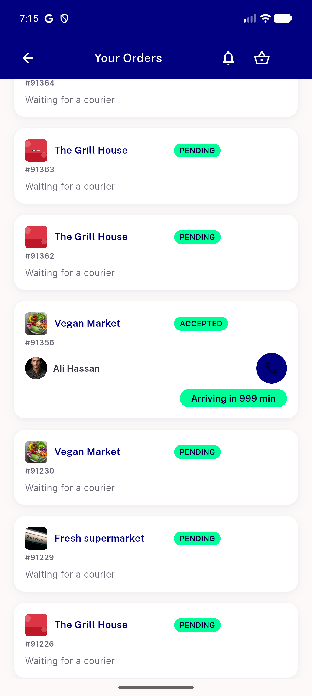</a> p9 02 orders list scrolled</td>
<td align="center" width="33%"> p9 03 order detail top</td>
<td align="center" width="33%"><a href="p9-05-order-detail-bottom.png">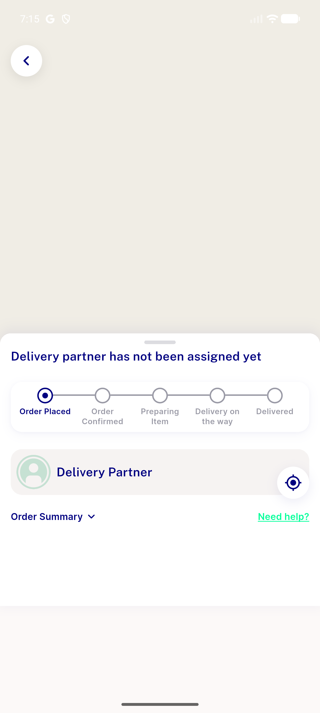</a> p9 05 order detail bottom</td>
</tr>
<tr>
<td align="center" width="33%"><a href="p9-20-owner-broken.png">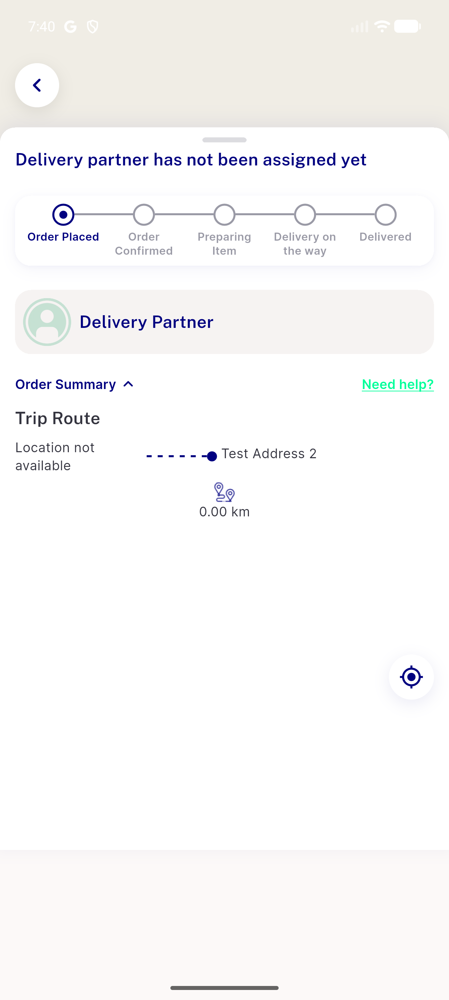</a> p9 20 owner broken</td>
<td align="center" width="33%"><a href="p9-OR1-arriving-in-999-min__crop.png">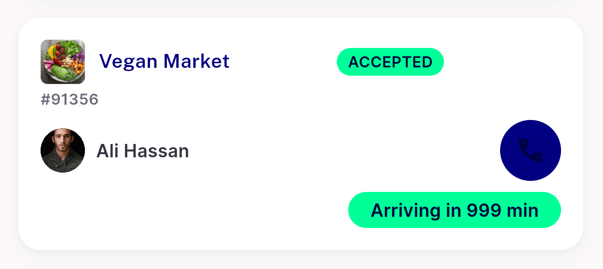</a> p9 OR1 arriving in 999 min crop</td>
<td align="center" width="33%"><a href="p9-OR1-arriving-in-999-min__full.png">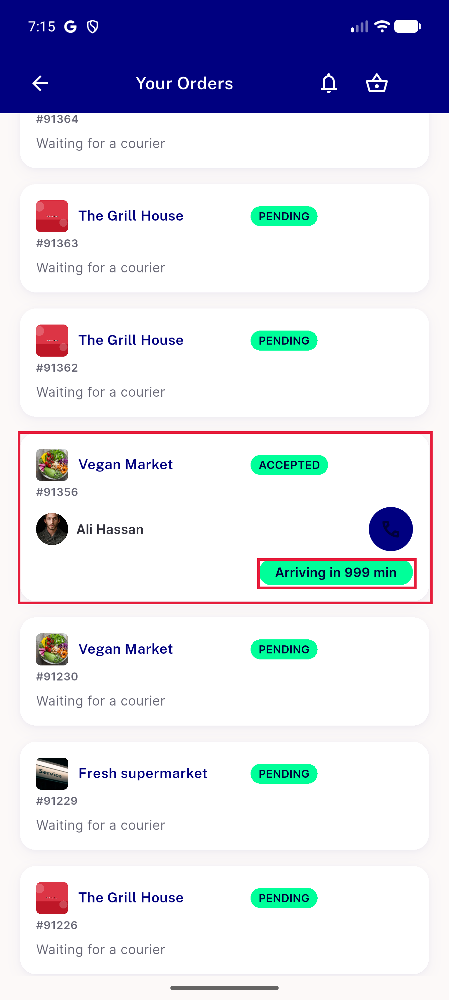</a> p9 OR1 arriving in 999 min full</td>
</tr>
<tr>
<td align="center" width="33%"> p9 OR10 need help contrast fab overlap crop</td>
<td align="center" width="33%"><a href="p9-OR10-need-help-contrast-fab-overlap__full.png">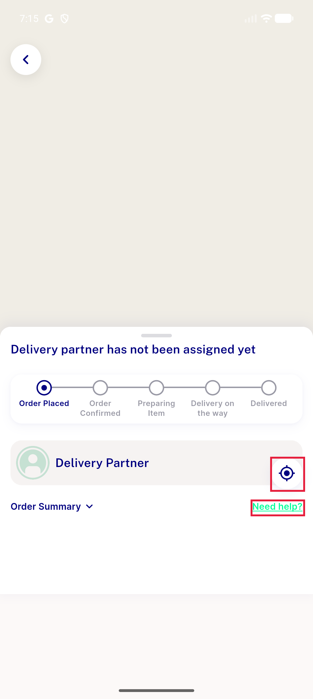</a> p9 OR10 need help contrast fab overlap full</td>
<td align="center" width="33%"><a href="p9-OR11-stepper-labels__crop.png">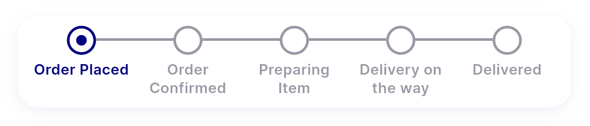</a> p9 OR11 stepper labels crop</td>
</tr>
<tr>
<td align="center" width="33%"><a href="p9-OR11-stepper-labels__full.png">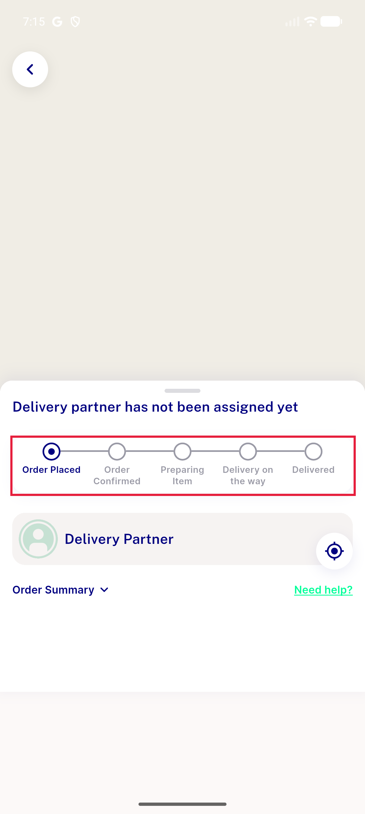</a> p9 OR11 stepper labels full</td>
<td align="center" width="33%"><a href="p9-OR12-order-summary-only-trip-route__crop.png">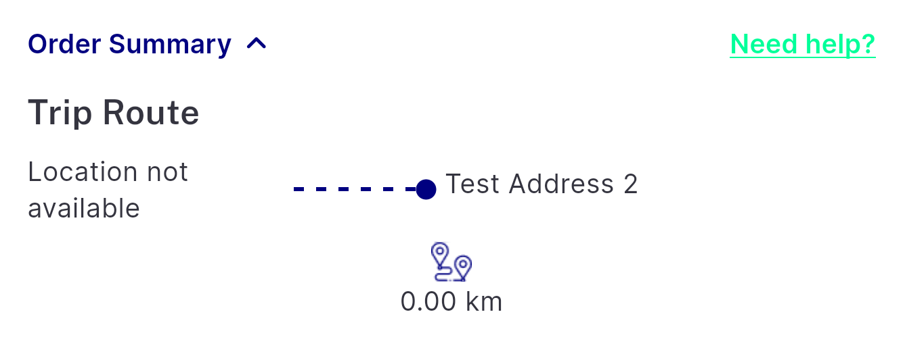</a> p9 OR12 order summary only trip route crop</td>
<td align="center" width="33%"><a href="p9-OR12-order-summary-only-trip-route__full.png">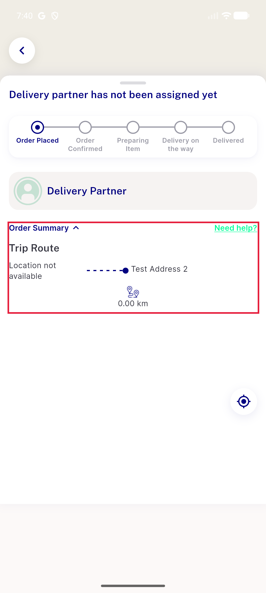</a> p9 OR12 order summary only trip route full</td>
</tr>
<tr>
<td align="center" width="33%"><a href="p9-OR13-trip-route-location-unavailable-0km__crop.png">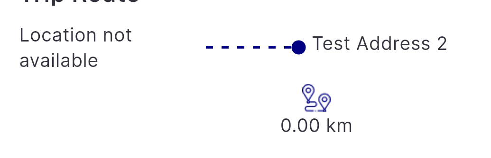</a> p9 OR13 trip route location unavailable 0km crop</td>
<td align="center" width="33%"><a href="p9-OR13-trip-route-location-unavailable-0km__full.png">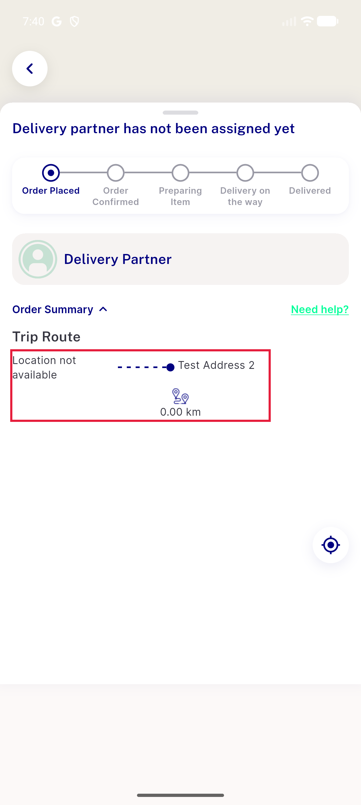</a> p9 OR13 trip route location unavailable 0km full</td>
<td align="center" width="33%"> p9 OR14 empty sheet body and grey band crop</td>
</tr>
<tr>
<td align="center" width="33%"><a href="p9-OR14-empty-sheet-body-and-grey-band__full.png">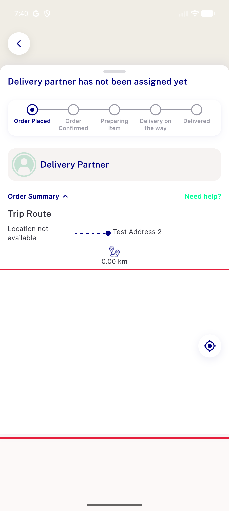</a> p9 OR14 empty sheet body and grey band full</td>
<td align="center" width="33%"> p9 OR15 locate fab over sheet crop</td>
<td align="center" width="33%"><a href="p9-OR15-locate-fab-over-sheet__full.png">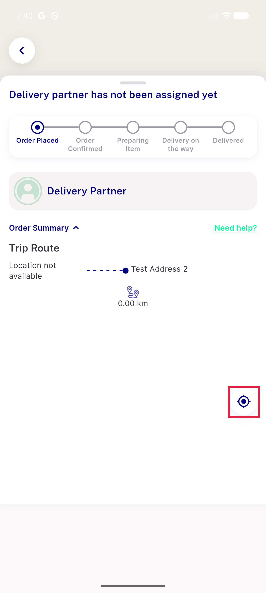</a> p9 OR15 locate fab over sheet full</td>
</tr>
<tr>
<td align="center" width="33%"> p9 OR16 placeholder delivery partner card crop</td>
<td align="center" width="33%"><a href="p9-OR16-placeholder-delivery-partner-card__full.png">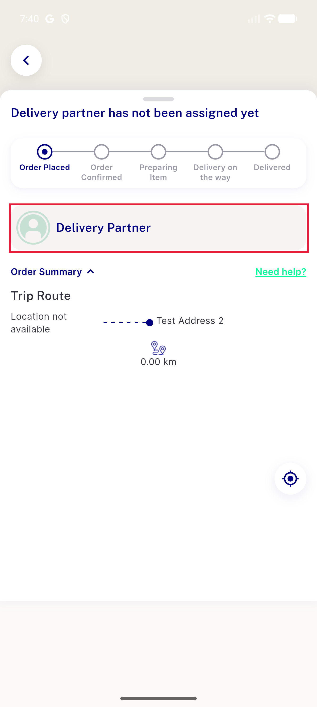</a> p9 OR16 placeholder delivery partner card full</td>
<td align="center" width="33%"> p9 OR17 headline wrong for pending crop</td>
</tr>
<tr>
<td align="center" width="33%"><a href="p9-OR17-headline-wrong-for-pending__full.png">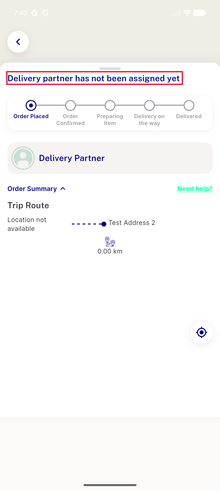</a> p9 OR17 headline wrong for pending full</td>
<td align="center" width="33%"> p9 OR2 all status chips same mint crop</td>
<td align="center" width="33%"><a href="p9-OR2-all-status-chips-same-mint__full.png">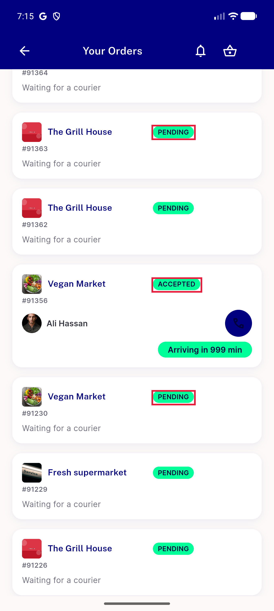</a> p9 OR2 all status chips same mint full</td>
</tr>
<tr>
<td align="center" width="33%"> p9 OR3 pending says waiting for courier crop</td>
<td align="center" width="33%"><a href="p9-OR3-pending-says-waiting-for-courier__full.png">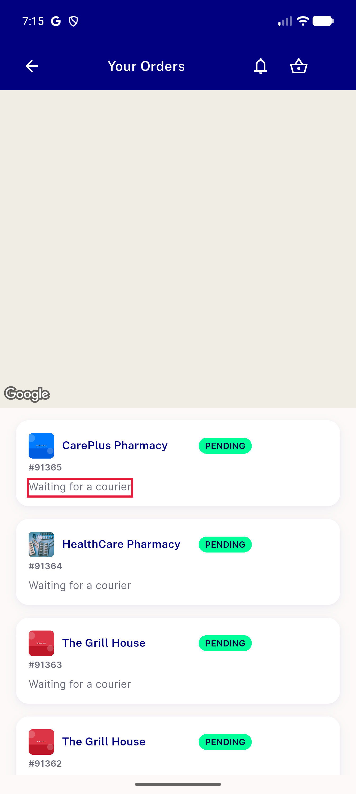</a> p9 OR3 pending says waiting for courier full</td>
<td align="center" width="33%"> p9 OR4 map 45pct above list crop</td>
</tr>
<tr>
<td align="center" width="33%"> p9 OR4 map 45pct above list full</td>
<td align="center" width="33%"> p9 OR7 blank screen tiny spinner crop</td>
<td align="center" width="33%"><a href="p9-OR7-blank-screen-tiny-spinner__full.png">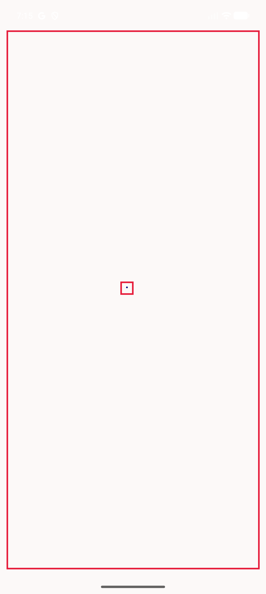</a> p9 OR7 blank screen tiny spinner full</td>
</tr>
<tr>
<td align="center" width="33%"><a href="qa-00-module-home.png">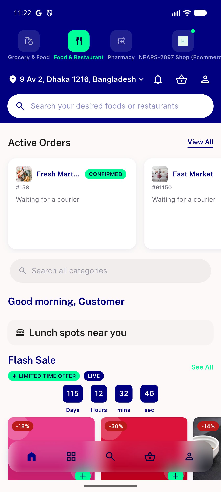</a> qa 00 module home</td>
<td align="center" width="33%"><a href="qa-MOB-my-orders-list.png">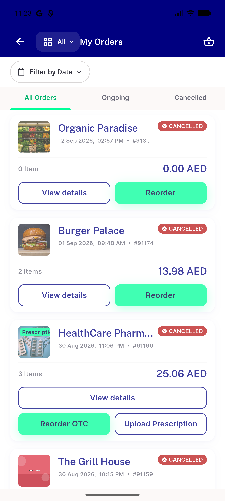</a> qa MOB my orders list</td>
<td align="center" width="33%"> qa OR1 91356 tracking fresh</td>
</tr>
<tr>
<td align="center" width="33%"> qa OR1 91356 tracking suppressed eta</td>
<td align="center" width="33%"><a href="qa-OR1-hub-91356-card.png">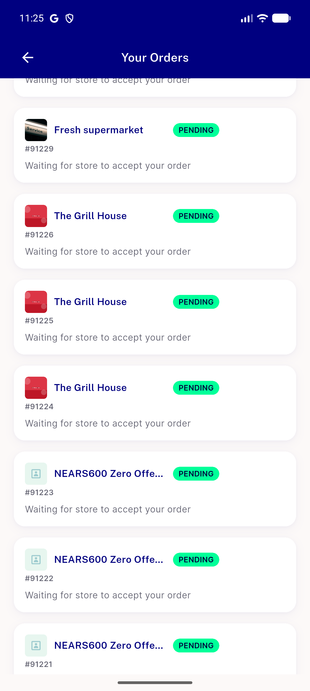</a> qa OR1 hub 91356 card</td>
<td align="center" width="33%"><a href="qa-OR12-crosscheck-order91356-details.png">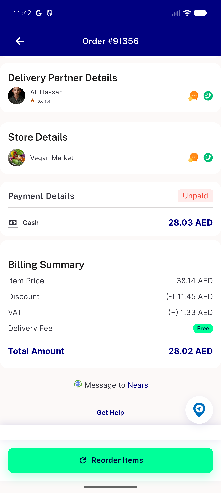</a> qa OR12 crosscheck order91356 details</td>
</tr>
<tr>
<td align="center" width="33%"><a href="qa-OR12-order-summary-dragged-full.png">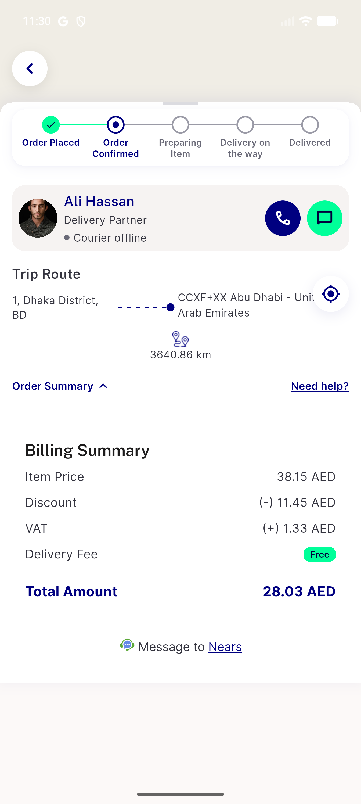</a> qa OR12 order summary dragged full</td>
<td align="center" width="33%"><a href="qa-OR12-order-summary-expanded.png">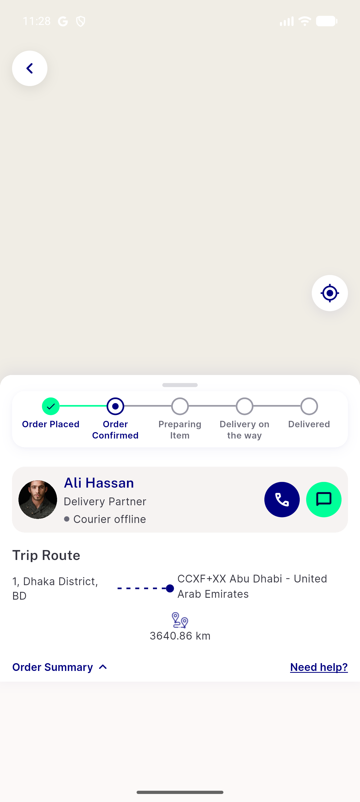</a> qa OR12 order summary expanded</td>
<td align="center" width="33%"><a href="qa-OR13-OR16-OR17-order158-tracking.png">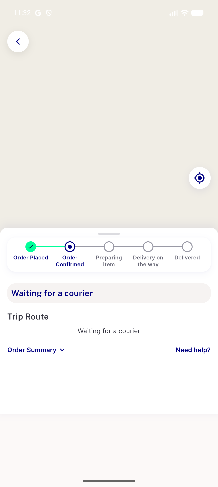</a> qa OR13 OR16 OR17 order158 tracking</td>
</tr>
<tr>
<td align="center" width="33%"><a href="qa-OR17-91365-pending-headline.png">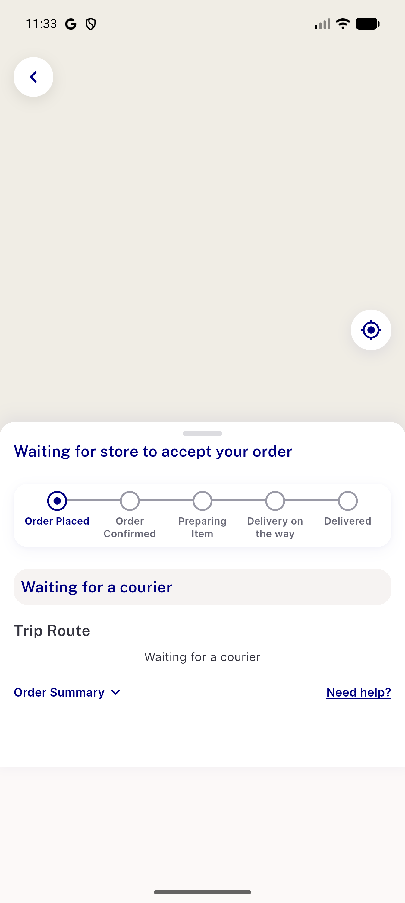</a> qa OR17 91365 pending headline</td>
<td align="center" width="33%"><a href="qa-OR2-OR5-ongoing-tab-pending-badges.png">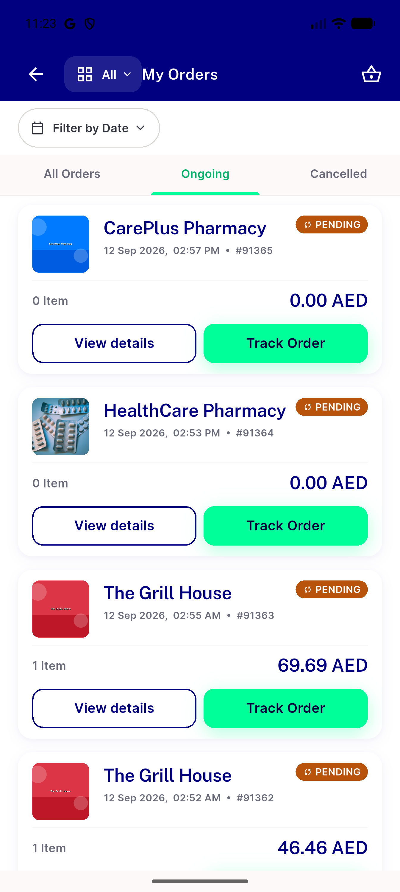</a> qa OR2 OR5 ongoing tab pending badges</td>
<td align="center" width="33%"><a href="qa-OR2-delivered-cancelled-badges.png">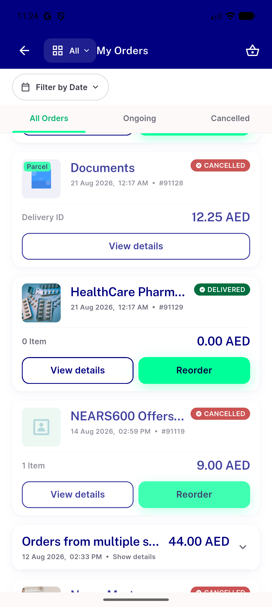</a> qa OR2 delivered cancelled badges</td>
</tr>
<tr>
<td align="center" width="33%"> qa OR4 OR3 hub top</td>
<td align="center" width="33%"> qa OR6 module filter pharmacy</td>
<td align="center" width="33%"> qa OR7 skeleton t1</td>
</tr>
<tr>
<td align="center" width="33%"><a href="qa-OR8-no-location-permission-gate.png">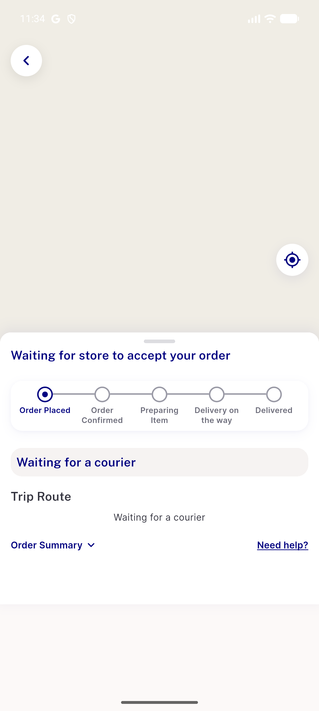</a> qa OR8 no location permission gate</td>
<td align="center" width="33%"><a href="qa-REGR-order-details-breakdown.png">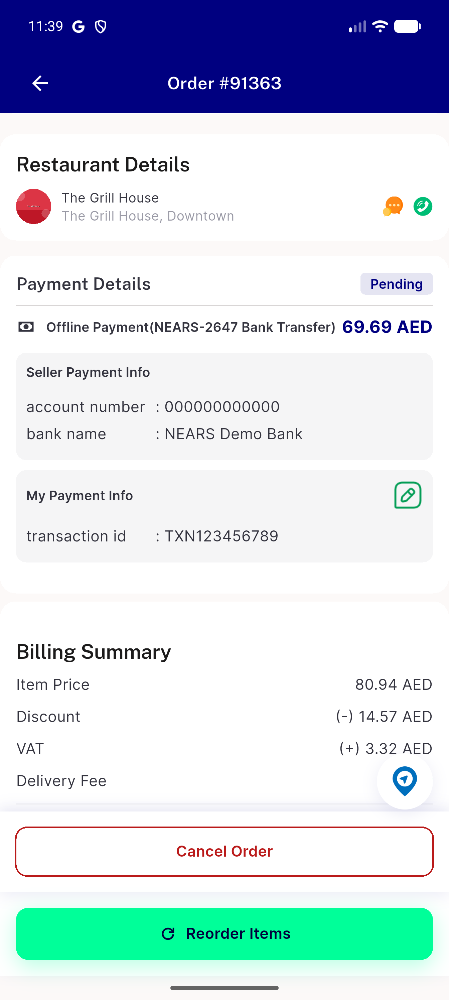</a> qa REGR order details breakdown</td>
<td align="center" width="33%"> qa bug home rail wrong waiting copy</td>
</tr>
</table>

### Other artifacts
- [`p9-OR8-OR9-tracking-open-log.txt`](p9-OR8-OR9-tracking-open-log.txt)
- [`qa-LOG-appfailure-backend-down.log`](qa-LOG-appfailure-backend-down.log)

---
*From `nears/docs/qa-evidence/NEARS-3627/` · public-repo scrub policy (no live secrets; verified clean).*
