# QA Evidence — NEARS-3630

**Human QA — Profile: two different profile screens + UI/UX findings (PF1-PF11)**

**28 screenshot(s).** Click any thumbnail for full resolution.

<table>
<tr>
<td align="center" width="33%"><a href="p10-01.png">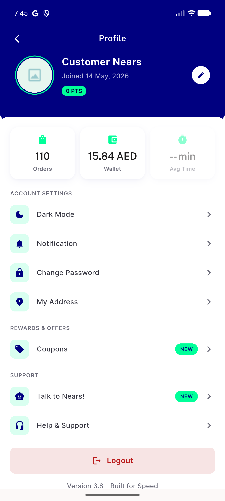</a> p10 01</td>
<td align="center" width="33%"> p10 40 menu tab top</td>
<td align="center" width="33%"><a href="p10-41-menu-tab-scrolled.png">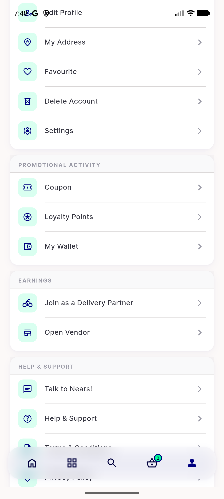</a> p10 41 menu tab scrolled</td>
</tr>
<tr>
<td align="center" width="33%"><a href="p10-42-menu-tab-scrolled2.png">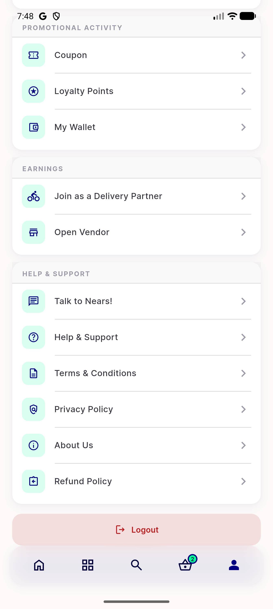</a> p10 42 menu tab scrolled2</td>
<td align="center" width="33%"><a href="p10-PF1-PF2-header-profile-screen-wallet-15-84__crop.png">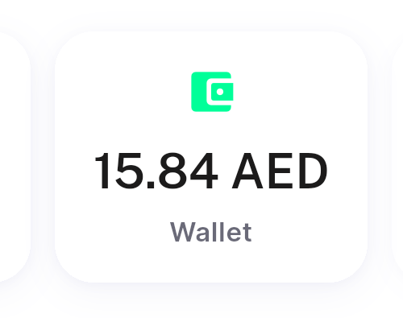</a> p10 PF1 PF2 header profile screen wallet 15 84 crop</td>
<td align="center" width="33%"><a href="p10-PF1-PF2-header-profile-screen-wallet-15-84__full.png">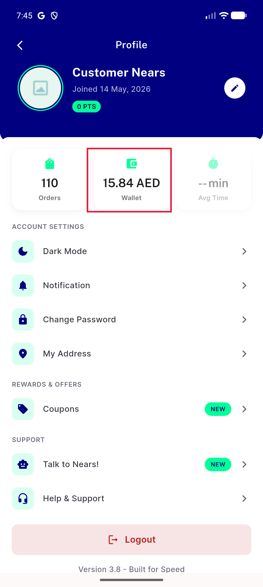</a> p10 PF1 PF2 header profile screen wallet 15 84 full</td>
</tr>
<tr>
<td align="center" width="33%"><a href="p10-PF1-PF2-menu-tab-screen-wallet-15-8__crop.png">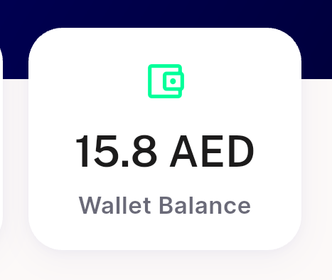</a> p10 PF1 PF2 menu tab screen wallet 15 8 crop</td>
<td align="center" width="33%"><a href="p10-PF1-PF2-menu-tab-screen-wallet-15-8__full.png">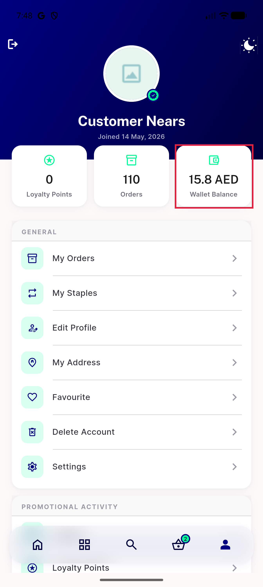</a> p10 PF1 PF2 menu tab screen wallet 15 8 full</td>
<td align="center" width="33%"> p10 PF10 dark mode row not switch crop</td>
</tr>
<tr>
<td align="center" width="33%"> p10 PF10 dark mode row not switch full</td>
<td align="center" width="33%"><a href="p10-PF11-legacy-bordered-grouped-rows__crop.png">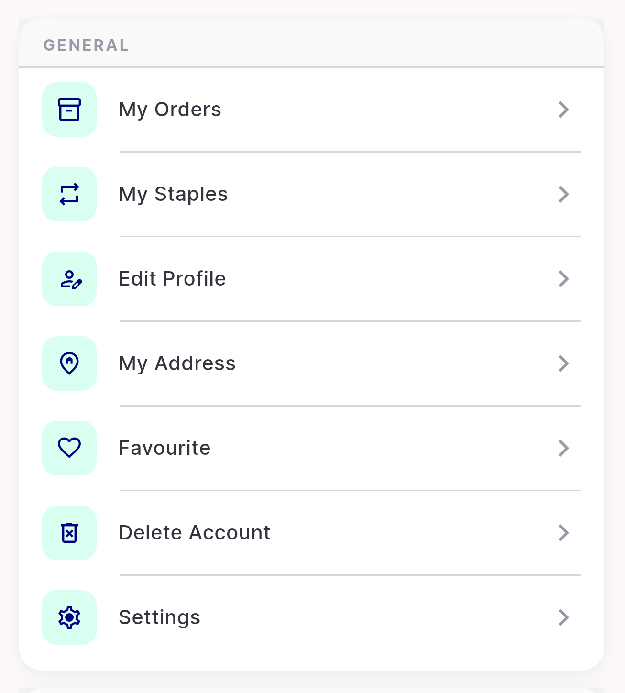</a> p10 PF11 legacy bordered grouped rows crop</td>
<td align="center" width="33%"><a href="p10-PF11-legacy-bordered-grouped-rows__full.png">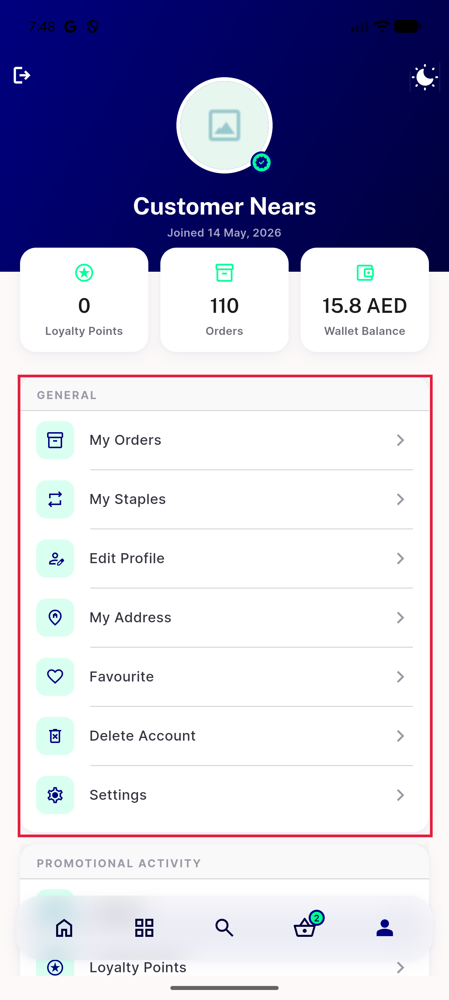</a> p10 PF11 legacy bordered grouped rows full</td>
</tr>
<tr>
<td align="center" width="33%"><a href="p10-PF11-reference-cleaner-list-style__crop.png">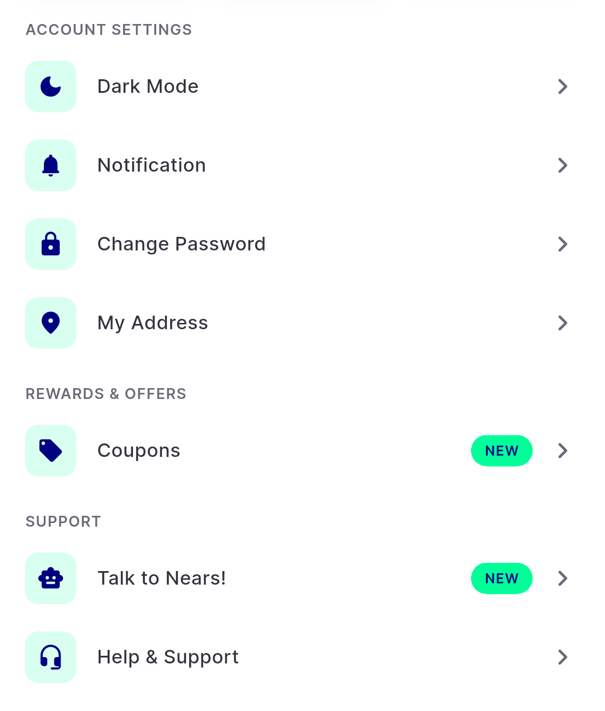</a> p10 PF11 reference cleaner list style crop</td>
<td align="center" width="33%"><a href="p10-PF11-reference-cleaner-list-style__full.png">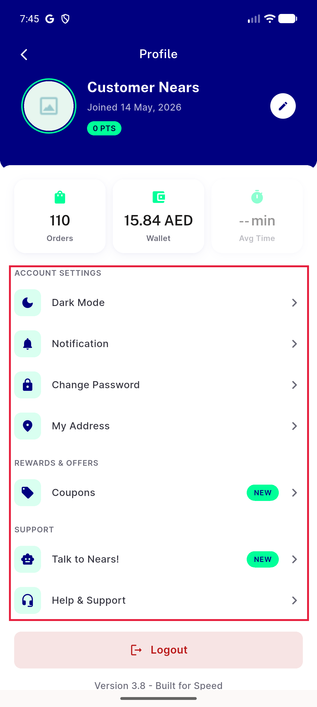</a> p10 PF11 reference cleaner list style full</td>
<td align="center" width="33%"><a href="p10-PF3-content-under-status-bar__crop.png">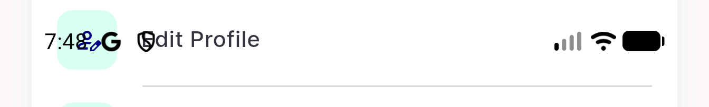</a> p10 PF3 content under status bar crop</td>
</tr>
<tr>
<td align="center" width="33%"><a href="p10-PF3-content-under-status-bar__full.png">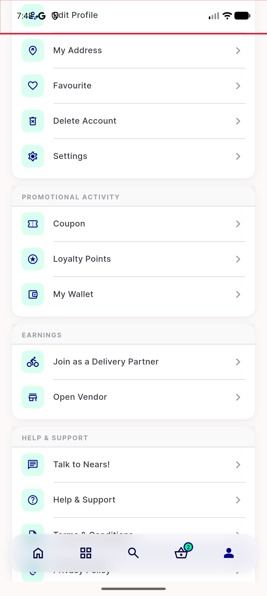</a> p10 PF3 content under status bar full</td>
<td align="center" width="33%"><a href="p10-PF4-delete-account-mid-list__crop.png">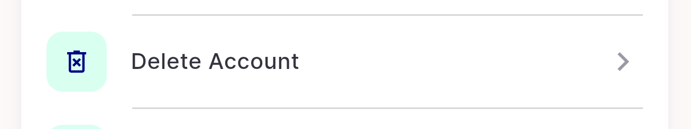</a> p10 PF4 delete account mid list crop</td>
<td align="center" width="33%"><a href="p10-PF4-delete-account-mid-list__full.png">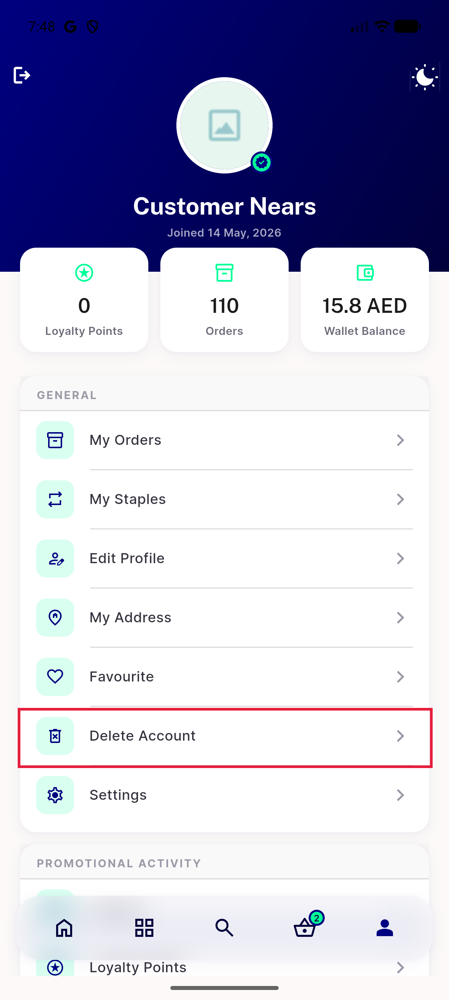</a> p10 PF4 delete account mid list full</td>
</tr>
<tr>
<td align="center" width="33%"> p10 PF5 logout button bottom crop</td>
<td align="center" width="33%"><a href="p10-PF5-logout-button-bottom__full.png">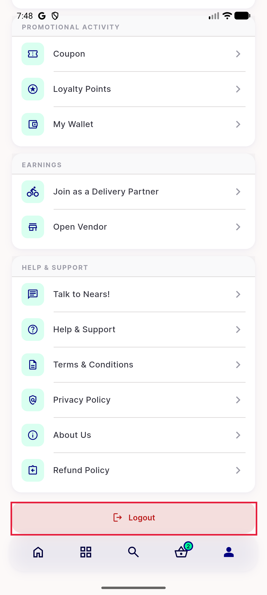</a> p10 PF5 logout button bottom full</td>
<td align="center" width="33%"> p10 PF5 logout icon and theme icon header crop</td>
</tr>
<tr>
<td align="center" width="33%"><a href="p10-PF5-logout-icon-and-theme-icon-header__full.png">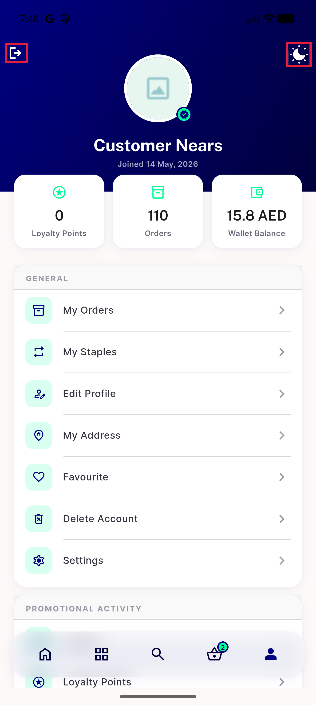</a> p10 PF5 logout icon and theme icon header full</td>
<td align="center" width="33%"><a href="p10-PF6-avg-time-placeholder-0-pts__crop.png">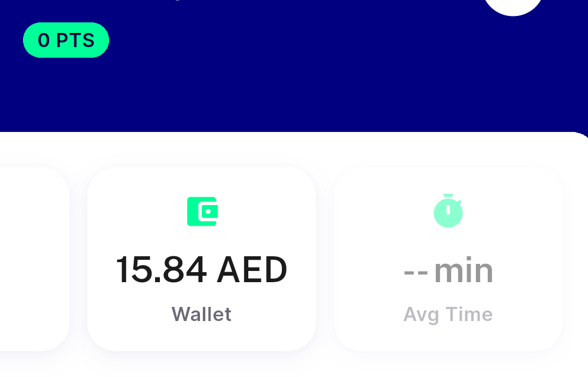</a> p10 PF6 avg time placeholder 0 pts crop</td>
<td align="center" width="33%"><a href="p10-PF6-avg-time-placeholder-0-pts__full.png">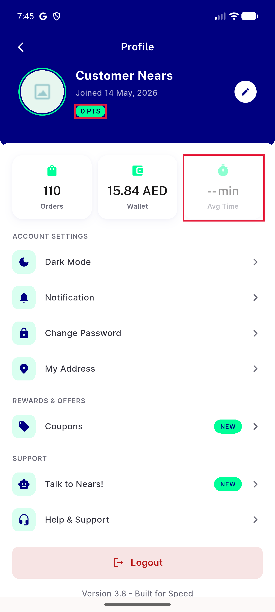</a> p10 PF6 avg time placeholder 0 pts full</td>
</tr>
<tr>
<td align="center" width="33%"> p10 PF8 new badges coupons talk crop</td>
<td align="center" width="33%"><a href="p10-PF8-new-badges-coupons-talk__full.png">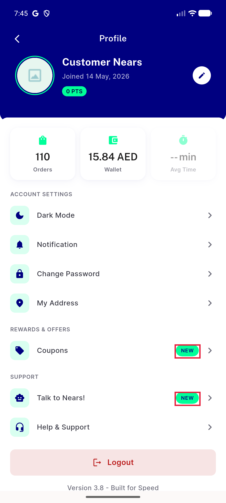</a> p10 PF8 new badges coupons talk full</td>
<td align="center" width="33%"><a href="p10-PF9-version-tagline__crop.png">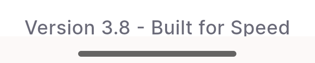</a> p10 PF9 version tagline crop</td>
</tr>
<tr>
<td align="center" width="33%"><a href="p10-PF9-version-tagline__full.png">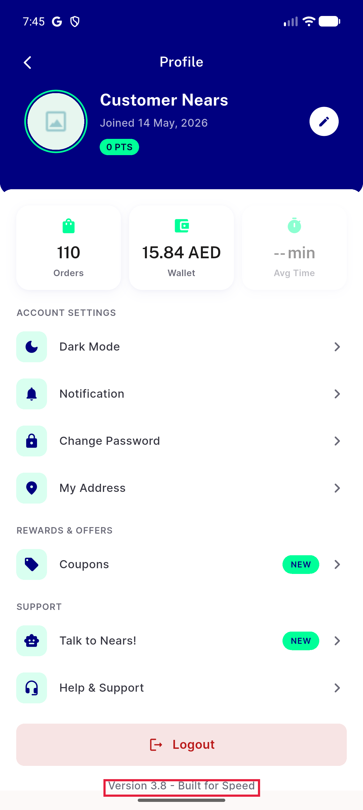</a> p10 PF9 version tagline full</td>
</tr>
</table>

---
*From `nears/docs/qa-evidence/NEARS-3630/` · public-repo scrub policy (no live secrets; verified clean).*
