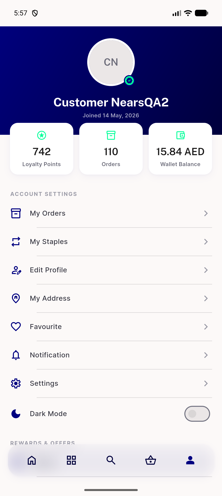
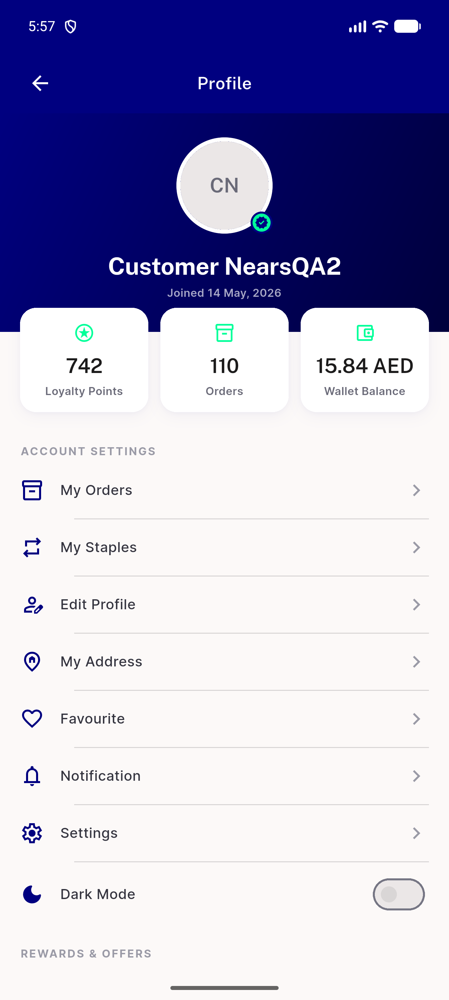
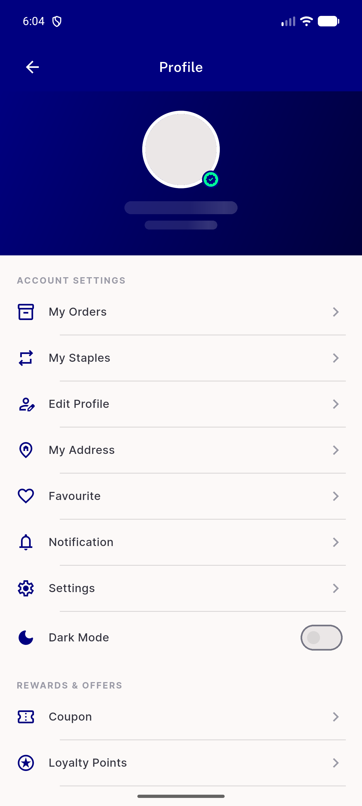
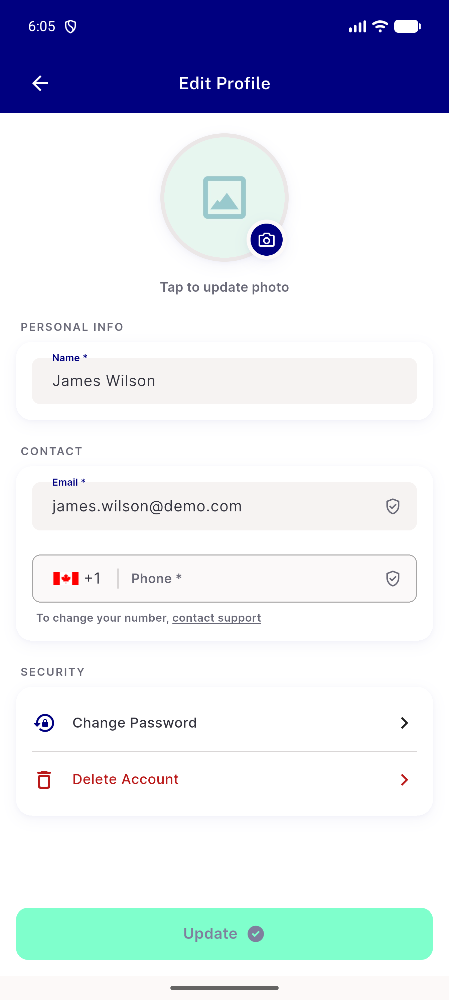

# QA Evidence — NEARS-3630

**Delta re-QA fix-cycle 2: PF7 re-demonstrated PASS (both entry points)**

**4 screenshot(s).** Click any thumbnail for full resolution.

<table>
<tr>
<td align="center" width="33%"> pf7 redemo bottomnav tab initials</td>
<td align="center" width="33%"> pf7 redemo pushed route initials</td>
<td align="center" width="33%"> pf7 regression real photo account</td>
</tr>
<tr>
<td align="center" width="33%"> pf7 regression real photo editprofile</td>
</tr>
</table>

### Other artifacts
- [`bug-login-firebase-stuck-profile.log`](bug-login-firebase-stuck-profile.log)

---
*From `nears/docs/qa-evidence/NEARS-3630/` · public-repo scrub policy (no live secrets; verified clean).*
