# QA Evidence — NEARS-3631

**PASS: 8b-fix1 category_selected position field delta re-QA (1st/3rd/last tile confirmed 1-based)**

**40 screenshot(s).** Click any thumbnail for full resolution.

<table>
<tr>
<td align="center" width="33%"><a href="8b-fix1-SR10-14-filter-sheet-all-sections.png">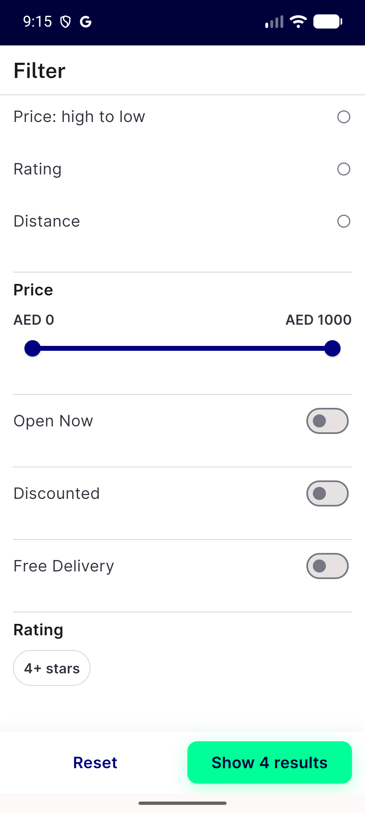</a> 8b fix1 SR10 14 filter sheet all sections</td>
<td align="center" width="33%"><a href="8b-fix1-SR11-basket-bar-reappears.png">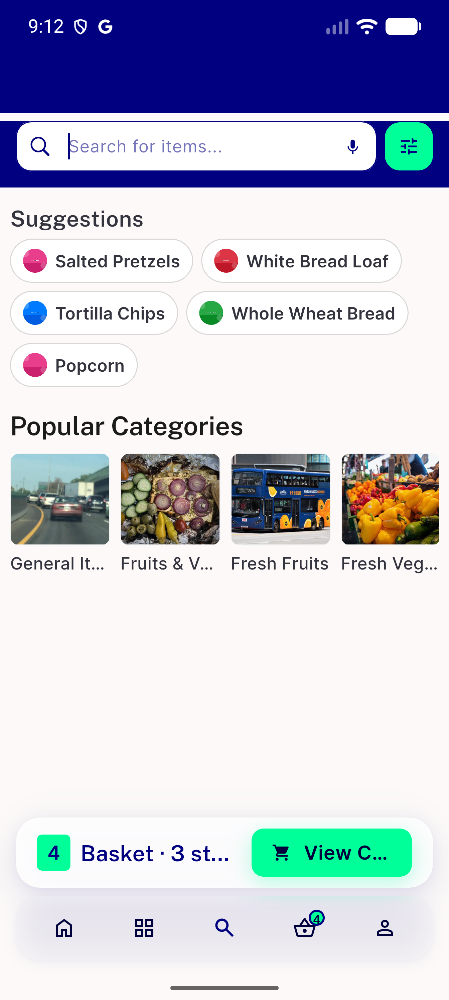</a> 8b fix1 SR11 basket bar reappears</td>
<td align="center" width="33%"><a href="8b-fix1-SR11-keyboard-basket-bar-hidden.png">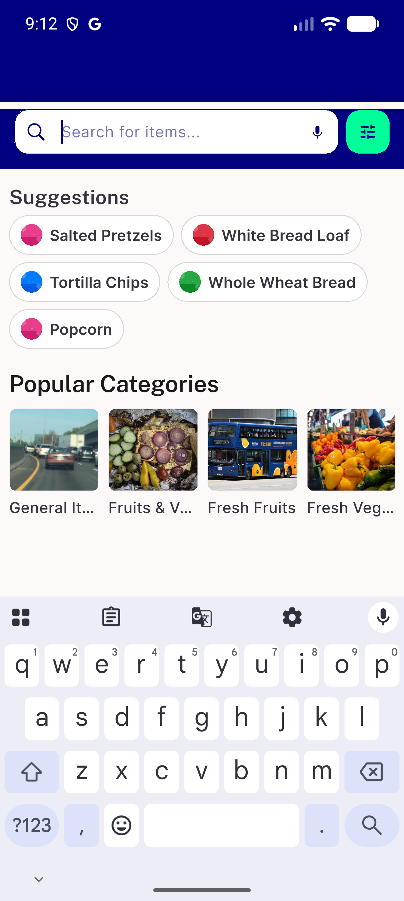</a> 8b fix1 SR11 keyboard basket bar hidden</td>
</tr>
<tr>
<td align="center" width="33%"><a href="8b-fix1-SR12-cross-store-from-price.png">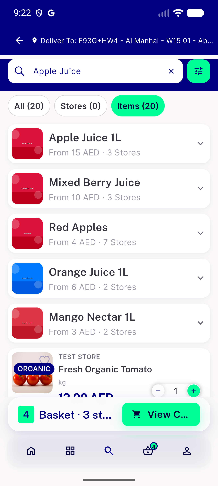</a> 8b fix1 SR12 cross store from price</td>
<td align="center" width="33%"><a href="8b-fix1-SR8-rating-badge-with-count.png">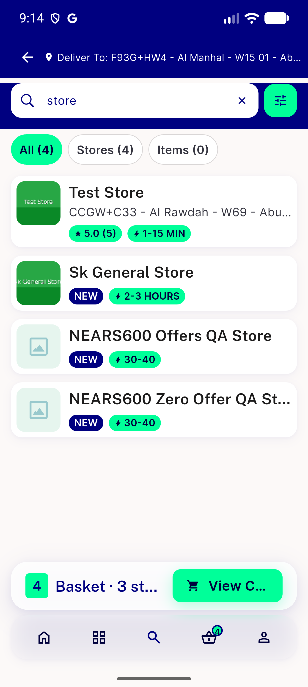</a> 8b fix1 SR8 rating badge with count</td>
<td align="center" width="33%"><a href="8b-fix1-category-selected-position-grid.png">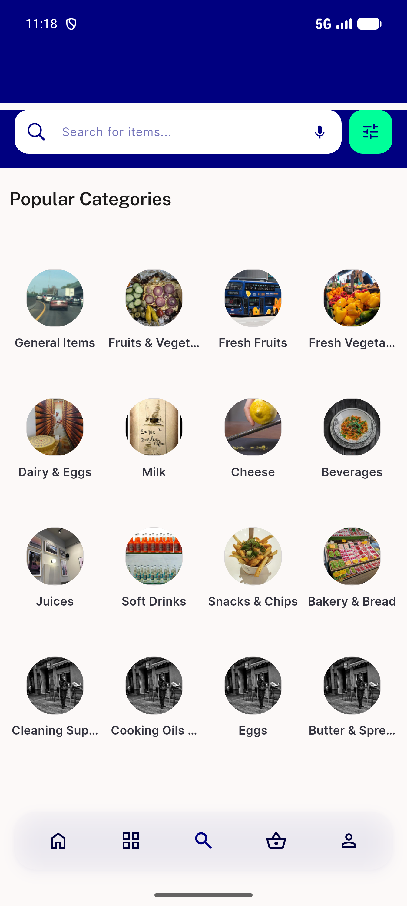</a> 8b fix1 category selected position grid</td>
</tr>
<tr>
<td align="center" width="33%"><a href="8b-fix1-regression-categories-chip-tap.png">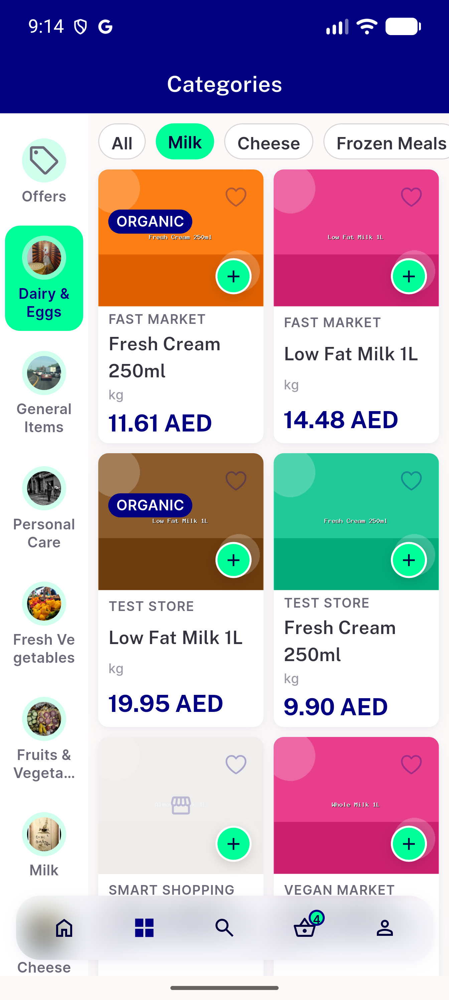</a> 8b fix1 regression categories chip tap</td>
<td align="center" width="33%"><a href="8b-fix3-SR12-veggie-market-discounted-10aed.png">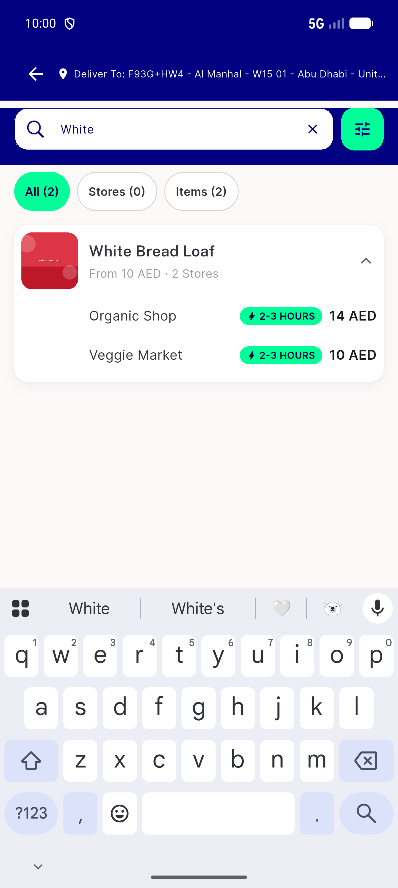</a> 8b fix3 SR12 veggie market discounted 10aed</td>
<td align="center" width="33%"><a href="8b-fix3-filter-sheet-switches-toggled-glyph-tap.png">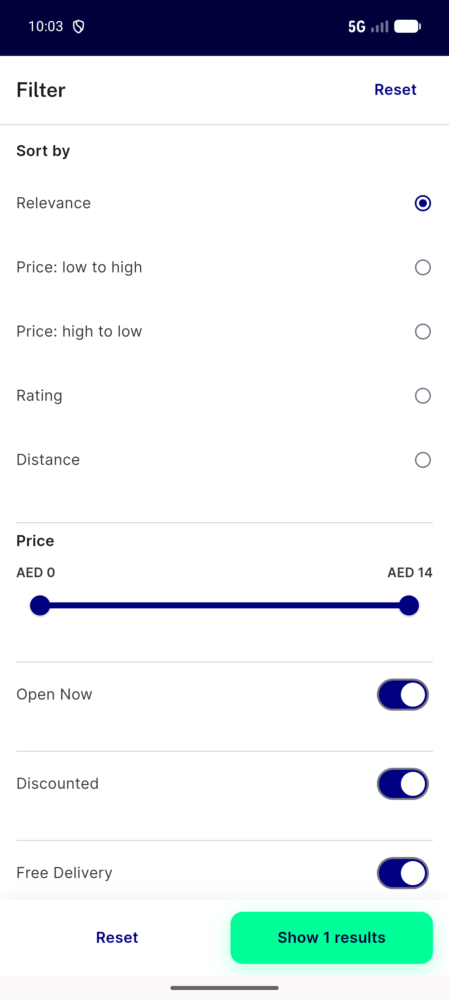</a> 8b fix3 filter sheet switches toggled glyph tap</td>
</tr>
<tr>
<td align="center" width="33%"><a href="bug-SR12-expanded-row-shows-raw-not-discounted-price.png">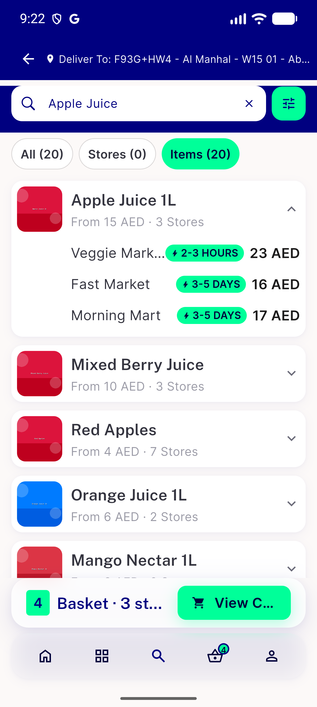</a> bug SR12 expanded row shows raw not discounted price</td>
<td align="center" width="33%"> p11 01 search empty</td>
<td align="center" width="33%"> p11 02 typing milk</td>
</tr>
<tr>
<td align="center" width="33%"> p11 03 results milk</td>
<td align="center" width="33%"> p11 11 idle with last search</td>
<td align="center" width="33%"> p11 12 results market</td>
</tr>
<tr>
<td align="center" width="33%"> p11 13 results market scrolled</td>
<td align="center" width="33%"> p11 14 filter</td>
<td align="center" width="33%"> p11 SR1 deliver to right aligned crop</td>
</tr>
<tr>
<td align="center" width="33%"> p11 SR1 deliver to right aligned full</td>
<td align="center" width="33%"> p11 SR10 basket bar over results while typing crop</td>
<td align="center" width="33%"> p11 SR10 basket bar over results while typing full</td>
</tr>
<tr>
<td align="center" width="33%"> p11 SR2 last search big title underlined clear gap crop</td>
<td align="center" width="33%"> p11 SR2 last search big title underlined clear gap full</td>
<td align="center" width="33%"> p11 SR3 suggestion big cards crop</td>
</tr>
<tr>
<td align="center" width="33%"> p11 SR3 suggestion big cards full</td>
<td align="center" width="33%"> p11 SR4 popular categories old unrelated images crop</td>
<td align="center" width="33%"> p11 SR4 popular categories old unrelated images full</td>
</tr>
<tr>
<td align="center" width="33%"> p11 SR5 separate sections empty items above stores crop</td>
<td align="center" width="33%"> p11 SR5 separate sections empty items above stores full</td>
<td align="center" width="33%"> p11 SR6 see all underlined crop</td>
</tr>
<tr>
<td align="center" width="33%"> p11 SR6 see all underlined full</td>
<td align="center" width="33%"> p11 SR7 item card tags on image crop</td>
<td align="center" width="33%"> p11 SR7 item card tags on image full</td>
</tr>
<tr>
<td align="center" width="33%"> p11 SR8 store card no rating closed on image crop</td>
<td align="center" width="33%"> p11 SR8 store card no rating closed on image full</td>
<td align="center" width="33%"> p11 SR9 filter sheet slider 0pct stars crop</td>
</tr>
<tr>
<td align="center" width="33%"> p11 SR9 filter sheet slider 0pct stars full</td>
<td align="center" width="33%"> p37 global 01 global idle</td>
<td align="center" width="33%"> p37 global 03 global results</td>
</tr>
<tr>
<td align="center" width="33%"><a href="tmp_location.png">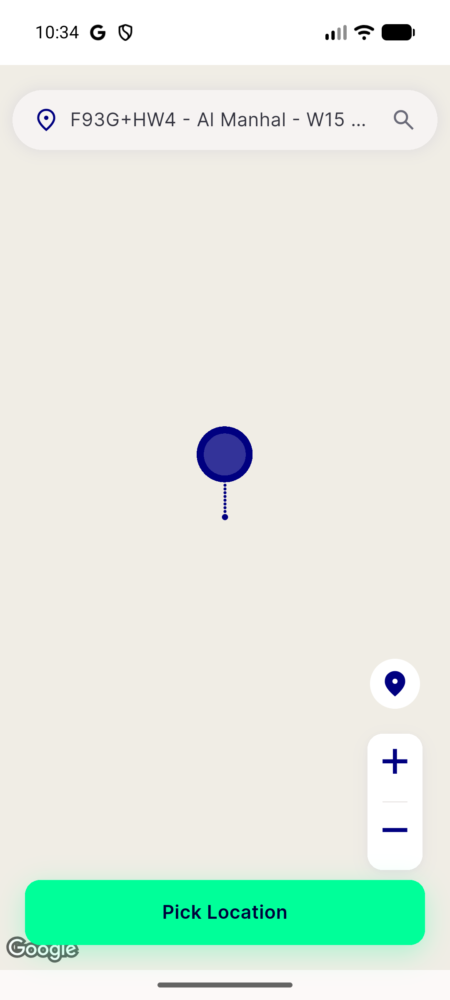</a> tmp location</td>
</tr>
</table>

### Other artifacts
- [`8b-fix1-category-selected-fa-log.txt`](8b-fix1-category-selected-fa-log.txt)

---
*From `nears/docs/qa-evidence/NEARS-3631/` · public-repo scrub policy (no live secrets; verified clean).*
