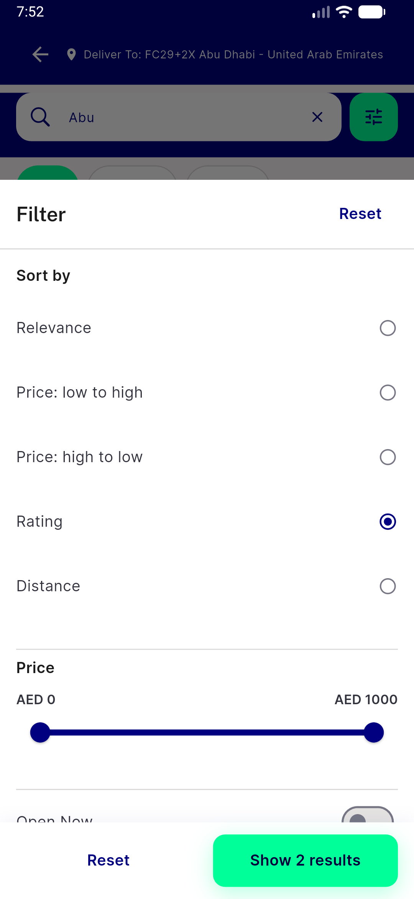
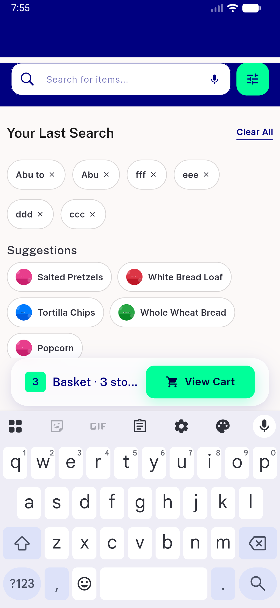
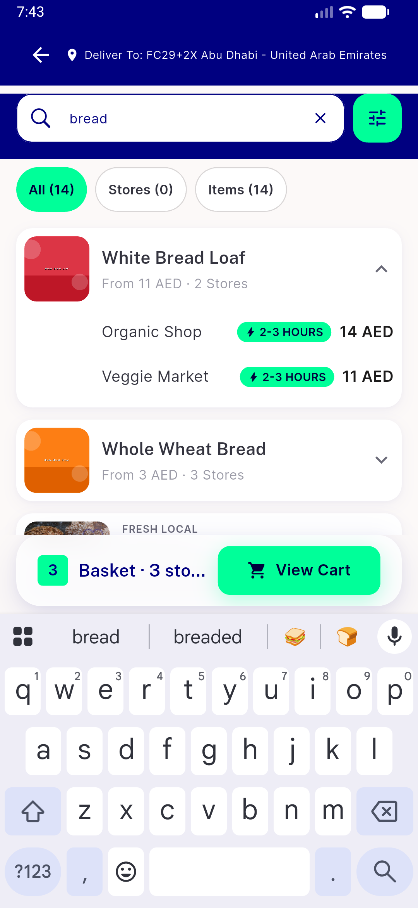
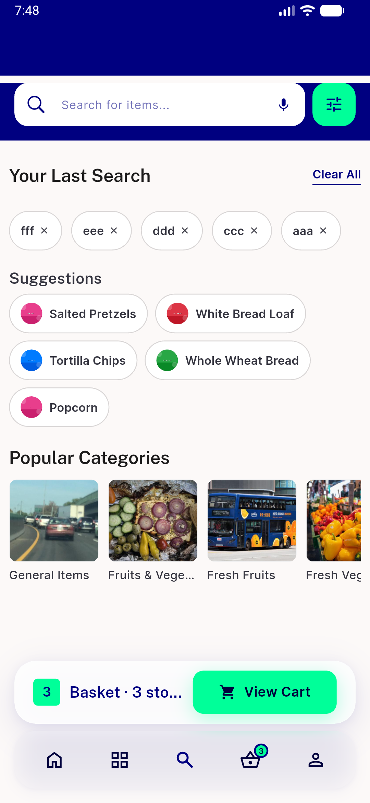
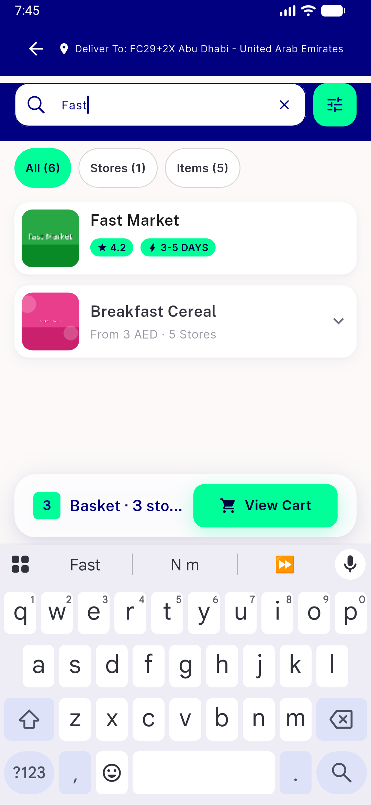
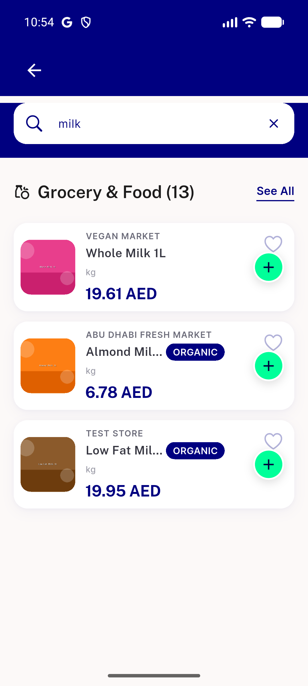
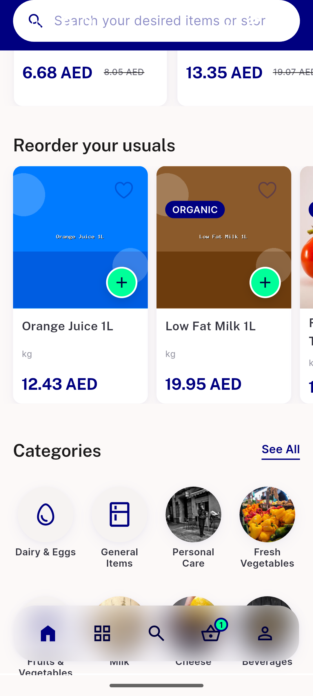

# QA Evidence — NEARS-3631

**Wave-2 QA (SR4/SR7/GS2 item3): FAIL — 1 breaks_ac task_bug (missing analytics position param), regression finding on pre-existing category-image data (out of blast radius)**

**12 screenshot(s).** Click any thumbnail for full resolution.

<table>
<tr>
<td align="center" width="33%"> bug sr10 opennow switch noop</td>
<td align="center" width="33%"> bug sr11 basket bar not hiding</td>
<td align="center" width="33%"> bug sr12 undiscounted minprice</td>
</tr>
<tr>
<td align="center" width="33%"> bug sr2 recent chip remove overlap</td>
<td align="center" width="33%"> bug sr8 rating no review count</td>
<td align="center" width="33%"> gs2 item3 compact rows</td>
</tr>
<tr>
<td align="center" width="33%"> gs2 item3 results compact</td>
<td align="center" width="33%"> regression categories nfilterchip</td>
<td align="center" width="33%"> regression home categories rail</td>
</tr>
<tr>
<td align="center" width="33%"> sr4 popular categories grid</td>
<td align="center" width="33%"> sr7 organic badge inline</td>
<td align="center" width="33%"> sr7 search results compact</td>
</tr>
</table>

### Other artifacts
- [`bug-analytics-missing-search-events.log`](bug-analytics-missing-search-events.log)
- [`bug-sr4-category-selected-missing-position.log`](bug-sr4-category-selected-missing-position.log)
- [`regression-inactive-store-in-search.log`](regression-inactive-store-in-search.log)
- [`sr4-a11y-tile-dump.xml`](sr4-a11y-tile-dump.xml)
- [`sr4-loading-state-dump.xml`](sr4-loading-state-dump.xml)

---
*From `nears/docs/qa-evidence/NEARS-3631/` · public-repo scrub policy (no live secrets; verified clean).*
