# QA Evidence — NEARS-3632

**QA NEARS-3632 (Categories store identity + horizontal categories + module switcher): FAIL — CT9 grid-not-reloading + AC-ANALYTICS context mismatches block Done; CT0/CT1/CT6/CT7/CT8/CT10/CT11/AC-LOG/AC-DLS confirmed PASS**

**19 screenshot(s).** Click any thumbnail for full resolution.

<table>
<tr>
<td align="center" width="33%"><a href="bug-ct9-module-switch-stale-grid.png">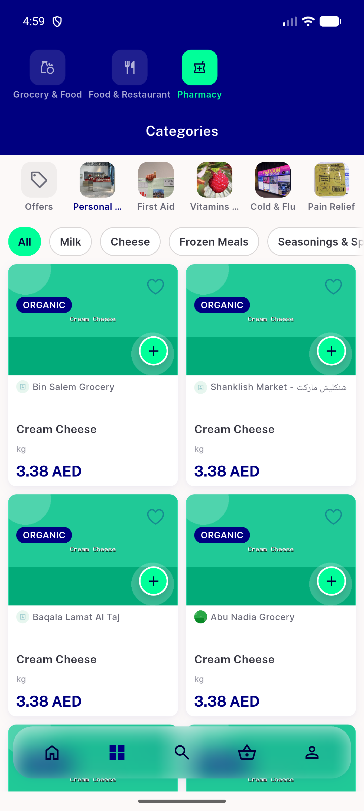</a> bug ct9 module switch stale grid</td>
<td align="center" width="33%"><a href="ct0-ct1-ct8-ct9-default-grid.png">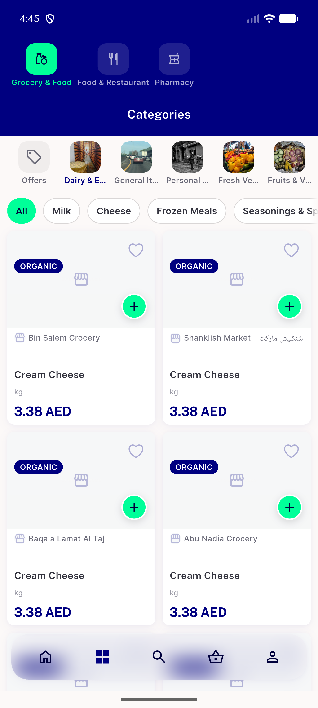</a> ct0 ct1 ct8 ct9 default grid</td>
<td align="center" width="33%"> ct0 real logo organicshop crop</td>
</tr>
<tr>
<td align="center" width="33%"><a href="ct10-stepper-price-visible.png">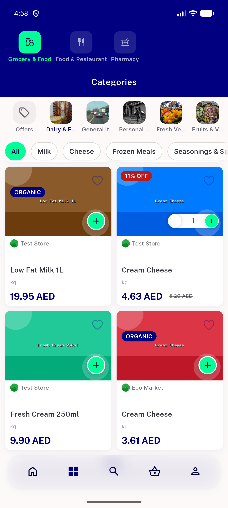</a> ct10 stepper price visible</td>
<td align="center" width="33%"> ct6 edge fade crop</td>
<td align="center" width="33%"><a href="ct7-last-row-visible.png">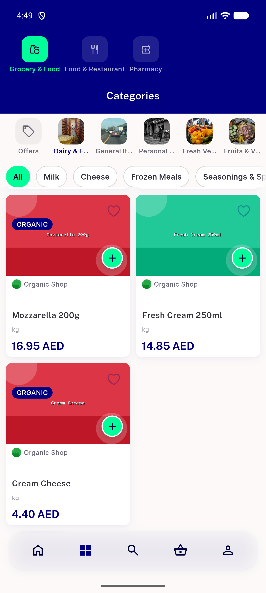</a> ct7 last row visible</td>
</tr>
<tr>
<td align="center" width="33%"><a href="p12-01.png">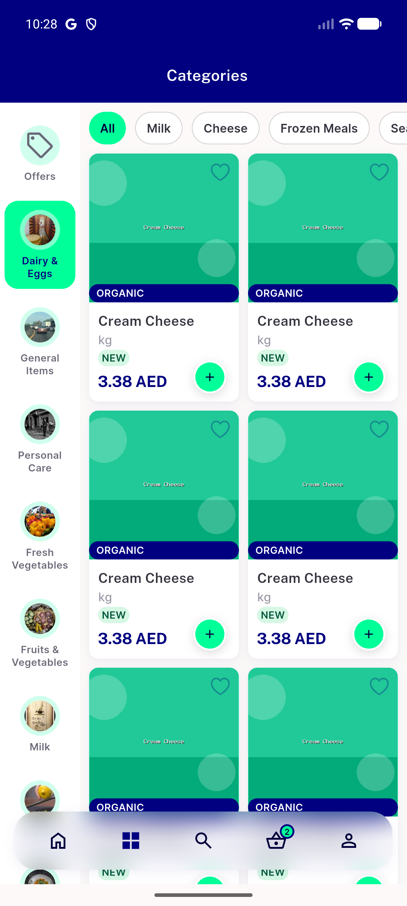</a> p12 01</td>
<td align="center" width="33%"><a href="p12-02.png">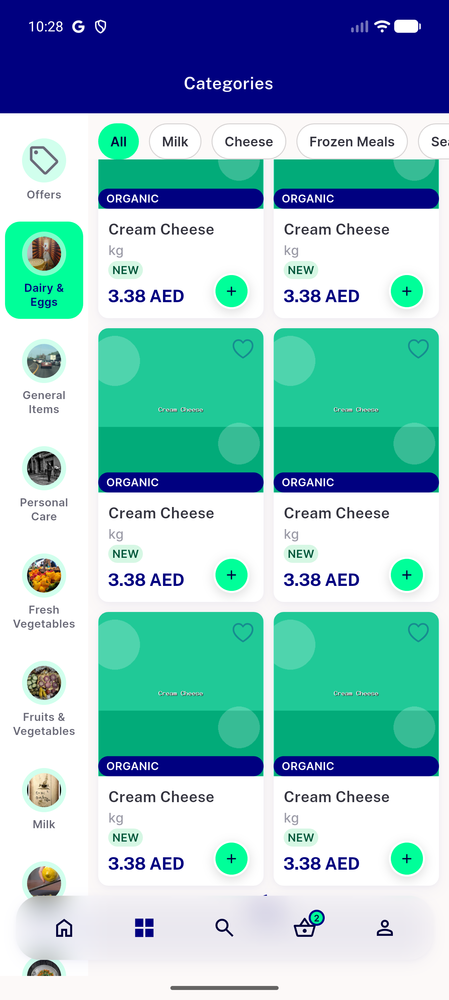</a> p12 02</td>
<td align="center" width="33%"><a href="p12-03.png">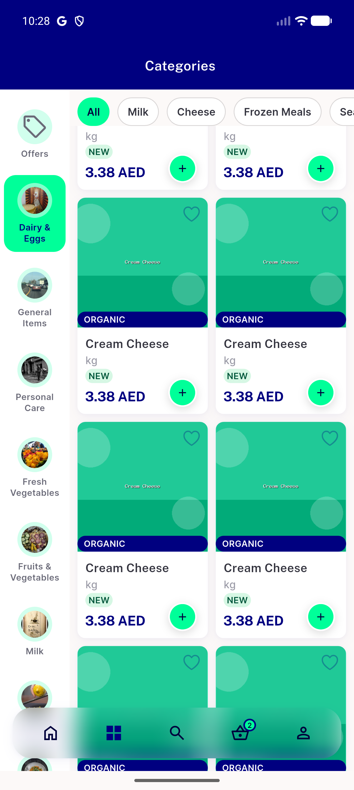</a> p12 03</td>
</tr>
<tr>
<td align="center" width="33%"><a href="p12-CT1-CT2-identical-cream-cheese-no-store-name__crop.png">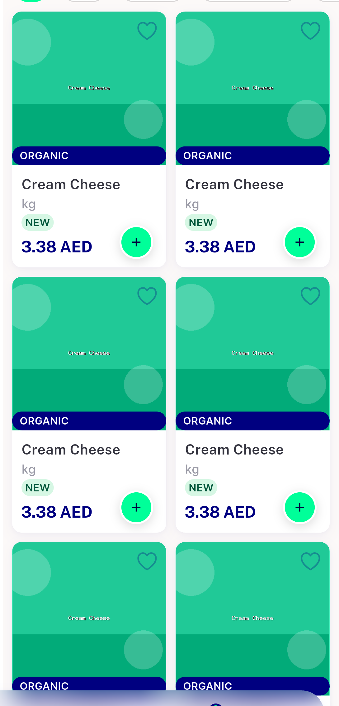</a> p12 CT1 CT2 identical cream cheese no store name crop</td>
<td align="center" width="33%"><a href="p12-CT1-CT2-identical-cream-cheese-no-store-name__full.png">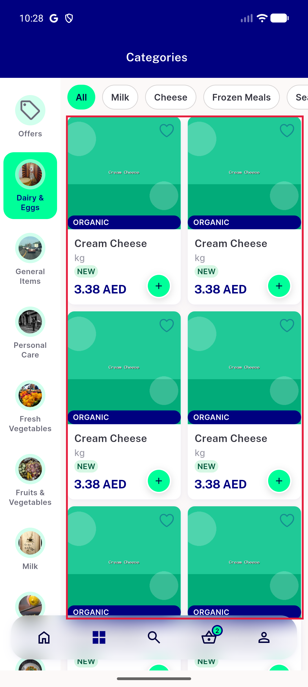</a> p12 CT1 CT2 identical cream cheese no store name full</td>
<td align="center" width="33%"> p12 CT3 category rail unrelated photos mint block crop</td>
</tr>
<tr>
<td align="center" width="33%"><a href="p12-CT3-category-rail-unrelated-photos-mint-block__full.png">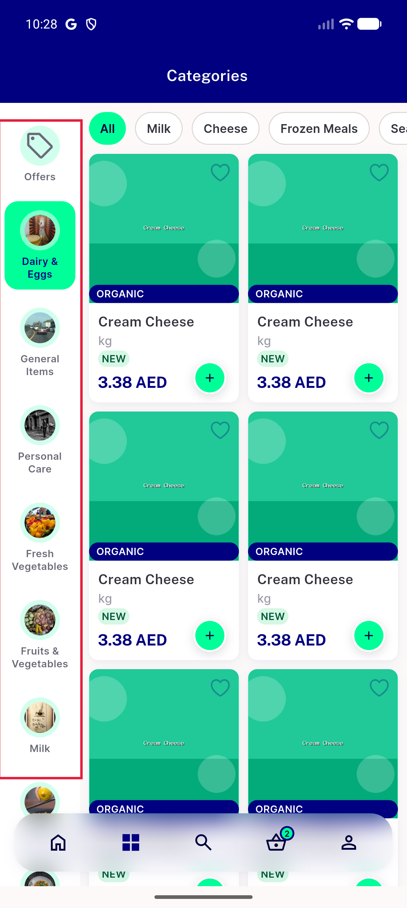</a> p12 CT3 category rail unrelated photos mint block full</td>
<td align="center" width="33%"><a href="p12-CT4-new-on-every-card-organic-bar__crop.png">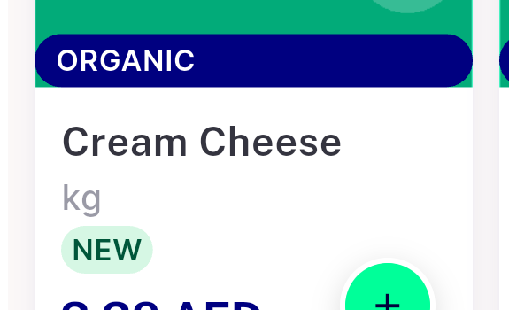</a> p12 CT4 new on every card organic bar crop</td>
<td align="center" width="33%"><a href="p12-CT4-new-on-every-card-organic-bar__full.png">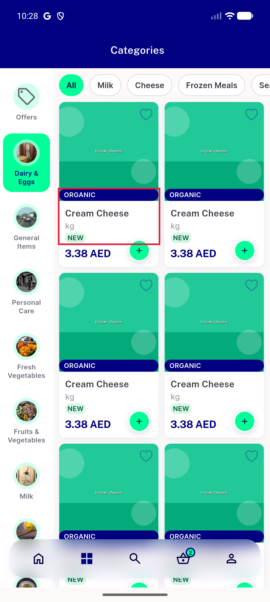</a> p12 CT4 new on every card organic bar full</td>
</tr>
<tr>
<td align="center" width="33%"> p12 CT6 subcategory chips cut no fade crop</td>
<td align="center" width="33%"> p12 CT6 subcategory chips cut no fade full</td>
<td align="center" width="33%"> p12 CT7 last row under nav crop</td>
</tr>
<tr>
<td align="center" width="33%"><a href="p12-CT7-last-row-under-nav__full.png">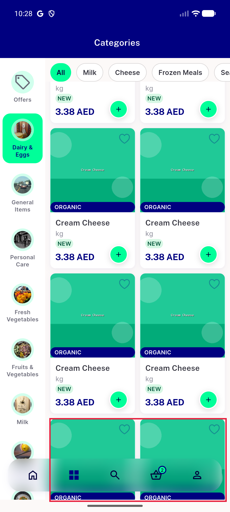</a> p12 CT7 last row under nav full</td>
</tr>
</table>

### Other artifacts
- [`bug-analytics-context-mismatch.log`](bug-analytics-context-mismatch.log)
- [`bug-ct9-module-switch-stale-grid.log`](bug-ct9-module-switch-stale-grid.log)
- [`bug-regression-category-grid-cell-height-test-failures.log`](bug-regression-category-grid-cell-height-test-failures.log)

---
*From `nears/docs/qa-evidence/NEARS-3632/` · public-repo scrub policy (no live secrets; verified clean).*
