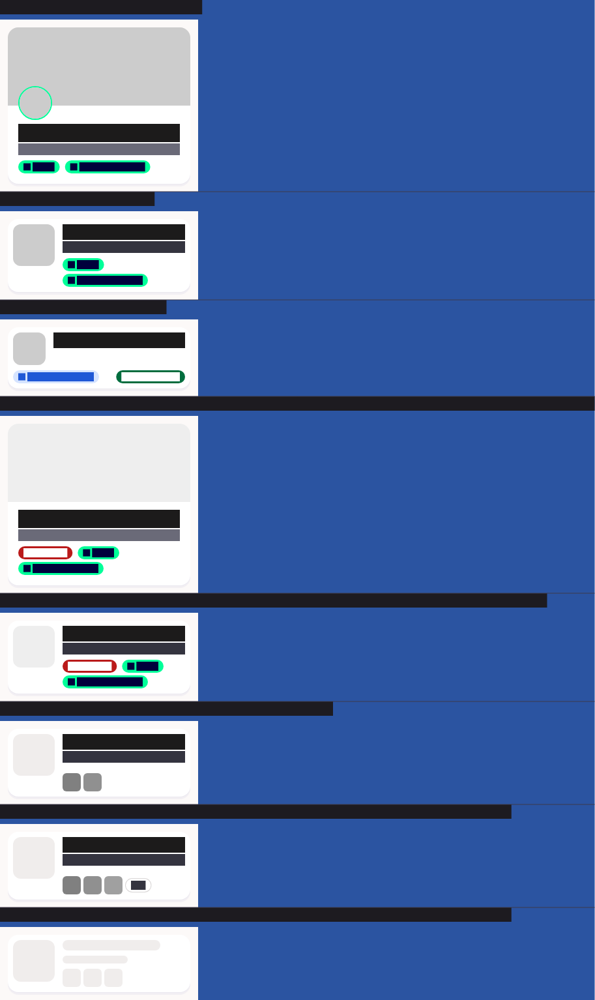

# QA Evidence — NEARS-3633

**DELTA RE-QA PASS — fix-cycle 5: AC3 (NStoreCard golden coverage, 13 scenarios) + AC-LOG (null-degrade logging, all 3 adapter files incl. both StoreCardWithDistance paths) confirmed**

**6 screenshot(s).** Click any thumbnail for full resolution.

<table>
<tr>
<td align="center" width="33%"> ac2 home flashsale</td>
<td align="center" width="33%"> fixcycle5 golden n store card light</td>
<td align="center" width="33%"> fixcycle5 golden n store card rtl</td>
</tr>
<tr>
<td align="center" width="33%"> fixcycle5 golden n store card text scale</td>
<td align="center" width="33%"> rtl home</td>
<td align="center" width="33%"> rtl textscale home</td>
</tr>
</table>

### Other artifacts
- [`bug-ac-log-missing-null-degrade-err.log`](bug-ac-log-missing-null-degrade-err.log)
- [`bug-ac3-storecard-no-golden.log`](bug-ac3-storecard-no-golden.log)
- [`fixcycle5-redemo-null-degrade-log.log`](fixcycle5-redemo-null-degrade-log.log)

---
*From `nears/docs/qa-evidence/NEARS-3633/` · public-repo scrub policy (no live secrets; verified clean).*
