# QA Evidence — NEARS-3633

**PASS — fix-cycle 6 (grid stepper strip) live-verified: Flash Sale, Trending Nearby, Category grid, Store grid, EN/AR RTL, 1.0x/1.3x text scale, qty 1-62(cap), organic badge, closed-card, tap-bubbling**

**26 screenshot(s).** Click any thumbnail for full resolution.

<table>
<tr>
<td align="center" width="33%"> ac2 home flashsale</td>
<td align="center" width="33%"> fixcycle5 golden n store card light</td>
<td align="center" width="33%"> fixcycle5 golden n store card rtl</td>
</tr>
<tr>
<td align="center" width="33%"> fixcycle5 golden n store card text scale</td>
<td align="center" width="33%"><a href="fixcycle6-flashsale-home.png">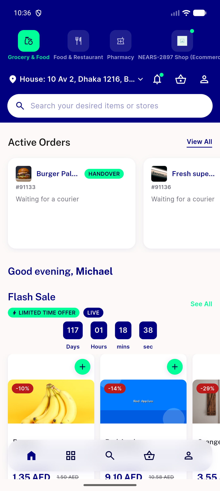</a> fixcycle6 flashsale home</td>
<td align="center" width="33%"><a href="fixcycle6-flashsale-qty1.png">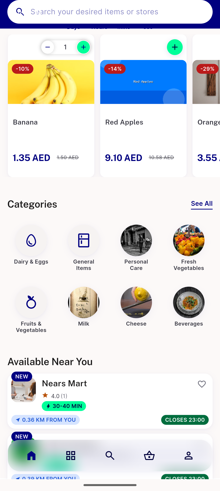</a> fixcycle6 flashsale qty1</td>
</tr>
<tr>
<td align="center" width="33%"><a href="fixcycle6-flashsale-qty99.png">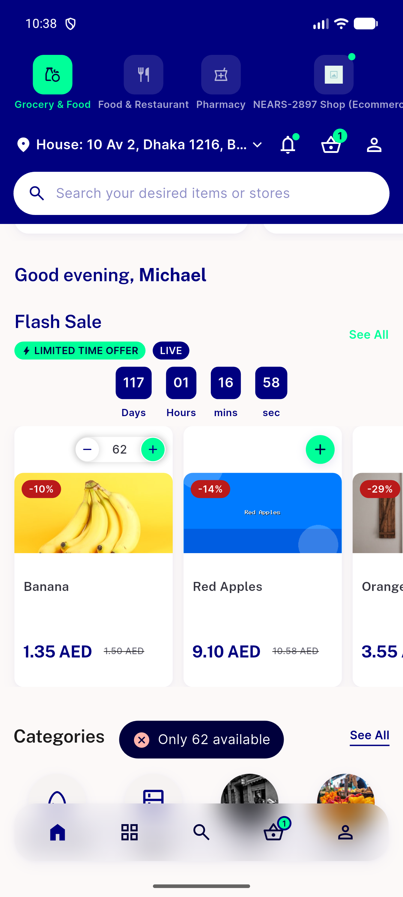</a> fixcycle6 flashsale qty99</td>
<td align="center" width="33%"> fixcycle6 flashsale scrolled</td>
<td align="center" width="33%"><a href="fixcycle6-rtl-cart-rail.png">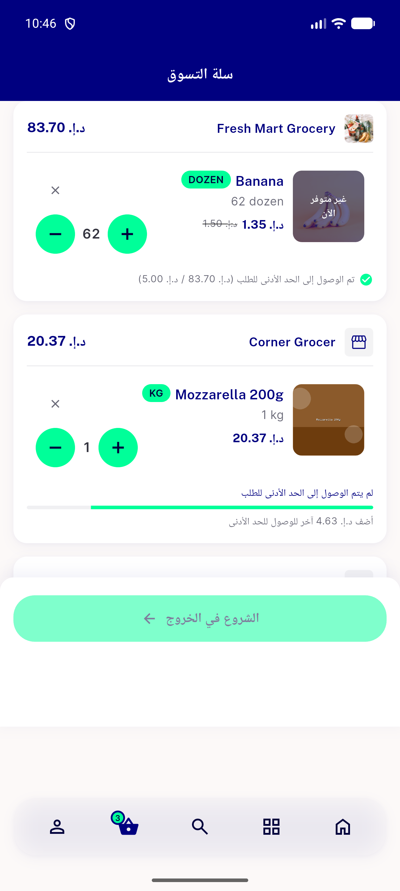</a> fixcycle6 rtl cart rail</td>
</tr>
<tr>
<td align="center" width="33%"> fixcycle6 rtl cart rail2</td>
<td align="center" width="33%"><a href="fixcycle6-rtl-category-grid.png">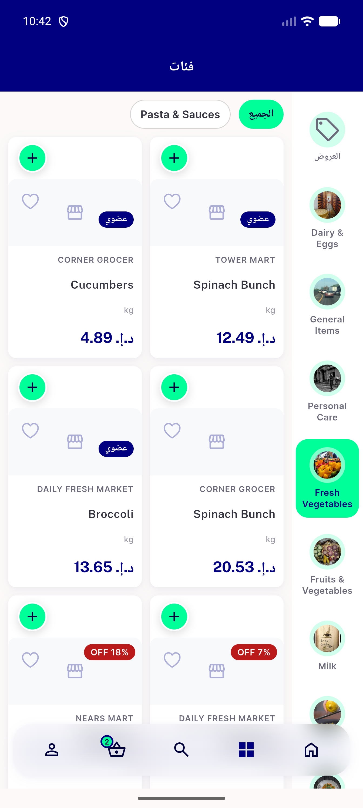</a> fixcycle6 rtl category grid</td>
<td align="center" width="33%"><a href="fixcycle6-rtl-flashsale-viewall.png">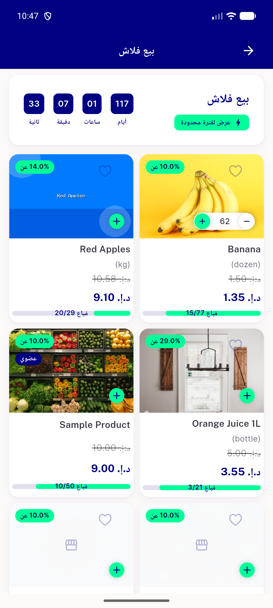</a> fixcycle6 rtl flashsale viewall</td>
</tr>
<tr>
<td align="center" width="33%"><a href="fixcycle6-rtl-home.png">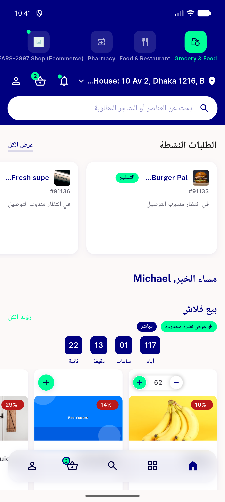</a> fixcycle6 rtl home</td>
<td align="center" width="33%"><a href="fixcycle6-rtl-home2.png">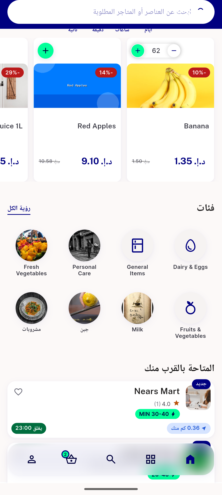</a> fixcycle6 rtl home2</td>
<td align="center" width="33%"><a href="fixcycle6-rtl-searchresults-row.png">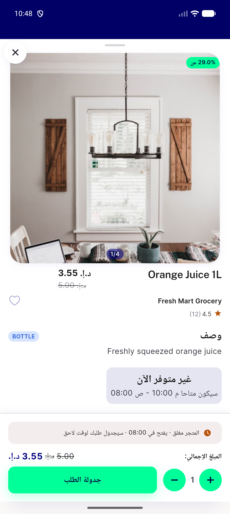</a> fixcycle6 rtl searchresults row</td>
</tr>
<tr>
<td align="center" width="33%"><a href="fixcycle6-rtl-store-grid.png">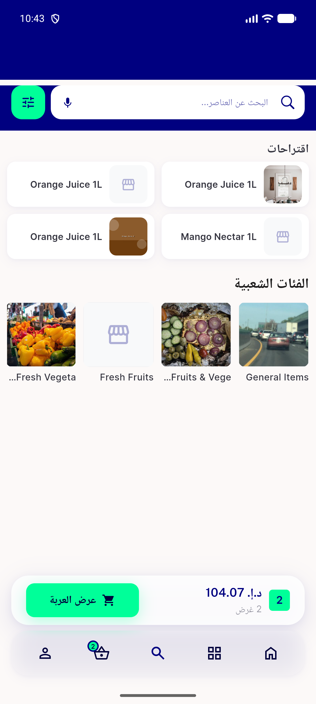</a> fixcycle6 rtl store grid</td>
<td align="center" width="33%"><a href="fixcycle6-rtl-storepage-allproducts.png">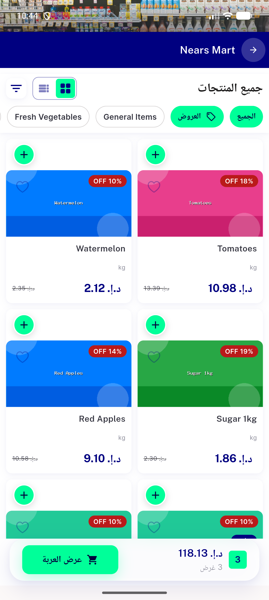</a> fixcycle6 rtl storepage allproducts</td>
<td align="center" width="33%"><a href="fixcycle6-rtl-storepage-qty1.png">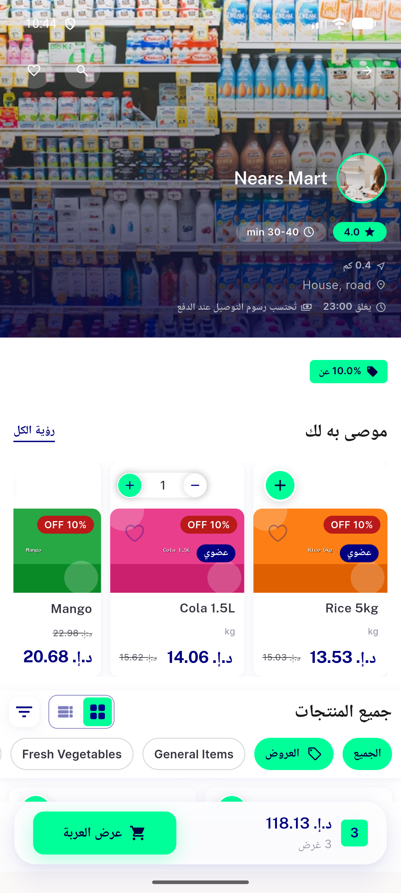</a> fixcycle6 rtl storepage qty1</td>
</tr>
<tr>
<td align="center" width="33%"><a href="fixcycle6-rtl-storepage.png">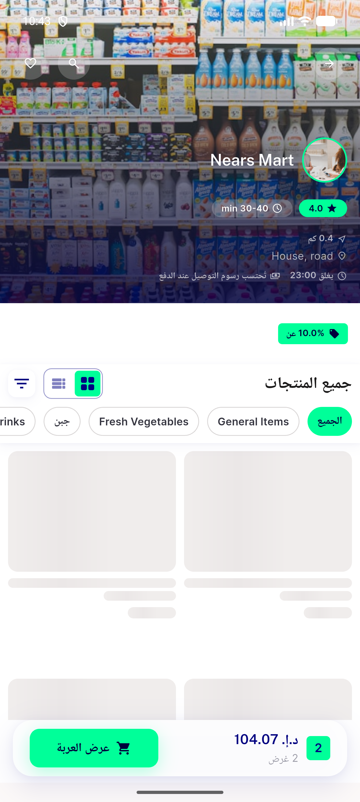</a> fixcycle6 rtl storepage</td>
<td align="center" width="33%"><a href="fixcycle6-rtl-storepage2.png">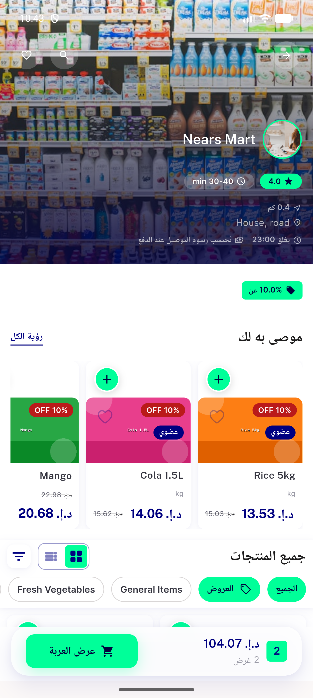</a> fixcycle6 rtl storepage2</td>
<td align="center" width="33%"><a href="fixcycle6-textscale13-trending.png">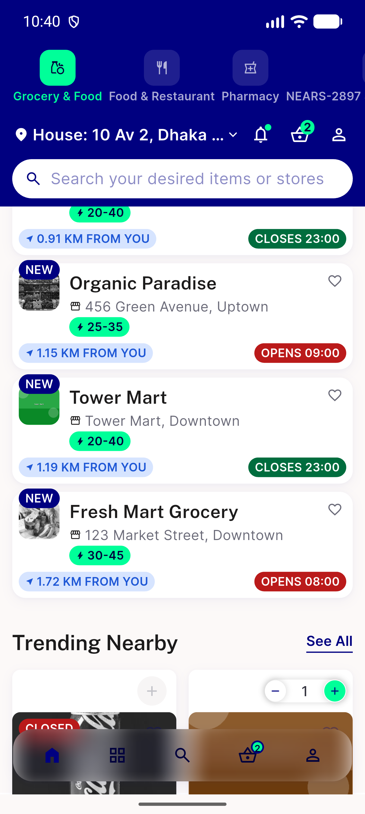</a> fixcycle6 textscale13 trending</td>
</tr>
<tr>
<td align="center" width="33%"><a href="fixcycle6-textscale13-trending2.png">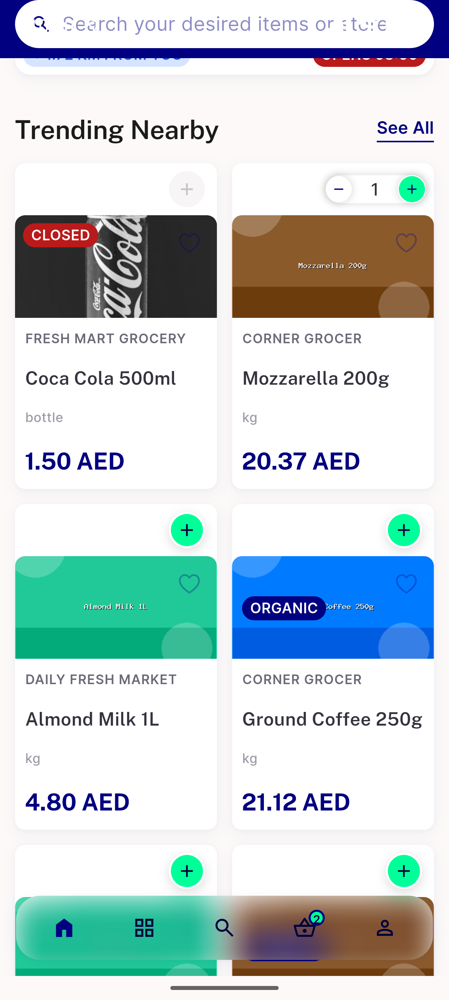</a> fixcycle6 textscale13 trending2</td>
<td align="center" width="33%"><a href="fixcycle6-trending-header.png">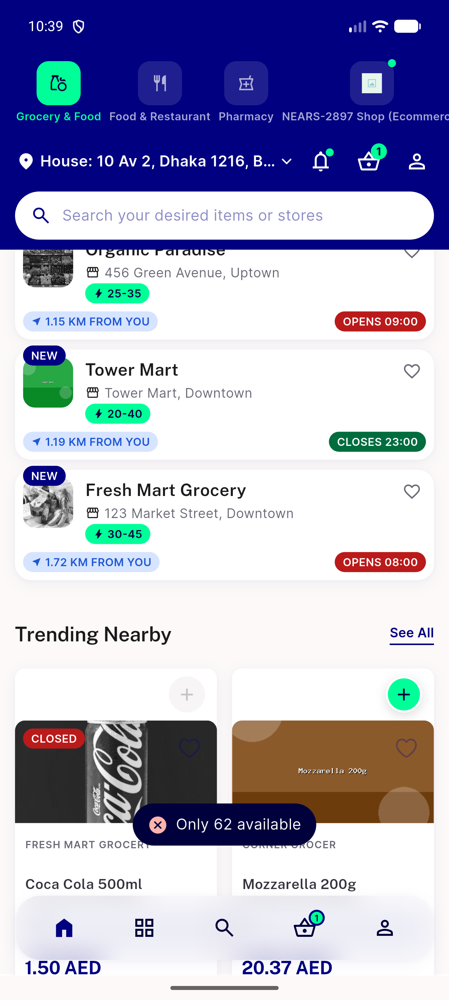</a> fixcycle6 trending header</td>
<td align="center" width="33%"><a href="fixcycle6-trending-qty1.png">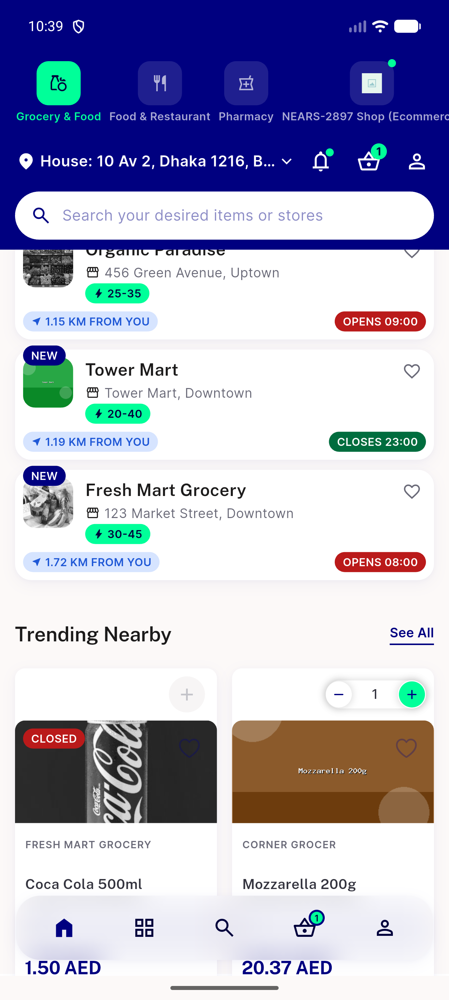</a> fixcycle6 trending qty1</td>
</tr>
<tr>
<td align="center" width="33%"> rtl home</td>
<td align="center" width="33%"> rtl textscale home</td>
</tr>
</table>

### Other artifacts
- [`bug-ac-log-missing-null-degrade-err.log`](bug-ac-log-missing-null-degrade-err.log)
- [`bug-ac3-storecard-no-golden.log`](bug-ac3-storecard-no-golden.log)
- [`fixcycle5-redemo-null-degrade-log.log`](fixcycle5-redemo-null-degrade-log.log)

---
*From `nears/docs/qa-evidence/NEARS-3633/` · public-repo scrub policy (no live secrets; verified clean).*
