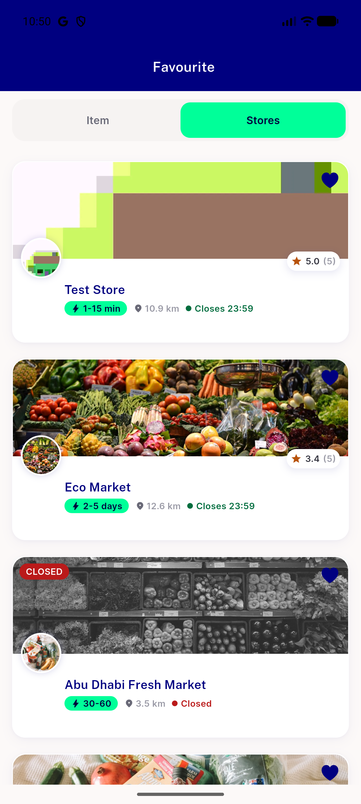
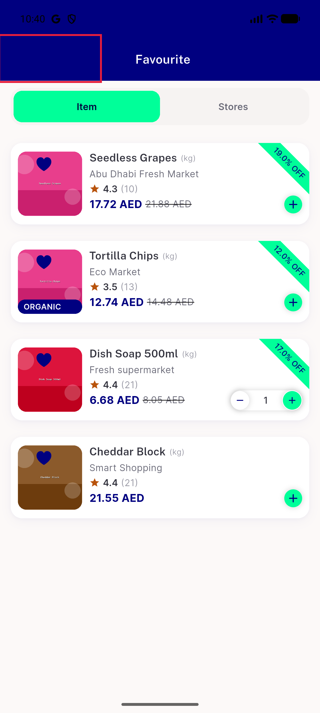
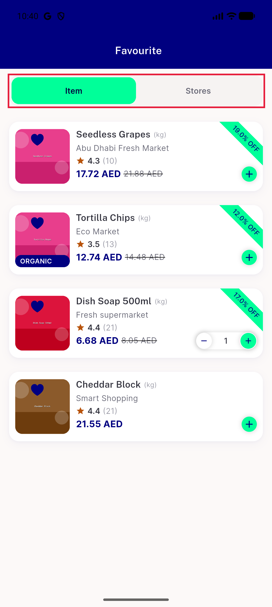
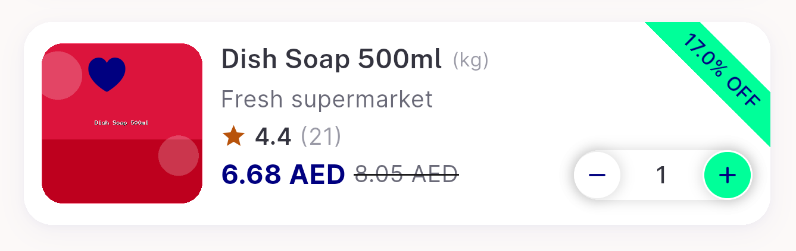
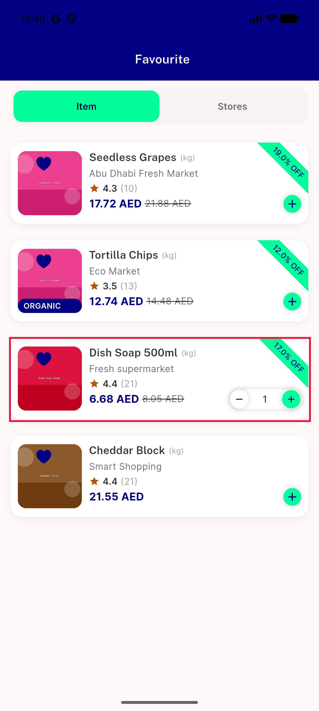
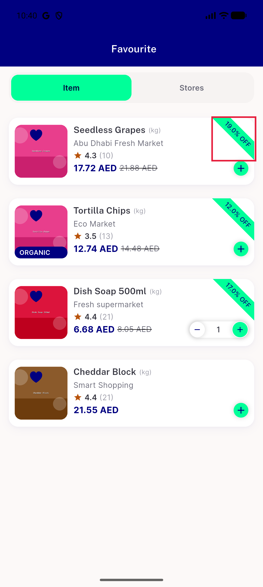
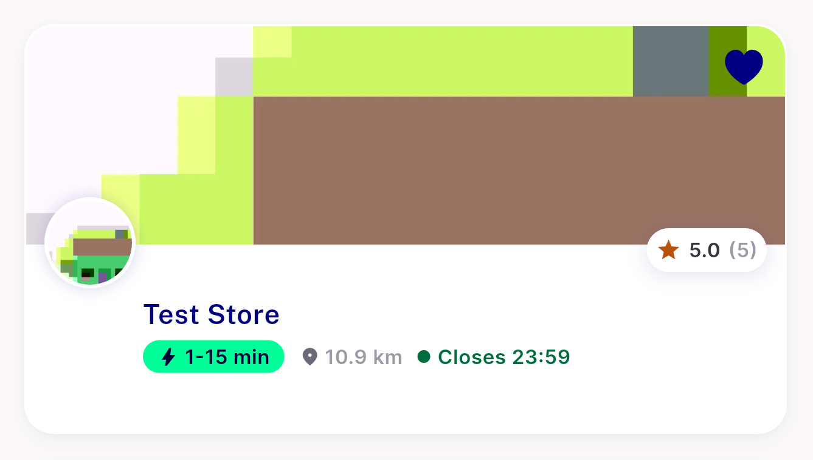
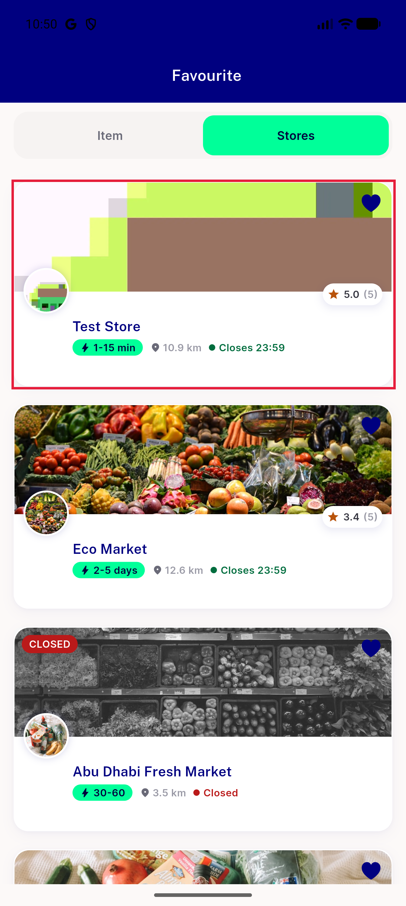
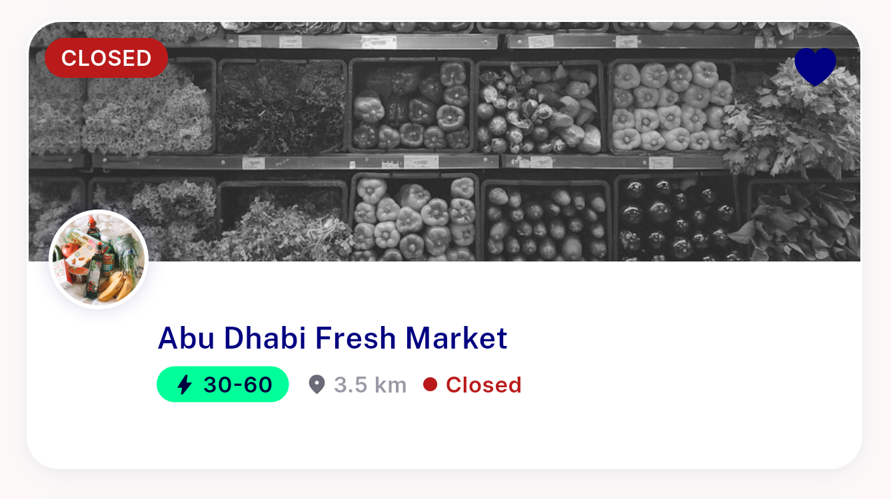
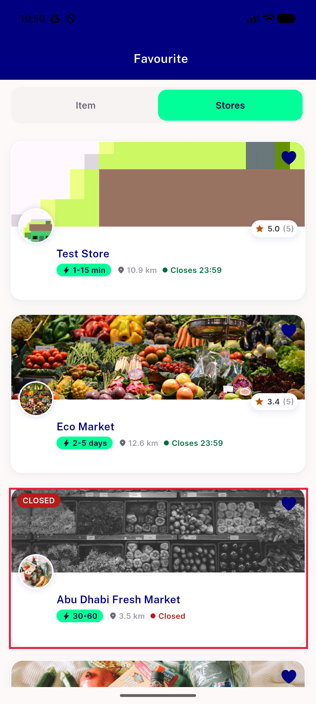

# QA Evidence — NEARS-3634

**8b-fix1 PASS: FV6 store-undo restore verified correct (real data, no blank/wrong placeholder), item-undo unchanged, view_store_list screen=favourites confirmed, back button a11y label confirmed**

**14 screenshot(s).** Click any thumbnail for full resolution.

<table>
<tr>
<td align="center" width="33%"> p13 01 favourites</td>
<td align="center" width="33%"> p13 03 favourites stores</td>
<td align="center" width="33%"> p13 FV1 no back button crop</td>
</tr>
<tr>
<td align="center" width="33%"> p13 FV1 no back button full</td>
<td align="center" width="33%"> p13 FV2 item stores segment labels crop</td>
<td align="center" width="33%"> p13 FV2 item stores segment labels full</td>
</tr>
<tr>
<td align="center" width="33%"> p13 FV3 reference card store name stepper not covering crop</td>
<td align="center" width="33%"> p13 FV3 reference card store name stepper not covering full</td>
<td align="center" width="33%"> p13 FV4 diagonal ribbon decimal crop</td>
</tr>
<tr>
<td align="center" width="33%"> p13 FV4 diagonal ribbon decimal full</td>
<td align="center" width="33%"> p13 FV7 big banner store cards crop</td>
<td align="center" width="33%"> p13 FV7 big banner store cards full</td>
</tr>
<tr>
<td align="center" width="33%"> p13 FV8 closed double signal crop</td>
<td align="center" width="33%"> p13 FV8 closed double signal full</td>
</tr>
</table>

### Other artifacts
- [`8b-fix1-analytics-screen-param.log`](8b-fix1-analytics-screen-param.log)
- [`8b-fix1-fv6-store-undo.log`](8b-fix1-fv6-store-undo.log)
- [`ac3-back-label-dump.xml`](ac3-back-label-dump.xml)

---
*From `nears/docs/qa-evidence/NEARS-3634/` · public-repo scrub policy (no live secrets; verified clean).*
