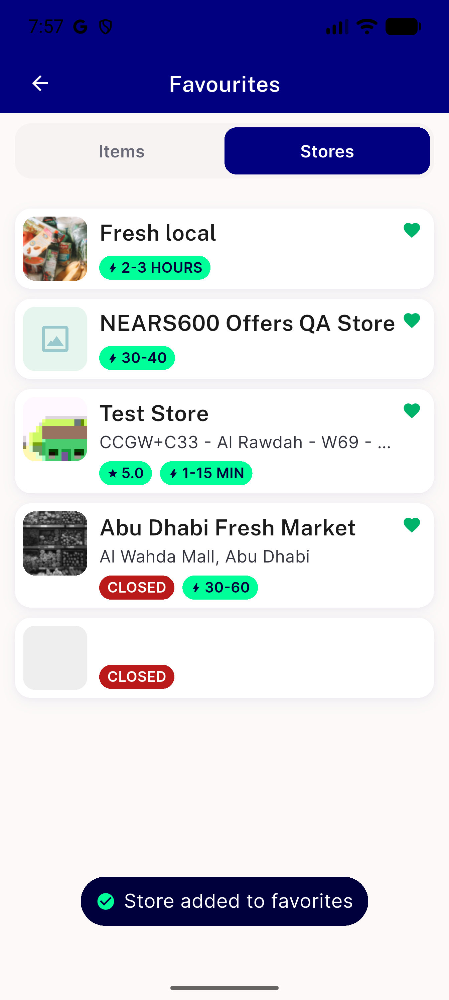
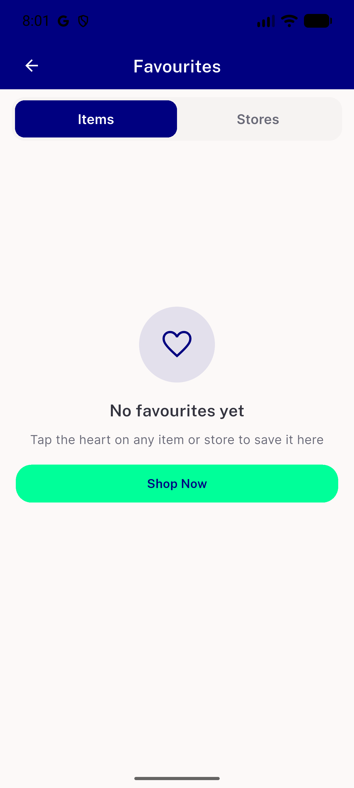
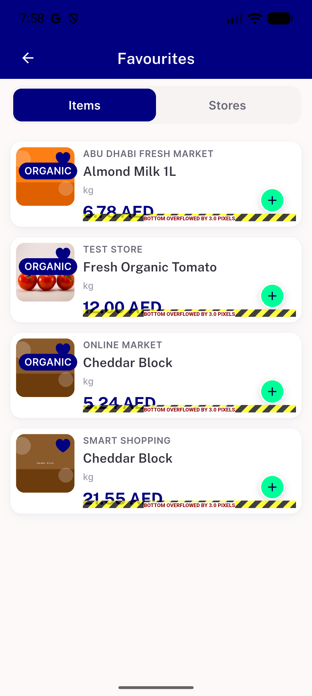
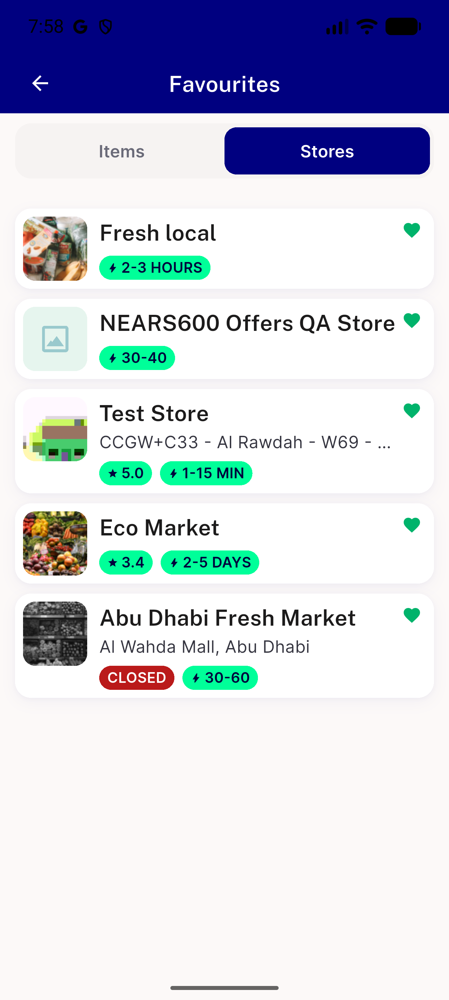

# QA Evidence — NEARS-3634

**FAIL — task_bug FV6 (store Undo restores a blank card), a11y gap FV1 (missing backLabel); other 9 findings PASS**

**4 screenshot(s).** Click any thumbnail for full resolution.

<table>
<tr>
<td align="center" width="33%"> bug store undo blank card</td>
<td align="center" width="33%"> empty state</td>
<td align="center" width="33%"> items tab</td>
</tr>
<tr>
<td align="center" width="33%"> stores tab</td>
</tr>
</table>

---
*From `nears/docs/qa-evidence/NEARS-3634/` · public-repo scrub policy (no live secrets; verified clean).*
