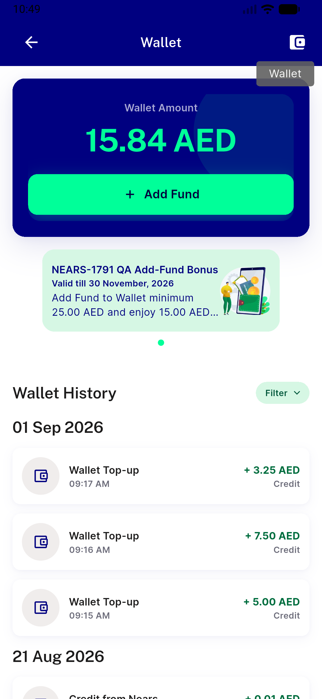
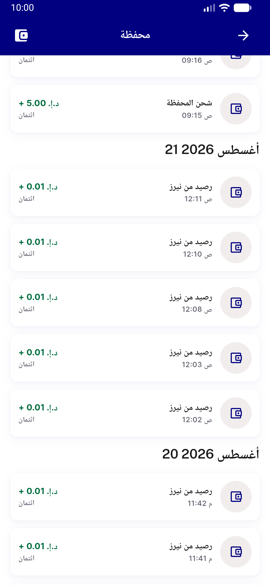
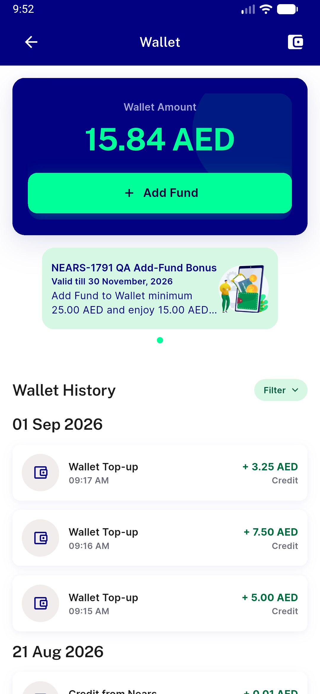

# QA Evidence — NEARS-3635

**Delta re-QA PASS — W5 a11y fix confirmed (1 semantics node, tooltip intact); AC-ANALYTICS 4-event property shapes corrected and confirmed live (view_promotion/select_promotion creative_slot=wallet_banner+1-based index, wallet_filter_changed key=filter, wallet_add_funds_started section/source independent axes)**

**4 screenshot(s).** Click any thumbnail for full resolution.

<table>
<tr>
<td align="center" width="33%"> bug w5 appbar icon</td>
<td align="center" width="33%"> w5 tooltip longpress</td>
<td align="center" width="33%"> wallet screen arabic w1 w2 w3 w4</td>
</tr>
<tr>
<td align="center" width="33%"> wallet screen w1 w2 w3 w4</td>
</tr>
</table>

### Other artifacts
- [`bug-analytics-context-gap.log`](bug-analytics-context-gap.log)
- [`bug-firebase-uncaught-blocks-nav.log`](bug-firebase-uncaught-blocks-nav.log)
- [`bug-partial-payment-raw-reference.log`](bug-partial-payment-raw-reference.log)
- [`bug-w5-double-semantics-dump.xml`](bug-w5-double-semantics-dump.xml)
- [`wallet-appbar-a11y-dump.xml`](wallet-appbar-a11y-dump.xml)
- [`wallet-tooltip-dump.xml`](wallet-tooltip-dump.xml)

---
*From `nears/docs/qa-evidence/NEARS-3635/` · public-repo scrub policy (no live secrets; verified clean).*
