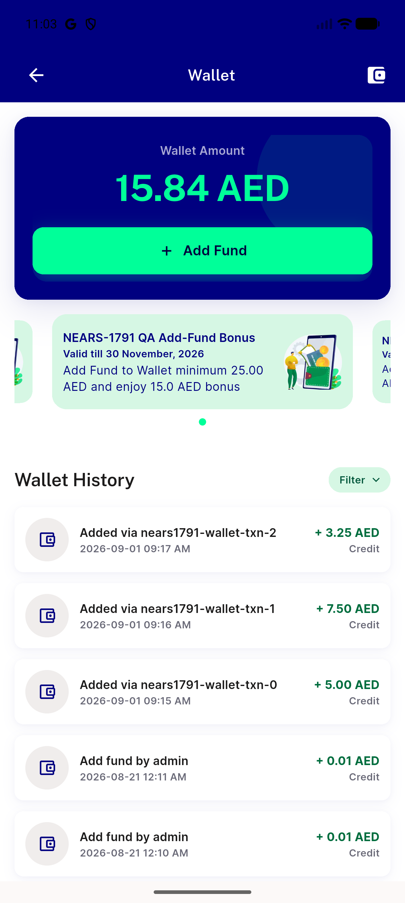
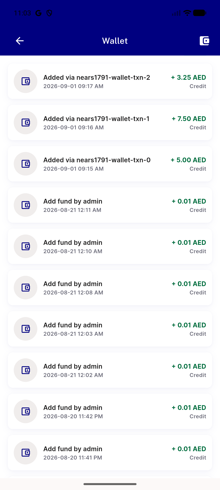
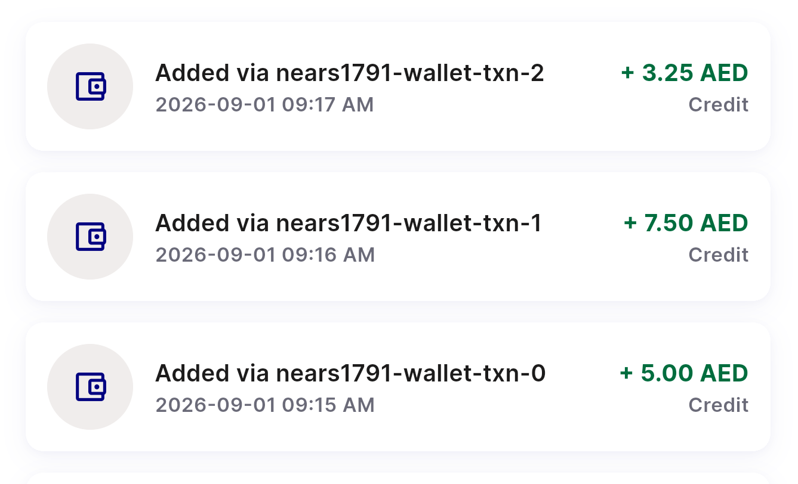
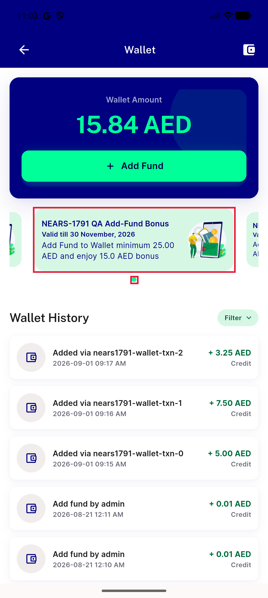
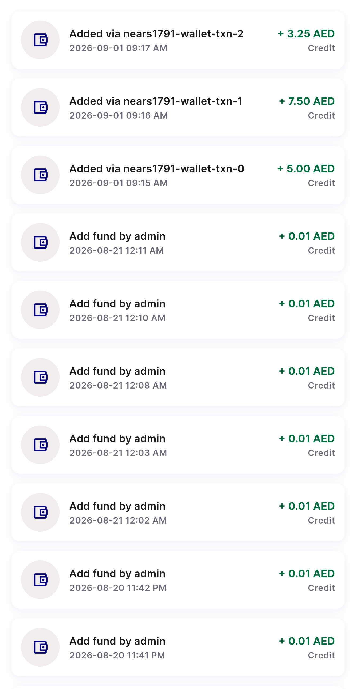
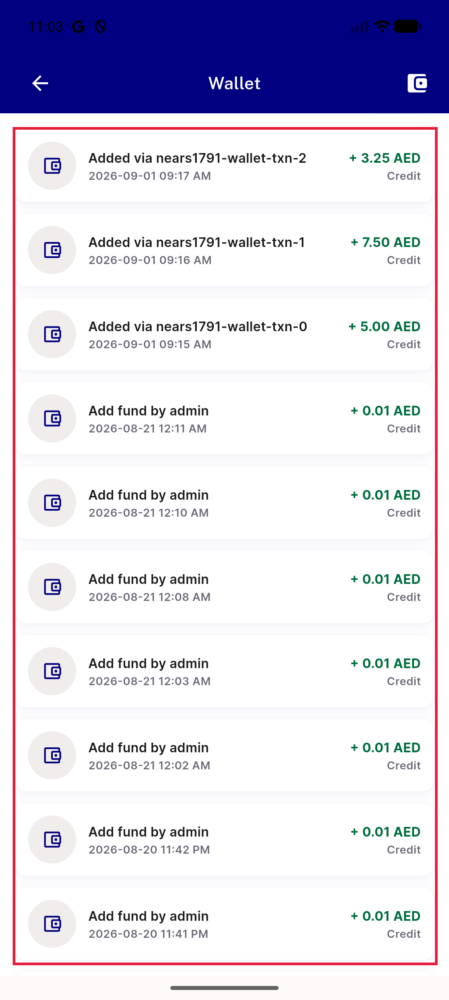
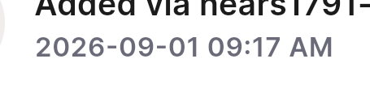
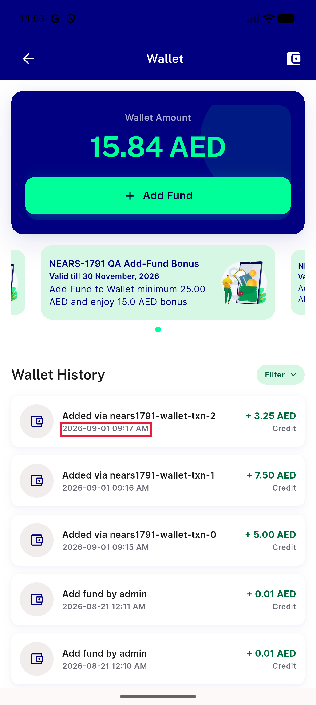

# QA Evidence — NEARS-3635

**Wallet UI/UX — 7 findings (W1-W6 defects, W7 info)**

**12 screenshot(s).** Click any thumbnail for full resolution.

<table>
<tr>
<td align="center" width="33%"> p14 01 wallet</td>
<td align="center" width="33%"> p14 02 wallet scrolled</td>
<td align="center" width="33%"> p14 W1 raw reference titles crop</td>
</tr>
<tr>
<td align="center" width="33%"> p14 W1 raw reference titles full</td>
<td align="center" width="33%"> p14 W2 internal campaign title decimals one dot crop</td>
<td align="center" width="33%"> p14 W2 internal campaign title decimals one dot full</td>
</tr>
<tr>
<td align="center" width="33%"> p14 W3 oversized rows same icon no date groups crop</td>
<td align="center" width="33%"> p14 W3 oversized rows same icon no date groups full</td>
<td align="center" width="33%"> p14 W4 iso date format crop</td>
</tr>
<tr>
<td align="center" width="33%"> p14 W4 iso date format full</td>
<td align="center" width="33%"> p14 W5 unlabelled appbar icon crop</td>
<td align="center" width="33%"> p14 W5 unlabelled appbar icon full</td>
</tr>
</table>

---
*From `nears/docs/qa-evidence/NEARS-3635/` · public-repo scrub policy (no live secrets; verified clean).*
