# QA Evidence — NEARS-3636

**PASS — 8-fix9 (2nd exception cycle): AR/RTL overflow gone (2dp gap trim inside shared card budget), EN+AR both >=5 full cards at 1.0x (126dp), 1.15x/1.3x AR clean (139dp/152dp), EN untouched**

**37 screenshot(s).** Click any thumbnail for full resolution.

<table>
<tr>
<td align="center" width="33%"> bug c3 ar 1.0x expiry card overflow</td>
<td align="center" width="33%"> bug c3 ar 1.0x renderflex overflow</td>
<td align="center" width="33%"> bug c4 coupon not persisted checkout</td>
</tr>
<tr>
<td align="center" width="33%"> c shimmer 1.3x ar</td>
<td align="center" width="33%"> c3 coupons 1.0x ar</td>
<td align="center" width="33%"><a href="c3-coupons-1.0x-en.png">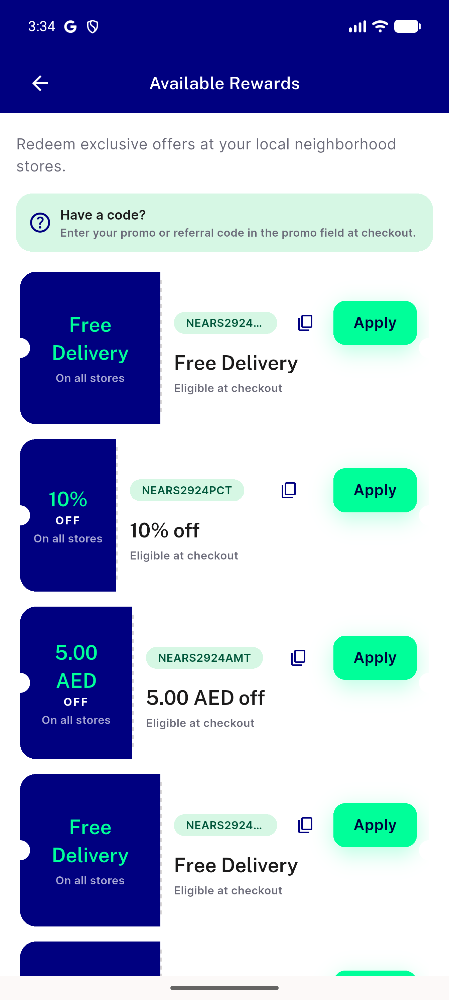</a> c3 coupons 1.0x en</td>
</tr>
<tr>
<td align="center" width="33%"> c3 coupons 1.3x ar</td>
<td align="center" width="33%"><a href="c3-coupons-1.3x-en.png">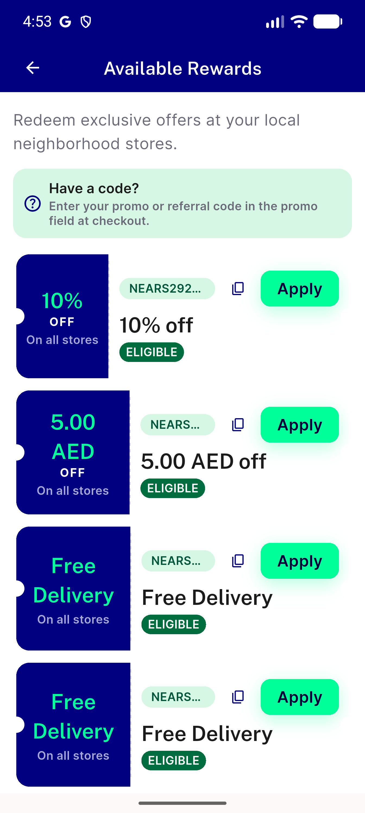</a> c3 coupons 1.3x en</td>
<td align="center" width="33%"><a href="c4-checkout-coupon-applied.png">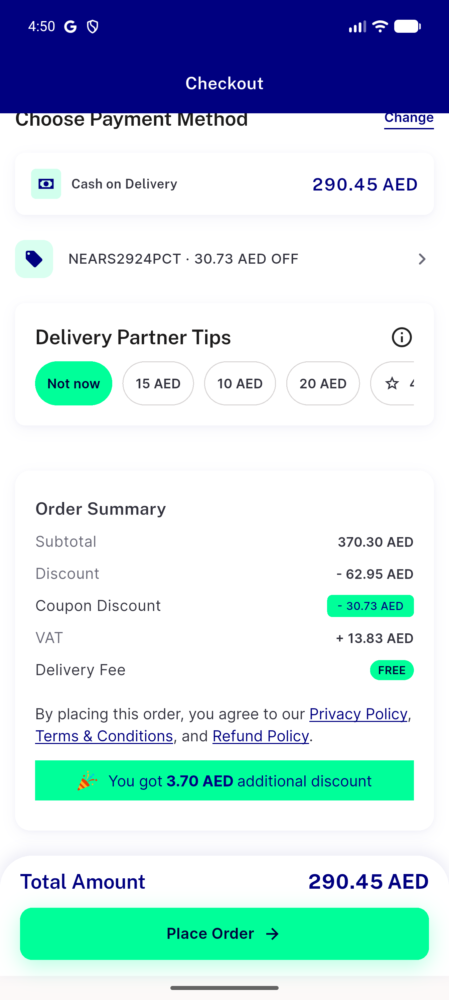</a> c4 checkout coupon applied</td>
</tr>
<tr>
<td align="center" width="33%"><a href="c4-second-entry-coupon-cleared.png">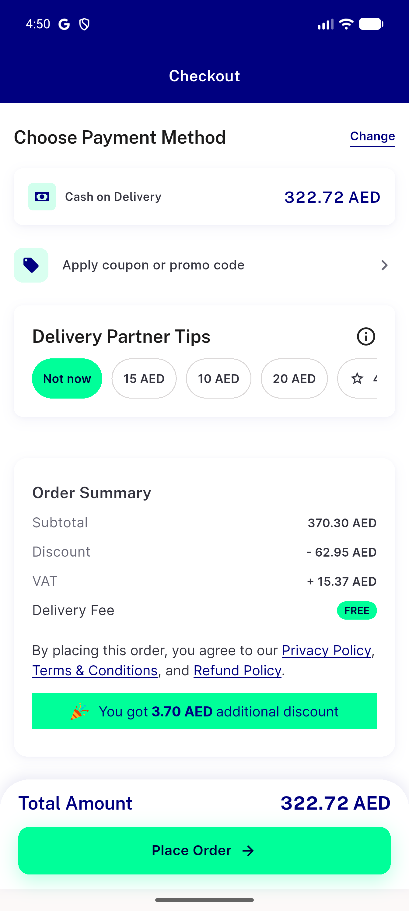</a> c4 second entry coupon cleared</td>
<td align="center" width="33%"><a href="c4-stale-checkout-sheet-coupon-cleared.png">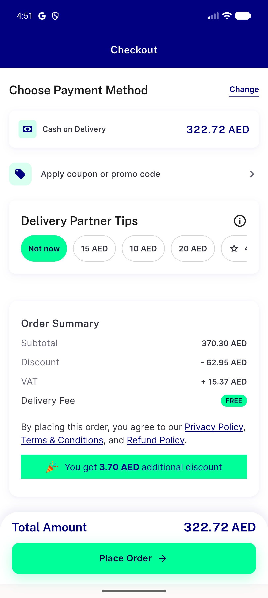</a> c4 stale checkout sheet coupon cleared</td>
<td align="center" width="33%"> coupon c3 ar 1.0x</td>
</tr>
<tr>
<td align="center" width="33%"> coupon c3 ar 1.3x</td>
<td align="center" width="33%"><a href="coupon-c3-en-1.0x.png">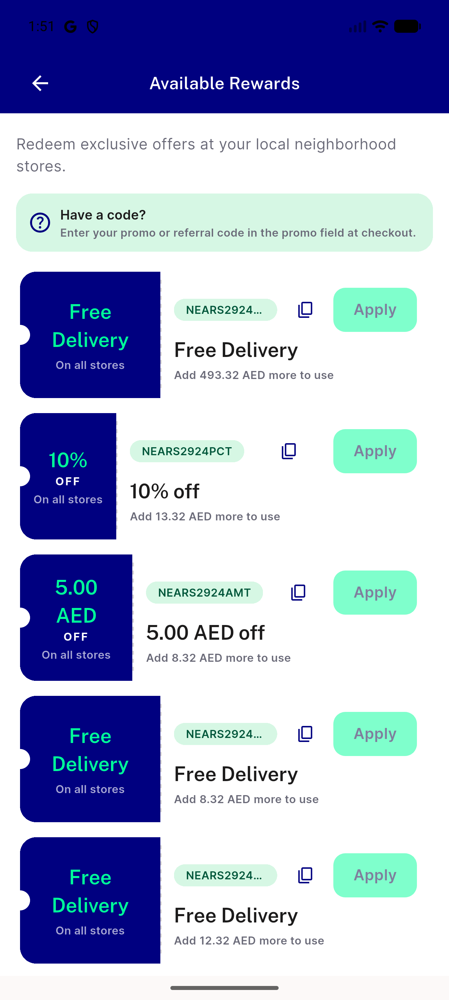</a> coupon c3 en 1.0x</td>
<td align="center" width="33%"><a href="coupon-c3-en-1.3x.png">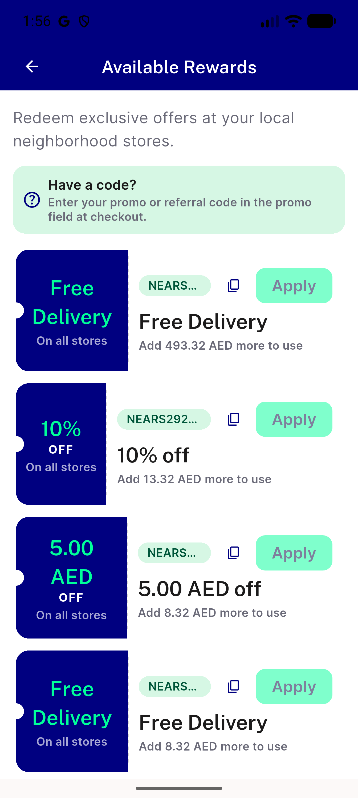</a> coupon c3 en 1.3x</td>
</tr>
<tr>
<td align="center" width="33%"> coupons ar 1.0 exp card</td>
<td align="center" width="33%"> coupons ar 13 exp</td>
<td align="center" width="33%"> coupons ar shimmer</td>
</tr>
<tr>
<td align="center" width="33%"> coupons ar shimmer2</td>
<td align="center" width="33%"> coupons ar shimmer frame</td>
<td align="center" width="33%"> coupons en 1.0 final</td>
</tr>
<tr>
<td align="center" width="33%"><a href="p15-01-coupons.png">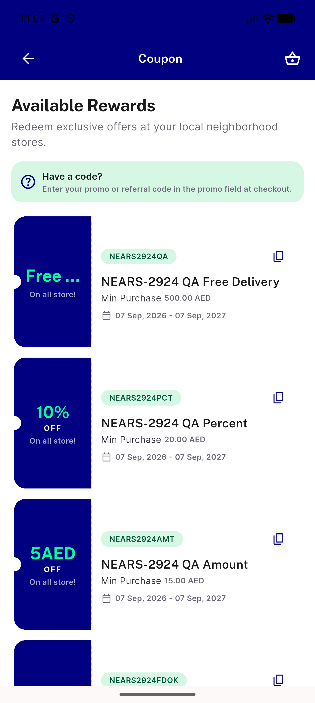</a> p15 01 coupons</td>
<td align="center" width="33%"><a href="p15-02-coupons-scrolled.png">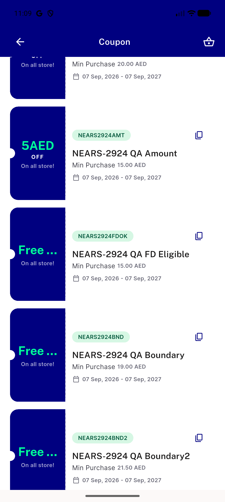</a> p15 02 coupons scrolled</td>
<td align="center" width="33%"> p15 C1 C2 free truncated on all store crop</td>
</tr>
<tr>
<td align="center" width="33%"><a href="p15-C1-C2-free-truncated-on-all-store__full.png">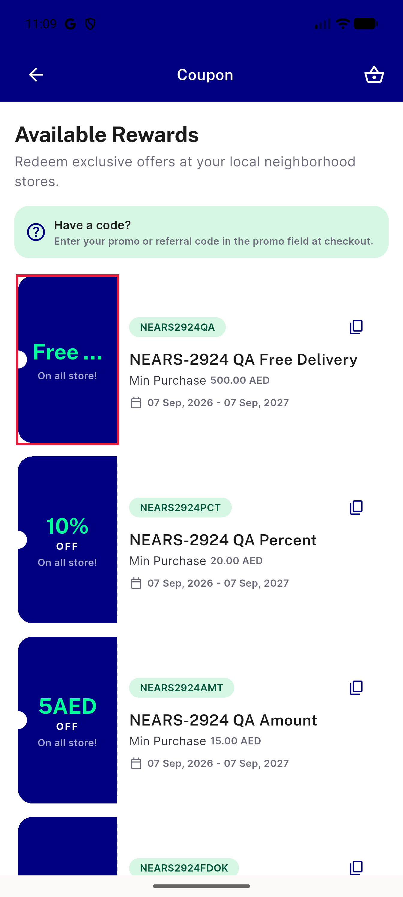</a> p15 C1 C2 free truncated on all store full</td>
<td align="center" width="33%"><a href="p15-C3-tall-coupon-card__crop.png">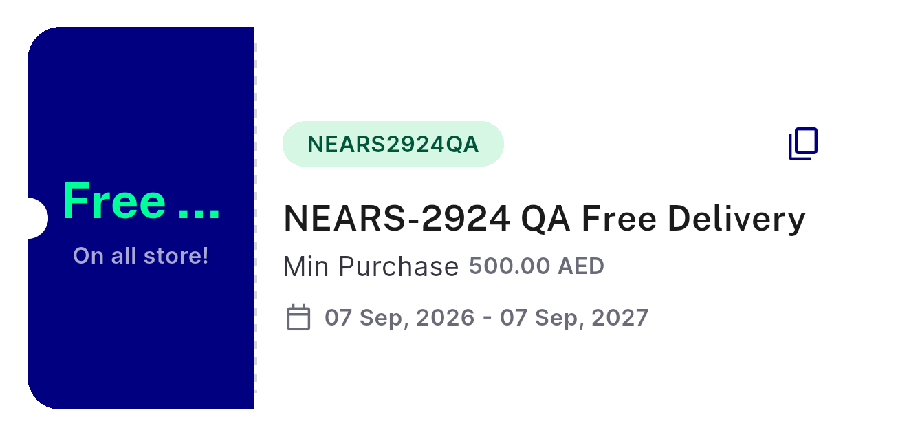</a> p15 C3 tall coupon card crop</td>
<td align="center" width="33%"><a href="p15-C3-tall-coupon-card__full.png">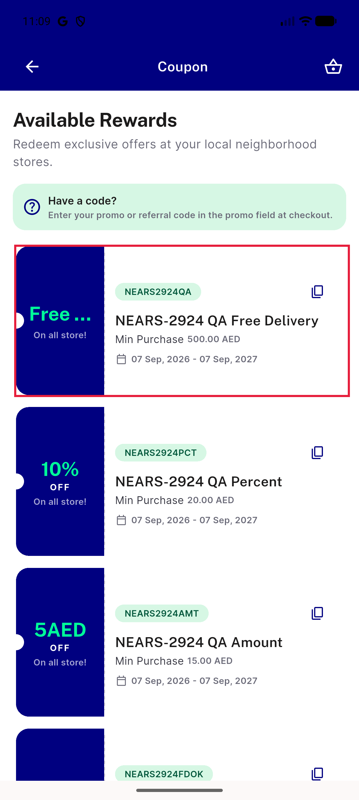</a> p15 C3 tall coupon card full</td>
</tr>
<tr>
<td align="center" width="33%"> p15 C4 copy only action have a code crop</td>
<td align="center" width="33%"><a href="p15-C4-copy-only-action-have-a-code__full.png">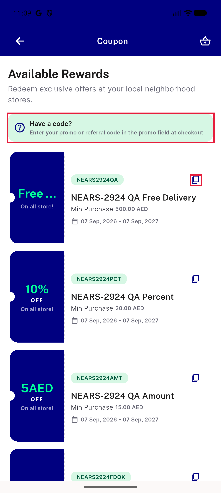</a> p15 C4 copy only action have a code full</td>
<td align="center" width="33%"><a href="p15-C5-campaign-name-title-dup-code__crop.png">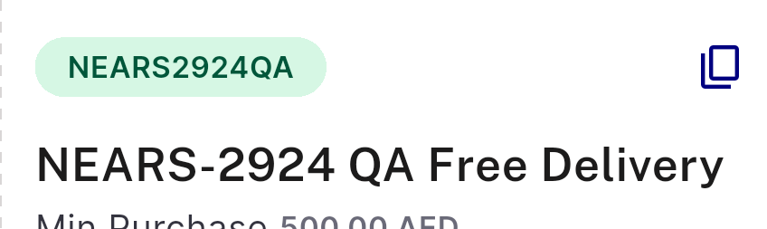</a> p15 C5 campaign name title dup code crop</td>
</tr>
<tr>
<td align="center" width="33%"><a href="p15-C5-campaign-name-title-dup-code__full.png">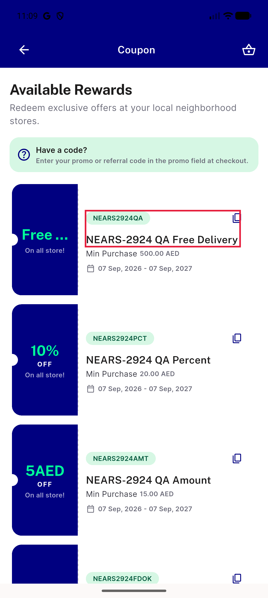</a> p15 C5 campaign name title dup code full</td>
<td align="center" width="33%"><a href="p15-C6-min-500-no-eligibility-cue__crop.png">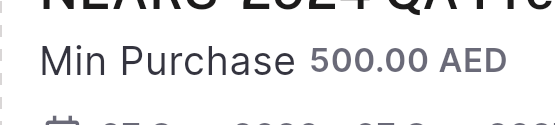</a> p15 C6 min 500 no eligibility cue crop</td>
<td align="center" width="33%"><a href="p15-C6-min-500-no-eligibility-cue__full.png">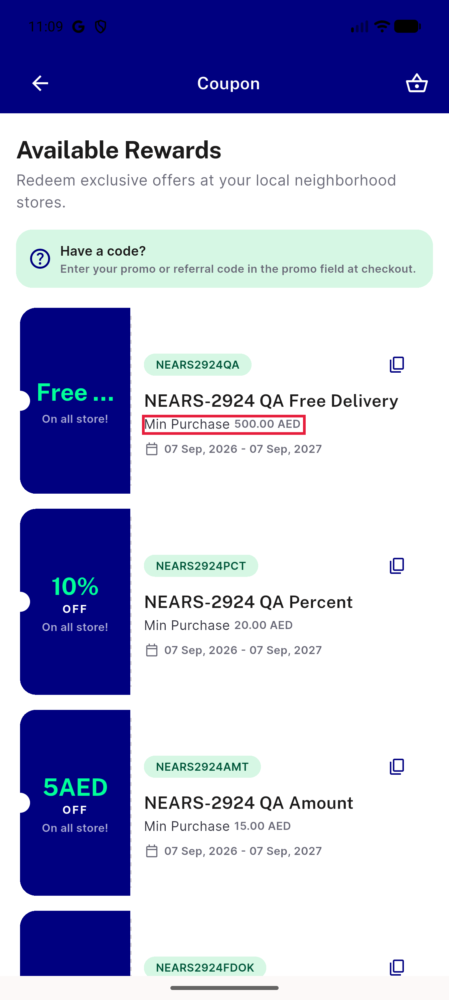</a> p15 C6 min 500 no eligibility cue full</td>
</tr>
<tr>
<td align="center" width="33%"> p15 C7 appbar coupon singular basket icon crop</td>
<td align="center" width="33%"><a href="p15-C7-appbar-coupon-singular-basket-icon__full.png">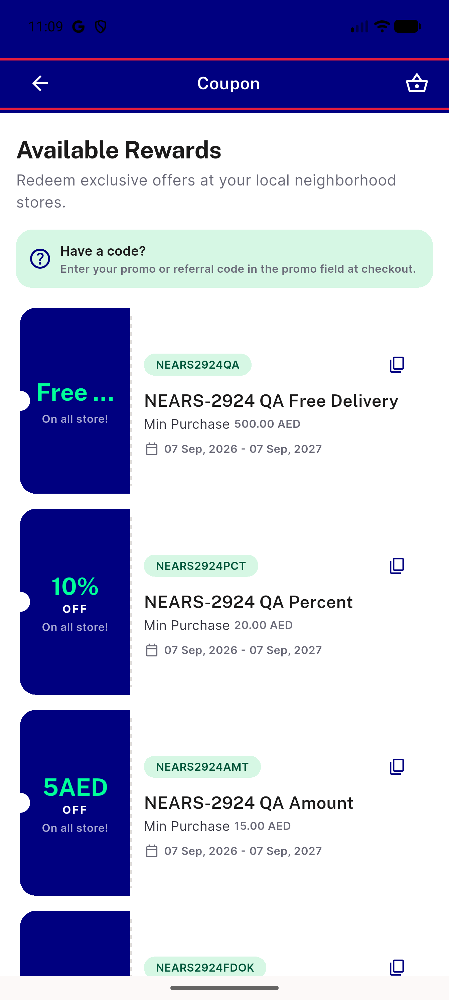</a> p15 C7 appbar coupon singular basket icon full</td>
<td align="center" width="33%"> p15 C9 5AED no space crop</td>
</tr>
<tr>
<td align="center" width="33%"> p15 C9 5AED no space full</td>
</tr>
</table>

### Other artifacts
- [`bug-c3-ar-1.0x-renderflex-overflow.log`](bug-c3-ar-1.0x-renderflex-overflow.log)
- [`bug-c4-coupon-not-persisted-checkout.log`](bug-c4-coupon-not-persisted-checkout.log)
- [`coupon-c3-ar-1.0x-a11ydump.xml`](coupon-c3-ar-1.0x-a11ydump.xml)
- [`coupon-c3-en-1.0x-a11ydump.xml`](coupon-c3-en-1.0x-a11ydump.xml)
- [`coupons_ar_1.0.xml`](coupons_ar_1.0.xml)
- [`coupons_ar_115.xml`](coupons_ar_115.xml)
- [`coupons_ar_13.xml`](coupons_ar_13.xml)
- [`coupons_ar_scroll.xml`](coupons_ar_scroll.xml)
- [`coupons_en_1.0.xml`](coupons_en_1.0.xml)
- [`coupons_en_scroll.xml`](coupons_en_scroll.xml)

---
*From `nears/docs/qa-evidence/NEARS-3636/` · public-repo scrub policy (no live secrets; verified clean).*
