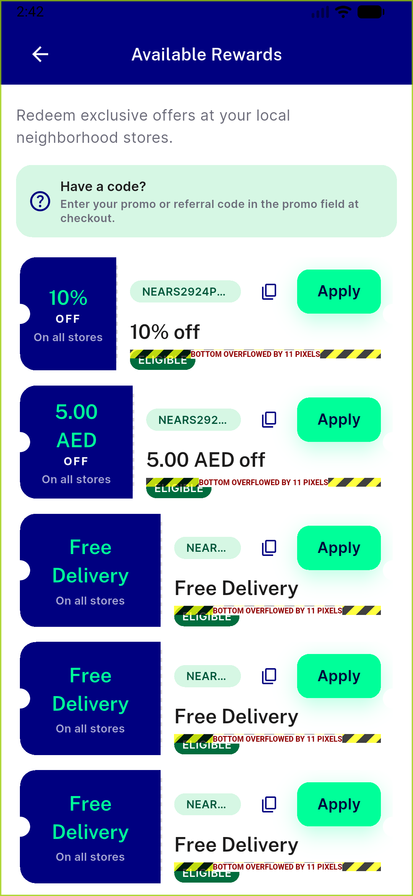

# QA Evidence — NEARS-3636

**QA NEARS-3636: FAIL — 2 High task_bugs (NTicketCard RenderFlex overflow breaking C3; checkout coupon-carryover breaking C4), 6/9 ACs PASS, 1 UNVERIFIABLE (C8 data gap), device emulator-5560**

**6 screenshot(s).** Click any thumbnail for full resolution.

<table>
<tr>
<td align="center" width="33%"> bug checkout coupon not carried over</td>
<td align="center" width="33%"> bug nticketcard overflow</td>
<td align="center" width="33%"> checkout discount</td>
</tr>
<tr>
<td align="center" width="33%"> coupons ar 1.0x</td>
<td align="center" width="33%"> coupons en 1.0x</td>
<td align="center" width="33%"> coupons en 1.3x</td>
</tr>
</table>

---
*From `nears/docs/qa-evidence/NEARS-3636/` · public-repo scrub policy (no live secrets; verified clean).*
