# QA Evidence — NEARS-3636

**8-fix5 final delta re-QA: R1,R2,R4,R5,R6,R7,R8 PASS; R3 UNVERIFIABLE (sha d7a093f83)**

**34 screenshot(s).** Click any thumbnail for full resolution.

<table>
<tr>
<td align="center" width="33%"> bug c8 expiry tag truncated en 1.3x</td>
<td align="center" width="33%"> bug checkout coupon not carried over</td>
<td align="center" width="33%"> bug nticketcard overflow</td>
</tr>
<tr>
<td align="center" width="33%"> c8 ar 1.0x</td>
<td align="center" width="33%"> c8 ar 1.3x</td>
<td align="center" width="33%"> c8 composite EXP card 4states</td>
</tr>
<tr>
<td align="center" width="33%"><a href="c8-en-1.0x.png">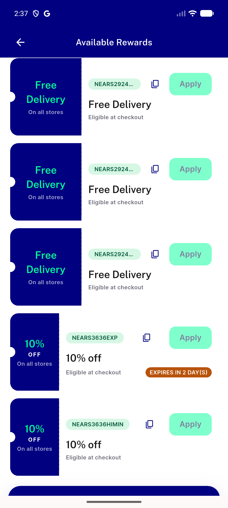</a> c8 en 1.0x</td>
<td align="center" width="33%"> c8 en 1.3x recheck</td>
<td align="center" width="33%"><a href="c8-en-1.3x.png">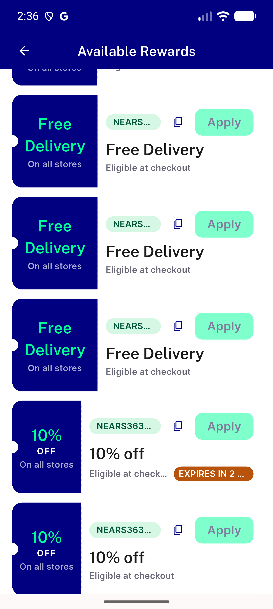</a> c8 en 1.3x</td>
</tr>
<tr>
<td align="center" width="33%"> checkout discount</td>
<td align="center" width="33%"> coupons ar 1.0x</td>
<td align="center" width="33%"> coupons en 1.0x</td>
</tr>
<tr>
<td align="center" width="33%"> coupons en 1.3x</td>
<td align="center" width="33%"><a href="f5-r1-checkout-coupon-applied.png">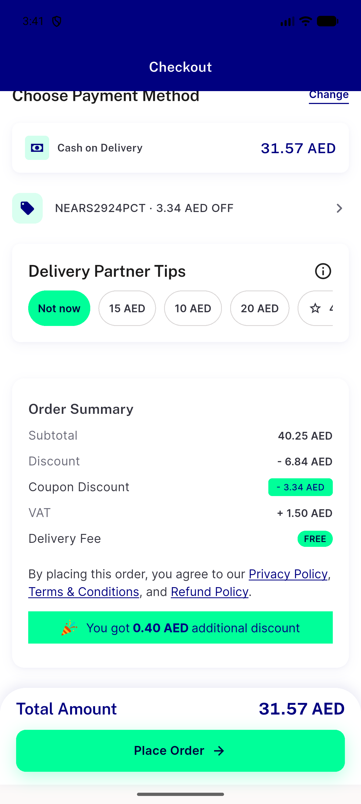</a> f5 r1 checkout coupon applied</td>
<td align="center" width="33%"><a href="f5-r1-checkout-top.png">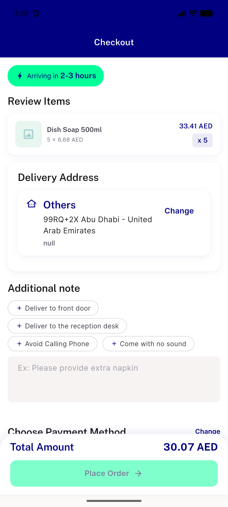</a> f5 r1 checkout top</td>
</tr>
<tr>
<td align="center" width="33%"> f5 r1 coupons page single store</td>
<td align="center" width="33%"><a href="f5-r2a-qty-edit-above-min-checkout-no-coupon.png">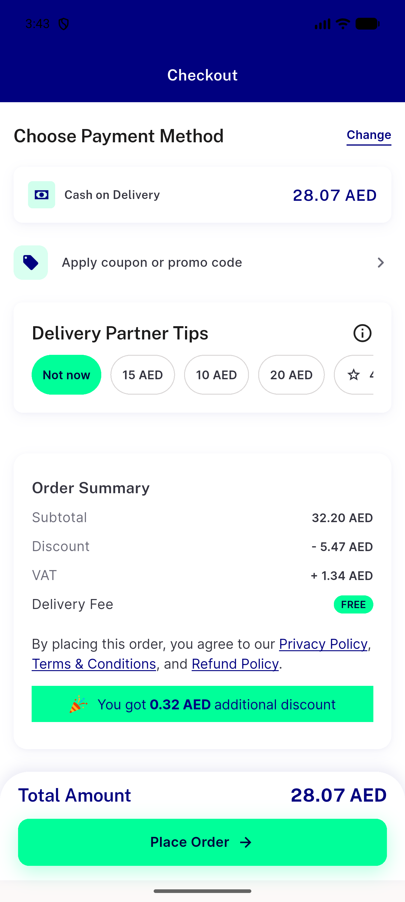</a> f5 r2a qty edit above min checkout no coupon</td>
<td align="center" width="33%"><a href="f5-r2b-qty-edit-below-min-checkout-no-coupon.png">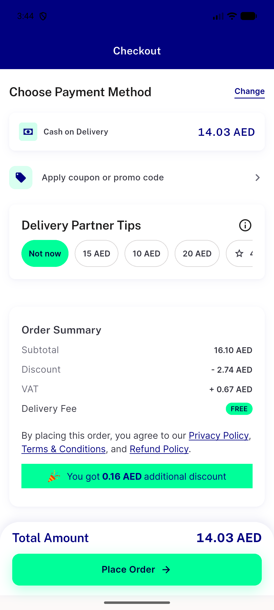</a> f5 r2b qty edit below min checkout no coupon</td>
</tr>
<tr>
<td align="center" width="33%"><a href="f5-r2c-positive-control-no-edit-coupon-survives.png">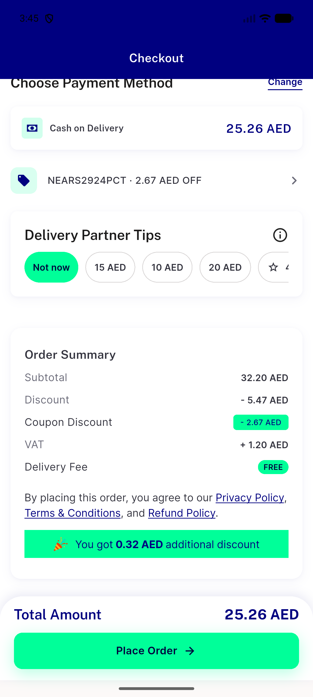</a> f5 r2c positive control no edit coupon survives</td>
<td align="center" width="33%"><a href="f5-r4-after-logout-login-checkout-no-coupon.png">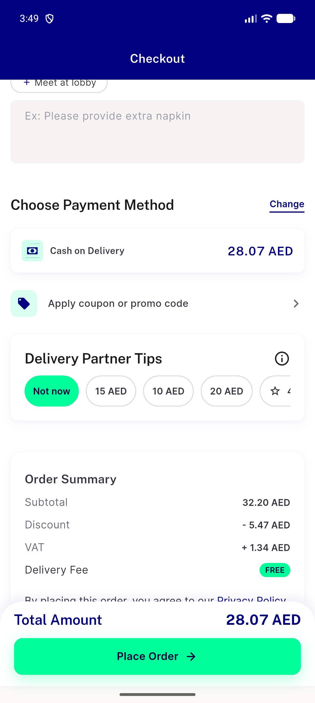</a> f5 r4 after logout login checkout no coupon</td>
<td align="center" width="33%"> f5 r5 ar 1.0x bottom</td>
</tr>
<tr>
<td align="center" width="33%"> f5 r5 ar 1.0x top</td>
<td align="center" width="33%"> f5 r5 en 1.0x</td>
<td align="center" width="33%"><a href="f5-r6-day21-1000-bottom.png">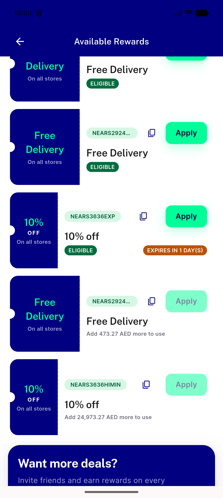</a> f5 r6 day21 1000 bottom</td>
</tr>
<tr>
<td align="center" width="33%"><a href="f5-r6-day21-1000-top.png">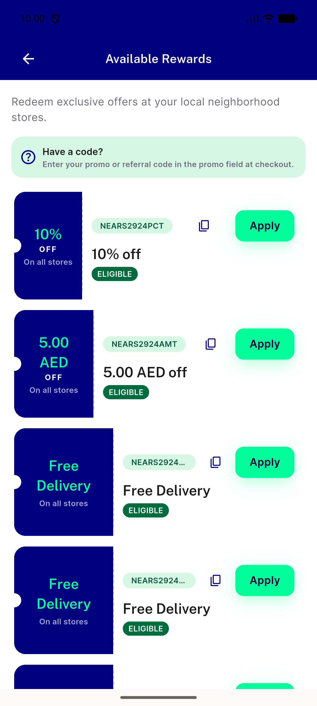</a> f5 r6 day21 1000 top</td>
<td align="center" width="33%"><a href="f5-r6-day22-0005-bottom.png">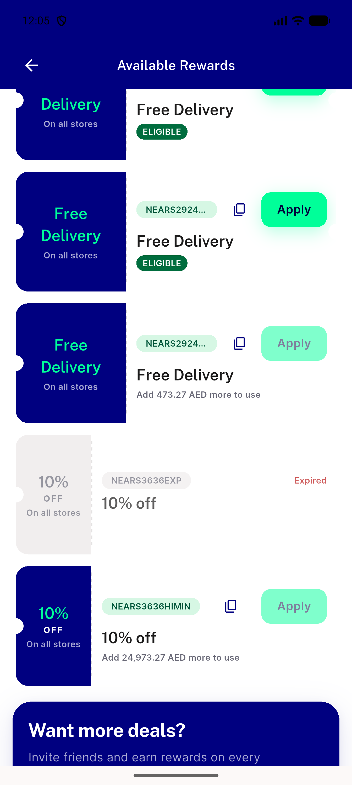</a> f5 r6 day22 0005 bottom</td>
<td align="center" width="33%"> f5 r7 himin eligibility en</td>
</tr>
<tr>
<td align="center" width="33%"> f5 r8 ar 1.3x bottom</td>
<td align="center" width="33%"> f5 r8 ar 1.3x top</td>
<td align="center" width="33%"> f5 r8 en 1.3x bottom</td>
</tr>
<tr>
<td align="center" width="33%"><a href="f5-r8-en-1.3x-top.png">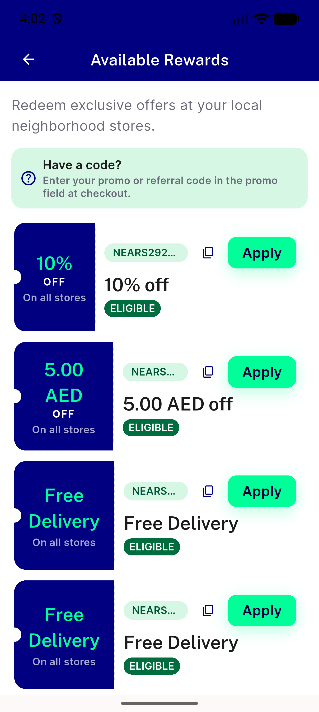</a> f5 r8 en 1.3x top</td>
<td align="center" width="33%"> f5 r8 error retry ar 1.3x</td>
<td align="center" width="33%"> f5 r8 shimmer ar 1.3x live</td>
</tr>
<tr>
<td align="center" width="33%"><a href="f5-r8-shimmer-ar-1.3x-offline-b.png">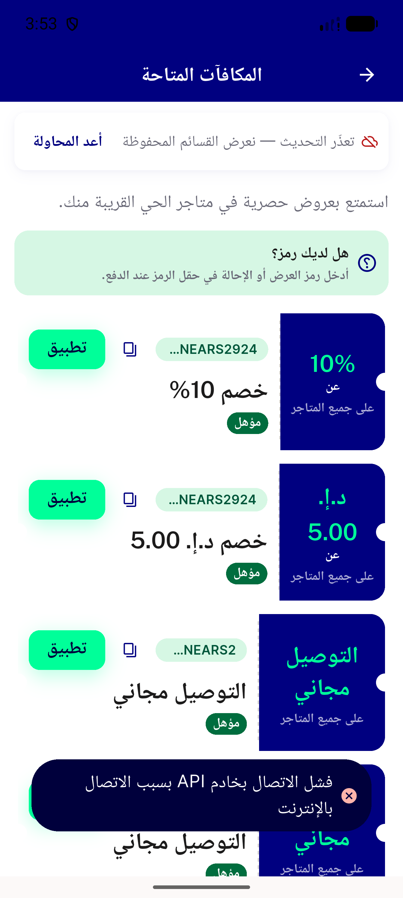</a> f5 r8 shimmer ar 1.3x offline b</td>
</tr>
</table>

### Other artifacts
- [`bug-checkout-get-tax-403-retry-loop-stale-server-cart.log`](bug-checkout-get-tax-403-retry-loop-stale-server-cart.log)
- [`bug-view-promotion-fires-off-page.log`](bug-view-promotion-fires-off-page.log)
- [`c8-api-raw-expire-date.log`](c8-api-raw-expire-date.log)
- [`c8-ar-1.0x-dump.xml`](c8-ar-1.0x-dump.xml)
- [`c8-ar-1.0x-top-dump.xml`](c8-ar-1.0x-top-dump.xml)
- [`c8-ar-1.3x-dump.xml`](c8-ar-1.3x-dump.xml)
- [`c8-en-1.0x-bottom-dump.xml`](c8-en-1.0x-bottom-dump.xml)
- [`c8-en-1.0x-top-dump.xml`](c8-en-1.0x-top-dump.xml)
- [`c8-en-1.3x-recheck-dump.xml`](c8-en-1.3x-recheck-dump.xml)
- [`f5-analytics-and-log-audit.log`](f5-analytics-and-log-audit.log)
- [`f5-r1-checkout-dump.xml`](f5-r1-checkout-dump.xml)
- [`f5-r5-ar-1.0x-bottom-dump.xml`](f5-r5-ar-1.0x-bottom-dump.xml)
- [`f5-r5-ar-1.0x-top-dump.xml`](f5-r5-ar-1.0x-top-dump.xml)
- [`f5-r5-en-1.0x-bottom-dump.xml`](f5-r5-en-1.0x-bottom-dump.xml)
- [`f5-r6-day21-1000-bottom-dump.xml`](f5-r6-day21-1000-bottom-dump.xml)
- [`f5-r6-day21-1000-top-dump.xml`](f5-r6-day21-1000-top-dump.xml)
- [`f5-r6-day22-0005-bottom-dump.xml`](f5-r6-day22-0005-bottom-dump.xml)
- [`f5-r6-day22-0005-top-dump.xml`](f5-r6-day22-0005-top-dump.xml)
- [`f5-r7-himin-eligibility-dump.xml`](f5-r7-himin-eligibility-dump.xml)
- [`f5-r8-ar-1.3x-bottom-dump.xml`](f5-r8-ar-1.3x-bottom-dump.xml)
- [`f5-r8-ar-1.3x-top-dump.xml`](f5-r8-ar-1.3x-top-dump.xml)
- [`f5-r8-delay-proxy.py`](f5-r8-delay-proxy.py)
- [`f5-r8-en-1.3x-bottom-dump.xml`](f5-r8-en-1.3x-bottom-dump.xml)
- [`f5-r8-en-1.3x-top-dump.xml`](f5-r8-en-1.3x-top-dump.xml)
- [`f5-r8-shimmer-ar-1.3x-live-dump.xml`](f5-r8-shimmer-ar-1.3x-live-dump.xml)
- [`progress.md`](progress.md)

---
*From `nears/docs/qa-evidence/NEARS-3636/` · public-repo scrub policy (no live secrets; verified clean).*
