# QA Evidence — NEARS-3637

**QA pass: LP1-LP8 + AC-DLS/AC-SHARED/AC-ANALYTICS/AC-LOG verified; 1 new task_bug (LP8 ISO date leak), 1 pre-existing regression_bug (About Us test)**

**18 screenshot(s).** Click any thumbnail for full resolution.

<table>
<tr>
<td align="center" width="33%"><a href="bug-lp8-iso-date-leak-ar.png">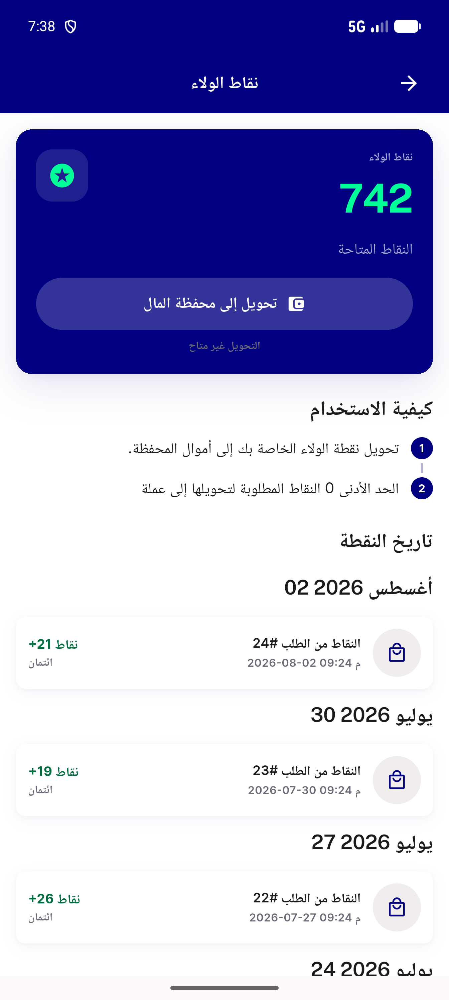</a> bug lp8 iso date leak ar</td>
<td align="center" width="33%"><a href="lp7-step-markers-ar.png">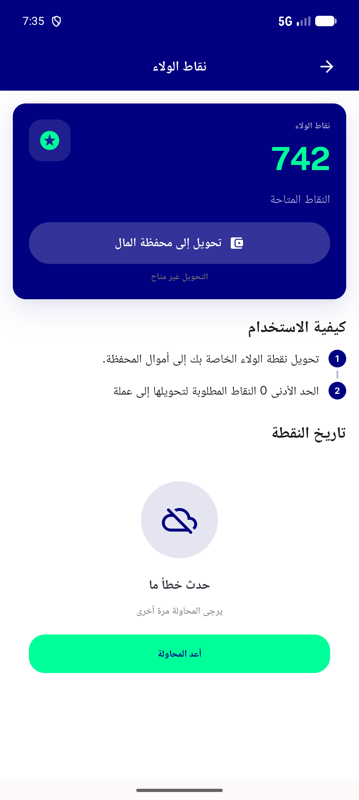</a> lp7 step markers ar</td>
<td align="center" width="33%"> p16 01 loyalty</td>
</tr>
<tr>
<td align="center" width="33%"><a href="p16-02-loyalty-scrolled.png">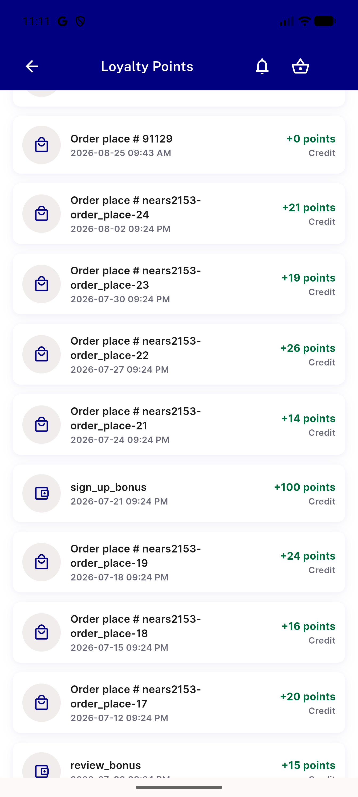</a> p16 02 loyalty scrolled</td>
<td align="center" width="33%"><a href="p16-LP1-balance-0-vs-credit-history__crop.png">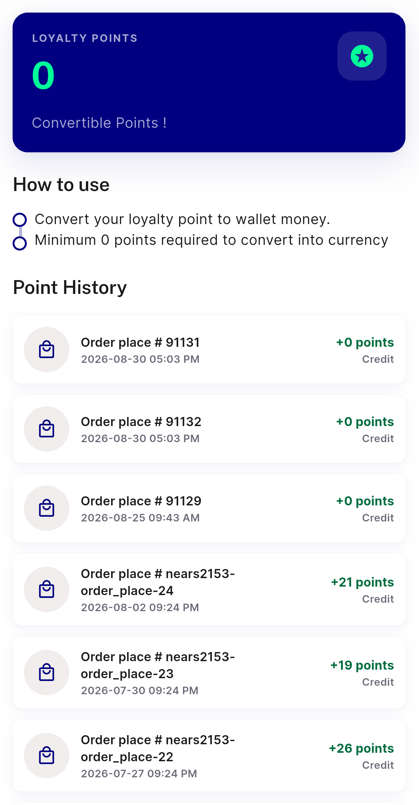</a> p16 LP1 balance 0 vs credit history crop</td>
<td align="center" width="33%"><a href="p16-LP1-balance-0-vs-credit-history__full.png">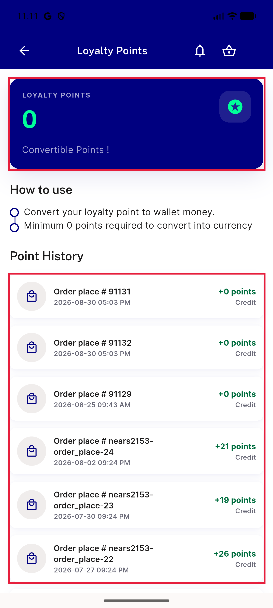</a> p16 LP1 balance 0 vs credit history full</td>
</tr>
<tr>
<td align="center" width="33%"><a href="p16-LP2-minimum-0-points__crop.png">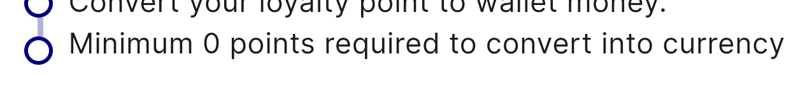</a> p16 LP2 minimum 0 points crop</td>
<td align="center" width="33%"><a href="p16-LP2-minimum-0-points__full.png">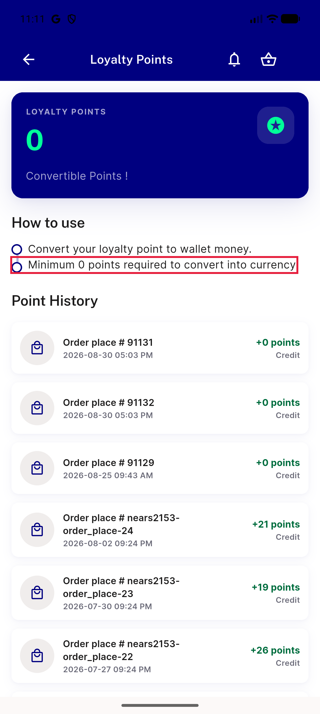</a> p16 LP2 minimum 0 points full</td>
<td align="center" width="33%"><a href="p16-LP3-order-place-raw-reference__crop.png">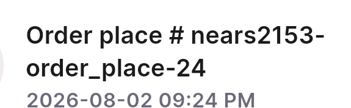</a> p16 LP3 order place raw reference crop</td>
</tr>
<tr>
<td align="center" width="33%"><a href="p16-LP3-order-place-raw-reference__full.png">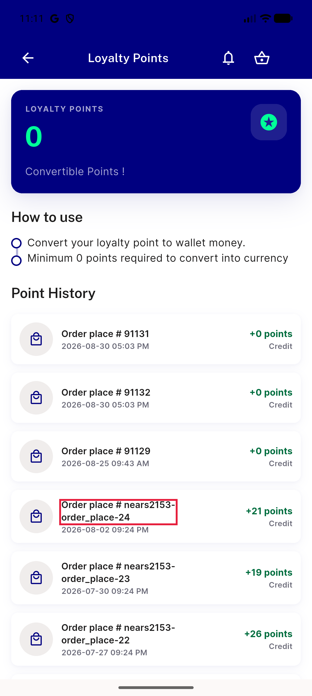</a> p16 LP3 order place raw reference full</td>
<td align="center" width="33%"><a href="p16-LP3-raw-keys-sign-up-review-bonus__crop.png">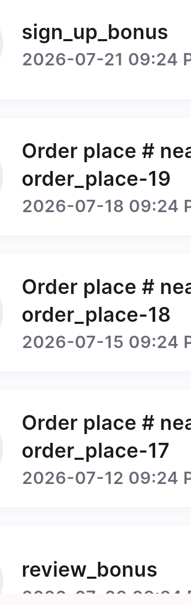</a> p16 LP3 raw keys sign up review bonus crop</td>
<td align="center" width="33%"><a href="p16-LP3-raw-keys-sign-up-review-bonus__full.png">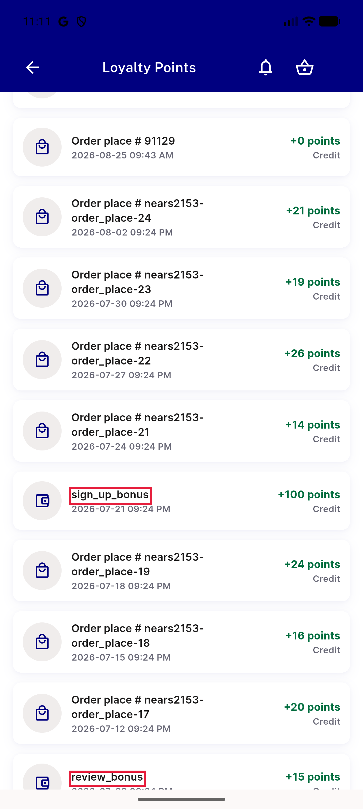</a> p16 LP3 raw keys sign up review bonus full</td>
</tr>
<tr>
<td align="center" width="33%"><a href="p16-LP4-plus-0-points-rows__crop.png">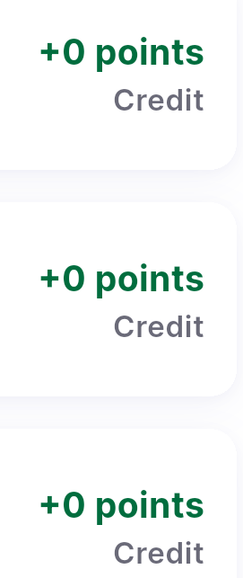</a> p16 LP4 plus 0 points rows crop</td>
<td align="center" width="33%"><a href="p16-LP4-plus-0-points-rows__full.png">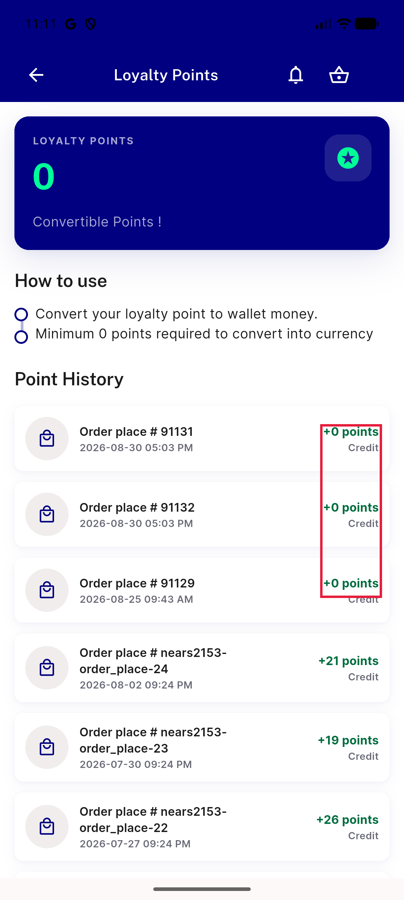</a> p16 LP4 plus 0 points rows full</td>
<td align="center" width="33%"><a href="p16-LP6-LP7-no-convert-cta-convertible-points__crop.png">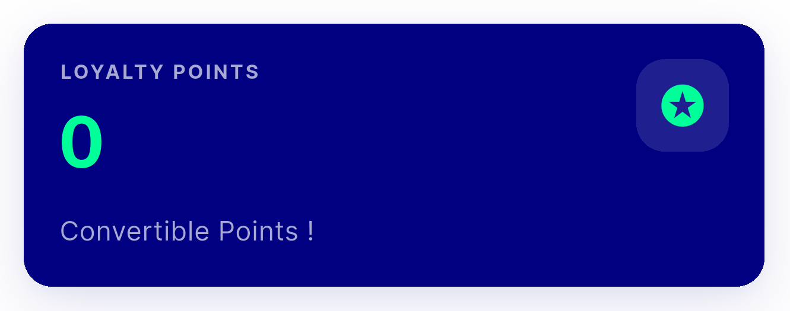</a> p16 LP6 LP7 no convert cta convertible points crop</td>
</tr>
<tr>
<td align="center" width="33%"><a href="p16-LP6-LP7-no-convert-cta-convertible-points__full.png">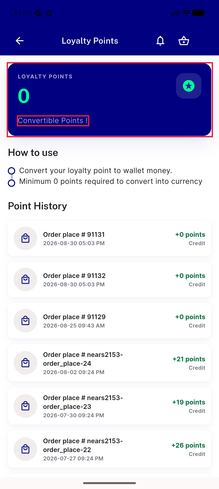</a> p16 LP6 LP7 no convert cta convertible points full</td>
<td align="center" width="33%"> p16 LP9 appbar title off centre two actions crop</td>
<td align="center" width="33%"><a href="p16-LP9-appbar-title-off-centre-two-actions__full.png">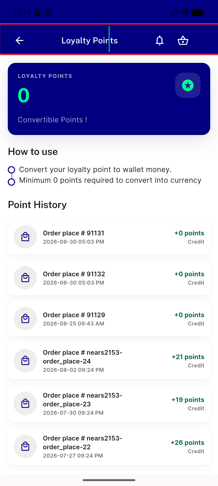</a> p16 LP9 appbar title off centre two actions full</td>
</tr>
</table>

---
*From `nears/docs/qa-evidence/NEARS-3637/` · public-repo scrub policy (no live secrets; verified clean).*
