# QA Evidence — NEARS-3638

**Human QA Notifications: NT1-NT7 findings — status/icon mismatch, broken templates, sheet dead-end, no order pictures, local-only read state, oversized rows, faint close icon**

**16 screenshot(s).** Click any thumbnail for full resolution.

<table>
<tr>
<td align="center" width="33%"><a href="p17-NT1-cancellation-shown-with-success-tick__crop.png">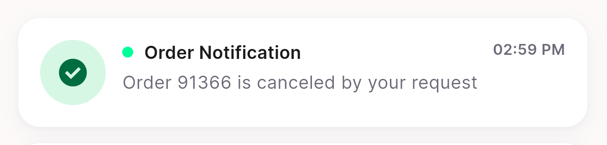</a> p17 NT1 cancellation shown with success tick crop</td>
<td align="center" width="33%"><a href="p17-NT1-cancellation-shown-with-success-tick__full.png">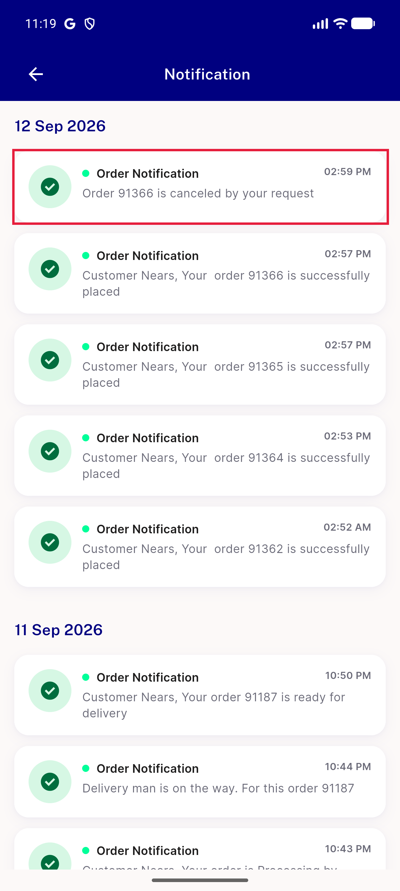</a> p17 NT1 cancellation shown with success tick full</td>
<td align="center" width="33%"><a href="p17-NT1-every-title-order-notification__crop.png">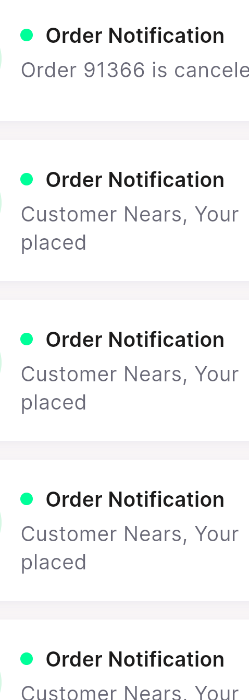</a> p17 NT1 every title order notification crop</td>
</tr>
<tr>
<td align="center" width="33%"><a href="p17-NT1-every-title-order-notification__full.png">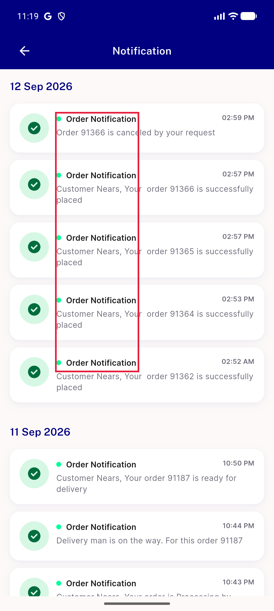</a> p17 NT1 every title order notification full</td>
<td align="center" width="33%"> p17 NT2 broken grammar delivery man crop</td>
<td align="center" width="33%"><a href="p17-NT2-broken-grammar-delivery-man__full.png">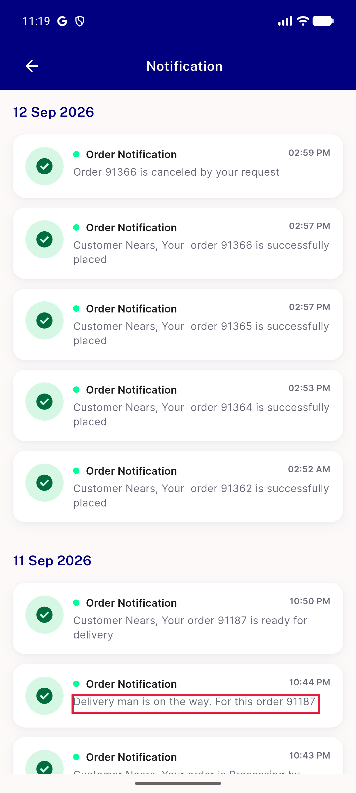</a> p17 NT2 broken grammar delivery man full</td>
</tr>
<tr>
<td align="center" width="33%"> p17 NT2 double space name prefix crop</td>
<td align="center" width="33%"><a href="p17-NT2-double-space-name-prefix__full.png">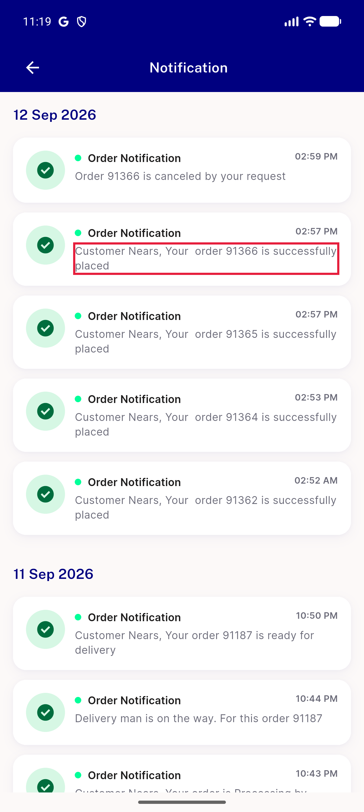</a> p17 NT2 double space name prefix full</td>
<td align="center" width="33%"><a href="p17-NT3-sheet-repeats-text__crop.png">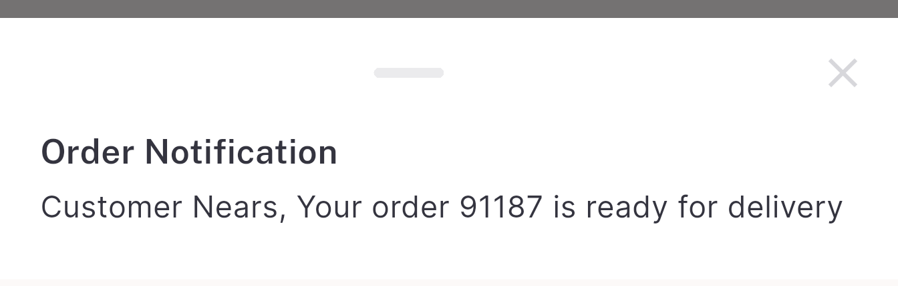</a> p17 NT3 sheet repeats text crop</td>
</tr>
<tr>
<td align="center" width="33%"><a href="p17-NT3-sheet-repeats-text__full.png">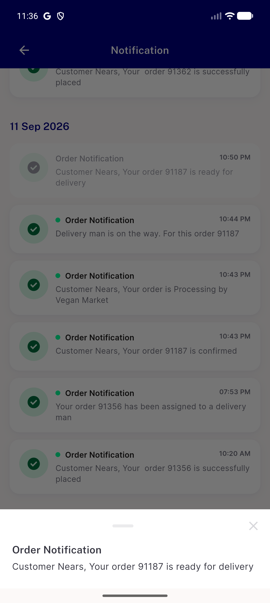</a> p17 NT3 sheet repeats text full</td>
<td align="center" width="33%"> p17 NT5 unread dot on every item crop</td>
<td align="center" width="33%"><a href="p17-NT5-unread-dot-on-every-item__full.png">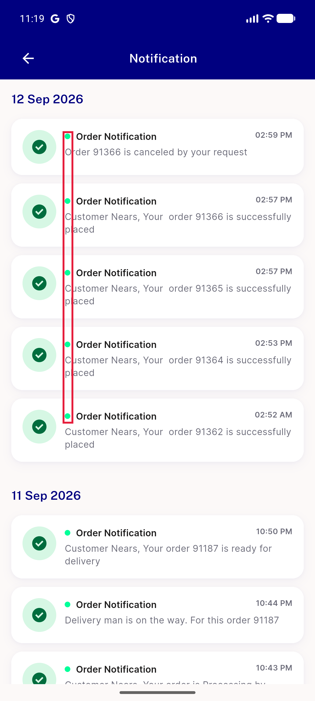</a> p17 NT5 unread dot on every item full</td>
</tr>
<tr>
<td align="center" width="33%"> p17 NT6 title singular crop</td>
<td align="center" width="33%"><a href="p17-NT6-title-singular__full.png">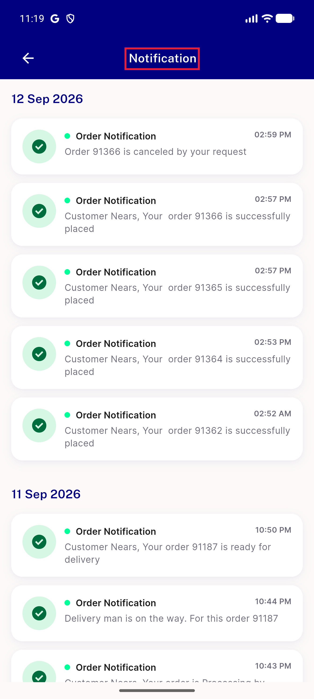</a> p17 NT6 title singular full</td>
<td align="center" width="33%"><a href="p17-overview-notifications-scrolled.png">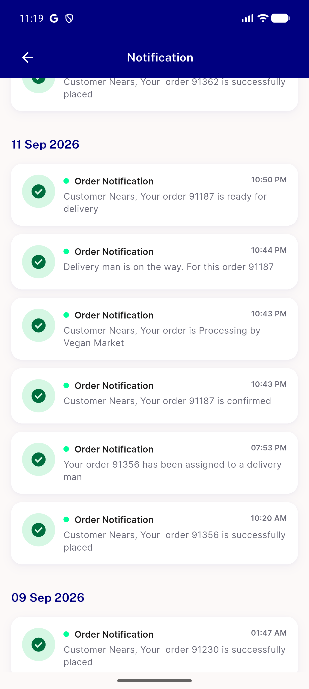</a> p17 overview notifications scrolled</td>
</tr>
<tr>
<td align="center" width="33%"><a href="p17-overview-notifications.png">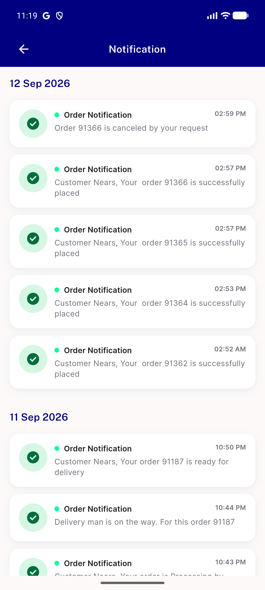</a> p17 overview notifications</td>
</tr>
</table>

---
*From `nears/docs/qa-evidence/NEARS-3638/` · public-repo scrub policy (no live secrets; verified clean).*
