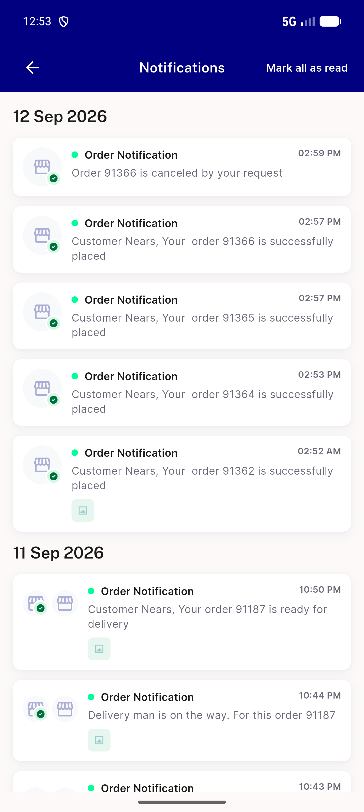
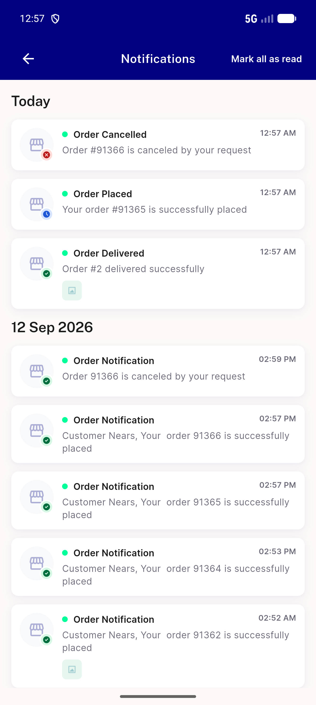
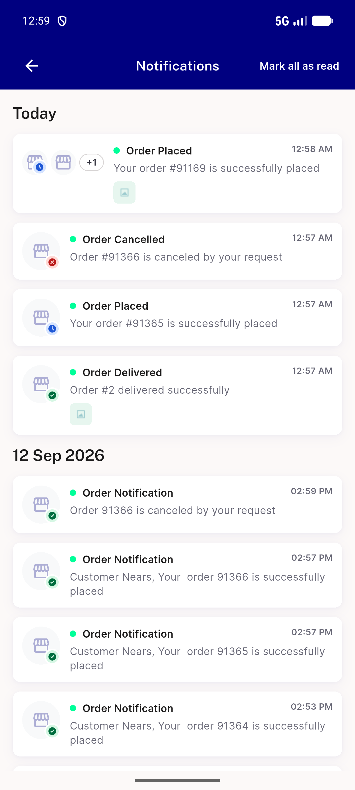
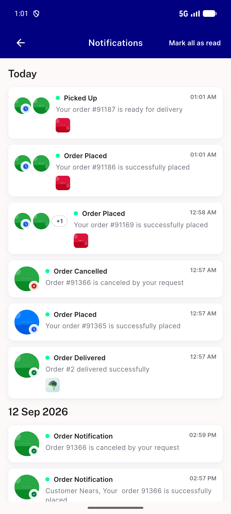
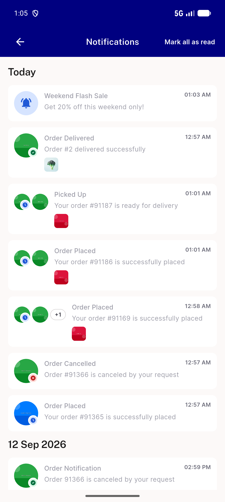
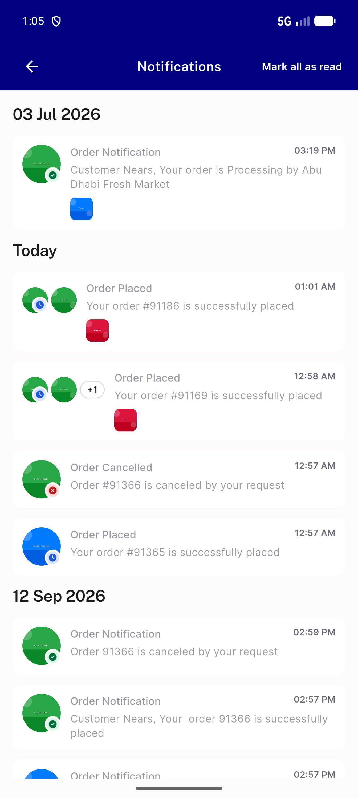

# QA Evidence — NEARS-3638

**QA FAIL — NT1 backfill regression + AC-ANALYTICS gaps (NT2-NT7/AC-DLS/AC-SHARED pass)**

**23 screenshot(s).** Click any thumbnail for full resolution.

<table>
<tr>
<td align="center" width="33%"> nt list existing notifications</td>
<td align="center" width="33%"> nt1 fresh notifications tone</td>
<td align="center" width="33%"> nt4 multistore thumbnails</td>
</tr>
<tr>
<td align="center" width="33%"> nt4 real item thumbnails</td>
<td align="center" width="33%"> nt5 mark all read</td>
<td align="center" width="33%"> nt5 persistence fresh session</td>
</tr>
<tr>
<td align="center" width="33%"> nt7 sheet close icon</td>
<td align="center" width="33%"> p17 NT1 cancellation shown with success tick crop</td>
<td align="center" width="33%"> p17 NT1 cancellation shown with success tick full</td>
</tr>
<tr>
<td align="center" width="33%"> p17 NT1 every title order notification crop</td>
<td align="center" width="33%"> p17 NT1 every title order notification full</td>
<td align="center" width="33%"> p17 NT2 broken grammar delivery man crop</td>
</tr>
<tr>
<td align="center" width="33%"> p17 NT2 broken grammar delivery man full</td>
<td align="center" width="33%"> p17 NT2 double space name prefix crop</td>
<td align="center" width="33%"> p17 NT2 double space name prefix full</td>
</tr>
<tr>
<td align="center" width="33%"> p17 NT3 sheet repeats text crop</td>
<td align="center" width="33%"> p17 NT3 sheet repeats text full</td>
<td align="center" width="33%"> p17 NT5 unread dot on every item crop</td>
</tr>
<tr>
<td align="center" width="33%"> p17 NT5 unread dot on every item full</td>
<td align="center" width="33%"> p17 NT6 title singular crop</td>
<td align="center" width="33%"> p17 NT6 title singular full</td>
</tr>
<tr>
<td align="center" width="33%"> p17 overview notifications scrolled</td>
<td align="center" width="33%"> p17 overview notifications</td>
</tr>
</table>

---
*From `nears/docs/qa-evidence/NEARS-3638/` · public-repo scrub policy (no live secrets; verified clean).*
