# QA Evidence — NEARS-3639

**FAIL — 2 task_bugs (language_changed analytics event never fires; Order-updates/Offers rows a11y doubled node), all other ACs demonstrated live PASS**

**17 screenshot(s).** Click any thumbnail for full resolution.

<table>
<tr>
<td align="center" width="33%"><a href="AC-LOG-natural-backend-crash-revert.png">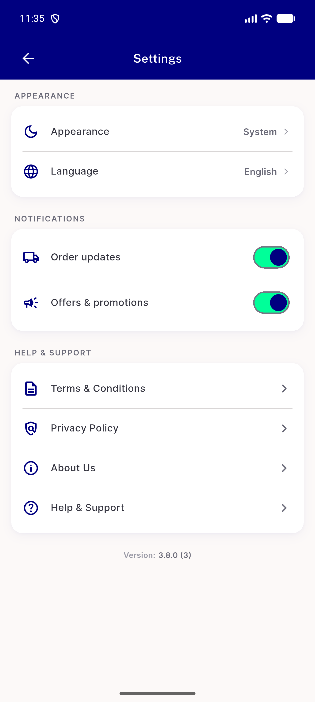</a> AC LOG natural backend crash revert</td>
<td align="center" width="33%"><a href="RTL-settings-page-arabic.png">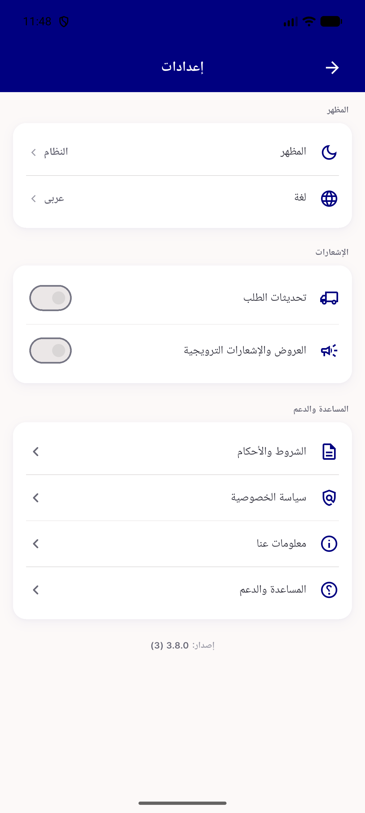</a> RTL settings page arabic</td>
<td align="center" width="33%"><a href="ST0-update-profile-change-password-delete-account.png">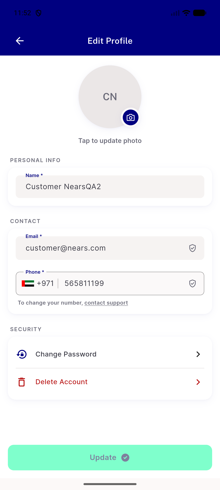</a> ST0 update profile change password delete account</td>
</tr>
<tr>
<td align="center" width="33%"> ST1 SEC1 after relaunch both off</td>
<td align="center" width="33%"><a href="ST1-SEC1-before-forceclose-both-off.png">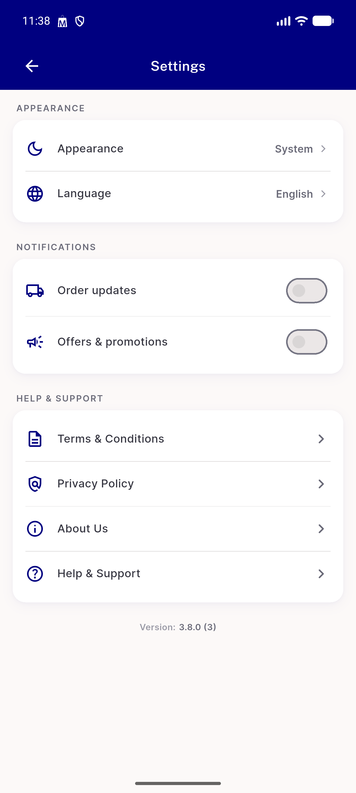</a> ST1 SEC1 before forceclose both off</td>
<td align="center" width="33%"><a href="ST1-SEC1-no-push-received-settings-screen.png">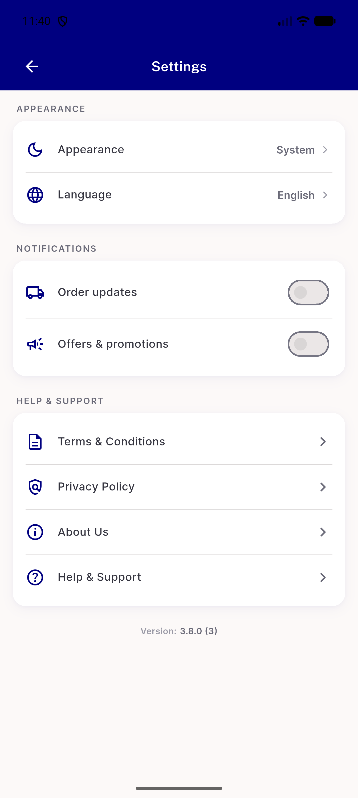</a> ST1 SEC1 no push received settings screen</td>
</tr>
<tr>
<td align="center" width="33%"> ST1 SEC3 fresh install server sync</td>
<td align="center" width="33%"><a href="ST1-offers-off-order-push-still-arrives.png">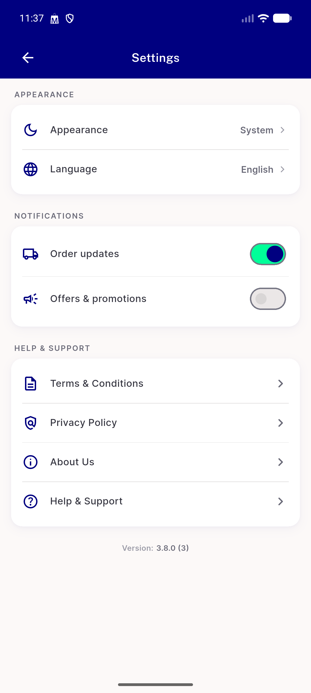</a> ST1 offers off order push still arrives</td>
<td align="center" width="33%"> ST2 explicit dark with os light</td>
</tr>
<tr>
<td align="center" width="33%"> ST2 secondcoldboot still system</td>
<td align="center" width="33%"><a href="ST2-system-follows-os-dark-live.png">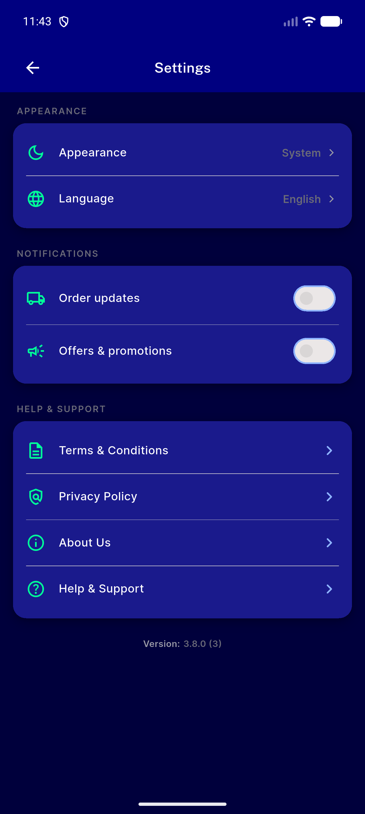</a> ST2 system follows os dark live</td>
<td align="center" width="33%"><a href="ST3-ST4-language-sheet-arabic-selected-update-enabled.png">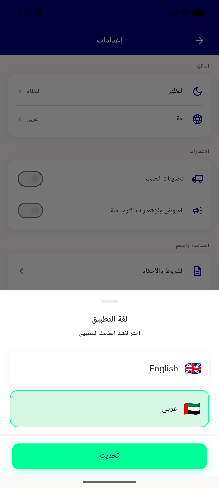</a> ST3 ST4 language sheet arabic selected update enabled</td>
</tr>
<tr>
<td align="center" width="33%"><a href="ST3-first-run-language-list.png">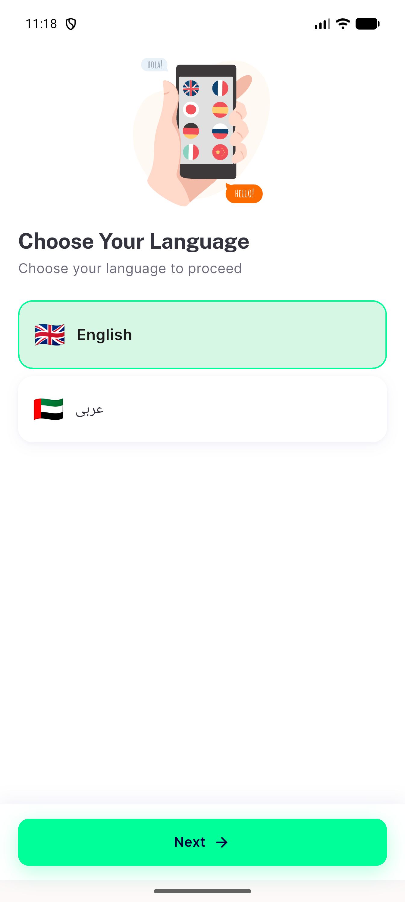</a> ST3 first run language list</td>
<td align="center" width="33%"><a href="ST6-menu-screen-support-group-no-duplication.png">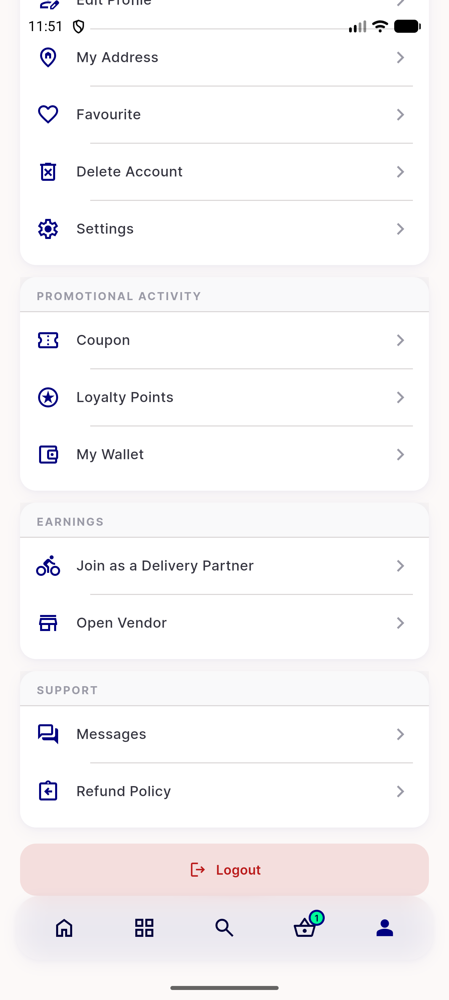</a> ST6 menu screen support group no duplication</td>
<td align="center" width="33%"><a href="legacy-profile-screen-notification-row.png">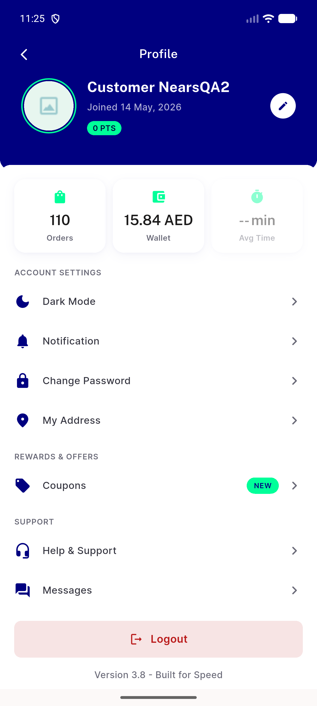</a> legacy profile screen notification row</td>
</tr>
<tr>
<td align="center" width="33%"><a href="os-permission-denied-routes-to-os-settings.png">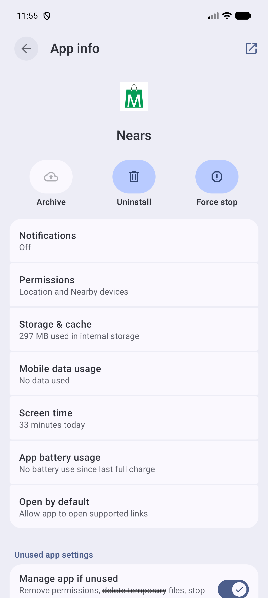</a> os permission denied routes to os settings</td>
<td align="center" width="33%"><a href="overview-settings-page.png">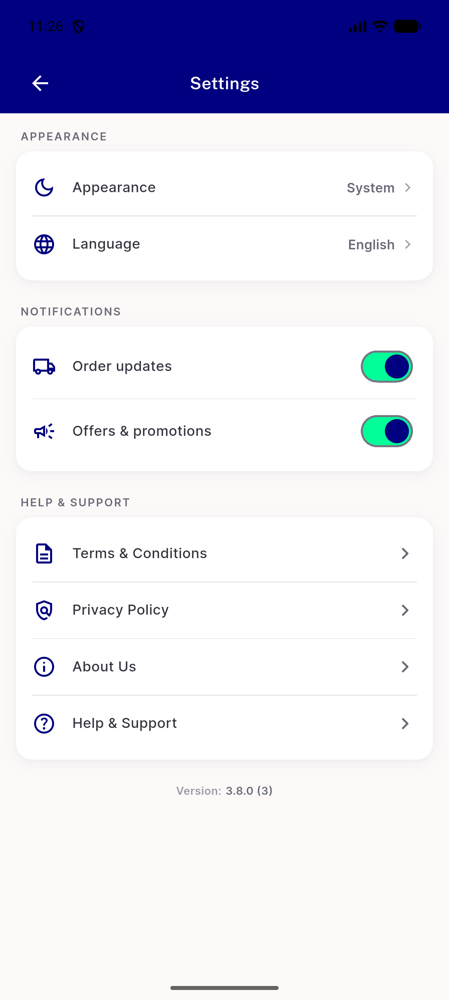</a> overview settings page</td>
</tr>
</table>

### Other artifacts
- [`RTL-settings-a11y-dump.xml`](RTL-settings-a11y-dump.xml)
- [`ST1-SEC1-after-relaunch-a11y-dump.xml`](ST1-SEC1-after-relaunch-a11y-dump.xml)
- [`ST1-SEC3-fresh-install-server-sync-a11y-dump.xml`](ST1-SEC3-fresh-install-server-sync-a11y-dump.xml)
- [`ST2-secondcoldboot-still-system-a11y-dump.xml`](ST2-secondcoldboot-still-system-a11y-dump.xml)
- [`bug-language-changed-event-never-fires.log`](bug-language-changed-event-never-fires.log)
- [`bug-order-updates-row-doubled-a11y-node.log`](bug-order-updates-row-doubled-a11y-node.log)
- [`settings-page-a11y-dump.xml`](settings-page-a11y-dump.xml)

---
*From `nears/docs/qa-evidence/NEARS-3639/` · public-repo scrub policy (no live secrets; verified clean).*
