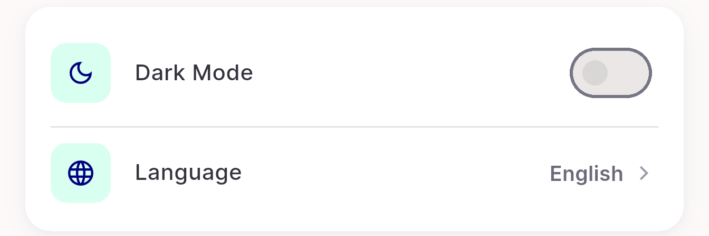
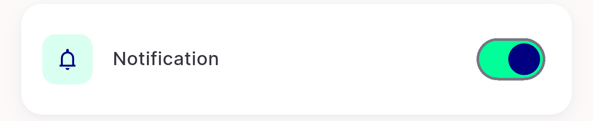
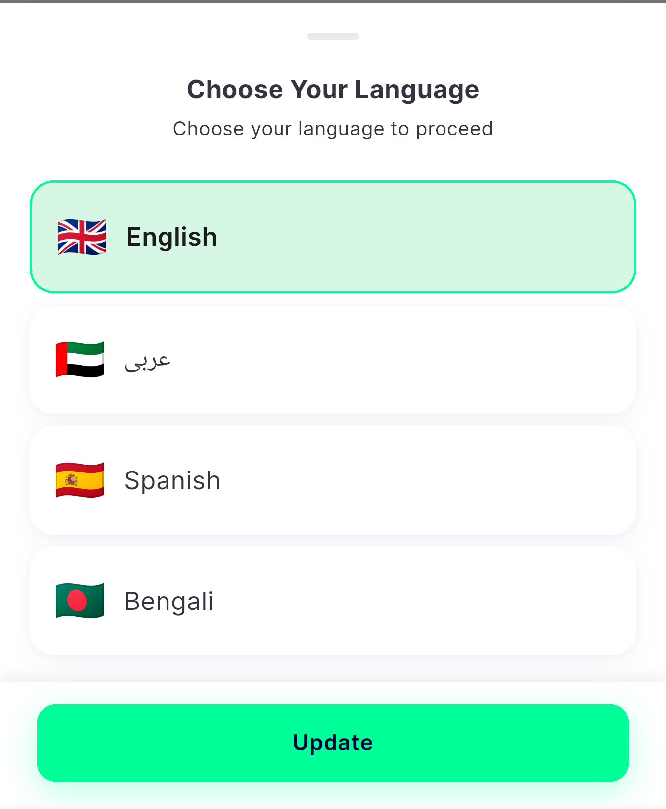
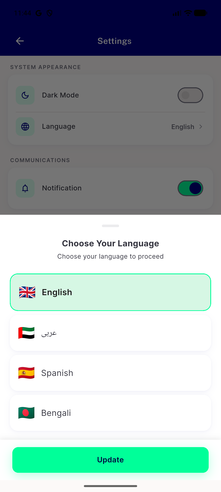
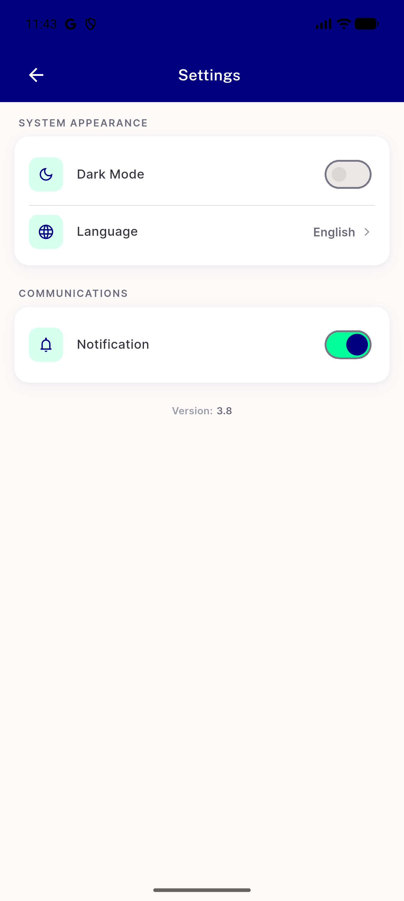

# QA Evidence — NEARS-3639

**Human QA — Settings: modernise DLS settings row + notification switch kills order updates**

**9 screenshot(s).** Click any thumbnail for full resolution.

<table>
<tr>
<td align="center" width="33%"> p18 ST0 legacy row style crop</td>
<td align="center" width="33%"> p18 ST1 notification switch crop</td>
<td align="center" width="33%"> p18 ST2 dark mode onoff only crop</td>
</tr>
<tr>
<td align="center" width="33%"> p18 ST3 incomplete languages crop</td>
<td align="center" width="33%"> p18 ST4 language sheet copy crop</td>
<td align="center" width="33%"> p18 ST5 version hardcoded crop</td>
</tr>
<tr>
<td align="center" width="33%"> p18 ST6 labels empty page crop</td>
<td align="center" width="33%"> p18 overview language sheet full</td>
<td align="center" width="33%"> p18 overview settings full</td>
</tr>
</table>

---
*From `nears/docs/qa-evidence/NEARS-3639/` · public-repo scrub policy (no live secrets; verified clean).*
