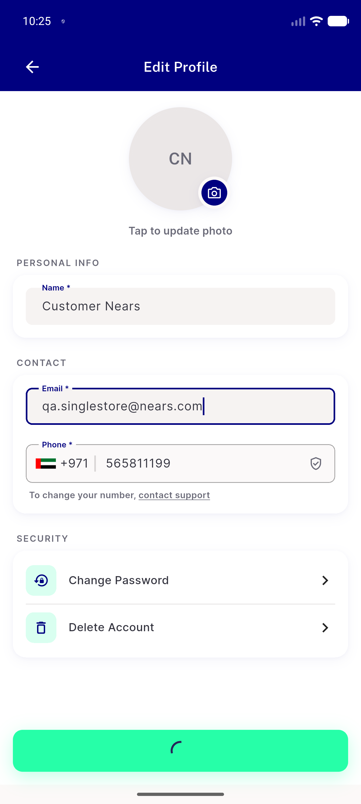
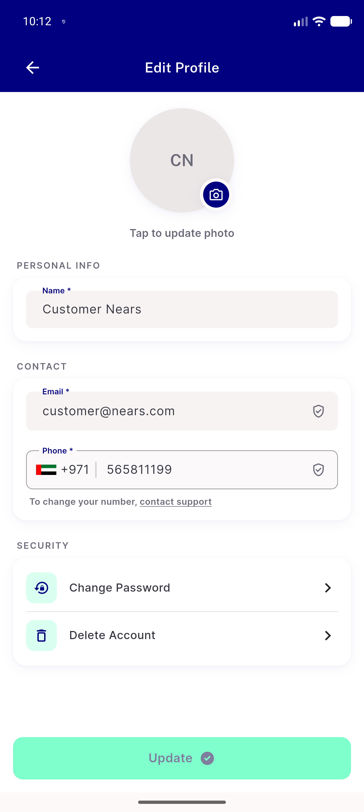
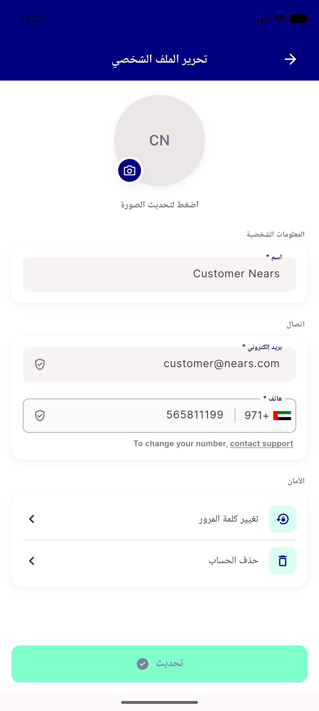
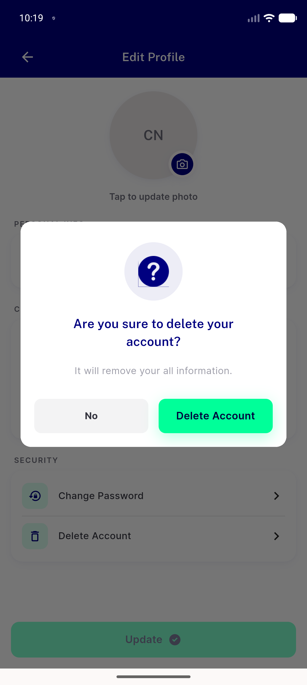
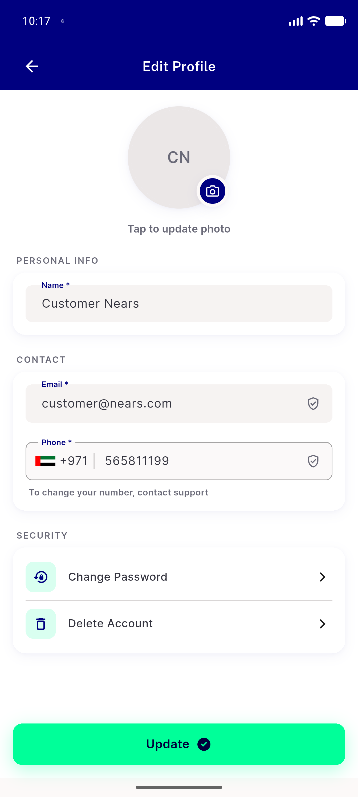
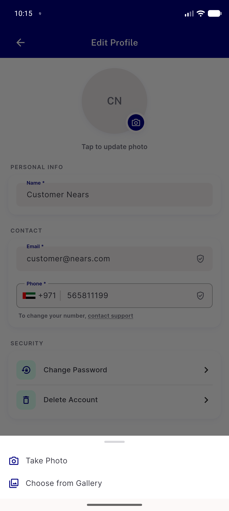
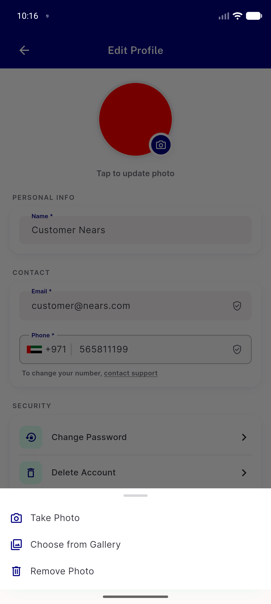
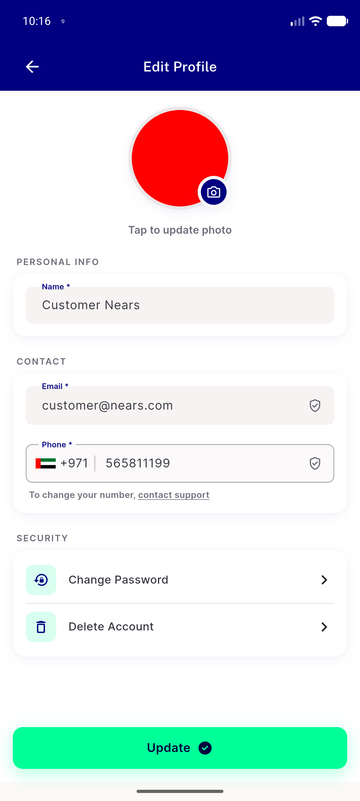

# QA Evidence — NEARS-3640

**FAIL — 2 task_bugs (breaks_ac: EP2 Save success/failure paths), all other ACs demonstrated live**

**14 screenshot(s).** Click any thumbnail for full resolution.

<table>
<tr>
<td align="center" width="33%"> bug update stuck loading</td>
<td align="center" width="33%"> ep0 ep1 ep6 ep7 overview</td>
<td align="center" width="33%"> ep0 rtl arabic</td>
</tr>
<tr>
<td align="center" width="33%"> ep1 delete account confirm dialog</td>
<td align="center" width="33%"> ep6 after remove photo staged</td>
<td align="center" width="33%"> ep6 avatar sheet 2row no photo</td>
</tr>
<tr>
<td align="center" width="33%"> ep6 avatar sheet 3row with photo</td>
<td align="center" width="33%"> ep6 photo staged preview</td>
<td align="center" width="33%"> p19 EP0 change password row crop</td>
</tr>
<tr>
<td align="center" width="33%"> p19 EP0 header avatar crop</td>
<td align="center" width="33%"> p19 EP1 overflow menu crop</td>
<td align="center" width="33%"> p19 EP2 update button crop</td>
</tr>
<tr>
<td align="center" width="33%"> p19 EP4 fields crop</td>
<td align="center" width="33%"> p19 overview edit profile full</td>
</tr>
</table>

### Other artifacts
- [`bug-save-permanently-stuck-loading.log`](bug-save-permanently-stuck-loading.log)
- [`bug-save-success-popscope-reentrancy.log`](bug-save-success-popscope-reentrancy.log)
- [`ep9-a11y-dump.xml`](ep9-a11y-dump.xml)
- [`regression-firebase-uncaught-during-address-and-login.log`](regression-firebase-uncaught-during-address-and-login.log)
- [`regression-profile-repository-null-body-crash.log`](regression-profile-repository-null-body-crash.log)

---
*From `nears/docs/qa-evidence/NEARS-3640/` · public-repo scrub policy (no live secrets; verified clean).*
