# QA Evidence — NEARS-3641

**PASS (cycle-2 delta) — TB1-TB5 re-verified live on emulator-5554, all fixes confirmed**

**23 screenshot(s).** Click any thumbnail for full resolution.

<table>
<tr>
<td align="center" width="33%"><a href="bug-naddresscard-blank-semantics.png">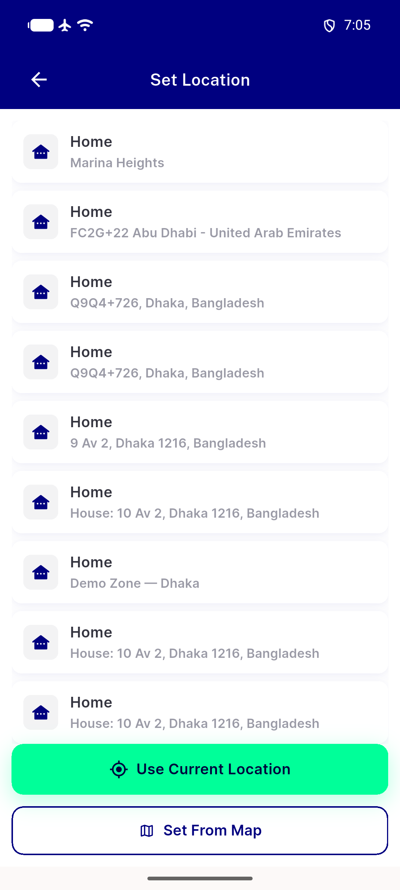</a> bug naddresscard blank semantics</td>
<td align="center" width="33%"> bug plus code via stale last known fallback</td>
<td align="center" width="33%"><a href="cyc2-TB1-access-location-list-fixed.png">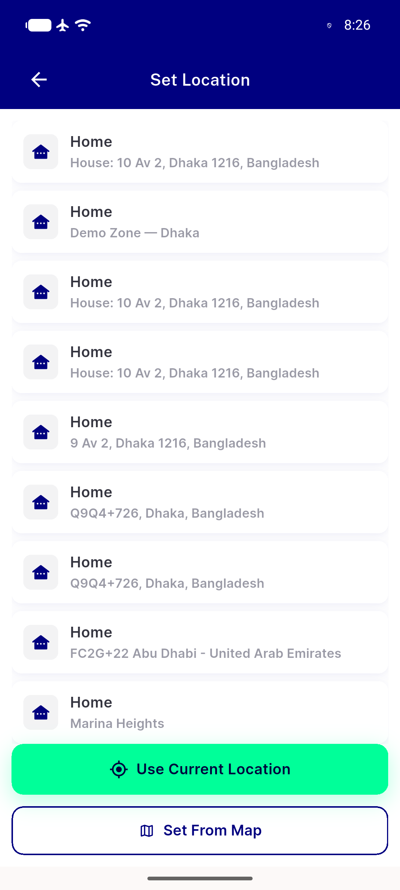</a> cyc2 TB1 access location list fixed</td>
</tr>
<tr>
<td align="center" width="33%"><a href="cyc2-TB2-staleLastKnown-real-address.png">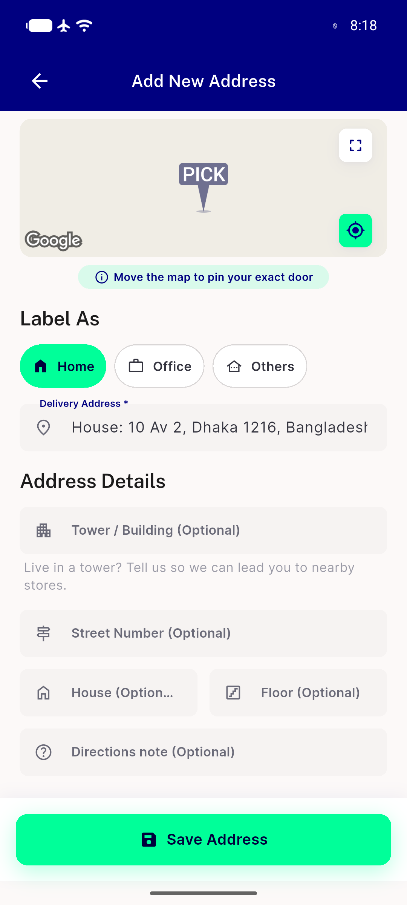</a> cyc2 TB2 staleLastKnown real address</td>
<td align="center" width="33%"><a href="cyc2-TB5-checkout-thumb-pencil.png">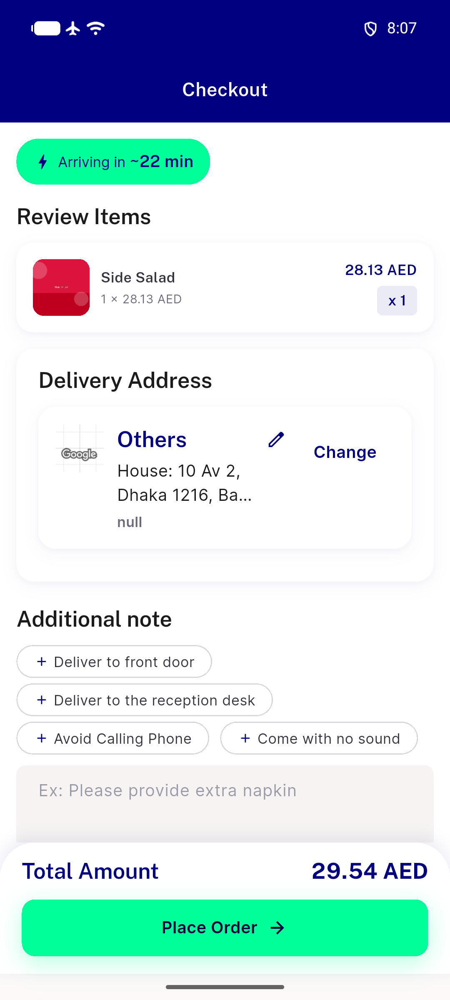</a> cyc2 TB5 checkout thumb pencil</td>
<td align="center" width="33%"><a href="p20-AD0-contact-details__crop.png">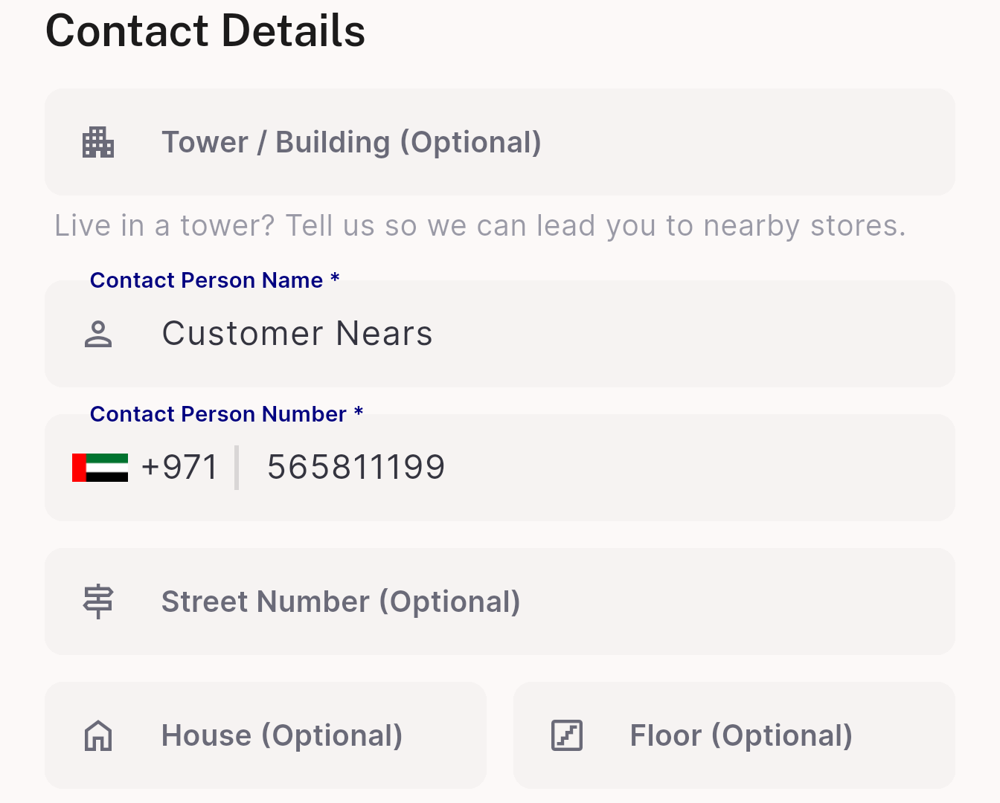</a> p20 AD0 contact details crop</td>
</tr>
<tr>
<td align="center" width="33%"> p20 AD0 header crop</td>
<td align="center" width="33%"> p20 AD0 quick action banner crop</td>
<td align="center" width="33%"> p20 AD0 save button crop</td>
</tr>
<tr>
<td align="center" width="33%"> p20 AD1 delivery address field crop</td>
<td align="center" width="33%"><a href="p20-AD2-duplicate-rows__crop.png">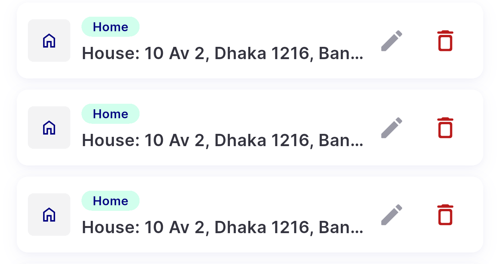</a> p20 AD2 duplicate rows crop</td>
<td align="center" width="33%"><a href="p20-AD4-all-rows__crop.png">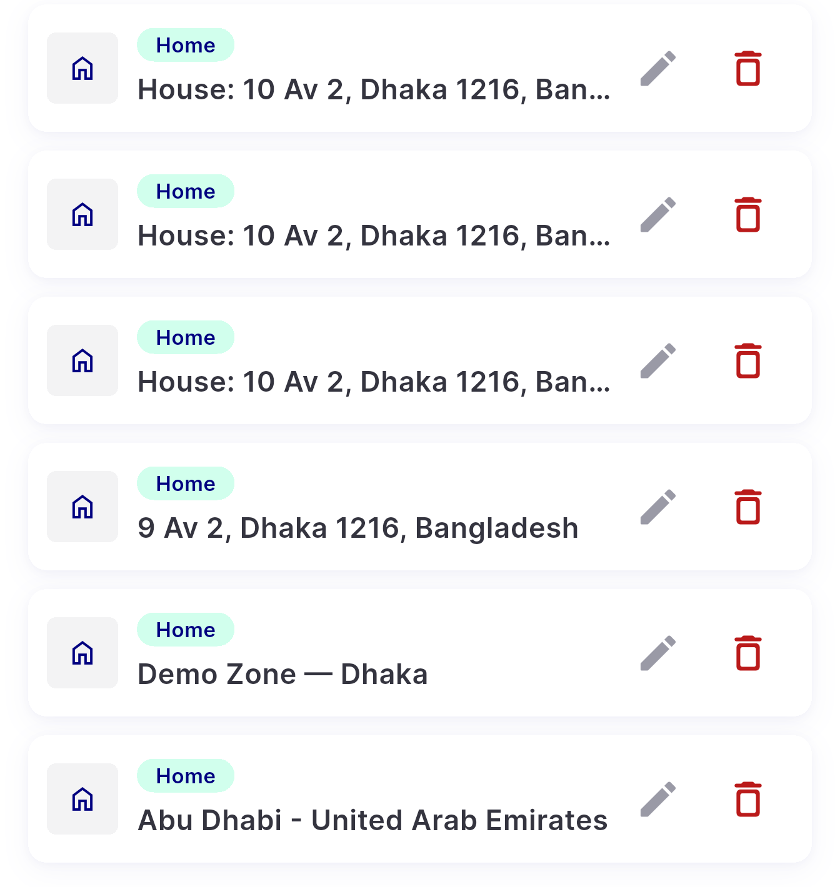</a> p20 AD4 all rows crop</td>
</tr>
<tr>
<td align="center" width="33%"><a href="p20-AD8-row-actions__crop.png">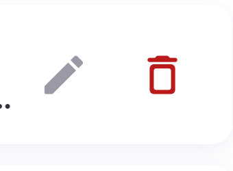</a> p20 AD8 row actions crop</td>
<td align="center" width="33%"><a href="p20-AD9-map__crop.png">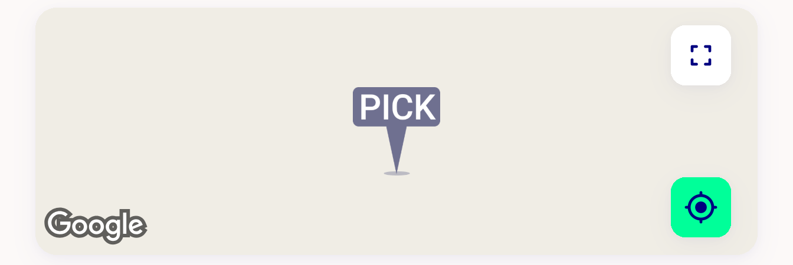</a> p20 AD9 map crop</td>
<td align="center" width="33%"><a href="p20-overview-add-address__full.png">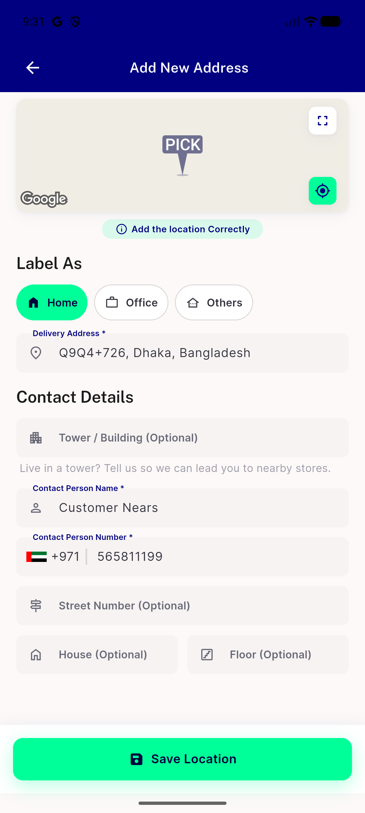</a> p20 overview add address full</td>
</tr>
<tr>
<td align="center" width="33%"><a href="p20-overview-my-address__full.png">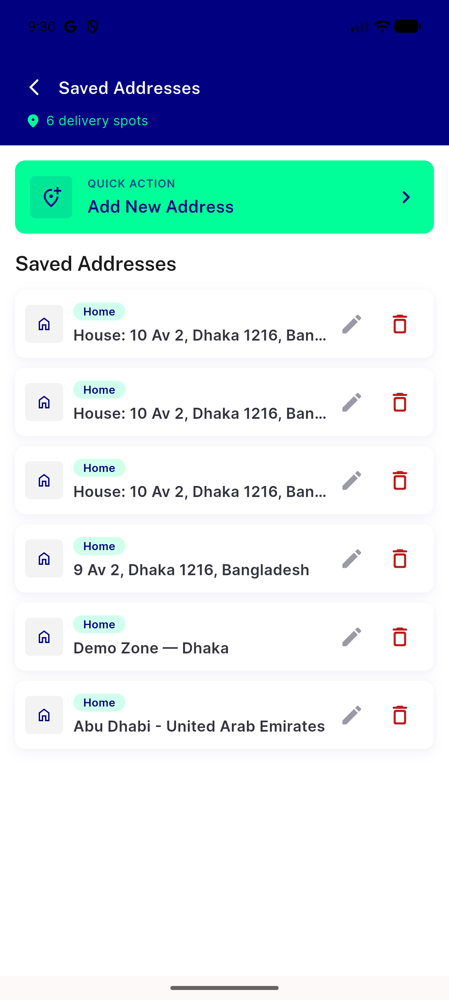</a> p20 overview my address full</td>
<td align="center" width="33%"> p38 edit 01 edit address</td>
<td align="center" width="33%"><a href="postfix-01-saved-addresses-en-ltr.png">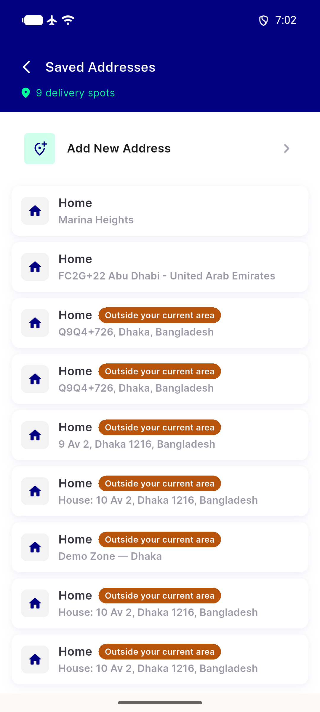</a> postfix 01 saved addresses en ltr</td>
</tr>
<tr>
<td align="center" width="33%"><a href="postfix-02-add-address-en-ltr.png">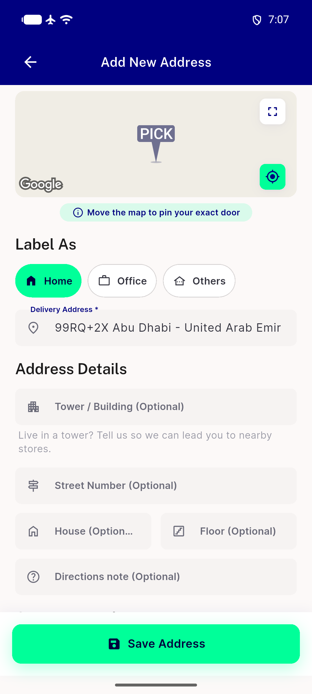</a> postfix 02 add address en ltr</td>
<td align="center" width="33%"><a href="postfix-03-edit-address-en-ltr.png">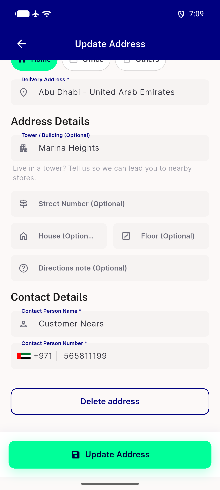</a> postfix 03 edit address en ltr</td>
<td align="center" width="33%"><a href="postfix-04-saved-addresses-ar-rtl.png">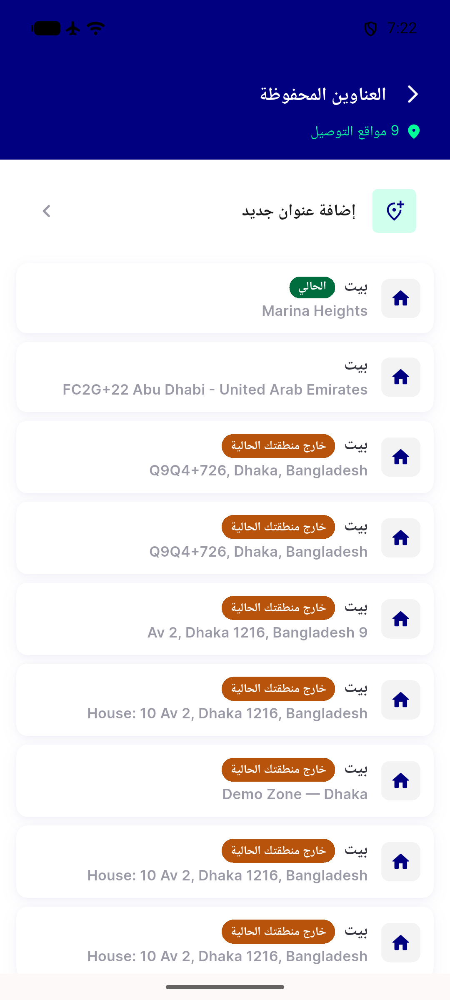</a> postfix 04 saved addresses ar rtl</td>
</tr>
<tr>
<td align="center" width="33%"> postfix 05 add address ar rtl</td>
<td align="center" width="33%"> postfix 06 edit address ar rtl</td>
</tr>
</table>

### Other artifacts
- [`bug-address-display-save-desync.log`](bug-address-display-save-desync.log)
- [`bug-analytics-params-mismatch.log`](bug-analytics-params-mismatch.log)
- [`bug-delivery-section-broken-tests.log`](bug-delivery-section-broken-tests.log)
- [`bug-naddresscard-blank-semantics-dump.xml`](bug-naddresscard-blank-semantics-dump.xml)
- [`bug-plus-code-via-stale-last-known-fallback.log`](bug-plus-code-via-stale-last-known-fallback.log)
- [`cyc2-TB2-staleLastKnown-log.log`](cyc2-TB2-staleLastKnown-log.log)
- [`cyc2-TB3-position-desync-fixed.log`](cyc2-TB3-position-desync-fixed.log)
- [`cyc2-TB4-analytics-full-params.log`](cyc2-TB4-analytics-full-params.log)
- [`cyc2-a11y-access-location-list-dump.xml`](cyc2-a11y-access-location-list-dump.xml)
- [`cyc2-a11y-checkout-changesheet-dump.xml`](cyc2-a11y-checkout-changesheet-dump.xml)
- [`cyc2-a11y-checkout-desktop-collapsed-strip-dump.xml`](cyc2-a11y-checkout-desktop-collapsed-strip-dump.xml)
- [`cyc2-a11y-checkout-summary-dump.xml`](cyc2-a11y-checkout-summary-dump.xml)
- [`cyc2-a11y-myaddress-dump.xml`](cyc2-a11y-myaddress-dump.xml)
- [`cyc2-a11y-tb3-dedupe-dump.xml`](cyc2-a11y-tb3-dedupe-dump.xml)
- [`regression-candidate-cart-item-widget-overflow.log`](regression-candidate-cart-item-widget-overflow.log)

---
*From `nears/docs/qa-evidence/NEARS-3641/` · public-repo scrub policy (no live secrets; verified clean).*
