# QA Evidence — NEARS-3643

**Delta re-QA PASS (fix-cycle 4, HEAD baa56c41f) — TB1/TB2 PASS, TB3 unverifiable (dead-code reachability), RB1/RB2 PASS**

**22 screenshot(s).** Click any thumbnail for full resolution.

<table>
<tr>
<td align="center" width="33%"> CH chat thread 2</td>
<td align="center" width="33%"><a href="CH-chat-thread.png">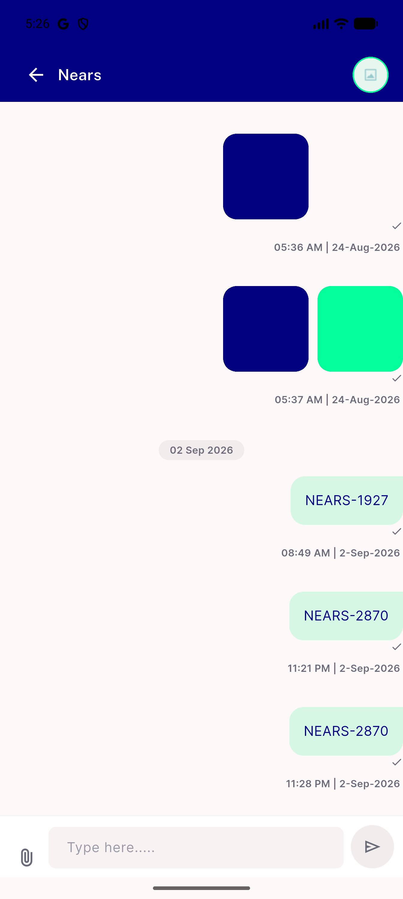</a> CH chat thread</td>
<td align="center" width="33%"><a href="CH4-composer-grown.png">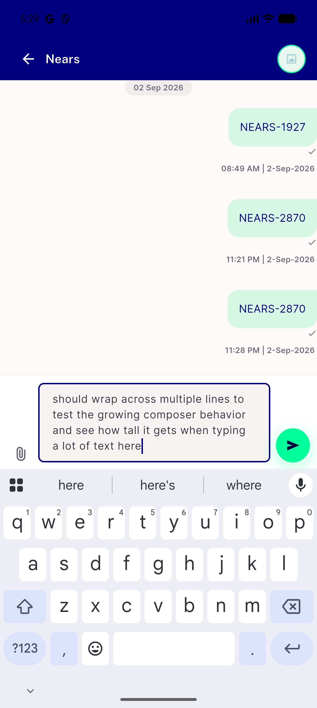</a> CH4 composer grown</td>
</tr>
<tr>
<td align="center" width="33%"><a href="CH4-desktop-composer.png">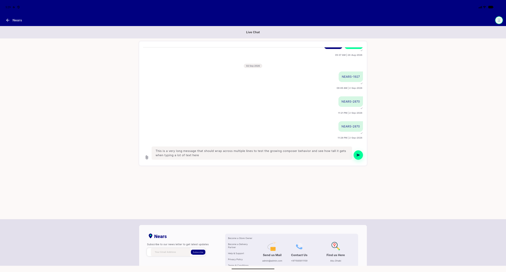</a> CH4 desktop composer</td>
<td align="center" width="33%"><a href="HS0-ar-rtl.png">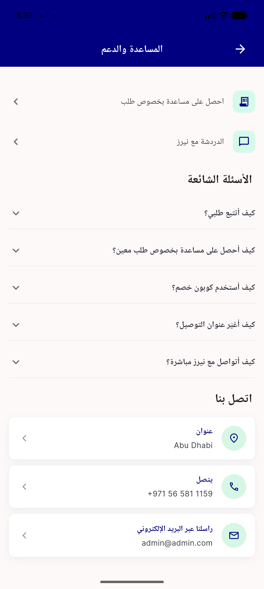</a> HS0 ar rtl</td>
<td align="center" width="33%"><a href="HS0-help-centre.png">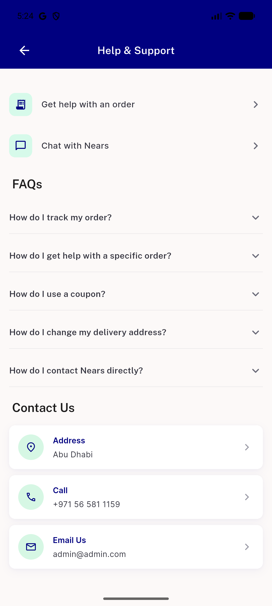</a> HS0 help centre</td>
</tr>
<tr>
<td align="center" width="33%"><a href="TN3-ar-rtl-conversation-list.png">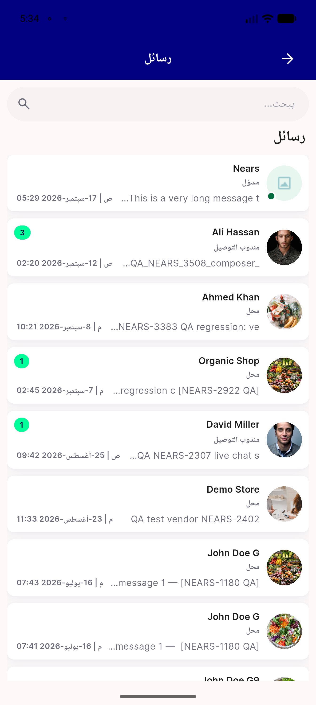</a> TN3 ar rtl conversation list</td>
<td align="center" width="33%"><a href="bug-menu-screen-two-help-entries.png">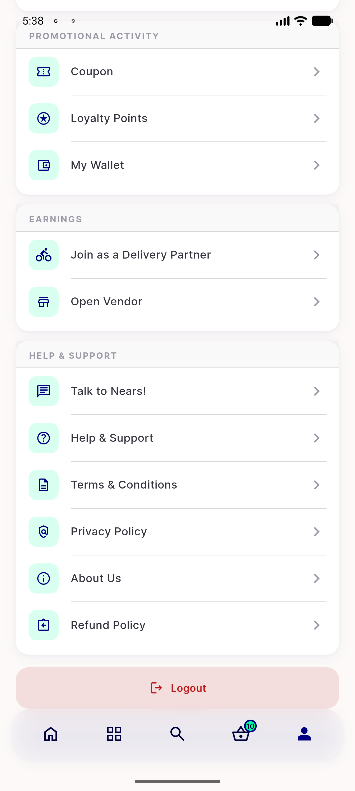</a> bug menu screen two help entries</td>
<td align="center" width="33%"><a href="bug-talk-to-nears-opens-generic-inbox.png">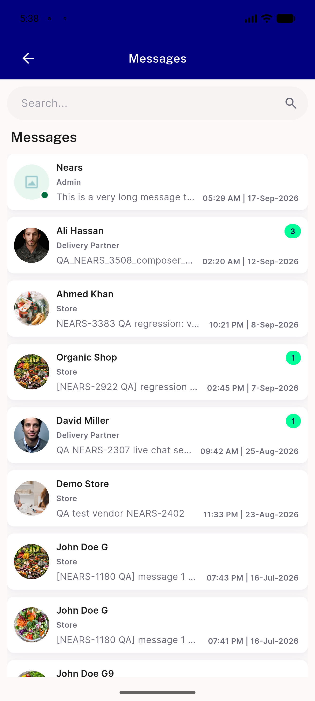</a> bug talk to nears opens generic inbox</td>
</tr>
<tr>
<td align="center" width="33%"><a href="p21-HS0-TN1-profile-section__crop.png">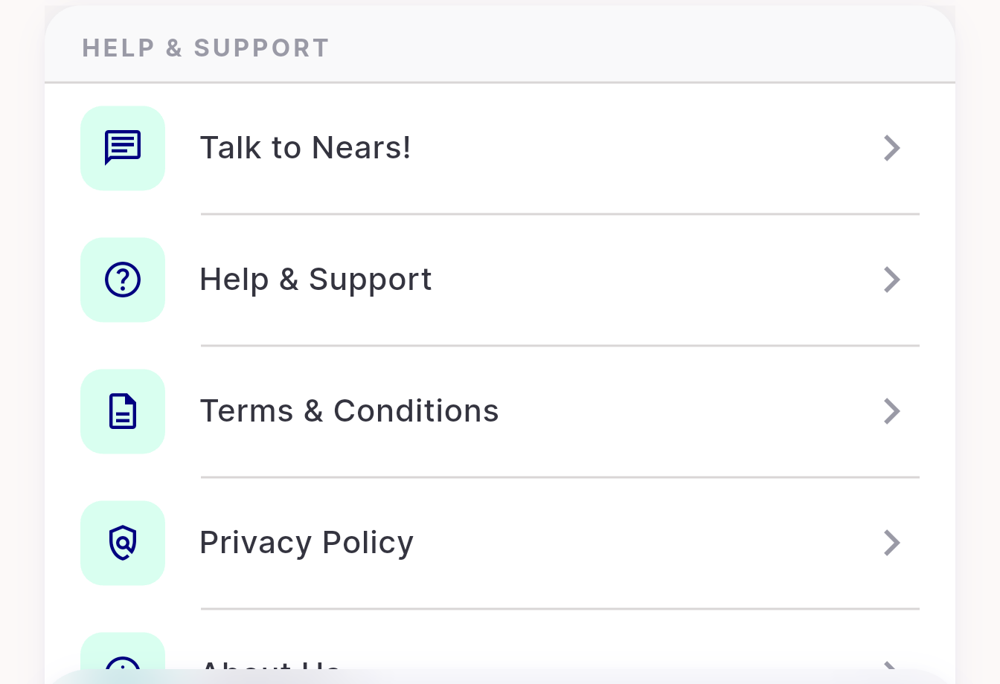</a> p21 HS0 TN1 profile section crop</td>
<td align="center" width="33%"><a href="p21-HS0-headset-title__crop.png">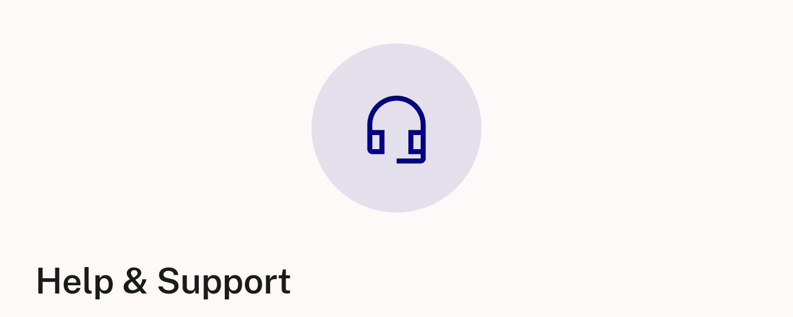</a> p21 HS0 headset title crop</td>
<td align="center" width="33%"><a href="p21-HS1-appbar__crop.png">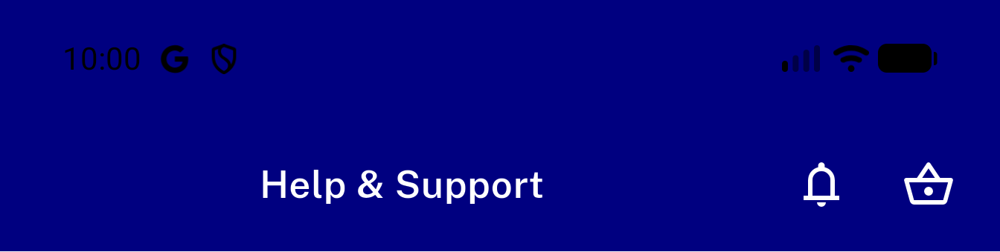</a> p21 HS1 appbar crop</td>
</tr>
<tr>
<td align="center" width="33%"><a href="p21-HS2-address-row__crop.png">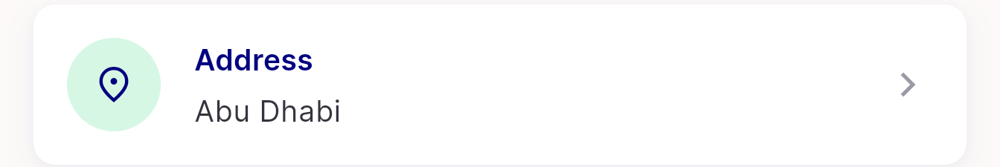</a> p21 HS2 address row crop</td>
<td align="center" width="33%"><a href="p21-HS3-contact-rows__crop.png">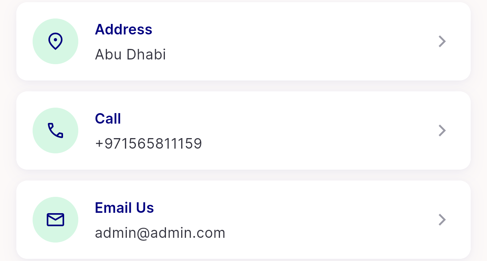</a> p21 HS3 contact rows crop</td>
<td align="center" width="33%"><a href="p21-TN1-TN3-admin-row__crop.png">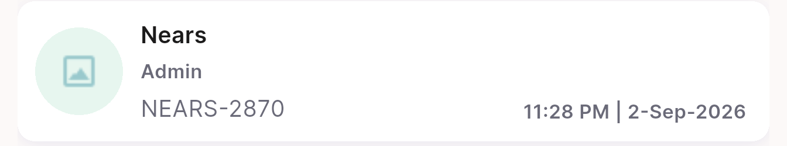</a> p21 TN1 TN3 admin row crop</td>
</tr>
<tr>
<td align="center" width="33%"><a href="p21-TN3-appbar-title__crop.png">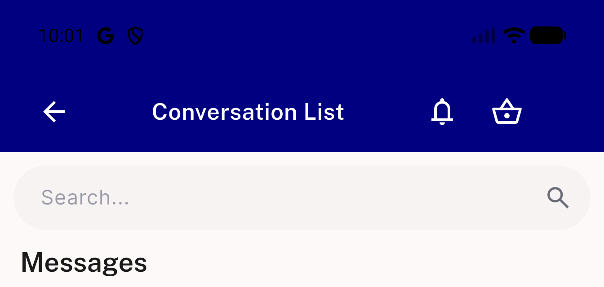</a> p21 TN3 appbar title crop</td>
<td align="center" width="33%"><a href="p21-overview-help-support__full.png">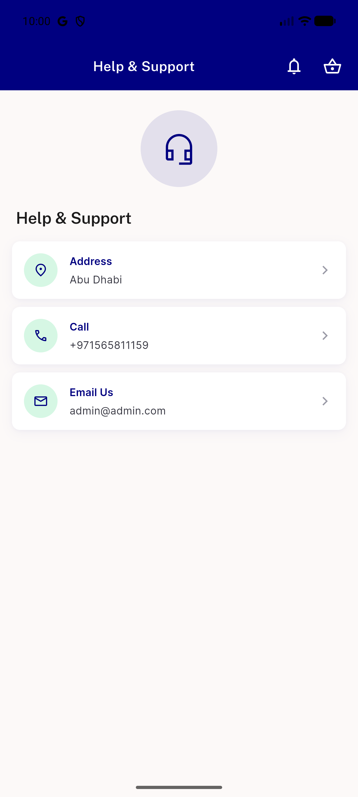</a> p21 overview help support full</td>
<td align="center" width="33%"><a href="p21-overview-profile-help-section__full.png">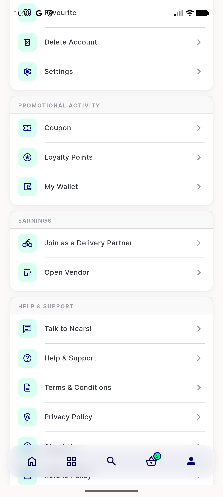</a> p21 overview profile help section full</td>
</tr>
<tr>
<td align="center" width="33%"><a href="p21-overview-talk-to-nears__full.png">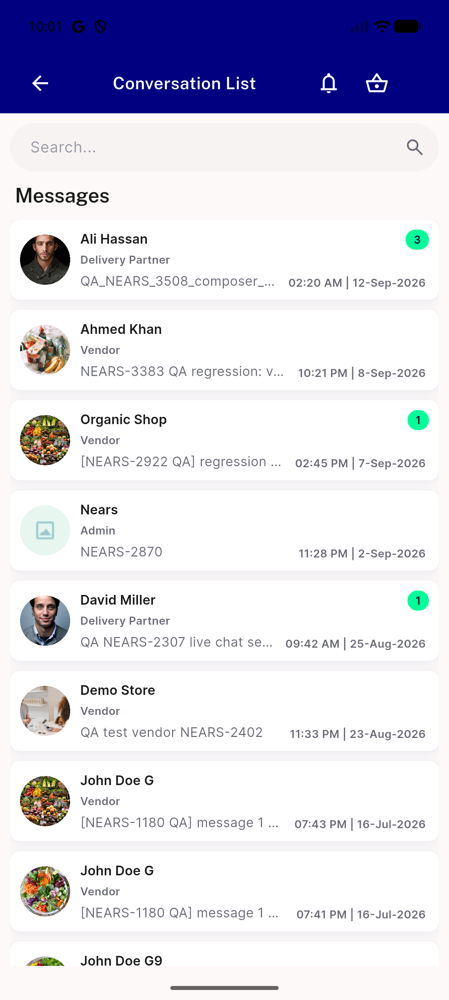</a> p21 overview talk to nears full</td>
<td align="center" width="33%"><a href="p32-chat-01-chat-thread.png">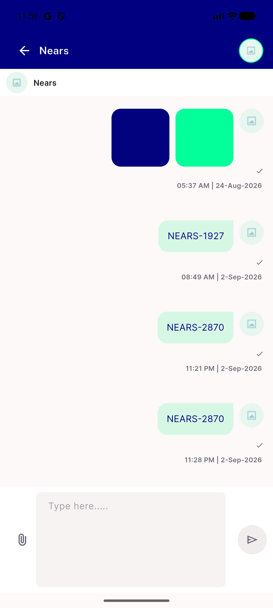</a> p32 chat 01 chat thread</td>
<td align="center" width="33%"><a href="rb1-broken-image-icon.png">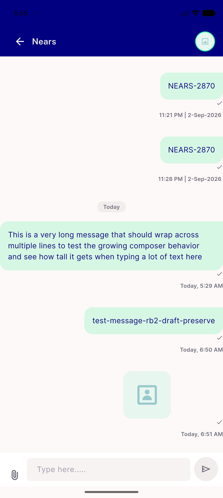</a> rb1 broken image icon</td>
</tr>
<tr>
<td align="center" width="33%"><a href="rb1-valid-image-loaded.png">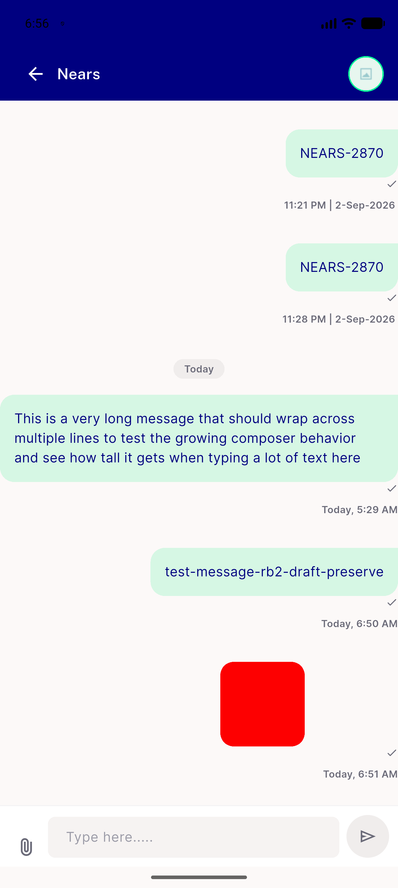</a> rb1 valid image loaded</td>
</tr>
</table>

### Other artifacts
- [`bug-about-us-route-test-stale-source-param.log`](bug-about-us-route-test-stale-source-param.log)
- [`bug-analytics-missing-context-block.log`](bug-analytics-missing-context-block.log)
- [`followup-firebase-uninitialized-aborts-async-chains.log`](followup-firebase-uninitialized-aborts-async-chains.log)
- [`tb3-conversation-list-unreachable.log`](tb3-conversation-list-unreachable.log)

---
*From `nears/docs/qa-evidence/NEARS-3643/` · public-repo scrub policy (no live secrets; verified clean).*
