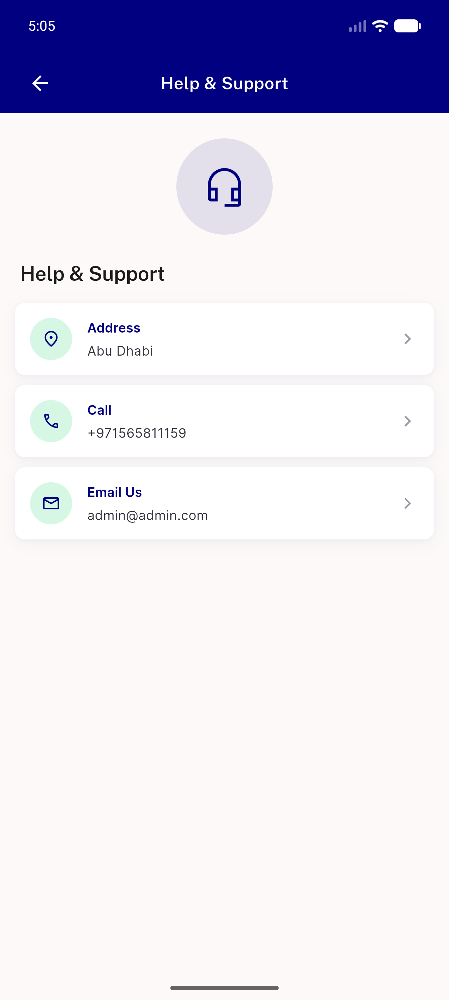
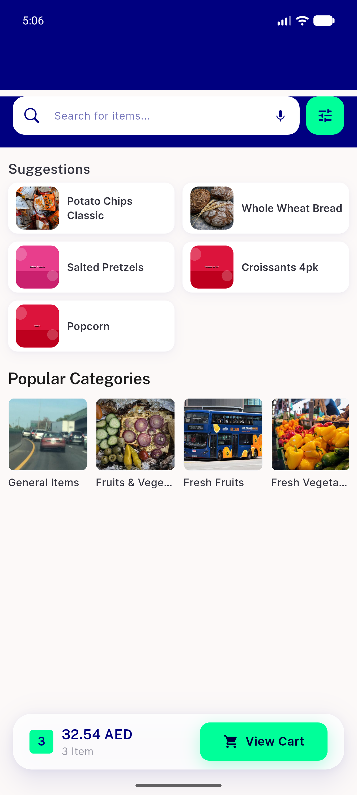
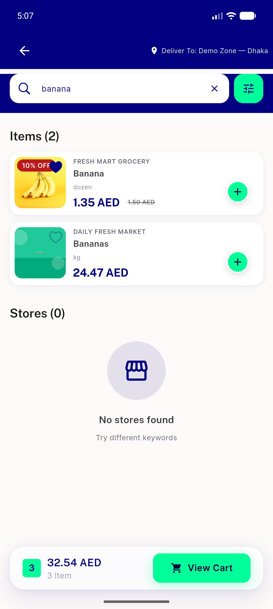
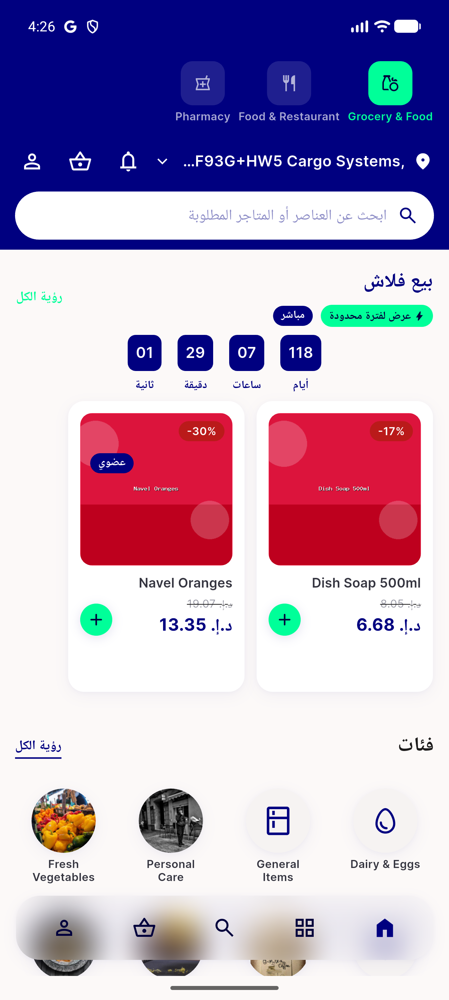
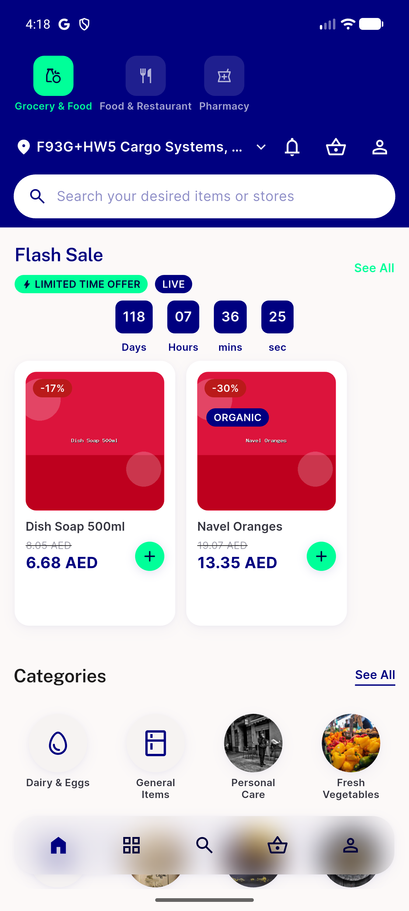
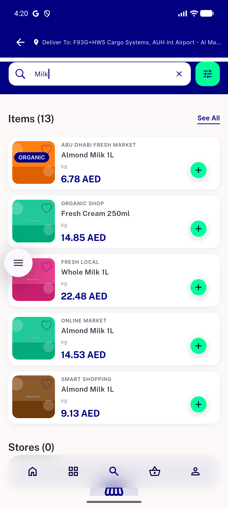
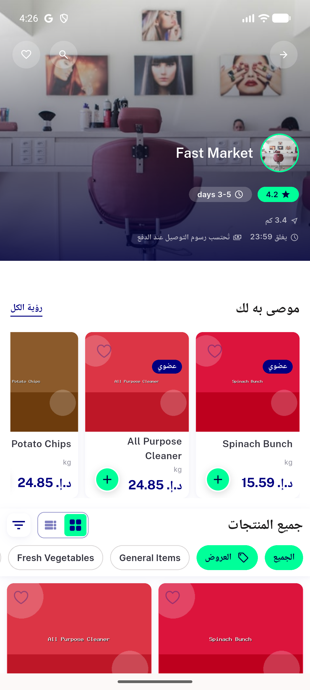
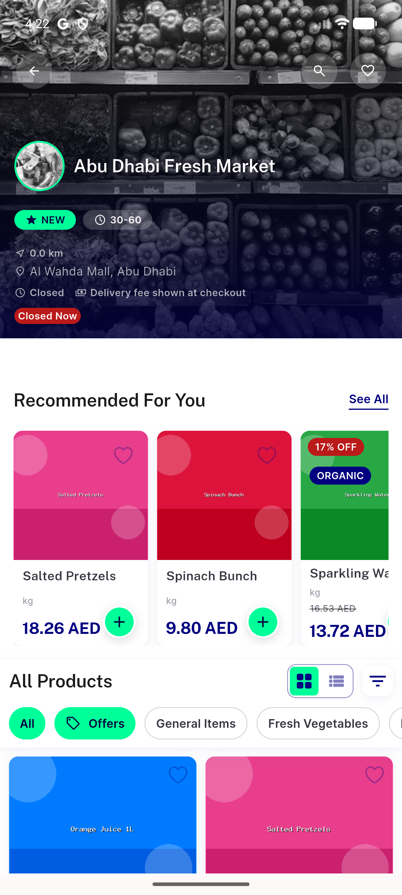
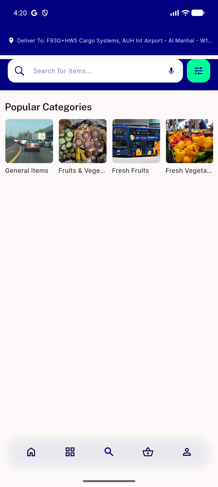
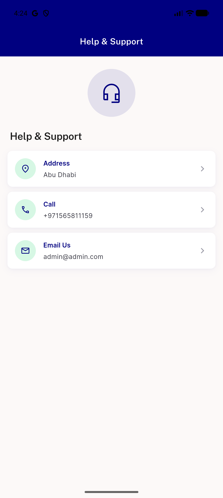

# QA Evidence — NEARS-3644

**Delta re-QA (fix cycle 1 of QA, cap 2): AB3/AB4/AC-ANALYTICS fixes verified live — PASS**

**10 screenshot(s).** Click any thumbnail for full resolution.

<table>
<tr>
<td align="center" width="33%"> AB3 support back affordance</td>
<td align="center" width="33%"> AB4 search idle no delivertoline</td>
<td align="center" width="33%"> AB4 search results delivertoline</td>
</tr>
<tr>
<td align="center" width="33%"> ac home ar rtl</td>
<td align="center" width="33%"> ac home en ltr</td>
<td align="center" width="33%"> ac search results state</td>
</tr>
<tr>
<td align="center" width="33%"> ac store ar rtl</td>
<td align="center" width="33%"> ac store closed grayscale</td>
<td align="center" width="33%"> bug search idle deliverto leak</td>
</tr>
<tr>
<td align="center" width="33%"> bug support screen missing back</td>
</tr>
</table>

### Other artifacts
- [`ac-analytics-home-basket.log`](ac-analytics-home-basket.log)
- [`ac-log-warn-unwired-settings.log`](ac-log-warn-unwired-settings.log)
- [`ac-shared-grep-result.txt`](ac-shared-grep-result.txt)
- [`bug-analytics-search-missing-moduleid.log`](bug-analytics-search-missing-moduleid.log)
- [`bug-analytics-store-missing-moduleid.log`](bug-analytics-store-missing-moduleid.log)
- [`bug-support-screen-missing-back-dump.xml`](bug-support-screen-missing-back-dump.xml)
- [`fix-cycle2-analytics-moduleid-confirmed.log`](fix-cycle2-analytics-moduleid-confirmed.log)

---
*From `nears/docs/qa-evidence/NEARS-3644/` · public-repo scrub policy (no live secrets; verified clean).*
