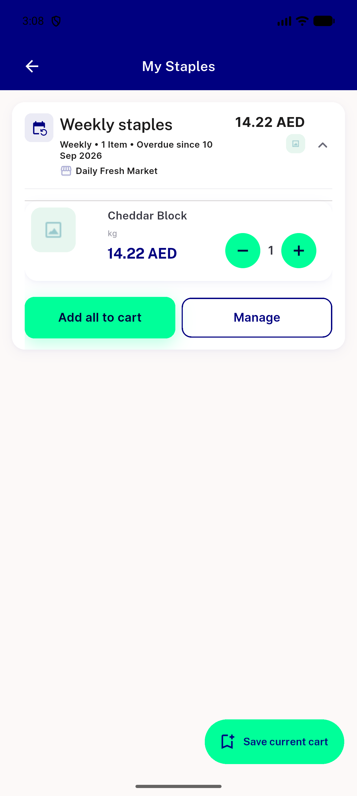
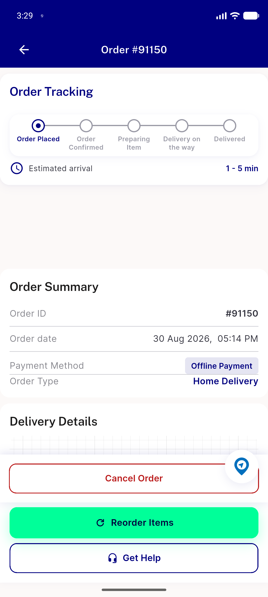
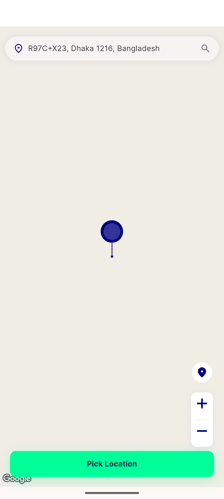
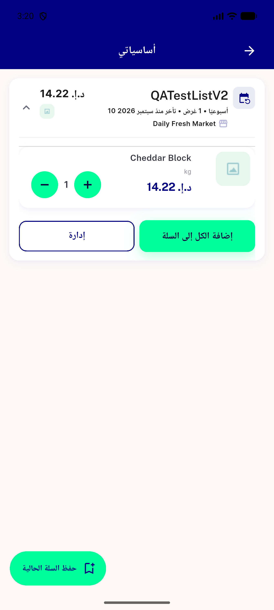
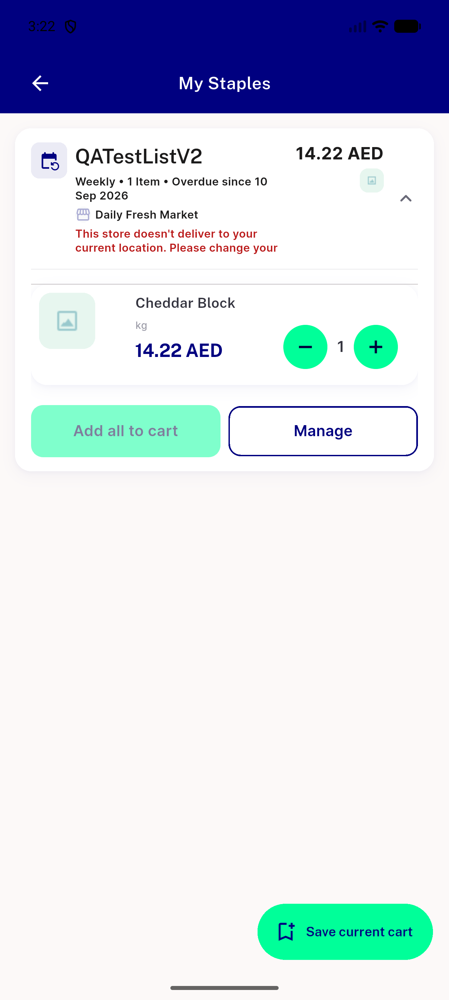
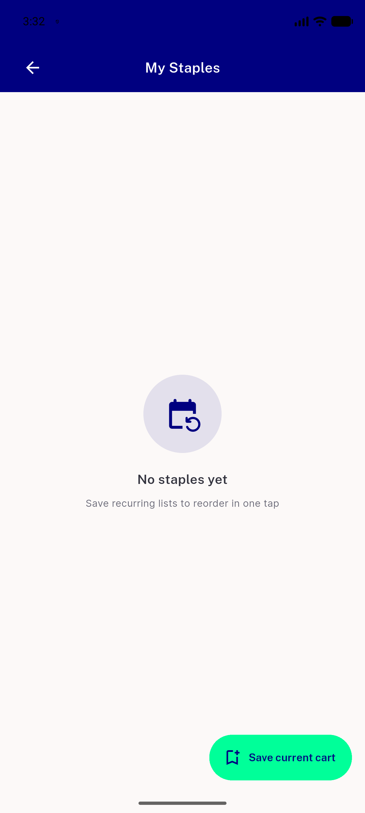

# QA Evidence — NEARS-3645

**QA pass 2026-09-17 — device emulator-5556**

**6 screenshot(s).** Click any thumbnail for full resolution.

<table>
<tr>
<td align="center" width="33%"> MS1 MS3 MS4 expanded card</td>
<td align="center" width="33%"> MS2 regression plain fab orderdetails</td>
<td align="center" width="33%"> MS2 regression plain fab pickmap</td>
</tr>
<tr>
<td align="center" width="33%"> MS3 MS5 RTL arabic expanded</td>
<td align="center" width="33%"> MS4 cross zone guard</td>
<td align="center" width="33%"> MS6 empty state</td>
</tr>
</table>

---
*From `nears/docs/qa-evidence/NEARS-3645/` · public-repo scrub policy (no live secrets; verified clean).*
