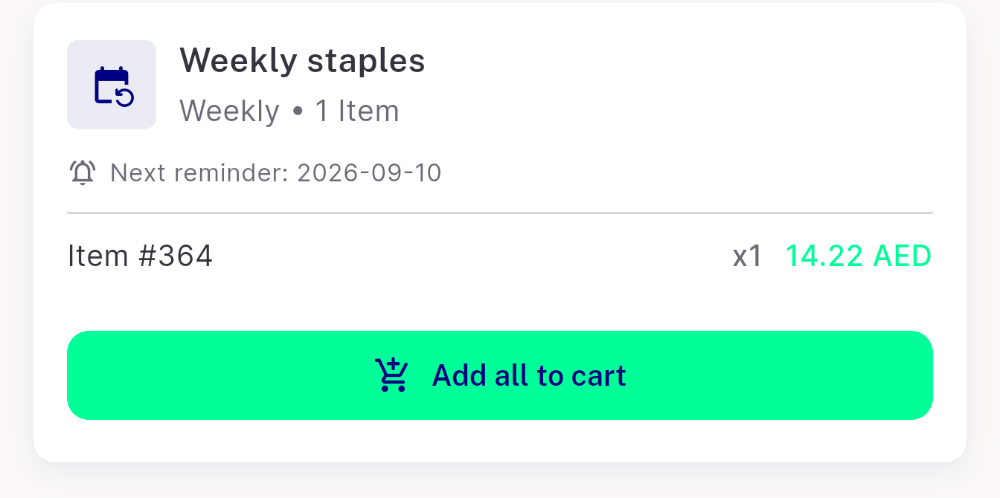
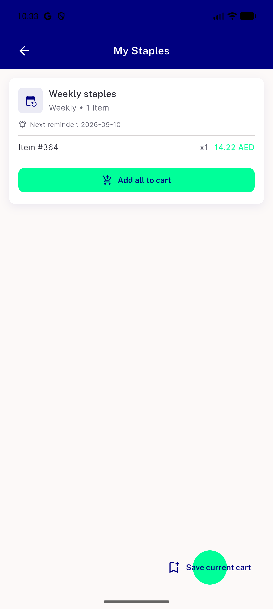

# QA Evidence — NEARS-3645

**Human QA page 23 - My Staples: item #id fallback, no store, broken FAB, not expandable, live 403 on Add all to cart**

**7 screenshot(s).** Click any thumbnail for full resolution.

<table>
<tr>
<td align="center" width="33%"> p23 MS1 item id no image crop</td>
<td align="center" width="33%"> p23 MS2 fab mint circle crop</td>
<td align="center" width="33%"> p23 MS3 past reminder crop</td>
</tr>
<tr>
<td align="center" width="33%"> p23 MS4 no store crop</td>
<td align="center" width="33%"> p23 MS5 not expandable crop</td>
<td align="center" width="33%"> p23 MS6 empty page full</td>
</tr>
<tr>
<td align="center" width="33%"> p23 overview full</td>
</tr>
</table>

---
*From `nears/docs/qa-evidence/NEARS-3645/` · public-repo scrub policy (no live secrets; verified clean).*
