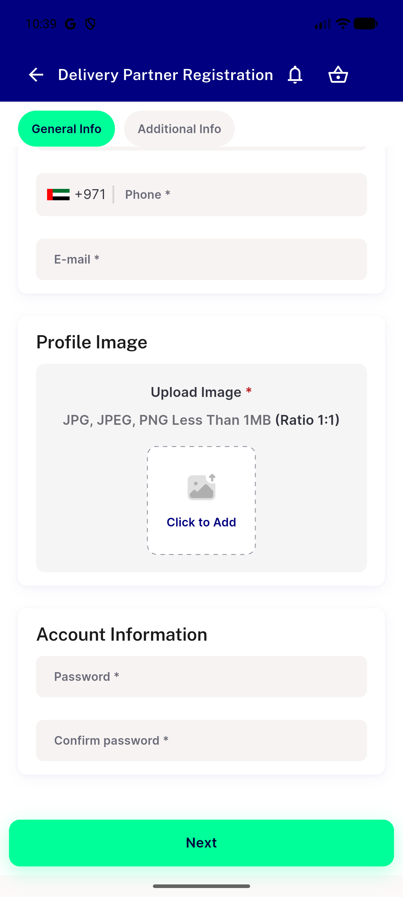
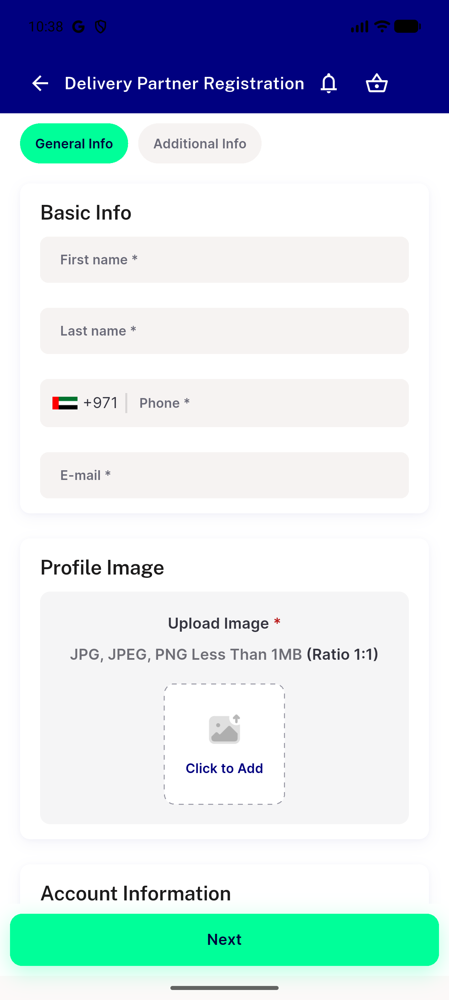
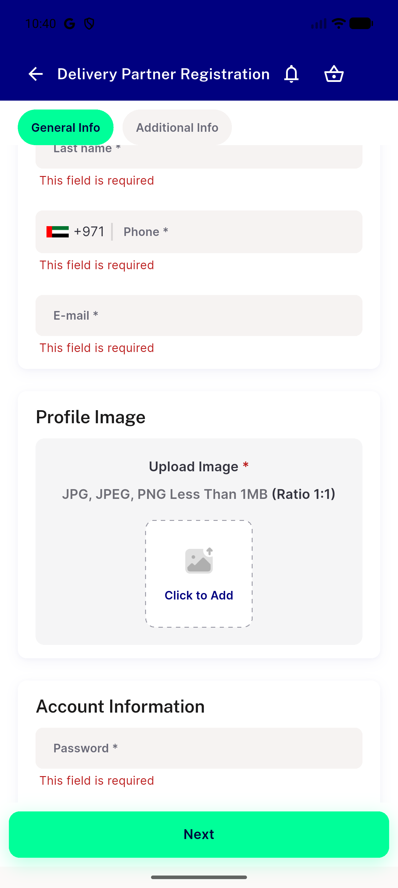

# QA Evidence — NEARS-3646

**Human QA page 24 — Join as a Delivery Partner: step-by-step redesign (DESIGN GATE) + heavy zone list**

**3 screenshot(s).** Click any thumbnail for full resolution.

<table>
<tr>
<td align="center" width="33%"> p24 DP0 account info no password rules crop</td>
<td align="center" width="33%"> p24 DP0 basic info no prefill technical copy crop</td>
<td align="center" width="33%"> p24 DP0 six required errors at once full</td>
</tr>
</table>

---
*From `nears/docs/qa-evidence/NEARS-3646/` · public-repo scrub policy (no live secrets; verified clean).*
