# QA Evidence — NEARS-3647

**Delta re-QA cycle 1: PASS - all 6 re-tested items fixed + 3 analytics events confirmed + 1 new Medium task_bug (pre-existing setState/Future logging noise)**

**16 screenshot(s).** Click any thumbnail for full resolution.

<table>
<tr>
<td align="center" width="33%"><a href="bug-submit-crash-stuck-loading.png">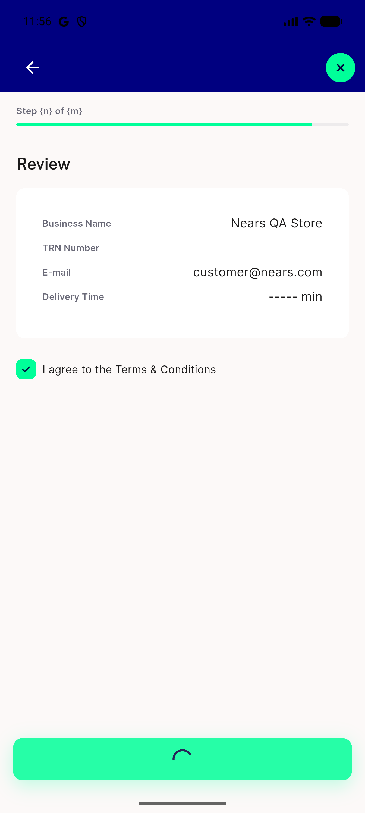</a> bug submit crash stuck loading</td>
<td align="center" width="33%"><a href="bug-vr0-step-progress-literal-template.png">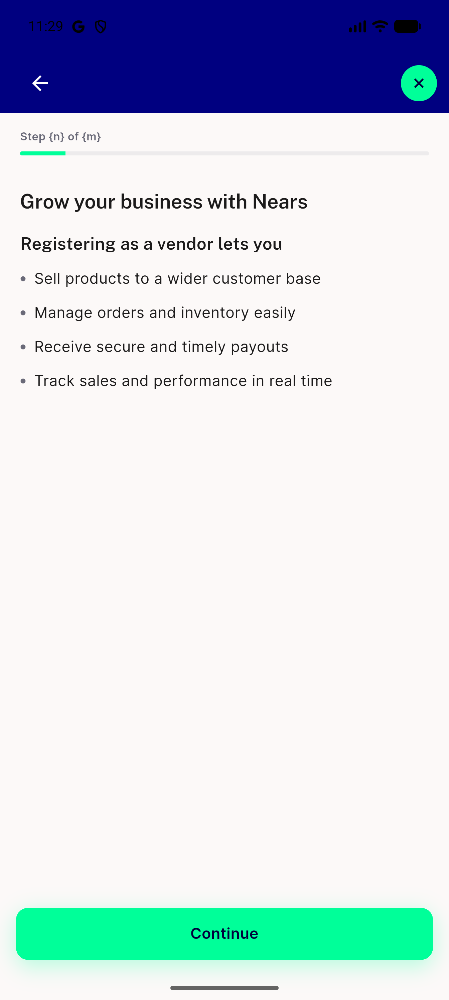</a> bug vr0 step progress literal template</td>
<td align="center" width="33%"><a href="p25-VR0-tabs-no-hint__crop.png">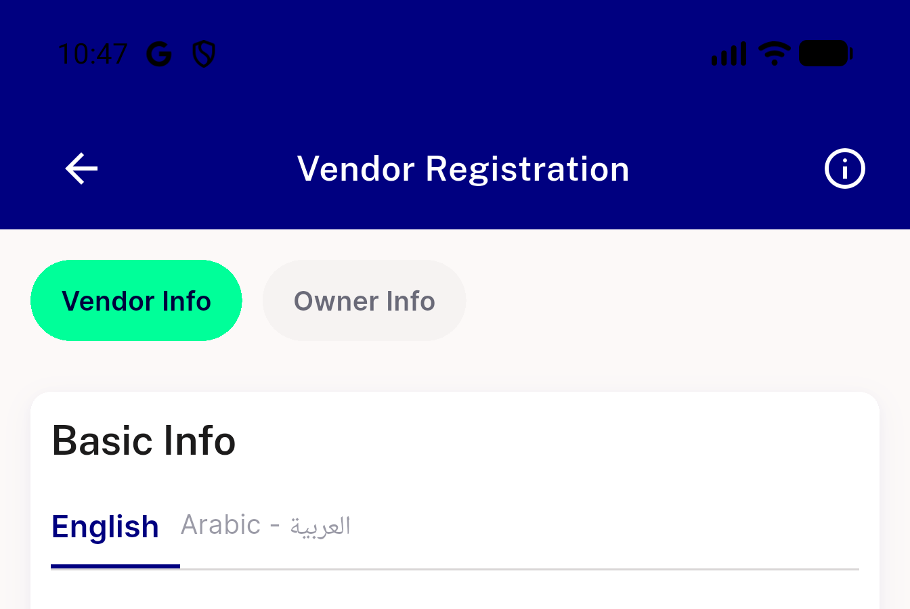</a> p25 VR0 tabs no hint crop</td>
</tr>
<tr>
<td align="center" width="33%"><a href="p25-VR1-map-scroll-trap__full.png">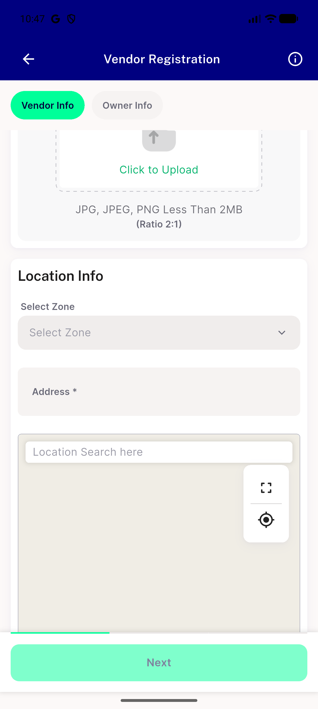</a> p25 VR1 map scroll trap full</td>
<td align="center" width="33%"><a href="p25-VR2-module-placeholder__crop.png">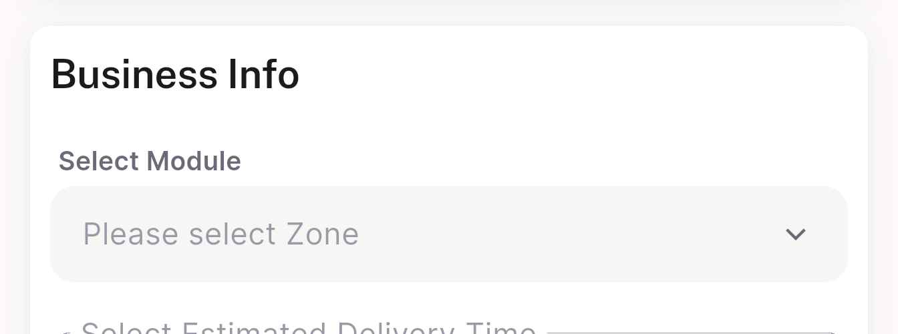</a> p25 VR2 module placeholder crop</td>
<td align="center" width="33%"><a href="p25-VR2-zone-picker__crop.png">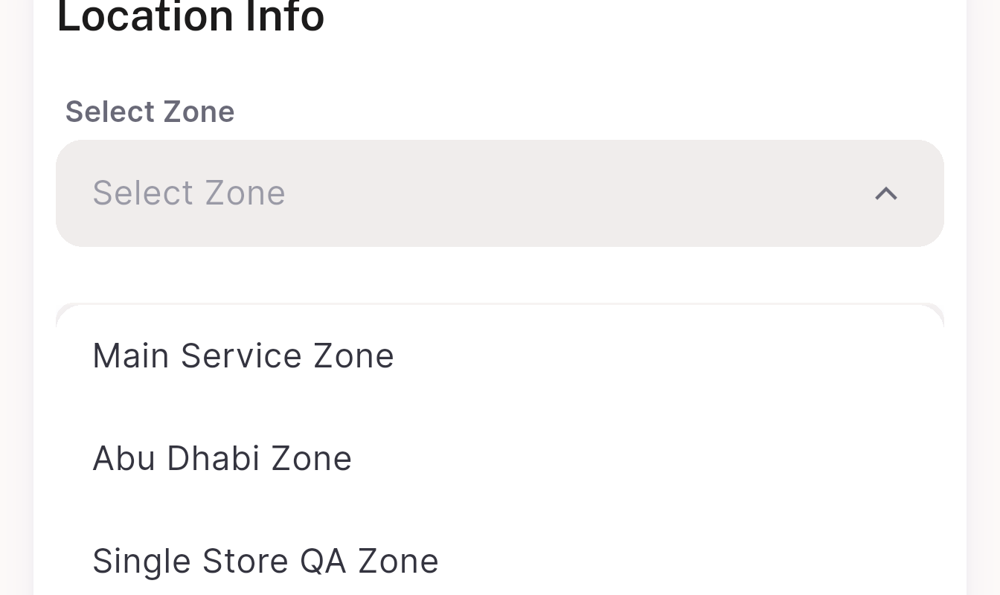</a> p25 VR2 zone picker crop</td>
</tr>
<tr>
<td align="center" width="33%"><a href="p25-VR4-arabic-tab__crop.png">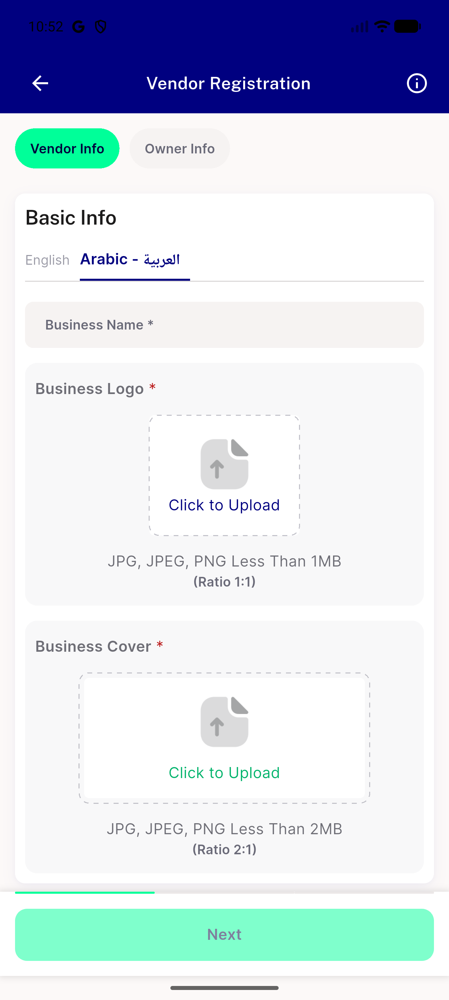</a> p25 VR4 arabic tab crop</td>
<td align="center" width="33%"><a href="p25-VR4-upload-copy__crop.png">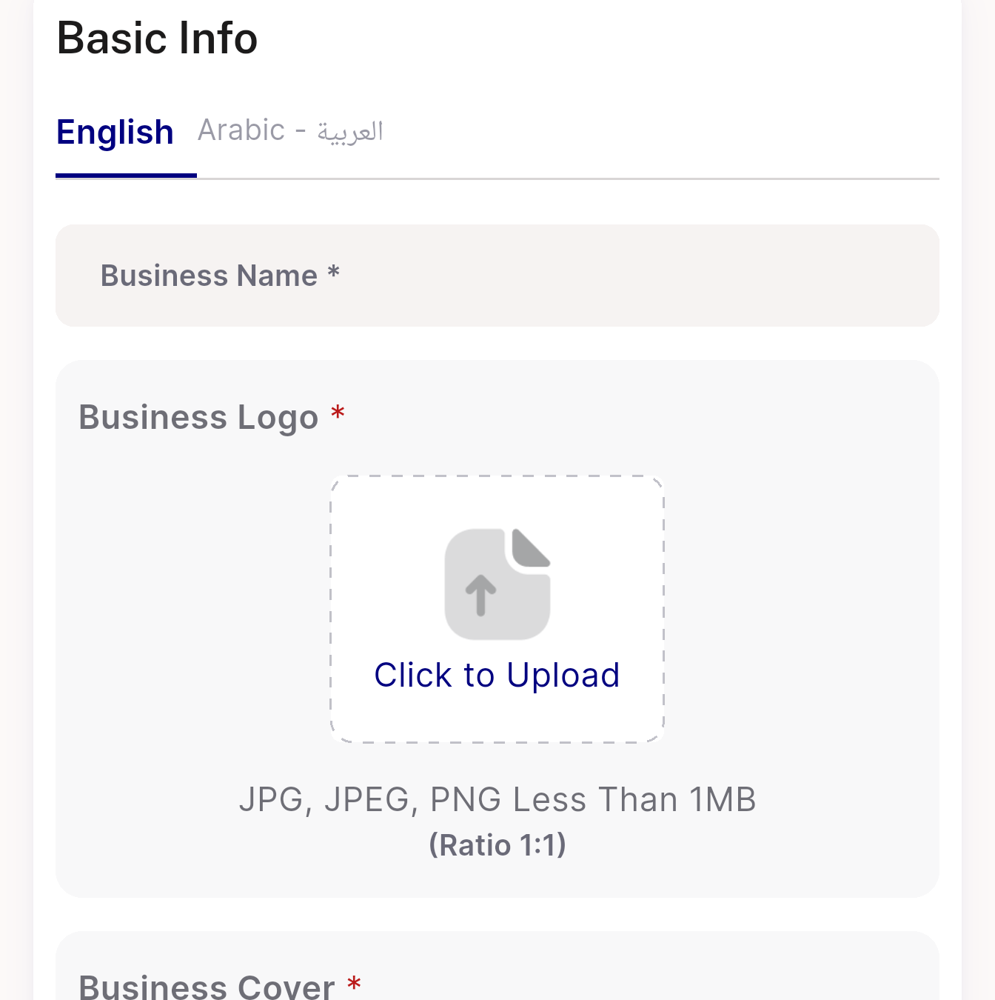</a> p25 VR4 upload copy crop</td>
<td align="center" width="33%"><a href="p25-VR5-benefits-sheet__crop.png">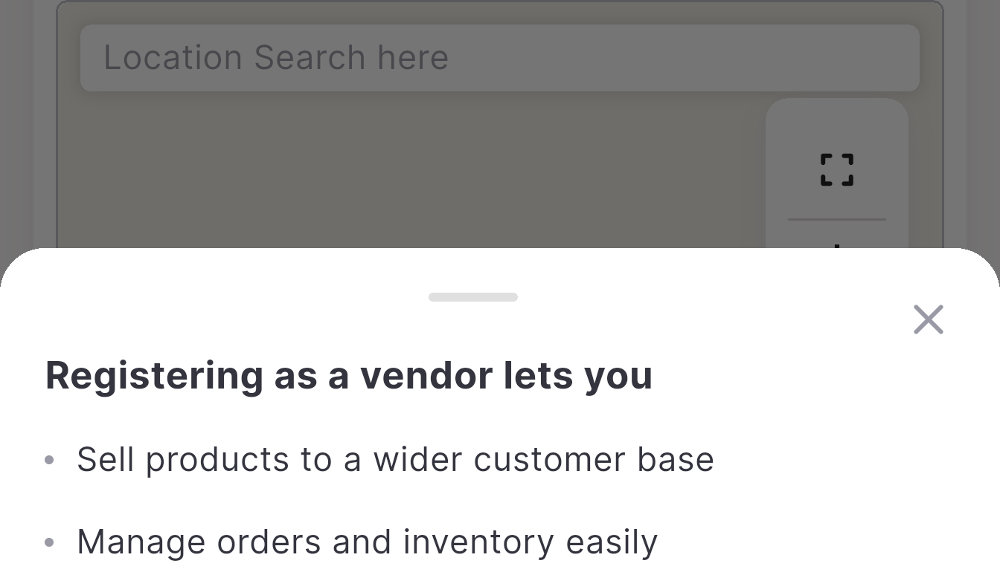</a> p25 VR5 benefits sheet crop</td>
</tr>
<tr>
<td align="center" width="33%"><a href="p25-VR7-delivery-time__crop.png">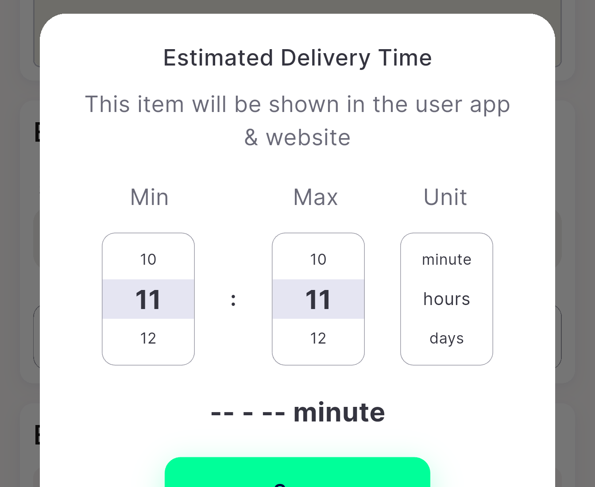</a> p25 VR7 delivery time crop</td>
<td align="center" width="33%"><a href="p26-VR9-leave-confirm-copy__crop.png">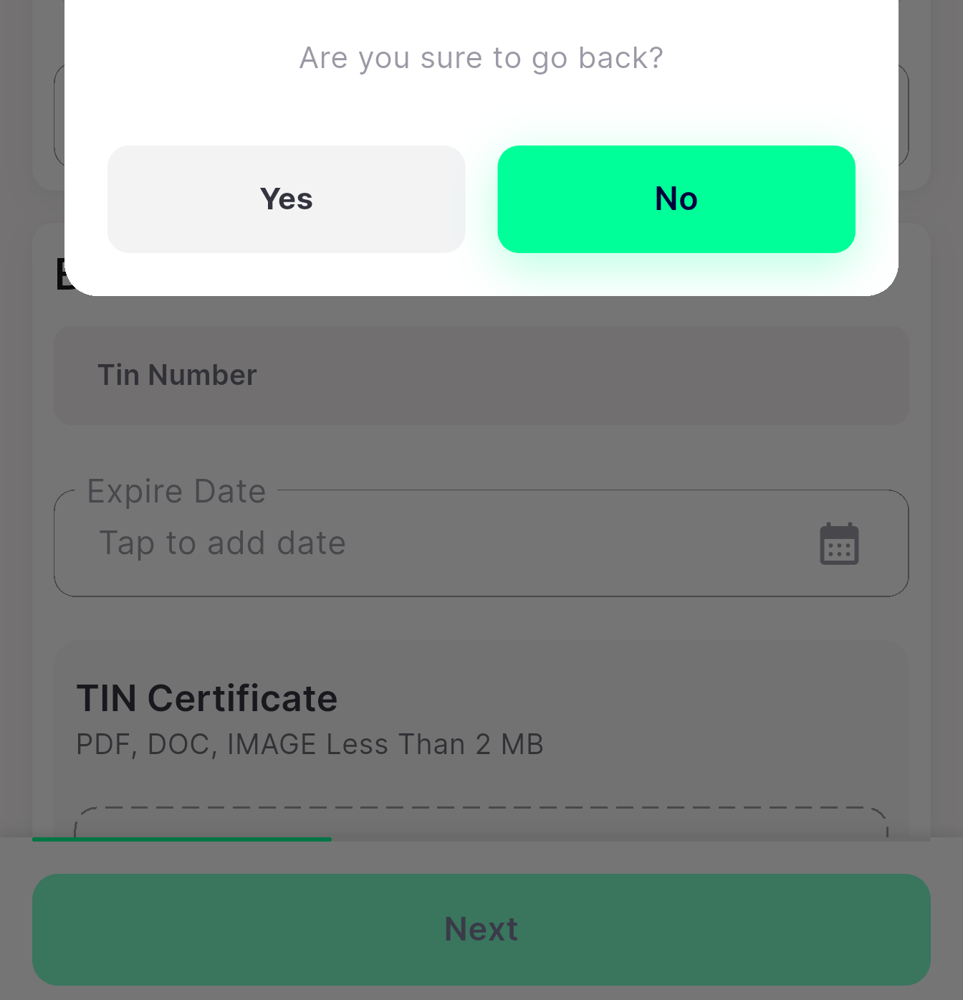</a> p26 VR9 leave confirm copy crop</td>
<td align="center" width="33%"><a href="vr3-logocover-inline-error.png">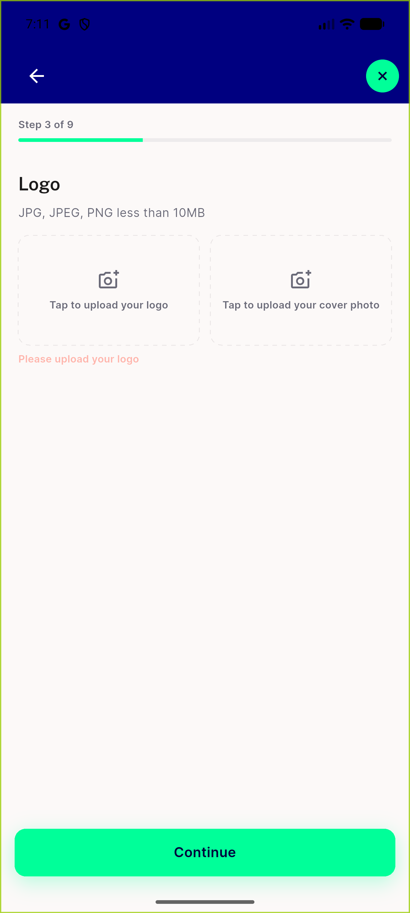</a> vr3 logocover inline error</td>
</tr>
<tr>
<td align="center" width="33%"><a href="vr6-store-under-review-handoff.png">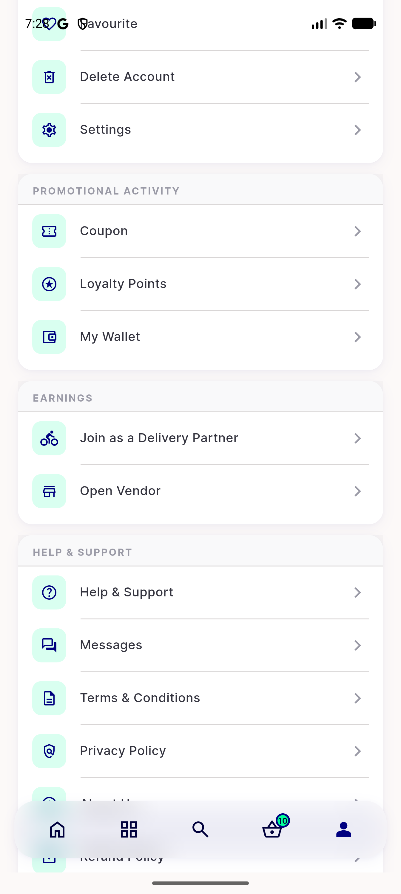</a> vr6 store under review handoff</td>
<td align="center" width="33%"><a href="vr7-duration-picker-distinct-errors.png">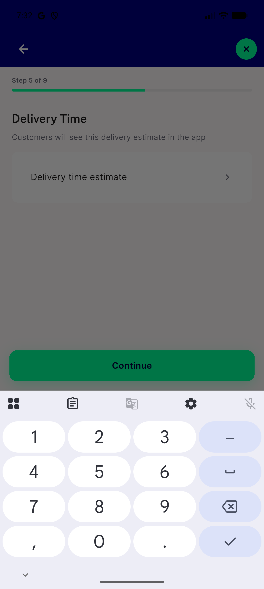</a> vr7 duration picker distinct errors</td>
<td align="center" width="33%"><a href="vr9-popscope-systemback-leaveconfirm.png">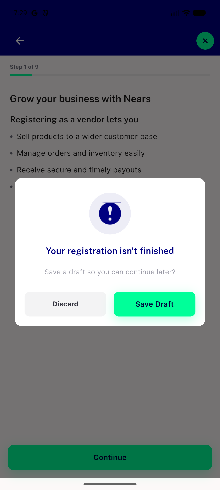</a> vr9 popscope systemback leaveconfirm</td>
</tr>
<tr>
<td align="center" width="33%"><a href="vr9-submit-graceful-failure-no-crash.png">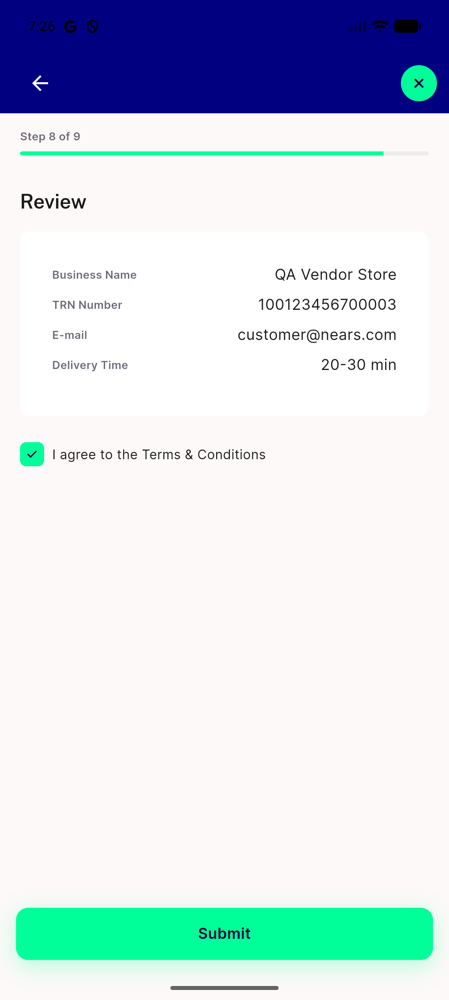</a> vr9 submit graceful failure no crash</td>
</tr>
</table>

### Other artifacts
- [`bug-logocover-setstate-future.log`](bug-logocover-setstate-future.log)
- [`bug-submit-crash-null-check.log`](bug-submit-crash-null-check.log)
- [`bug-vr0-step-progress-literal-template.xml`](bug-vr0-step-progress-literal-template.xml)

---
*From `nears/docs/qa-evidence/NEARS-3647/` · public-repo scrub policy (no live secrets; verified clean).*
