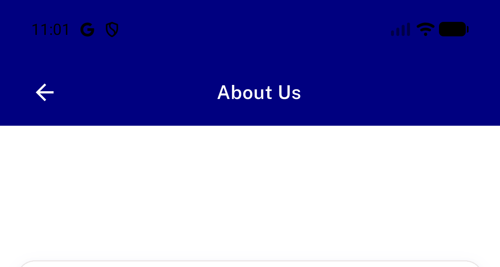
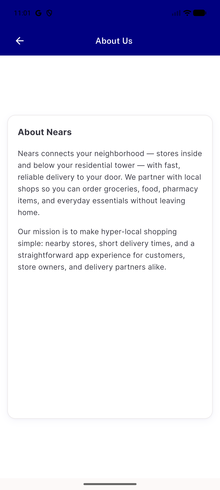
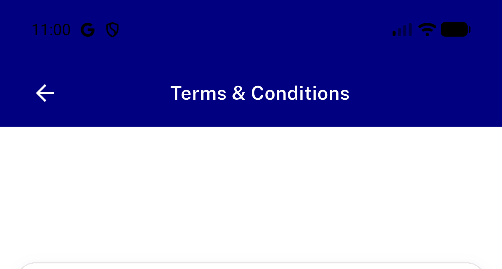
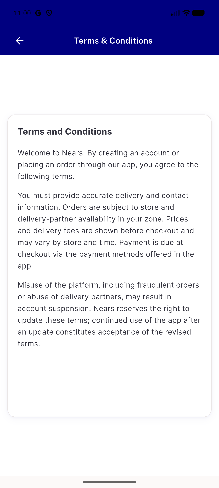
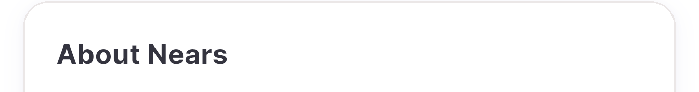
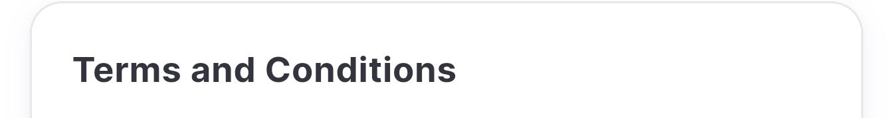

# QA Evidence — NEARS-3648

**LG1 content floats mid-screen with blank area above (FooterView 65% min-height); LG4 duplicate title (app bar + server HTML heading)**

**6 screenshot(s).** Click any thumbnail for full resolution.

<table>
<tr>
<td align="center" width="33%"> p26 LG1 about blank area above card crop</td>
<td align="center" width="33%"> p26 LG1 about card mid screen full</td>
<td align="center" width="33%"> p26 LG1 terms blank area above card crop</td>
</tr>
<tr>
<td align="center" width="33%"> p26 LG1 terms card mid screen full</td>
<td align="center" width="33%"> p26 LG4 about duplicate title crop</td>
<td align="center" width="33%"> p26 LG4 terms duplicate title crop</td>
</tr>
</table>

---
*From `nears/docs/qa-evidence/NEARS-3648/` · public-repo scrub policy (no live secrets; verified clean).*
