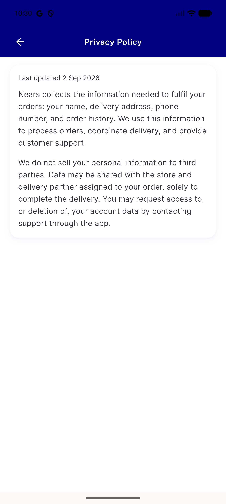
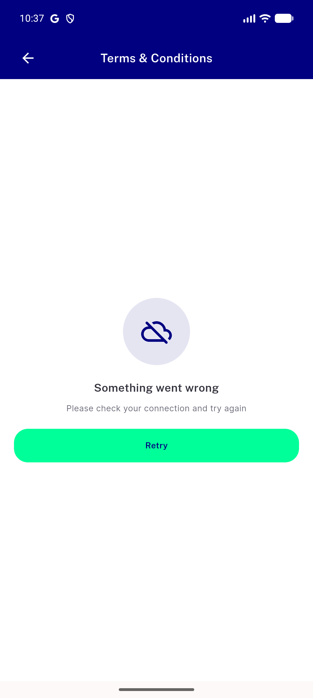
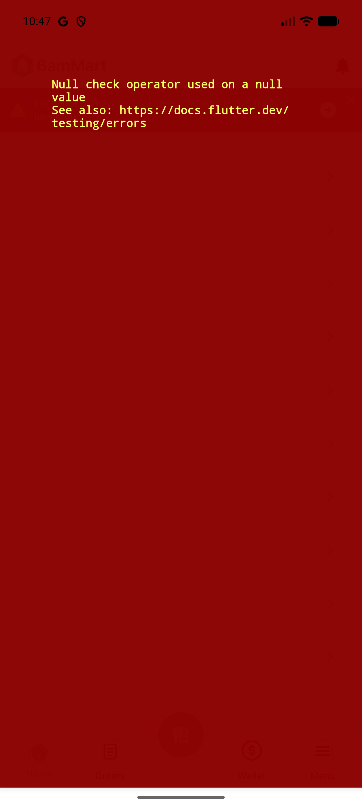

# QA Evidence — NEARS-3648

**PASS — LG1 top-aligned NDocumentPage + LG4 dedup verified live, AC-SHARED/AC-ANALYTICS/AC-LOG demonstrated**

**3 screenshot(s).** Click any thumbnail for full resolution.

<table>
<tr>
<td align="center" width="33%"> ac lg1 lg4 privacy policy</td>
<td align="center" width="33%"> ac log fetch failure</td>
<td align="center" width="33%"> bug vendorapp menu null check crash</td>
</tr>
</table>

### Other artifacts
- [`ac-log-fetch-failure.log`](ac-log-fetch-failure.log)
- [`bug-vendorapp-menu-null-check-crash.log`](bug-vendorapp-menu-null-check-crash.log)

---
*From `nears/docs/qa-evidence/NEARS-3648/` · public-repo scrub policy (no live secrets; verified clean).*
