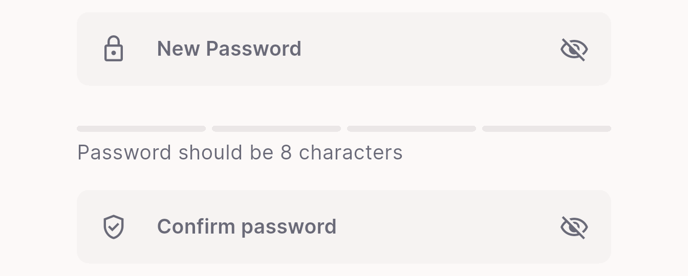
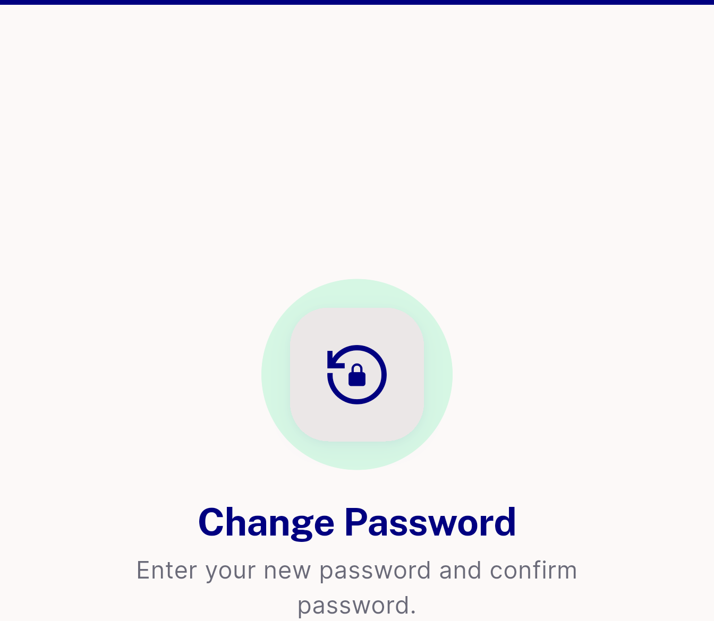

# QA Evidence — NEARS-3649

**Human QA p29 Change Password: no current-password check + sessions stay signed in (security) + layout**

**4 screenshot(s).** Click any thumbnail for full resolution.

<table>
<tr>
<td align="center" width="33%"> p29 CP1 only new confirm no current password crop</td>
<td align="center" width="33%"> p29 CP3 strength bar rule text crop</td>
<td align="center" width="33%"> p29 CP4 bottom pinned button crop</td>
</tr>
<tr>
<td align="center" width="33%"> p29 CP4 empty top hero duplicate title crop</td>
</tr>
</table>

---
*From `nears/docs/qa-evidence/NEARS-3649/` · public-repo scrub policy (no live secrets; verified clean).*
