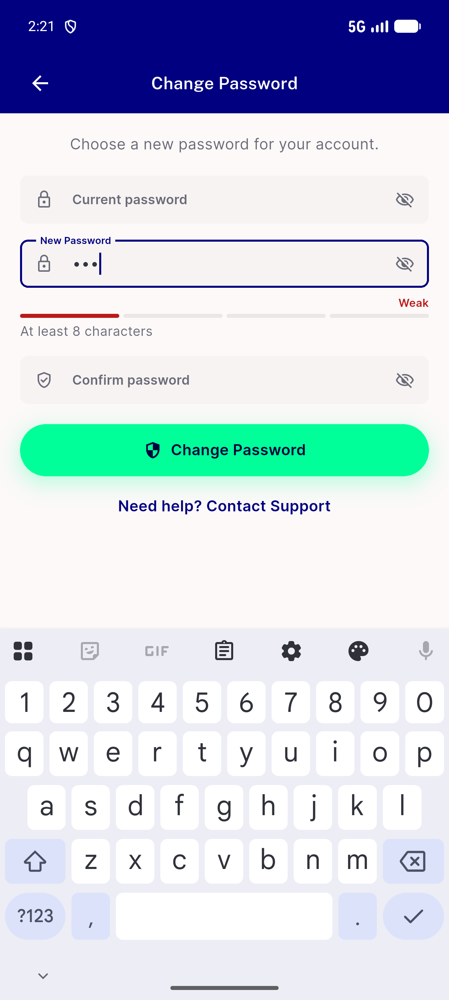
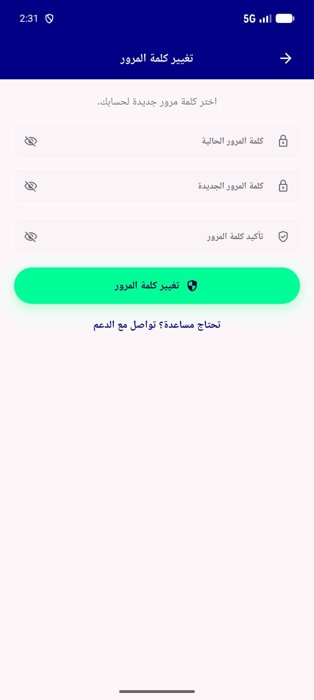
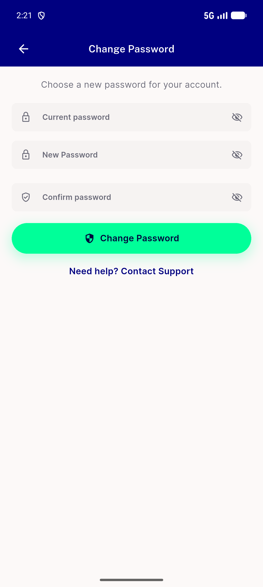
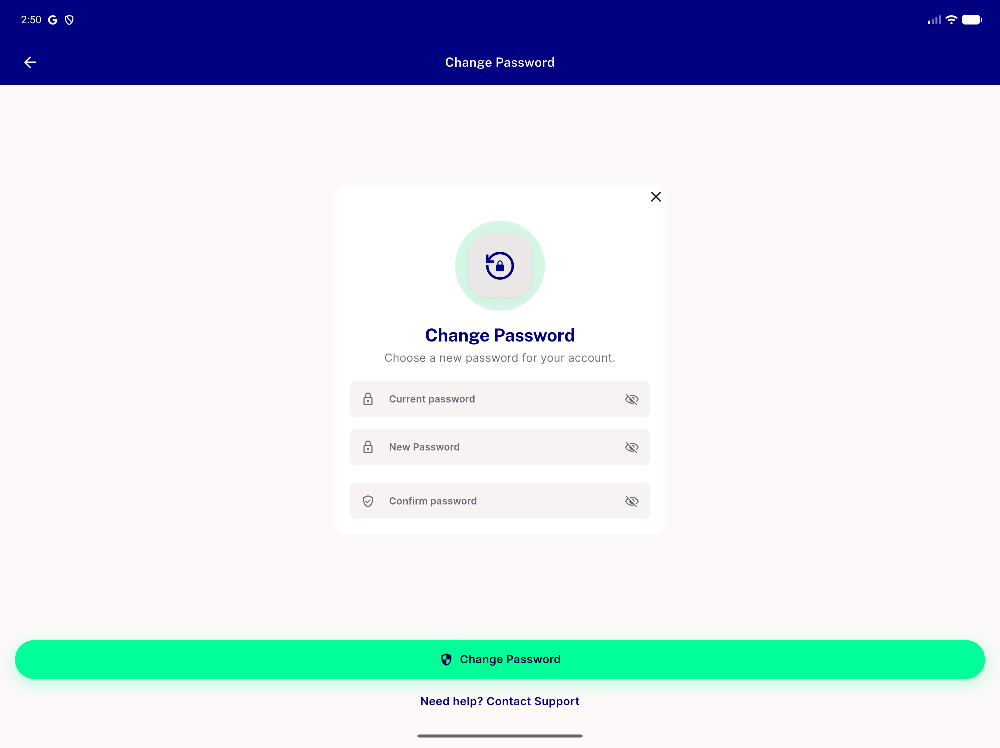
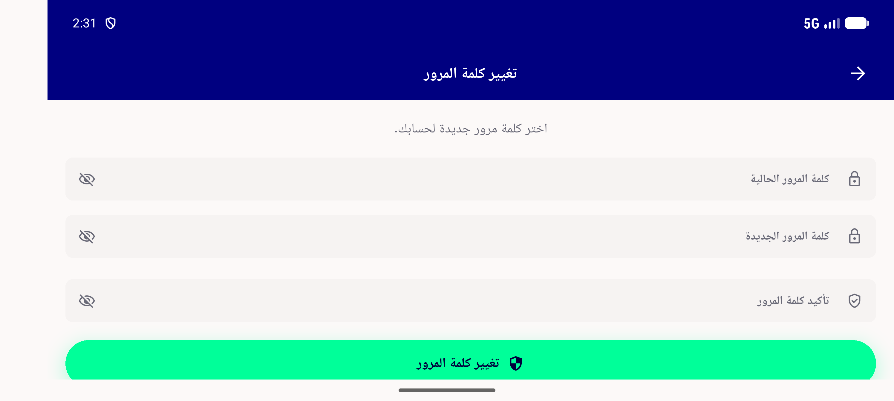

# QA Evidence — NEARS-3649

**PASS — CP1/CP2 security fixes verified live (wrong/correct current password, rate-limit 6th=429, session A/B revocation, email dispatch confirmed), CP3/CP4/CP5 layout+copy verified EN+AR+landscape+isDesktop, AC-ANALYTICS all 5 result values fired w/ correct properties, AC-LOG wrong/rate-limit/timeout all correlate FE<->BE, AC-DLS/SHARED catalog+storybook+goldens present, automated backstop 7+31+2 tests green**

**9 screenshot(s).** Click any thumbnail for full resolution.

<table>
<tr>
<td align="center" width="33%"> cp3 strength bar visible weak en</td>
<td align="center" width="33%"> cp4 change password layout ar rtl</td>
<td align="center" width="33%"> cp4 change password layout en</td>
</tr>
<tr>
<td align="center" width="33%"> cp4 isdesktop legacy path</td>
<td align="center" width="33%"> cp4 landscape ar scroll reachable</td>
<td align="center" width="33%"> p29 CP1 only new confirm no current password crop</td>
</tr>
<tr>
<td align="center" width="33%"> p29 CP3 strength bar rule text crop</td>
<td align="center" width="33%"> p29 CP4 bottom pinned button crop</td>
<td align="center" width="33%"> p29 CP4 empty top hero duplicate title crop</td>
</tr>
</table>

### Other artifacts
- [`bug-firebase-unguarded-login-block.log`](bug-firebase-unguarded-login-block.log)

---
*From `nears/docs/qa-evidence/NEARS-3649/` · public-repo scrub policy (no live secrets; verified clean).*
